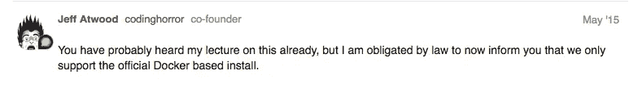
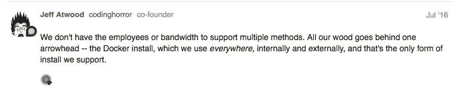
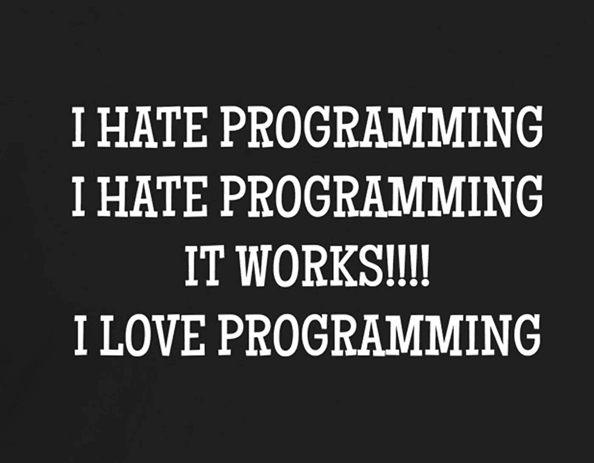

# 我如何用 Nanobox 运行不支持的对话安装

> 原文：<https://medium.com/hackernoon/how-i-ran-an-unsupported-discourse-install-with-nanobox-f6736f83cef0>


在 [Nanobox](https://nanobox.io) ，由于我们产品的性质，我们收到了很多棘手的问题。从如何使用我们的产品到关于各种不同语言和框架的问题。我们不仅将 Slack 作为内部沟通工具，还将其作为支持用户的主要方法。这使得帮助解决问题和回答他们的问题变得非常容易。但是，随着新用户的加入，我们发现自己一遍又一遍地回答许多相同的问题。

自然，我们认为是时候建立一个论坛了。一个论坛会给我们一个地方来放置我们得到的所有问题的答案。然后，我们将能够指导人们在哪里找到我们得到的所有重大问题的答案。

我们花了很长时间寻找最能满足我们需要的东西。有几个不错的选择，但最终我们选择了[演讲](https://www.discourse.org/)。你用话语的价格标签(免费)得到的东西的数量是相当惊人的。Discourse 的团队做得非常好。

它拥有你所期望的功能齐全的论坛平台的一切。此外，还有大量优秀的官方和社区插件，可以满足您开箱即用的需求。

# 易于安装…算是吧

话语创造了一个[官方支持的 Docker 装置](https://github.com/discourse/discourse/blob/master/docs/INSTALL.md)。这很酷。他们非常非常(非常)坚持要你用这个。并明确表示，不这样做就会失去支持:



我没有说出来，因为我认为他们做的事情有问题。事实上恰恰相反。我认为这完全有道理。一个小团队怎么可能支持他们项目的这么多可能的安装呢？



我完全理解用户对开发团队的要求。尤其是对于一个像话语一样提供价值的项目。我认为他们花时间创造这样一个简单的安装方法是很棒的。

但是…

# 手头的任务

你在这里，因为无论什么原因，你不想使用他们的 Docker 安装。没关系，我将向您展示如何在没有 Docker 的情况下运行 Discourse。

我在这里的原因是因为我的任务是建立我们的官方论坛。我可以很容易地按照他们的指南，让它快速启动和运行。然而，就像 Discourse 使用他们自己的产品作为他们的官方论坛一样，我使用我们的产品作为部署它的方法对我来说很重要。

Docker 是一个非常强大的工具，它改变了我们对 web 应用程序的看法，但是它需要开发人员去学习、理解和使用。这不一定很难，但肯定需要时间投入才能适应。

创建一个“Dockerized”版本的 Discourse 可以更容易地控制每个安装的结果。这确实有助于 Discourse 的团队确保他们的用户拥有尽可能好的体验。这也是 Nanobox 存在的原因。并非所有开发人员都有时间或才能成为全职应用开发人员**和**全栈、开发运维、系统管理员。Nanobox 填补了这一空白。

# 潜入水中

> 让我重申一下。我遵循的过程直接违背了 Discourse 推荐的过程。继续进行，风险自负…

我不会详细讨论如何用 Nanobox 部署对话(你可以在我们的博客上阅读)。我将更多地谈论我尝试使用 Nanobox 进行对话的经历。

通常情况下,“传统的”Rails 应用程序很容易使用 Nanobox 进行部署。事实上，[我们自己的仪表板](https://dashboard.nanobox.io)是一个非常大而复杂的 Rails 应用程序，我们已经使用 Nanobox 将其部署到 DigitalOcean。

Discourse 绝不是传统的 Rails 应用程序。他们确实有各种“入门”指南，从初学者到高级都有。其中大部分只会帮助你在当地进行对话。您需要自己解决生产部署问题。

## 重要的事情先来

我通读了他们的需求列表，以便很好地了解我需要从什么开始。至少我需要 Ruby、Rails、Postgres 和 Redis。

这是我最初的`boxfile.yml`配置:

```
run.config:
  engine: ruby
  extra_packages:
    - nodejs
    - nginxdata.db:
  image: nanobox/postgresql:9.4data.redis:
  image: nanobox/redis
```

我修改了`config/boot.rb`,这样服务器将绑定到`0.0.0.0`,允许外界访问，修改了`config/database.yml`,这样应用程序可以连接到数据库。

运行完一个`rake db:migrate`后，我试着启动这个应用程序。我立刻注意到我缺少了一些话语需要的额外的包，所以我对我的`boxfile.yml`做了如下修改:

```
run.config:
  engine: ruby
  extra_packages:
    - git
    - nodejs
    - nginx
    - ImageMagick
    - optipng
    - jpegoptim
    - gifsicle
    - jhead
  extra_steps:
    - yarn install
  extra_path_dirs:
    - node_modules/.bin
  cache_dirs:
    - .bundle
    - vendor/bundle
    - node_modules
```

这给了我足够的时间让应用程序在本地运行。我的下一个任务是将它部署到生产中。这就是事情变得困难的地方…

## 舞台话语

Nanobox 允许我使用`dry-run`命令在本地进行生产部署。这太棒了，因为我可以在部署之前确保一切正常。事实证明，这比想象的要困难得多。当我尝试预编译资产时，我所有的问题都产生了…

在 Rails 3 中，有一个很好的小设置叫做`initialize_on_precompile`。将这个设置为`false`会告诉 Rails 你不想初始化应用程序来预编译所有的资源。那正是我想要的。您不应该仅仅为了预编译资产就需要初始化整个应用程序。

原来，在 Rails 4+中，他们[删除了这个设置](https://github.com/rails/rails/commit/2d5a6de)。这给我带来了巨大的问题。当我预编译资产时，Discourse 试图连接 Postgres 和 Redis。

当在本地运行 Nanobox 时，所有的服务都在运行，所以我从来没有遇到任何问题。然而，在尝试部署时，当我尝试预编译资产时，服务没有运行(因为它们不需要运行)。

Nanobox 允许您定义在供应和部署过程中的特定时间运行的“挂钩”。当我尝试预编译资产时，Postgres 和 Redis 都不存在，因为它们都是在过程的后期才创建的。

我试图通过对核心应用程序做一些修改来解决这个问题。我想我应该使用一个环境变量来跳过任何试图连接到任一服务的操作，所以我在代码中添加了以下内容:

```
if ENV["PRECOMPILE"]...
```

这不起作用…对 Postgres 和 Redis 的依赖如此之多，以至于它正在变成一个怪物。我后退了一步…



知道了 Nanobox 如何工作，以及话语的需求，我决定不在构建期间编译资产。在部署之后，我必须在生产环境中完成。

这不是做这件事的理想方式，但最后结果还不错。我又修改了一次`boxfile.yml`，给了我一个本地存储组件。将资产存储在这里，使任何需要它们的人都可以访问它们。

这是最后一个`boxfile.yml`,我用它成功地进行了演讲和部署:

> 您可以在指南中找到关于每个不同节点及其功能[的信息。](https://content.nanobox.io/an-open-source-forum-discourse-and-nanobox/)

这里有一些奇怪的东西，在部署 Rails 应用程序时通常不会看到。幸运的是`boxfile.yml`足够灵活，我可以得到一切我需要的东西来让它工作。

# 收拾残局

在一切顺利进行之前，我还需要处理一些事情。

## discourse.conf

Discourse 为生产配置提供了一个`discourse.conf`文件。在顶部，它给你几个不同的选项来选择如何使用这个文件。

您可以:

1.  什么都不做(不推荐)。
2.  复制配置文件并使用您自己的设置进行更新。
3.  以 DISCOURSE_*的形式使用环境变量

起初，我认为这意味着你可以同时使用配置文件*和* evars。在我注意到它没有使用我的一些 evars 之后，我挖掘了源代码，发现它们是互斥的。

我没有使用一半的 evars 和一半的 config 文件，而是最终只使用了 config 文件(我仍然在配置文件中使用了 evars *，我只是不希望它们直接从环境中取出来):*

Nanobox 自动为数据服务生成 evars，所以我可以马上将它们包含在配置中。我需要任何额外的 evars，[我不得不手动添加](https://docs.nanobox.io/cli/evar/#add)。例如，我们的 SMTP 凭证:

```
DISCOURSE_SMTP_ADDRESS
DISCOURSE_SMTP_PORT
DISCOURSE_SMTP_DOMAIN
DISCOURSE_SMTP_USER_NAME
DISCOURSE_SMTP_PASSWORD
```

> 尽管我没有直接在环境中使用 evars，但我仍然使用了创建它们时概述的约定，只是将它们添加到配置文件中。

有了这些，在 Nanobox 上运行对话就变得轻而易举了。而且，当我没有使用他们官方的 Docker 安装时，Nanobox 在引擎盖下使用 Docker，所以同样的事情对吗？


# 包扎

Discourse 不是我希望的传统 Rails 应用程序。在花了大量时间在源代码中挖掘，试图让它工作起来之后，我发现它们已经覆盖或删除了许多您可能期望找到的内容。

所有的初始化器都是定制的，许多标准的 rake 任务已经完全重写。当您试图运行应用程序时，他们还会对应用程序的状态做出许多假设。

也就是说，他们希望你使用他们的 Docker 形象，这很好。所以底层应用程序看起来怎么样并不重要。一旦我补偿了这一切，问题就消失了。

再次感谢 Discourse 的团队为这个伟大的项目所做的一切，以及他们已经做的和将继续做的工作。现在它正在运行，话语为我们工作得很好。

如果你想让你自己的论坛开始运行，遵循我们博客上的详细指南。如果你只是想在不做任何工作的情况下创建一个论坛，看看我们的[快速入门](https://github.com/nanobox-quickstarts/nanobox-discourse)。

如果您遇到任何问题或有任何疑问，请联系我们。您可以在这里发表评论，或者[加入我们的 Slack 团队](https://slack.nanoapp.io/)，我们将尽我们所能提供帮助。