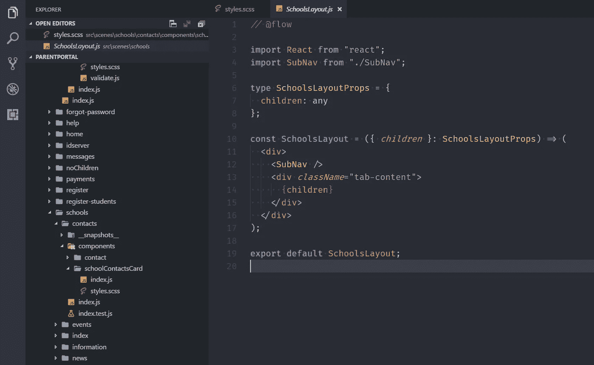
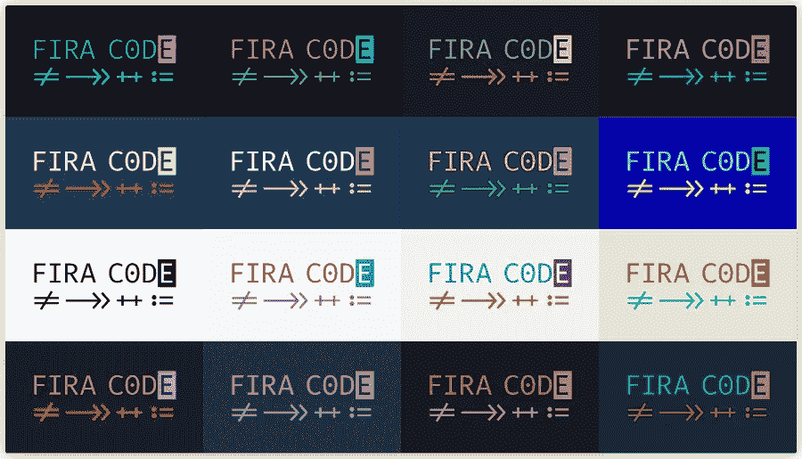

# 我最近如何从 Atom 转换到 Visual Studio 代码

> 原文：<https://medium.com/hackernoon/how-i-recently-switched-from-atom-to-visual-studio-code-dc652de01db>

在过去的 2-3 年里，我一直是 Atom 的铁杆粉丝，它做得很好，我很满意。我最近开始注意到越来越多的问题出现，它开始变得越来越慢，有时甚至没有反应，所以我需要杀死它。是时候给[视觉](https://hackernoon.com/tagged/visual)工作室[代码](https://hackernoon.com/tagged/code)一个尝试了。我主要从事前端工作，我有一个日常工作和副业项目所需的插件/包列表。

我从探索 [**Visual Studio 市场**](https://marketplace.visualstudio.com/) 开始，特别是 [**最流行的**](https://marketplace.visualstudio.com/search?target=VSCode&category=All%20categories&sortBy=Downloads) 包。我看到了很多有趣的东西，但决定保持安装最少。

首先，我从导入 [**原子键映射**](https://marketplace.visualstudio.com/items?itemName=ms-vscode.atom-keybindings) 开始。它允许无缝地切换到 Visual Studio 代码，并继续使用我多年来一直使用的相同的键绑定。

然后，就到了主题选择。再次在这里，作为原子粉丝，我发现 [**原子一暗**](https://marketplace.visualstudio.com/items?itemName=akamud.vscode-theme-onedark) 但后来切换到 [**一暗亲**](https://marketplace.visualstudio.com/items?itemName=zhuangtongfa.Material-theme) 因为我更喜欢它。



我旅程的下一步是选择一个图标主题。你可能会觉得这很有趣，但我发现正确突出文件扩展名很重要。我目前在用 [**VSCode 大图标**](https://marketplace.visualstudio.com/items?itemName=emmanuelbeziat.vscode-great-icons) 和 [**素材图标主题**](https://marketplace.visualstudio.com/items?itemName=PKief.material-icon-theme) 我还没决定我最喜欢哪个。

下一阶段实际上与 Visual Studio 代码无关，而是一般的开发。当我看到 [**丹·阿布拉莫夫**](https://twitter.com/dan_abramov/) 关于他使用的漂亮字体的推文时，我完全爱上了它。我的爱人叫— [**符单声道**](https://www.typography.com/fonts/operator/styles/) 。

当我算出这个字体价格在 **$600** 左右的时候，我感觉心都碎了。所以我开始谷歌搜索最近的免费替代品。我发现这两个链接非常有用:

*   [**操作员单色字体的替代字体**](/@docodemore/an-alternative-to-operator-mono-font-6e5d040e1c7e)
*   [**vs code**](https://github.com/mikaelbr/open-source-ideas/issues/10)操作员单斜体主题的自由替代

这些链接把我带到了 Fira 代码 这个我每天都在使用的很棒的免费字体，建议每个人都使用它。我的🍝代码从来没有这么漂亮过。



Fira Code font

好的，接下来是我发现非常有用的工具列表:

*   [**Chrome 的调试器**](https://marketplace.visualstudio.com/items?itemName=msjsdiag.debugger-for-chrome)
*   [**ESLint**](https://marketplace.visualstudio.com/items?itemName=dbaeumer.vscode-eslint)
*   [**流语言支持**](https://marketplace.visualstudio.com/items?itemName=flowtype.flow-for-vscode)
*   [**更漂亮**](https://marketplace.visualstudio.com/items?itemName=esbenp.prettier-vscode)

另外， [**React 代码片段**](https://marketplace.visualstudio.com/items?itemName=xabikos.ReactSnippets) 这是一个非常方便的包，可以减少你创建新`React`组件的时间。

最后，这是我在 Windows 机器上使用的**用户设置**文件。

```
{
 "workbench.iconTheme": "material-icon-theme",
 "terminal.integrated.shell.windows": "C:\\Program Files\\Git\\bin\\bash.exe",
 "atomKeymap.promptV3Features": true,
 "editor.formatOnPaste": true,
 "workbench.colorTheme": "One Dark Pro",
 "editor.fontFamily": "Fira Code",
 "editor.fontLigatures": true,
 "editor.fontSize": 17,
 "editor.lineHeight": 25,
 "files.trimTrailingWhitespace": true,
 "editor.fontWeight": "400",
 "editor.renderWhitespace": "all",
 "editor.tabSize": 2,
 "editor.cursorStyle": "line",
 "editor.insertSpaces": false,
 "prettier.useTabs": true,
 "terminal.integrated.fontSize": 15,
 "javascript.validate.enable": false,
 "editor.formatOnSave": true,
 "files.autoSave": "off"
}
```

这篇博文最初发布在我的博客中[，看看吧。](http://edvinsantonovs.co.uk/how-i-recently-switched-from-atom-to-visual-studio-code/)

别忘了在推特上关注我。