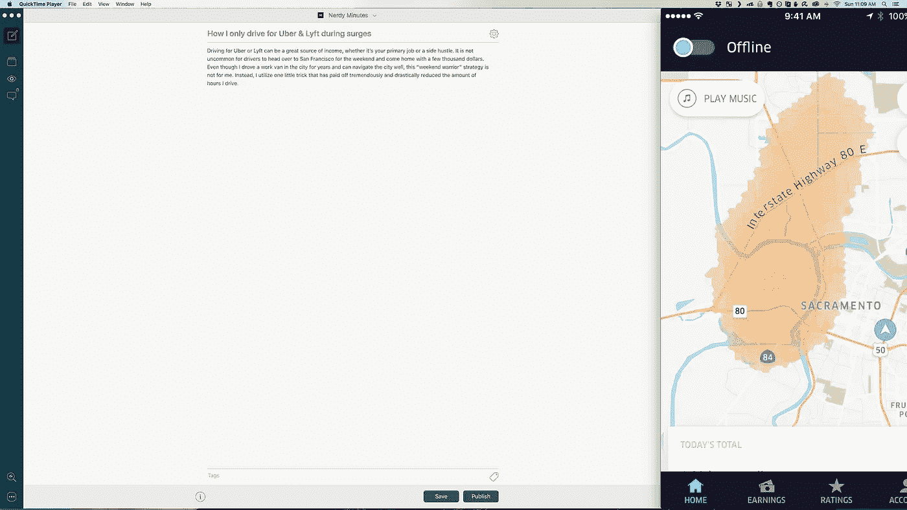
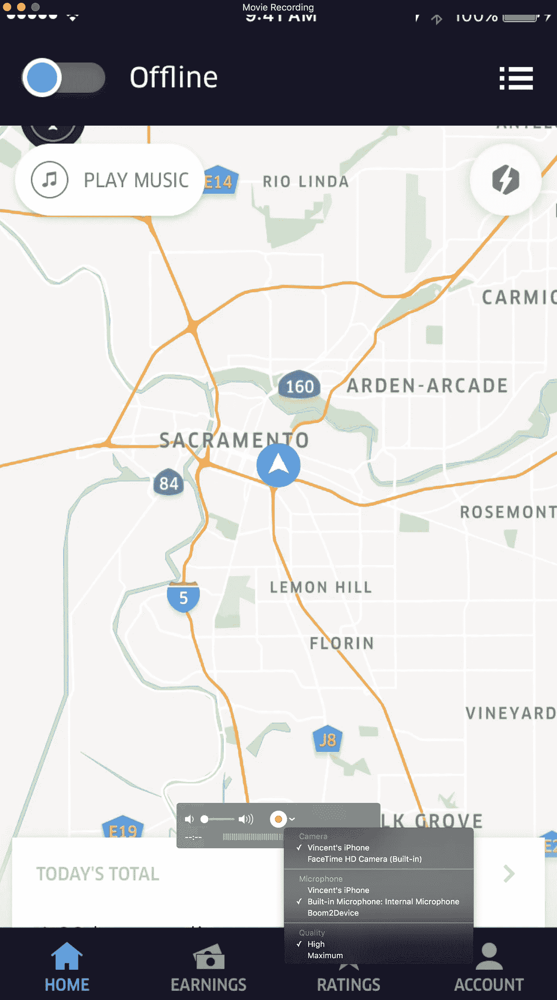
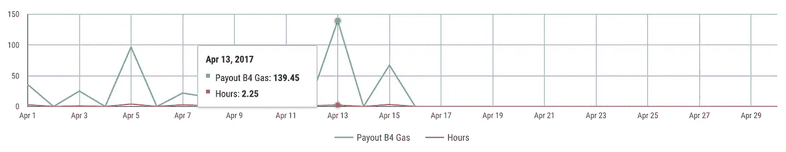

# 我是如何减少优步和 Lyft 的驾驶时间并获得更多收入的

> 原文：<https://medium.com/hackernoon/how-i-reduced-my-uber-lyft-drive-time-and-earned-more-865e2fa7f2a1>

Uber Driver app running on Mac while I write this post.

无论是你的主要工作还是副业，为优步或 T2 Lyft 开车都是一笔巨大的收入来源。司机去旧金山度周末，带着几千美元回家，这并不罕见。尽管我在城市里开了好几年的工作车，而且驾驶自如，但这种“周末战士”策略并不适合我。相反，我使用了一个小技巧，这个技巧极大地减少了我开车的时间。

鉴于以下情况，这一策略可能不适用于所有人，但如果你生活在一个大(甚至半大)都市，它会非常有效:

*   我住在一个受欢迎的闹市区
*   面积相对[小](https://sacramentopress.com/2013/12/29/redefining-downtown-sacramento/)
*   它包括一个可容纳 20，000 人的竞技场，可举办各种活动

像萨克拉门托市中心这样小的电网，如果不进行 10，000 次 3 美元的小旅行，很难赚到大钱。从电网的一边到另一边的平均票价约为 6.5 美元，司机除了几块钱什么都没有。很早就知道这一点迫使我想出更好的方法来利用我的时间。

诀窍很简单:插入你的 iPhone(或[下载你的 Android](https://airdroid.com/) )，将你的优步驱动程序镜像到你的电脑上，然后等待。

**在 Mac 上镜像你的 iPhone:**

1.  用闪电线把你的手机插上。
2.  打开 Quicktime Player。
3.  转到文件>新电影录制。
4.  将输入源更改为 iPhone。

Change your Quicktime movie recording source to iPhone and open the Uber Driver app.

现在，你已经在 Mac 上显示的优步驱动程序中获得了你所在区域的完美视图。随意浏览网页，写点东西或补上工作。由于 iPhone 和 Mac 之间没有真正的延迟，你会看到接近实时的波动。当它来袭时，打开你的应用程序，等待一个 ping，然后出去赚钱！

This strategy has allowed me to cut back on the amount of hours I drive while retaining high payouts.

Ignore the poor design — I kinda suck at [Google Data Studio](https://www.google.com/analytics/data-studio/).

如果你有兴趣驾驶[优步](https://partners.uber.com/i/x12zqu25ue)或 [Lyft](https://www.lyft.com/drivers/VINNIE4) ，考虑使用我的链接注册。如果你这样做，我们都会得到一份奖金！

我在[书呆子会议](https://www.nerdyminutes.com/?utm_source=medium)上写类似的东西。我还策划了一份简短的每周简讯，刊登了来自网络上类似的文章。