# 我如何在两天内以 1，200 美元的价格售出我的第一款应用——学习和技巧

> 原文：<https://medium.com/hackernoon/how-i-sold-my-first-app-for-1-200-in-two-days-learnings-tips-903f41b6b548>

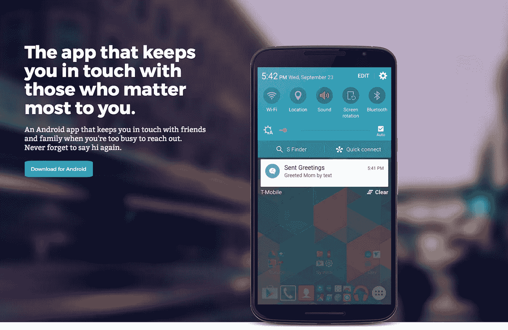

inTouch noticed you haven’t talked to mom in awhile, so it sent your preset greeting to her by text to spark a conversation.

几天前，我写了这篇文章，“[为什么我要建立 inTouch，为什么我要在](https://blog.markgrowth.com/why-i-built-intouch-and-why-im-auctioning-the-android-app-business-plan-on-flippa-31abd0e226ba) [Flippa](http://flippa.com) 上拍卖 Android 应用&商业计划”。两天后，它卖了 1200 美元。我听说有人在 Flippa 这样的平台上销售他们的应用有困难，甚至我自己第一次也有困难。既然我已经获得了成功，我想确保与我的工程师和创意同事分享我是如何收购投标人的，以及我采取了哪些措施来确保我和我的买家之间的资产安全转移。

# 有值得买的东西

你必须先建造，然后才能出售。2015 年，我在 IBM Watson 实习之外，做了一个 inTouch 的暑期项目。inTouch 是一个简单的应用程序，但它背后有非常复杂的逻辑来使它工作。事实上，它太复杂了，以至于我不知道有哪个应用程序成功地复制了它的功能。甚至流行的 BroApp 也是 inTouch 的简单形式。

## 决定为什么它值得购买

在你试图出售之前，了解你想卖的东西的价值是很重要的。我想把 inTouch 变成一门生意，但作为一名大学二年级学生，我没有足够的资源来这样做。尽管如此，我还是写了一份商业计划，并试图围绕 inTouch 开展业务。虽然我不能建立企业，但我相信合适的人可以。以下是为什么我相信如果我在屏幕的另一边，inTouch 是值得购买的。

inTouch 是如此独特和难以构建，以至于当我在构建它的时候(现在也很可能)，由于必要的逻辑，在 iOS 上构建它是不可能的；有些人尝试过，但最终都是简单的提醒应用程序。inTouch 不是一个提醒应用程序，但它的所有模仿者都只是提醒应用程序。inTouch 利用天真的人工智能知道您想与谁保持联系，距离您上次交流有多长时间了，以及何时是发送问候的最佳时机，以便在您和您最关心的人之间引发对话。

如果我没有热情或时间，我不会尝试开发 inTouch。有些人只是想让它保持原样并围绕它进行构建，他们会很乐意为他们开发它。如果我在 2015 年有这笔钱，我会花钱找人替我做。买家可以在我不能把它变成真正的生意的地方建立 inTouch。稍后我会解释我是如何让大家知道这件事的。

# 卖给潜在的买家

现在你有了*你认为*值得买的东西，是时候*试着*卖掉它了。

## 解释为什么用户会想要什么投标人正在投标

首先，用简短的方式抓住他们的注意力。下面是我在 Flippa 的一个小方框中列出的清单标题中对 inTouch 的解释:

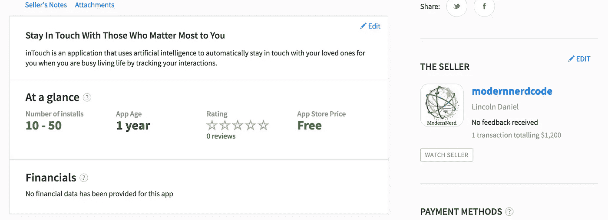

inTouch is an application that uses artificial intelligence to automatically stay in touch with your loved ones for you when you are busy living life by tracking your interactions.

既然你已经引起了他们的注意，那么一定要更详细地解释你的应用程序如何实现它所宣称的功能。尽管如此，还是要远离太多的技术术语；请记住，您的潜在投标人可能是商人，他们没有技术背景，只是在寻找一些东西来建立。以下是我在列表页面上的解释:

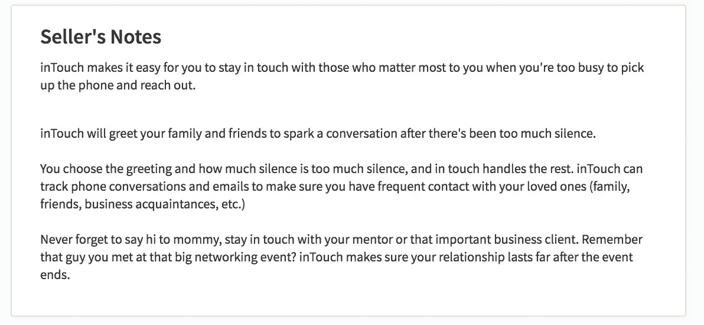

## 准备生动的图形

阅读大量文本是获取知识的一种方式。然而，在糟糕的日子里，这可能是获取采取行动所需信息的一种耗费精力的方式。图片是另一种手段，可以很容易地激发，同时以更及时的方式提供必要的信息。幸运的是，我在两年前构建 inTouch 时就知道这一点，所以我已经有了一些生动的图片添加到我的列表中。这些图片展示了 inTouch 的工作原理、工作原理以及它存在的原因。我在我的列表中添加了更多的图片，但这一个横幅就完成了任务:

你的购买者想知道当他们购买你的应用程序时，他们得到的是与之相关的一切。当你看不见的时候，很难知道你会得到什么。你的工作是让你的买家容易知道他们得到了什么。在你的列表中添加尽可能多的附件，以传达完整性:

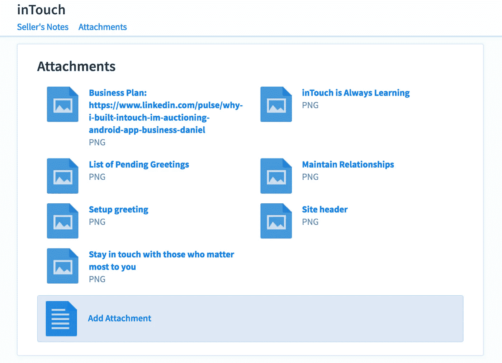

这些标题恰当的附件向潜在买家展示了这款应用的工作原理，包括一个网站，以及一份奖金[商业计划](https://blog.markgrowth.com/why-i-built-intouch-and-why-im-auctioning-the-android-app-business-plan-on-flippa-31abd0e226ba)，我稍后会谈到。

## 决定你愿意卖的最低价格

这一点很难，但它将在今后发挥作用；在 Flippa 上，他们称之为你的*储备*。你怎么知道你的应用在自由市场上值多少钱？我不知道，但我从我为什么要卖它开始:它只是停在 Google Play 上，一年有 10-50 次下载，我没有时间去推动它，所以我决定把它卖给可能有时间种植它的人。我并不真的需要钱来做任何特定的事情，但我确实需要足够的钱来证明它值得建造。多少钱才足以抵御那些可能会说我浪费时间建造它的朋友呢？我认为 500 美元是吹牛的好价钱。当你习惯于吃政府的奶酪时，500 美元是一大笔钱。所以是 500 美元。

如果你不知道什么是好的数字，试着看看平台上的其他列表，了解一下你的列表可以做什么。

## 拍卖它

现在是拍卖你的应用的时候了。你用你在这篇文章中整理的信息填写表格，你就为你的生活永远改变做好了准备！这是一个激动人心的时刻。你可以点击开始按钮，让出价开始，或者你可以添加一些升级，以增加你的销售机会。

我决定花 59 美元升级一下，让我的列表出现在 Flippa 应用页面的主页上。我不知道这有多大帮助，但我肯定它对一些人有帮助，因为 Flippa 自称是销售应用和网站的头号市场:

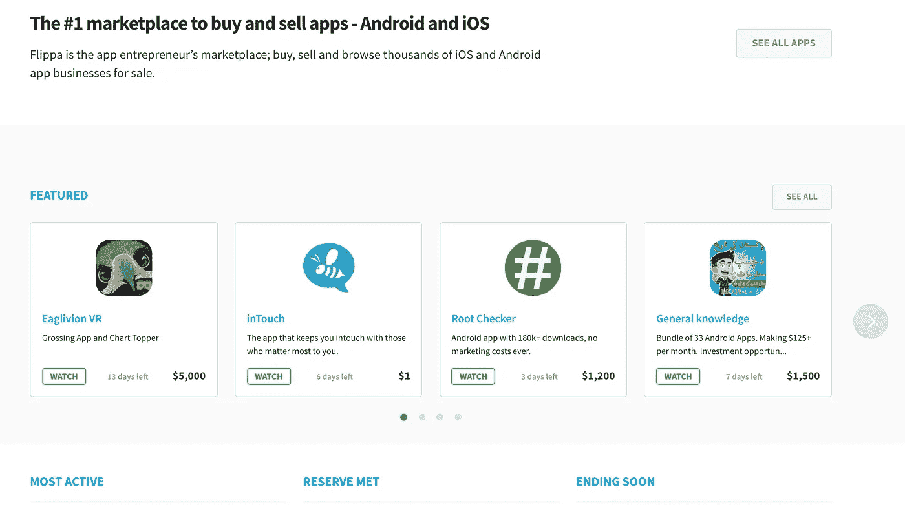

点击开始按钮，以 1 美元开始拍卖。我见过其他人以高价开始拍卖(我今天看到一个起拍价为 4 万美元)，但我不认为投标人对此反应良好。我采用了乌龟的方法，并且满意地看着竞价以指数级增长。

现在，你可以坐在那里，每五秒钟刷新一次页面，看看是否有新的出价者，或者你可以做些什么来增加你的列表流量。我第一次尝试在 Flippa 上销售时，我做了前者，尽管我最终得到了一些出价，有人愿意购买我的第一个项目，这是我在大一第一次学习编码时建立的，售价 200 美元以上，但我知道我可以卖得更多。从第一次经历中我知道了什么，我选择做一些事情来增加我的列表的流量。

## 为你的拍卖增加流量

你店里没人的时候，很难卖出东西。我只有七天时间在 Flippa 上销售我的应用程序，所以我知道我必须迅速行动，让尽可能多的人出现在我的列表页面上。就这样，我做了多年来我逐渐信任的事情:我在这个博客平台上写了一篇名为 [Medium](/) 的文章(你应该去看看)。

在过去的几年里，我在 Medium 上发展了自己的受众，在构建工具和平台来帮助 Medium 上的其他作者和编辑的同时，我也发展了有价值的关系，我可以在需要的时候利用这些关系。我有一个朋友，[大卫·斯穆克](https://medium.com/u/7f91547ce9c9?source=post_page-----903f41b6b548--------------------------------)，他在 Medium 这里经营着[一家很受欢迎的科技出版物](https://hackernoon.com/)，我们在适当的时候互相帮助。他的出版物专注于技术和(我想)帮助彼此在奇妙的技术世界中导航，而我正在销售我自己开发的应用程序。我的文章将重点关注我为什么以及如何开发这款应用，以及我为什么要出售它，这样它就能为出版物的读者提供价值。我向他推销了这本书，他为我向他的 12.5 万读者发表了这本书。

> 我这么说是因为在这个过程中建立关系并为人们提供价值是非常重要的。通过这样做，当你有需要时，你将有更好的机会找到帮助。

这是我为[黑客正午](http://hackernoon.com)写的文章:

 [## 为什么我要开发 inTouch，为什么我要在 Flippa 上拍卖 Android 应用和商业计划

### inTouch 可以让您轻松做到这一点。与对你最重要的人保持联系。不幸的是，它可能…

hackernoon.com](https://hackernoon.com/why-i-built-intouch-and-why-im-auctioning-the-android-app-on-flippa-5cea2a8154a8) 

我在推特、脸书和 LinkedIn 上分享了它。在 Medium 之外，这篇文章没有获得太多点击，尽管它在脸书和 LinkedIn 上获得了许多赞。然后我想起来，分享文章的外部链接不如分享原生 LinkedIn 文章有效，所以我在我的 LinkedIn 个人资料上重写了这篇文章，并在那里分享。当时在 LinkedIn 上反响很好。所有这些都给我的列表带来了很大的流量。

分享文章后，我的列表的浏览量、关注者和出价者很快开始增加。虽然这篇文章没有被很多人阅读，但它被正确的人阅读了。这是买家对他如何找到我的拍卖说的话:

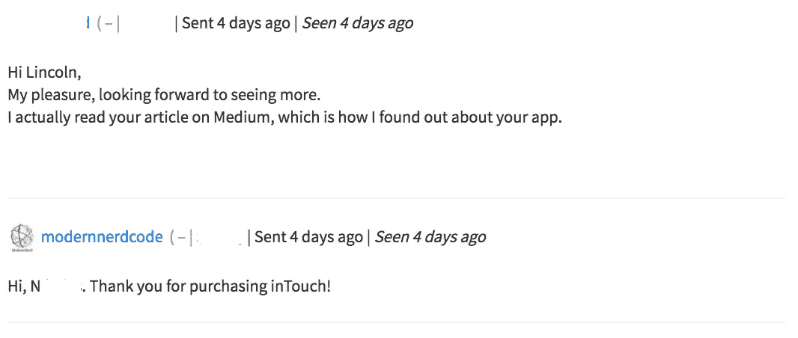

## 给他们比你卖的更多的东西

我把这次拍卖的成功归功于我写的宣传文章。它带动了更多的观点，并导致更多的优质投标人。但是为什么呢？我真的相信[如果你付出更多，你会得到更多](https://blog.markgrowth.com/entrepreneurial-advice-nobody-gives-you-d64515897dd2)。

我的拍卖是出售我的安卓应用，它在谷歌 Play 商店上市的那一年只有 10 到 50 次安装。它几乎没有用户。它不是传统的社交网络 app，不是游戏，也不是一个 app 的一夜成名。这是一个营销不善(几乎没有营销)的应用程序，没有收入。然而，我能够以符合收入需求的价格出售它。我想相信，投标人和出价的急剧增加是因为我提供了我对产品的愿景，以及如果我有资源来完成它，我的商业计划会是什么。

这些是我分享这篇文章之前的出价:

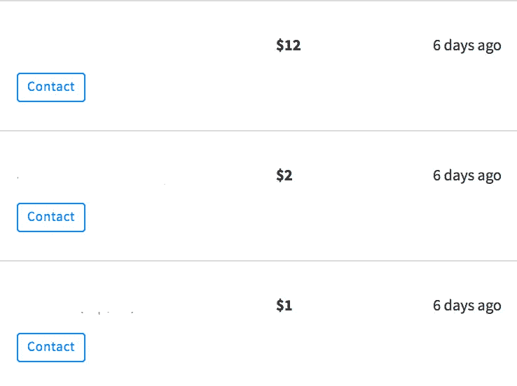

发表文章后，我开始发送垃圾邮件，查看我的列表的刷新按钮是否有效。不幸的是，它没有我刷新页面的速度快，所以我迅速做出决定，希望增加我的销售机会。我不得不加上“立即购买”的价格。我认为我可以得到 800 美元，但我随机认为 1200 美元将足够令人满意，是一个安全的数字。我决定花 1200 美元，并开始分享这篇文章。

很快，拍卖价格涨到了 100 美元。第二天早上，我打开笔记本电脑，看到拍卖价是 120 美元，然后两分钟后，两个人出价 150 美元。我告诉我的女朋友它现在正在上涨，她非常高兴。我放下它来完成一天的准备工作。当我五分钟后回来时，一个现有的竞拍者已经决定退出这场儿童游戏，结束拍卖。

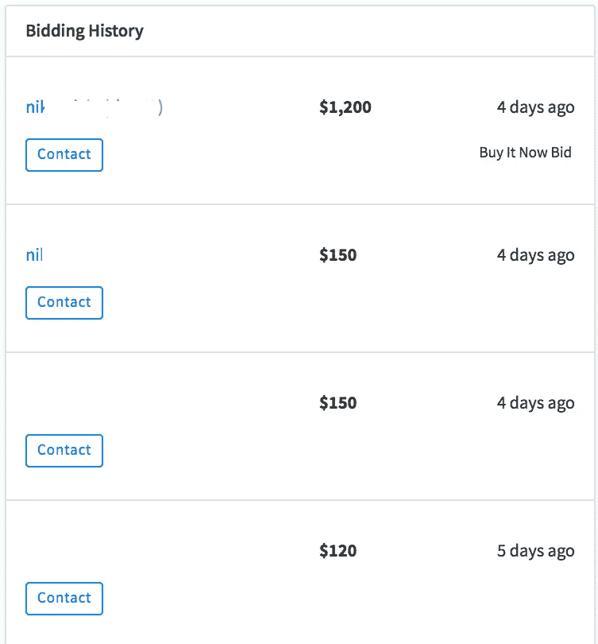

他从 150 美元跳到 1200 美元。为什么？除了那篇描述应用程序、我的动机、我的愿景以及可以用来将 inTouch 发展成一家公司的商业计划的文章让他相信，我出售的整套产品值得他放弃以更低价格购买 inTouch 的机会，或者让它输给另一个投标人，我没有别的可相信的了。

## 公开吸引投标人和观众

很重要的一点是，你要主动澄清潜在投标人可能有的任何问题或顾虑。与你的访客进行讨论，不要害怕利用这个机会进一步解释你卖的是什么，以及如何为买家带来利润:

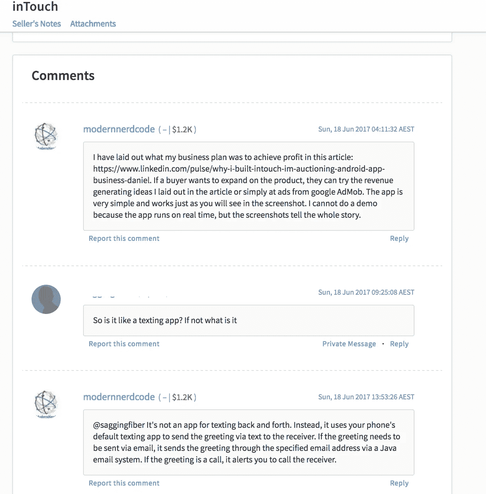

# 结束销售

这可能是这个过程中压力最大的部分。

所以你成功说服某人承诺购买你的应用。你应该感到高兴和兴奋，但继续关注你的时间、感情和钱包。这里的关键词是“提交”。正如你在生活中的经历所知，如果条件不适合维持承诺，承诺就会被打破。我在 Flippa 上看过卖东西的评论，在 Craigslist 上卖过东西，在易贝上买过东西，对此我非常了解，所以我在处理销售完成时非常小心。

## 处理即时后悔

收到买家的最终出价后，我立刻感到后悔……我想，“该死！我本可以得到 3000 美元甚至 5000 美元！”尽管我确实相信 inTouch 的价值甚至超过 5000 美元，但我不得不咽下我的遗憾，完成出售。我不会为了可能得到 5000 美元的机会而放弃 1200 美元。我也不想成为在交易中弃我而去的人。

## 转移资产

这里的关键是交流信任。你发送的每一条信息都应该精心制作，以传达你信任买家，他们也可以信任你。如果您使用的是第三方托管，系统会让您更容易相信销售会成功完成，但无论您选择如何转移资产，都必须建立一定程度的信任，以避免在没有获得付款或吓跑买家的情况下丢失资产。

我试图通过展示我们将如何转移资产的计划，并迅速回答买家的问题，比必要的信息更丰富，来传达信任:

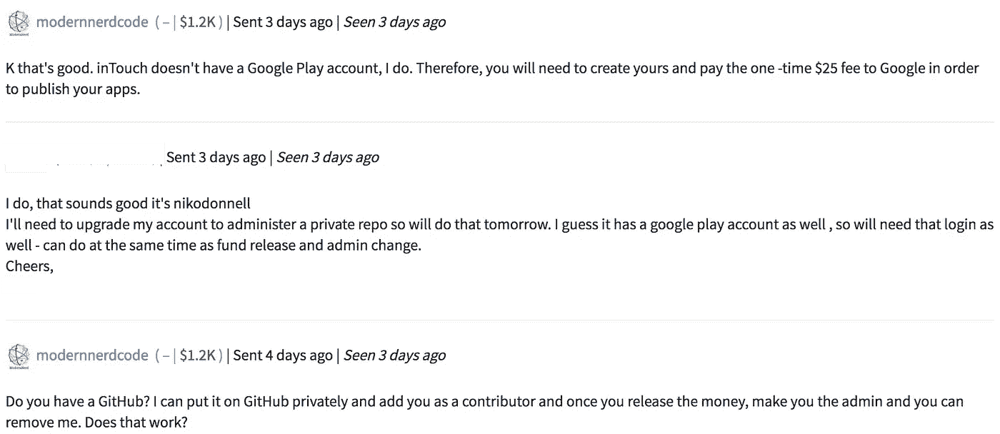

我将买家添加到一个 GitHub 回购协议中，该协议包含了他所购买的所有代码，我向他展示了我对他的信任，相信他不会在不付钱给我的情况下克隆回购协议并逃跑。当然，在我没有拿到钱之前，我不会把所有的代码都放上去。这就是买家对我的信任发挥作用的地方。

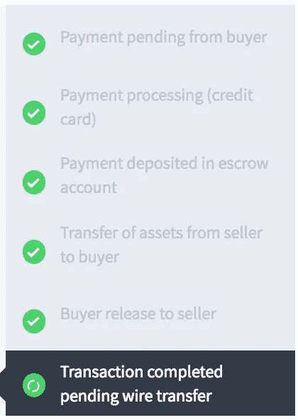

这是 Flippa 使用的托管流程。买家将钱放入金库，卖家将资产释放给买家，买家表示 Flippa 可以将金库中的钱释放给卖家，最后，Flippa 在身份验证后向卖家付款。如果你想正确地玩信任的游戏，你必须了解这个系统是如何运作的。

买家必须相信你会给他们所有的资产，你也必须相信买家不会不付款就带着你所有的资产逃跑。我不知道 Flippa 或其他托管系统如何处理一个逃跑的买家(或卖家)，但我不太相信解决中心。

为了避免买家逃跑，我保留了软件包中一个非常重要的部分，没有它，源代码几乎毫无用处。在我和买家之间建立了相当大的信任之后，我让他知道我保留了一段代码来保护我自己，同时尽量不让他有所防备:

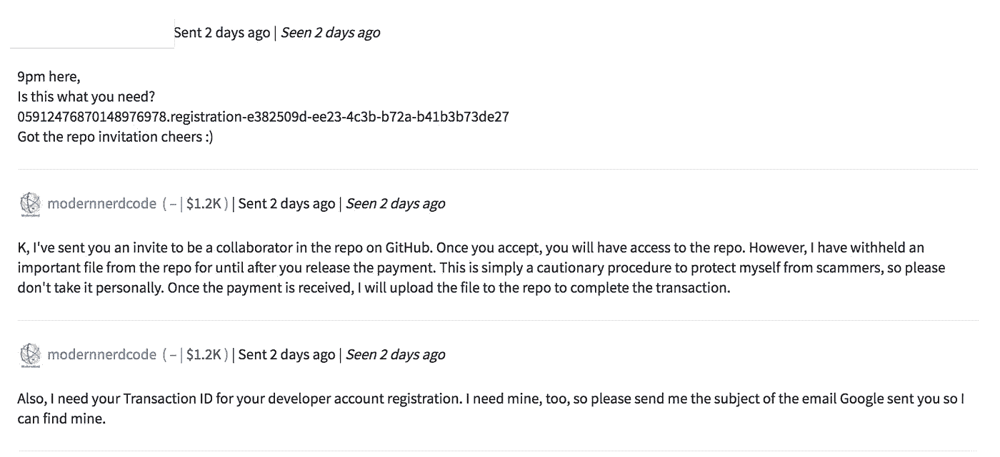

看来他不太在乎这件事。我们继续进行，并在四天后完成了交易(耐心很重要)。在经历了漫长的过程后，我们都开心地离开了。

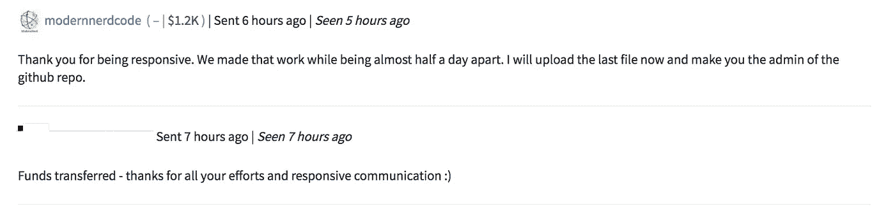

所以，总的来说，我花了两天时间从买家那里得到购买承诺，四天完成销售，还有一天剩余时间。

# 结论

所以，这就是我在 Flippa 上卖出第一个应用的方式。希望这里的信息对你以后准备卖自己的 app 或者网站有所帮助。请在下面的评论中告诉我你的想法、问题、担忧或任何你想到的东西。

如果你喜欢这个故事，请点击下面的心形让我知道并帮助其他人找到这篇文章。我会永远感激你！

> [黑客中午](http://bit.ly/Hackernoon)是黑客如何开始他们的下午。我们是 [@AMI](http://bit.ly/atAMIatAMI) 家庭的一员。我们现在[接受投稿](http://bit.ly/hackernoonsubmission)并乐意[讨论广告&赞助](mailto:partners@amipublications.com)机会。
> 
> 如果你喜欢这个故事，我们推荐你阅读我们的[最新科技故事](http://bit.ly/hackernoonlatestt)和[趋势科技故事](https://hackernoon.com/trending)。直到下一次，不要把世界的现实想当然！

