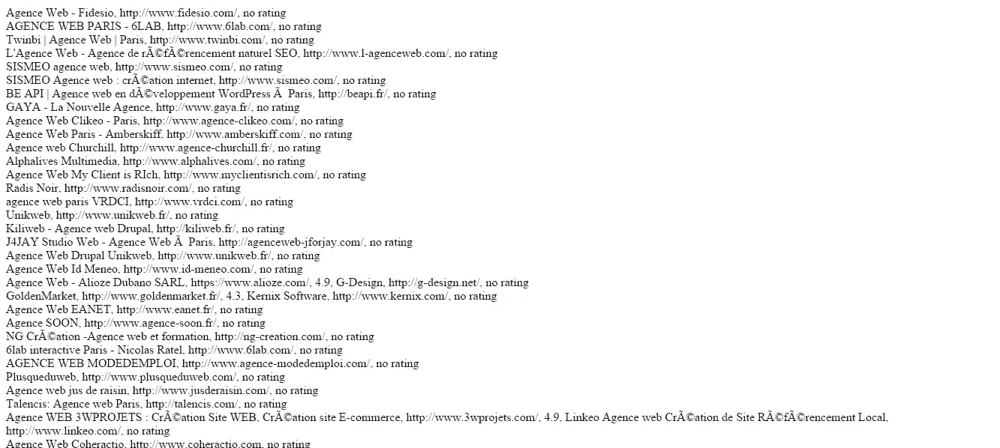

# 我是如何(在某种程度上)绕过谷歌地图 API 结果限制的

> 原文：<https://medium.com/hackernoon/how-i-sort-of-got-around-the-google-maps-api-results-limit-1c673e66ef36>

## 在 JavaScript 中使用闭包的一个实际例子

前一阵子我在找一份网页开发员的工作时，我到处寻找巴黎所有网页代理的名单。我想比较它们中的每一个，并在网上搜索一个我从未找到的详细而详尽的列表。

所以除了自己做，我看不到别的解决办法。我开始想知道在网上哪里可以很容易地找到这些机构，而不会迷失在谷歌搜索的 500 多万个结果中。

## Googles Places 是一个在任何给定地区通过关键词找到企业的好方法

我意识到，几乎每个网络机构在谷歌地图上都被称为一个地方。你猜怎么着？[谷歌地图 API](https://developers.google.com/maps/) ，更确切地说是[谷歌地点 API](https://developers.google.com/places/) ，可以让你做各种令人惊奇的事情，包括用关键词过滤器搜索地点，获取地点的名称，以及相应的网址、照片和用户评级。

如果我能找到一种方法，使用 Google Places 获取尽可能多的巴黎地区的结果，很大一部分工作就会自动完成，并为我节省大量宝贵的时间。

**剧透:**我设法得到了巴黎地区的 186 个结果，我知道这实际上并不是网络代理的总数(其中一些没有在 Google Places 上注册，其他的出于未知原因根本没有出现在结果中)，但这让我发现了一些有趣的结果，否则我不会发现这些结果。看起来是这样的:

**地图:**

Web agencies in Paris

**列表(节选):**

Data fetched from Google Places

**Google Places API** 似乎拥有了我所需要的一切:一旦搜索完成并返回结果， [Place Details request](https://developers.google.com/places/web-service/details) 允许你获取每个地方的名称、网址、照片和评级。我希望能够通过员工数量来评估每个机构的规模，但是嘿。

## 开始搜索

我在 localhost 上建立了一个项目(稍后我需要使用 PHP 将结果写入一个文件中)，并遵循 [JavaScript](https://hackernoon.com/tagged/javascript) API 文档来启动地图(在这里获取它[，并发出一个雷达搜索请求(在这里](https://developers.google.com/maps/documentation/javascript/tutorial)[获取它](https://developers.google.com/places/web-service/search)):

文本搜索或附近的搜索请求可以让您直接访问所需的响应参数，但有一个主要限制:每个查询最多返回 20 个结果。每次搜索可以返回多达 60 个结果，分布在三个页面上，这意味着您可以调用一个 **next_page_token** 数据，并得到一个**总计 60 个结果**，但随后您就被卡住了。

## 避开 60 个结果的查询限制

**雷达搜索**请求可以让你一次搜索多达 **200 个地方**，但是比通常从文本搜索或附近搜索请求返回的细节要少。你基本上得到每个地方的 ID，但没有更多的细节，甚至没有一个名字。

这意味着您必须遍历您的结果，通过传递您找到的每个地点的 ID 来调用[地点详细信息请求](https://developers.google.com/places/web-service/details)。Place Details 请求是返回我们寻找的所有参数的地方。

这将发生在我们的`service.radarSearch`函数的回调中:

这部分有效。虽然总数是 186，但是我**通过循环结果只得到 10 个详细的结果**。这是为什么呢？

## 避开每秒 10 次查询的限制:`setTimeout`和闭包

嗯，地点详细信息请求的问题是它让你每秒只能查询*10 个结果*。代码的执行用时不到一秒，所以看起来我们在这里碰壁了，不是吗？

如果我们使用`setTimeout`函数每秒查询一个结果，因此永远不会达到每秒 10 个结果的限制，会怎么样？

for 循环中使用的 setTimeout 函数是 JavaScript 中意外行为的典型例子[。](/@shyamseshadri/the-5-types-of-js-developers-i-find-in-interviews-225bd547c421#.7sm5bg578)

这就是**闭包**对有很大帮助的地方[，它允许我们存储 186 个结果中找到的每个值，并将它们存储在`agencies`数组中以备后用:](/@lenafaure/how-to-use-javascript-closures-with-confidence-85cd1f841a6b)

最后，完整的 JavaScript 代码片段是:

我现在可以用它来获取我想要的结果并使用数据，结果看起来很有趣:

Fetching one result / second

当然，这对于实时应用程序来说是行不通的，但是对于获取我想要查找的特定地点的数据来说，这非常有用:)

想了解更多关于 JavaScript 的基础知识吗？查看我的其他文章:

*   [**JavaScript 中的吊装:快速指南**](https://hackernoon.com/hoisting-in-javascript-a-quick-guide-cc4d9597bbd7)
*   [**轻松理解 JavaScript 变量作用域**](https://hackernoon.com/understand-javascript-variable-scope-with-ease-221a6d41dc43)
*   **搞清楚“这个”**
*   **[**如何自信地使用 JavaScript 闭包**](/@lenafaure/how-to-use-javascript-closures-with-confidence-85cd1f841a6b)**
*   **[**掌握 JavaScript**](https://hackernoon.com/grasp-by-value-and-by-reference-in-javascript-7ed75efa1293) 中的“按值”和“按引用”**

**我希望你喜欢这篇文章，随时评论并喜欢这篇文章，以便其他人可以在媒体上轻松找到它！**

****************

> **[黑客中午](http://bit.ly/Hackernoon)是黑客如何开始他们的下午。我们是阿美族家庭的一员。我们现在[接受投稿](http://bit.ly/hackernoonsubmission)并乐意[讨论广告&赞助](mailto:partners@amipublications.com)机会。**
> 
> **如果你喜欢这个故事，我们推荐你阅读我们的[最新科技故事](http://bit.ly/hackernoonlatestt)和[趋势科技故事](https://hackernoon.com/trending)。直到下一次，不要把世界的现实想当然！**

****