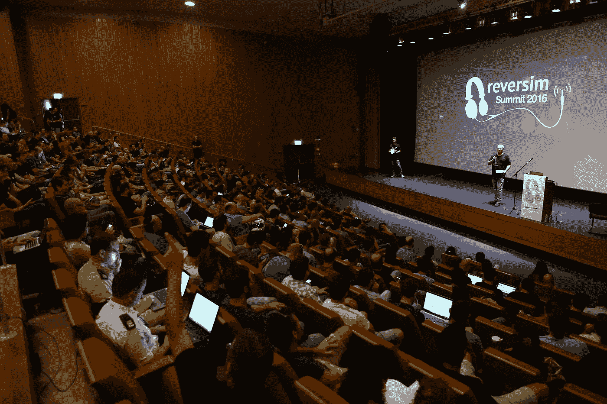
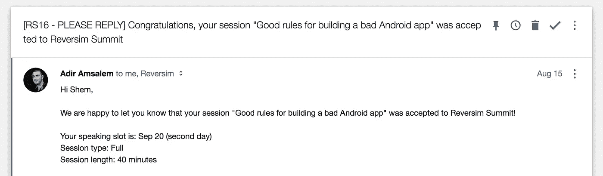
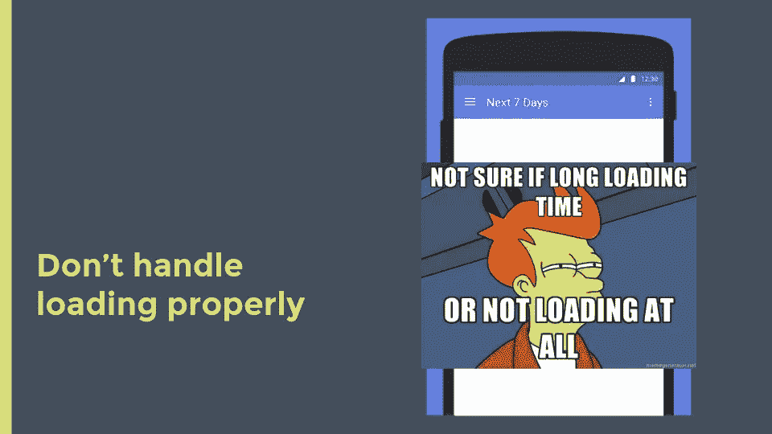
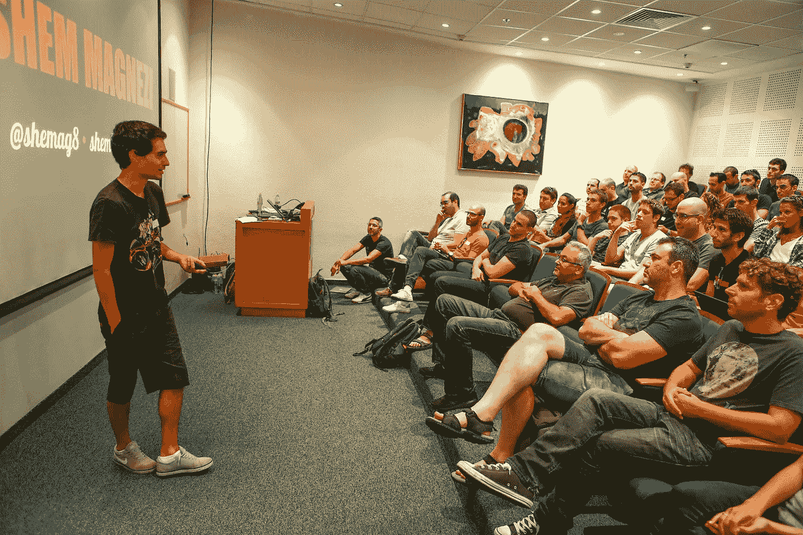

# 我是如何熬过我的第一次大型会议演讲的

> 原文：<https://medium.com/hackernoon/how-i-survived-my-first-big-conference-talk-532d337d439a>

## *20.9*日，我在[*Reversim 峰会*](http://summit2016.reversim.com/) *(以色列最大的开发者大会之一)上发表了关于构建 Android 应用的演讲。这是我第一次在这种规模的会议上发言。这并不容易，但我挺过来了，我在这里谈谈我的旅程。*

大约 3 个月前的一天，我在我的一个脸书小组中偶然发现了一个关于 9 月份将举行的开发者大会的帖子:

> 大家好，
> 
> Reversim 峰会可能是以色列最好的(如果不是最好的)独立软件工程会议之一，它将于今年 9 月 19-20 日在魏茨曼研究所举行。
> 
> 作为一个 100%基于社区生成内容的活动，会议与提交的内容质量一样好。
> 
> 征稿现在开始了...

这是我第一次听说黑白棋峰会。我熟悉播客[并且知道它很好，所以我知道这个会议应该有价值。所以我决定试一试。](http://www.reversim.com/)

# 选择正确的内容

好的，所以我决定在会议上发言，但是关于什么呢？我从伟大的[陈秋琪](https://medium.com/u/cd95dc24dfe?source=post_page-----532d337d439a--------------------------------)那里得到的关于[如何成为一名 Android 专家](https://www.youtube.com/watch?v=PeKKzeAte30)的一个很好的建议是拿起你的一篇博客文章，然后创建一个话题。我认为，这是一个很好的方式，当试图描述我将要谈论的内容时，给评论者一个更有说服力的方式，而不是只有 1-2 段。

幸运的是，我写了几篇技术文章，但大多数都是关于如何在 Android 中做各种事情的教程。此外，他们中的大多数人没有获得太多的关注，这让我觉得人们不会太感兴趣。

此外，我知道这次会议将会收到很多提交材料，我知道我的演讲应该是不同的。鉴于我没有足够的声誉，而且因为人们对更大规模的技术问题比对移动技术更感兴趣——如果我与其他技术会谈，我会失败。

所以，我决定选择我的关于如何构建一个糟糕的应用程序的系列博文([第一部分](http://shem8.github.io/blog/2016/03/31/10-good-rules-for-bad-app-part-1-technical/)、[第二部分](http://shem8.github.io/blog/2016/04/17/10-good-rules-for-bad-app-part-2-uxui/)、[第三部分](http://shem8.github.io/blog/2016/05/06/10-good-rules-for-bad-app-part-3-product/))。这很好，因为:

1.  这也将涵盖手机开发的其他方面，如设计和产品。
2.  这次谈话将是关于我的经历和我所做的事情。我认为这些是最好的谈话。
3.  我不喜欢太技术性的演讲——我不相信我们可以从幻灯片中读到太多的代码，或者在没有实际操作的情况下理解深刻的技术概念。所以这对于高水平的复习来说是非常好的，因为每个人都可以得到很多小东西。
4.  它很轻松，很有趣，是一个有趣的演讲。

# 征稿

这总是一个棘手的部分(尽管有一些关于如何[为 CFP](http://speaking.io/plan/writing-a-cfp/) 写一份好的摘要的好资源可以提供帮助)。

我如何使我的摘要突出我的讲话，使它独一无二？我如何描述我正在谈论的内容(如何构建一个糟糕的应用程序)而不混淆观众？怎么说有点技术含量但又不过分？如何仅仅用一段话就让别人知道是给开发者、设计师、产品经理看的？

尽了最大努力得到了这个:

> 如今，开发一个像样的应用程序很容易，有很多关于它的教程、视频和博客文章。在这一节中，我将试着回顾一些我们每个人在开发应用时都会犯的错误。这将涵盖构建糟糕的应用程序的所有方面——技术、用户界面和 UX，以及产品。所以你们每个人都可以适应自己喜欢的坏模式，毁掉自己的应用程序。

我认为它很棒，因为它很清楚，但仍然让读者感到好奇。人们可能担心这不够专业，但是他们知道他们可以从谈话中得到行动项目。

一周后，审查开始，它结合了群众投票和处理所有请求并选择最佳请求的版主团队。

大约有 300 个提议会议，只有 30 个会被批准，我在移动轨道，有 30 个提交，只有 3 个会被选中。10%的几率，没有你能理解的那么高。

在和我的版主发了几封邮件和打了几个电话之后(谢谢 [Adir Amsalem](https://medium.com/u/2182c416e290?source=post_page-----532d337d439a--------------------------------) ！)，我收到了这封邮件:

> 事情变得真实了。

# 预热

现在是做实际工作的时候了。我立即在我工作的地方安排了一次谈话，作为我们两周一次的公司谈话计划的一部分。

我决定为每个列表选择 5 条规则:技术、用户界面/UX 和产品。我想为 15 条规则中的大部分找到一个来自真实应用的例子，目标是每个人都知道的大应用。建立一个最小的幻灯片，用规则和一两张图片(可能的话截图，其他的用 gif)和几张幻灯片作为介绍和背景。

这对于第一次运行来说很棒，但是也有一些问题:

1.  太长了，我花了大约 50 分钟，而我只有 35 分钟(外加 5 分钟的提问时间)。**解决方案-将规则列表削减至 11 条。**
2.  当我走到幻灯片前，在我开始讲述之前，观众能够看到幻灯片标题中的规则。这扼杀了惊喜的效果。**解决方案-改变动画淡入的顺序，这样文本会显示在最后。**
3.  gif 一直在播放，并加强了观众(和我)的注意力。**解决方案——在 gif 上面放一个静态的 gif 图片来“停止”gif 图片，点击后显示出来(这是一个很好的技巧，从现在开始我将把它应用到我所有的演示文稿中)。**

经过一些调整后，峰会的一位导师安排了另一次在 Wix 办公室的演练。有点像私下排练(向他和另一所大学展示)以收集最终反馈。

我们再次发现了可以改进的地方:

1.  简介太长，不太清楚。**解决方案——我将在第一张幻灯片上讲述我的故事，在另一张幻灯片上讲述动机，然后去掉另外两张幻灯片，而不是用 4 张不同的幻灯片来讲述我为什么要做这个讲座。**
2.  没有互联网连接，谷歌幻灯片上的视频无法播放。**解决方案-保存视频的本地副本，并使用它。**
3.  谈话突然结束了。**解答-添加一张总结幻灯片，列出我们讨论过的所有规则。**

我还把主题改成了更干净的，并展示了最后一张幻灯片:

# 秀场

9 月 19 日——峰会的第一天，注册并聚集到主题演讲厅(由令人惊叹的 [Iris Shoor](https://medium.com/u/612b82f03228?source=post_page-----532d337d439a--------------------------------) 主持)，进入一个大约有 500 人的大礼堂。幸运的是(实际上也有些失望),我的会议被安排在一个小得多的房间里，所以我不需要因为必须在这么多人面前讲话而抓狂。

在峰会期间，我参加了一些很棒的演讲(由[埃亚尔·亚沃尔](https://medium.com/u/758b460d87a1?source=post_page-----532d337d439a--------------------------------)、[里尔·巴尔-翁](https://medium.com/u/d39e872a386?source=post_page-----532d337d439a--------------------------------)、[尤瓦尔·萨梅特](https://medium.com/u/eaf9c484f838?source=post_page-----532d337d439a--------------------------------)、[博阿兹·高恩](https://medium.com/u/950930c7c65?source=post_page-----532d337d439a--------------------------------)和[柳文欢·埃伦博根](https://medium.com/u/1060f9ec7045?source=post_page-----532d337d439a--------------------------------))和令人惊叹的灯光演讲(尤其是由[哈盖·莱文](https://medium.com/u/b3b5f0a38554?source=post_page-----532d337d439a--------------------------------)和[迈克尔·蒂罗什](https://medium.com/u/eb8bef6e7a5f?source=post_page-----532d337d439a--------------------------------)主持的)，甚至还有一首歌！(作者 [Yoni Tsafir](https://medium.com/u/f260c37b79a8?source=post_page-----532d337d439a--------------------------------) )。这是你在会议中发言的另一个好处——你可以得到一张免费票=)

我的演讲是在第二天早上，我有点紧张，但不是太多。Reversim 团队很棒，我的一切都被照顾得很好。我只需要记住规则的顺序(因为正如你所记得的，我改变了它，当我开始谈论它时，我没有幻灯片中的文本),但除此之外，我感到非常自信。

一切都很顺利，大厅并不大，所以我不需要麦克风，这让它更自然。我还得到了一些观众朋友，这让我压力小了一些。我甚至在开始前想好了一些笑话。

很快就完成了。有趣的是，你为 40 分钟的演讲准备了很长时间。在舞台上它甚至感觉更短。

我得到了非常好的反馈，他们说讲座非常好，他们学到了一两件以前没有想到的错误。

# 下一步是什么

从那以后，我在另一个会议上做了演讲- [Droidcon Tel-Aviv](http://il.droidcon.com/) 我计划再做一次或者两次。

我觉得用希伯来语交谈很舒服，即使是在一大群观众面前。我的下一个里程碑是把这种自信带到我用英语说话的时候，并在国外的会议上发表演讲。我可能需要准备比以前更多的东西，但我想我很快就能做到。

# 结论

*   明智地选择你的谈话。想一想你的相对优势是什么，以及你的演讲如何能从所有的演讲中脱颖而出。
*   不要害羞。不要认为自己不够有趣，没有别人可以学习的东西。
*   任何排练你都会得到更多的反馈，做得越多，你的演讲和幻灯片就会越好。但是:
*   不要想多了。你永远不会变得完美。了解哪里足够好，不要对你所拥有的感到自信。

*照片由:* [*黑白派峰会 2016 相册*](https://photos.google.com/share/AF1QipPORYX7nOWI1AsG8wE8SDrKCi3llj81FxRS1aXKfVrt1oauBI_KIZKWaAb79JoJ1w?key=OFJXdVJyZHUzckRjbUY3UXgyWmNSWHQ3R1lIR2F3)

如果你喜欢这篇文章，请点击下面的“推荐”按钮，分享这个故事。我也爱看所有的评论。谢谢！

*原载于 2016 年 10 月 3 日*[*she M8 . github . io*](http://shem8.github.io/blog/2016/09/23/my-way-to-reversim/)*。*

> [黑客中午](http://bit.ly/Hackernoon)是黑客如何开始他们的下午。我们是 AMI 家庭的一员。我们现在[接受投稿](http://bit.ly/hackernoonsubmission)并乐意[讨论广告&赞助](mailto:partners@amipublications.com)机会。
> 
> 如果你喜欢这个故事，我们推荐你阅读我们的[最新科技故事](http://bit.ly/hackernoonlatestt)和[趋势科技故事](https://hackernoon.com/trending)。直到下一次，不要把世界的现实想当然！

