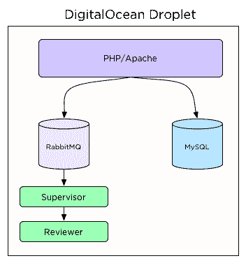
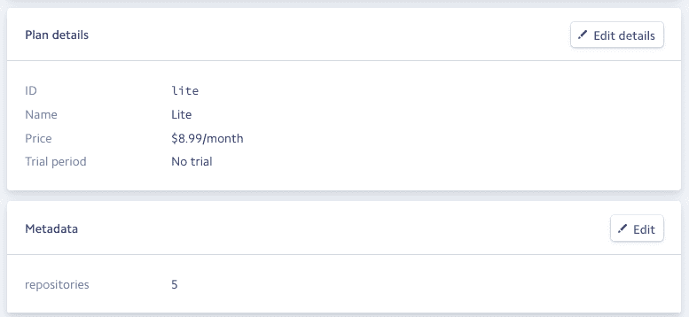

# 我是如何把坚持 CI 从一个想法变成一个侧面的骗局的

> 原文：<https://medium.com/hackernoon/how-i-took-stickler-ci-from-an-idea-into-a-side-hustle-3a7287d953a5>

# 关于本系列文章

在这个由三部分组成的系列中，我将讲述从最初的原型到今天的过去两年中 [Stickler CI](https://stickler-ci.com) 的演变。这篇具体的文章将涵盖我如何建立最初的原型，然后添加付费计划。

# 我的副业

Stickler CI 是一个软件即服务应用程序，它自动化了代码审查中更繁琐的部分；强制样式和检查 lint 错误。它与您的 [GitHub](https://hackernoon.com/tagged/github) 库集成，并检查每个 pull 请求的代码风格错误。当你的团队中有人犯了风格错误时，坚持不懈的 CI 会留下评论。这节省了开发人员的时间，因为对样式错误的反馈是自动处理的，您的团队不必通读构建报告来查找空白错误。

当我们的团队在 FreshBooks 上重构我们应用程序的旧部分时，在花了大量时间对风格错误给出反馈后，我受到启发，创建了[风格的 CI。我认为一定有更好的方法来反馈在代码评审中发现的代码风格&格式错误。](https://hackernoon.com/tagged/stickler)

# 最初的原型

前端应用程序是用 CakePHP 构建的，而执行代码审查的应用程序后端部分是用 Python 构建的。持久数据存储在 MySQL 中，RabbitMQ 用于检查作业队列。经过几个月的初始隐形模式开发阶段，我已经准备好了一个初始原型。第一个版本部署在一个 1GB 的 DigitalOcean 微滴上。我开始时只有一个用户(我)。建筑看起来是这样的:

Initial application architecture

应用程序的所有组件都放在一个盒子里。我的目标是用最少的花费和最少的复杂性将原型呈现在人们面前。虽然单服务器方法在容量和可伸缩性方面有局限性，但我目前并不担心这些问题；我只有一个用户。在使部署/基础设施更具弹性或可伸缩性之前，我想看看是否有人会使用该产品并为此付费。

简单的基础架构使我能够使用完全相同的 Ansible 行动手册来管理我的本地和生产环境。这也使得“扩大”变得容易，因为我可以很容易地从 DigitalOcean 获得更大的实例。此时，Stickler CI 只能连接到公共存储库，因为如果原型被证明是成功的，我想对私有存储库收费。

我在我的一些开源项目中启用了 Stickler CI，以帮助贡献者解决他们自己的 lint 错误，并希望激起一些对产品的兴趣。从我的开源项目中，我吸引了第一批用户，有几个用户想在他们的私有存储库上使用 Stickler CI。这是一个足够积极的信号，促使我建立私人的知识库支持和付费计划。

# 添加付费计划

我选择使用一个非常简单的基于订阅的业务模型，该模型根据个人想要启用的私有存储库的数量进行扩展。我选择私有存储库作为差异化因素，因为它的计费模式与 Stickler CI 的竞争对手类似。

我用 Stripe 来建立订阅。Stripe 是一个很棒的产品，它有很棒的 API 和很棒的文档。Stripe 处理卡令牌化、计划列表和订阅计费。我利用计划上的元数据字段来存储每个计划提供的私有存储库的数量。这消除了在我的应用程序代码中维护产品映射及其存储库限制的需要。

Plan metadata in Stripe

在升级期间，我可以读取存储库元数据字段，并知道要授予用户多少个私有存储库。

在这个阶段，大约有 50 个用户，Stickler 每天处理大约 150 个任务。Stripe 的加入并没有从根本上改变架构，但我开始担心我为了让产品上市而走的一些弯路。我将在我的下一篇文章中详细介绍这些快捷方式以及我是如何修复它们的。