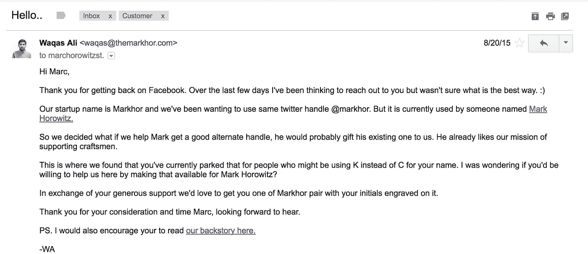

# 我是如何用鞋子换来我梦寐以求的 Twitter 手柄的

> 原文：<https://medium.com/hackernoon/how-i-traded-shoes-for-the-twitter-handle-i-was-dreaming-of-c58d53b07577>

## 一个关于善良和一点点喧嚣的故事。

当我们把我们的[创业](https://hackernoon.com/tagged/startup)的名字从老家改成[马克霍](https://markhor.com)的时候。任何社交媒体渠道(尤其是 Twitter)都没有@Markhor 这个账号。所以为了不浪费时间，我们注册了@themarkhor。

## @markhor —由 Mark Horowitz 使用

随着时间的推移，我们注意到我们的客户经常在 twitter 上给我们贴上@Markhor 的标签，而不是@themarkhor。我们查找了一下，发现马克霍是由一位名叫*马克霍洛维茨*的绅士使用的。是的，他用了他全名的前 7 个字母，这恰好是我们品牌的名字。如果我们要求他放弃这个账号，我们没有什么可以回报的，所以我开始寻找一个更好的/类似的 twitter 账号给他。我和他也没有直接的联系，那时他是媒体的编辑。

## 帮助来自一个意想不到的地方。

我们忙着接近 Y Combinator 演示日(我们是 2015 年夏季班的一部分)。接下来是演示日，YC 每年在山景城的计算机历史博物馆组织两次。

我和我的联合创始人西德拉穿着我们的马克霍尔 t 恤会见潜在投资者。当史蒂文·利维走近我们时，他说你好。毫无疑问，史蒂文是最资深的科技记者和作家之一。我想我有点吓坏了。他非常友好，并进一步提到他以前在 Wired 工作的老板目前有 twitter 账号@Markhor，Steven 可能会从他那里帮助我们。我们接受了邀请，并请史蒂文和马克商量一下，做一个介绍。

几天后，我又联系了史蒂文，第二天他做了介绍。我们和马克谈过，并提出我们会给他一个好的 twitter 手柄作为替代，还有一双漂亮的马克霍鞋。他欣然同意支持。我注意到的一件事是马克和史蒂文都超级善良和慷慨。我就知道会成功的！

## @markhorowitz—由 Marc Horowitz 拍摄但未使用

我们还找到了@markhorowitz，一个被拿走但没有真正使用过的账号。我知道这将是向马克·霍洛维茨提供的理想把柄。为了找到谁拥有它，我们仔细看了看，这个账户只关注了两个人，其中一个叫马克·霍洛维茨，所以我们认为这可能是我们的人，他可以给我们@马克·霍洛维茨，然后我们可以用[@马克·霍](http://twitter.com/markhorowitz)交易这个账户。

我在谷歌上搜索了马克·霍洛维茨，惊讶地发现他和我有一个共同的脸书朋友，加里·谭，当时我们是 Y Combinator 的合伙人。加里愉快地介绍了 T2 和脸书。马克告诉了我他的电子邮件地址，然后我给他写了下面的邮件。

(We offered the best thing we could, which is off course: Markhor shoes.)

他的助理回复了我，在几封来回的电子邮件之后，我们安排了一次电话。我发现，在说服别人或分享你关心的事情时，电话比电子邮件有效得多。

成功了，我们达成了协议。这比我们预期的要多，但我同意给他们做 13 双 Markhor 鞋，以此交换 twitter 账号@markhorowitz。基本上，他们希望整个团队都能得到一双 Markhor 鞋。

我们又花了 2-3 个月的时间，才获得所有的尺寸调整权，退货问题很少，我们不得不从头开始管理。最后，他们得到了所有的鞋子，我们把 twitter 的手柄换了。现在我们拥有了 handle @markhorowitz。

然后，我回到马克·霍洛维茨身边，请他开始换鞋，我们给他买了一双马克·霍洛维茨鞋。史蒂文·利维也因为他的支持得到了一个。

然后这一天来了，我们做了改变。最后，我们得到了梦寐以求的 twitter 账号。

整个过程中，好几次我都有想要放弃的感觉。感觉工作太多，没有任何成功的希望，但这是一个很好的教训。

我喜欢从成功中学习。

**相关:**看这段视频，当时我从巴基斯坦飞到旧金山，亲手将鞋子送给我们的 Kickstarter 支持者。

> [黑客中午](http://bit.ly/Hackernoon)是黑客如何开始他们的下午。我们是 [@AMI](http://bit.ly/atAMIatAMI) 家庭的一员。我们现在[接受投稿](http://bit.ly/hackernoonsubmission)并乐意[讨论广告&赞助](mailto:partners@amipublications.com)机会。
> 
> 如果你喜欢这个故事，我们推荐你阅读我们的[最新科技故事](http://bit.ly/hackernoonlatestt)和[趋势科技故事](https://hackernoon.com/trending)。直到下一次，不要把世界的现实想当然！

