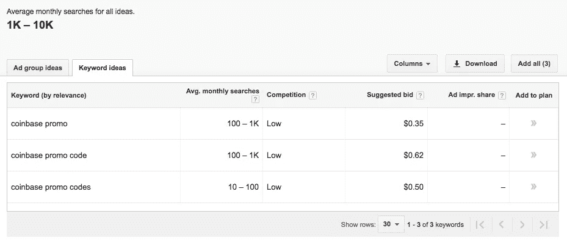
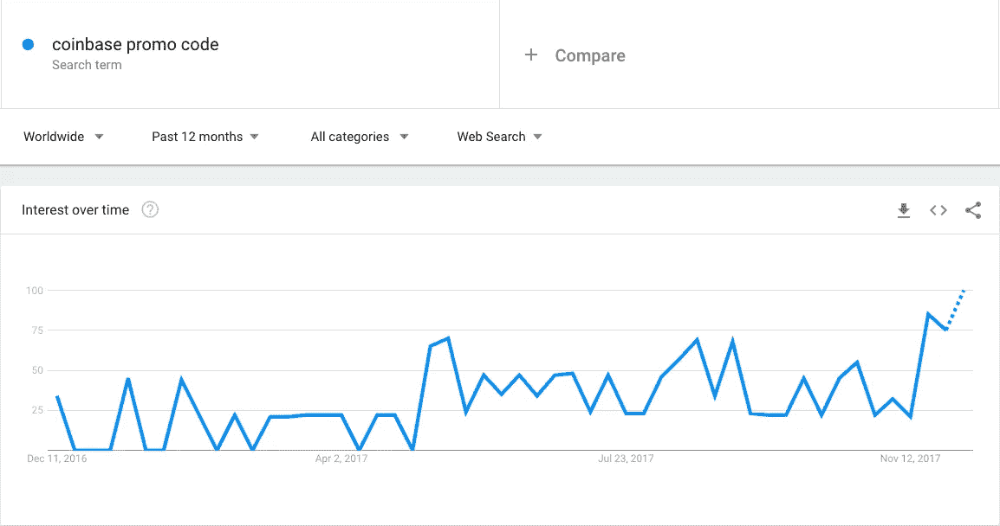
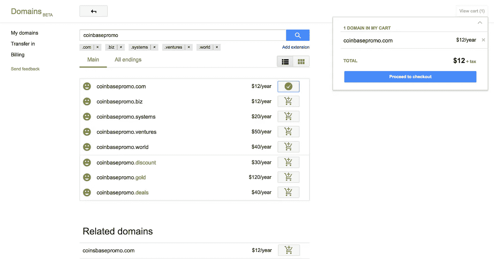
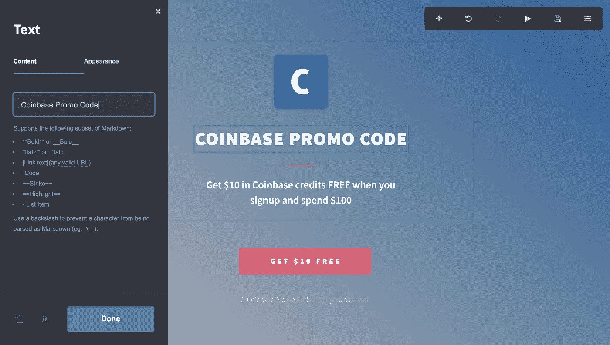
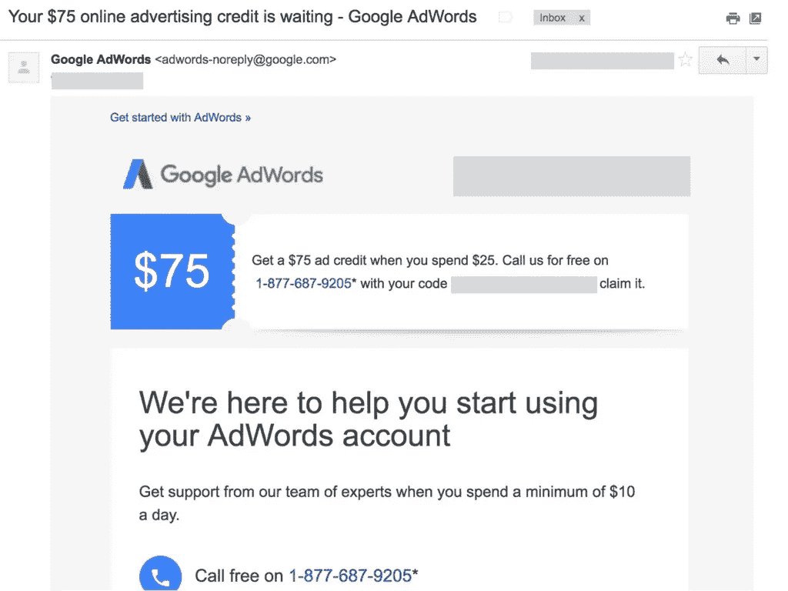
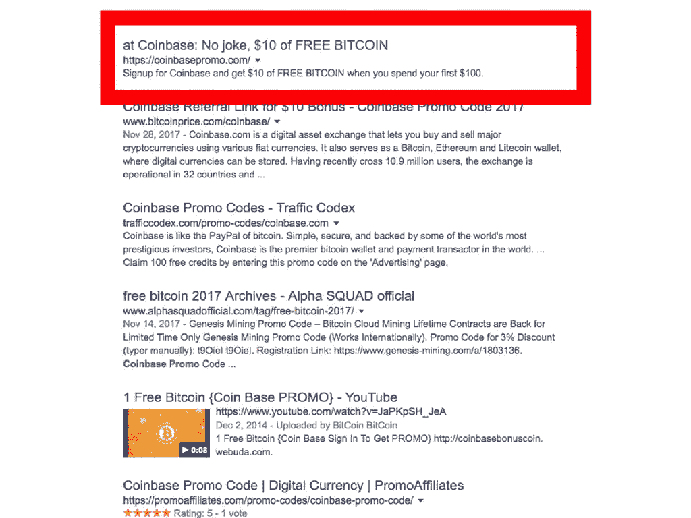
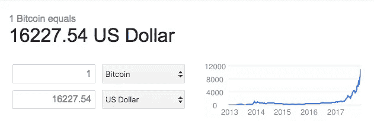
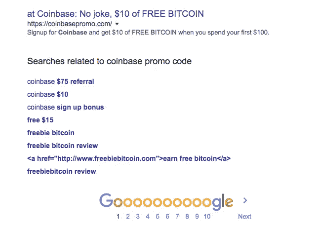

# 我如何将 26.24 美元变成 1000 多美元的比特币

> 原文：<https://medium.com/hackernoon/how-i-turned-26-24-into-1-000-of-bitcoin-c0b44bf2b17d>

不用花一分钱在比特币上…💵

 [## 每当彼得·施罗德发表文章时，就收到一封电子邮件。

### 每当彼得·施罗德发表文章时，就收到一封电子邮件。通过注册，您将创建一个中型帐户，如果您还没有…

medium.com](/subscribe/@peterschroederr) 

我的想法背后的概念相对简单。我想用 10 美元的比特币基地推荐项目来提供我自己的[比特币基地推广代码](https://www.coinbase.com/join/drat67_c?src=ios-link)。(基本上，当有人注册比特币基地并花费 100 美元时，比特币基地会给你价值 10 美元的比特币。)

随着比特币的迅速崛起和进入比特币基地的便利，我认为人们会寻找比特币基地的促销代码来购买比特币。

为了证明我的假设，我查看了 Goggle Keyword Planner 上的关键词量和 Google Trends 上的流行度。

Google Keyword Planner

Google Trends

事实证明，这是一个相对热门的话题。🔥(我一个月得到 1k-10k 不是一吨的搜索量，但对于这样的事情来说足够移动指针了。)

所以我决定放手一搏。我创建了一个 URL，在那里我分享了我唯一的推荐代码。然后，我申请了一些免费的广告积分，并在我的网站上投放了一些广告，针对那些希望第一次使用[比特币基地](https://www.coinbase.com/join/drat67_c?src=ios-link)的人(这是我的推荐代码起作用的唯一方式)。

# 所以，我是这样做的

1.  **注册域名。💰**

我使用了 [Google Domains](https://domains.google) 和 [Honey](http://joinhoney.com/ref/ifv42p) 来获得从最初的 12 美元到 1.24 美元域名注册费的大幅折扣。

Google Domains

我买了[coinbasepromo.com](https://www.coinbase.com/join/drat67_c?src=ios-link)

2.**创建网站。👨‍💻**

如果你没有听说过 [Carrd on Product Hunt](https://www.producthunt.com/posts/carrd) ，建议你去看看。基本上，它是世界上最简单的单页网站生成器。

我用他们超级简单的界面为 coinbasepromo.com 设计了一个网站。

Carrd.co

我能够在不到 15 分钟的时间内到达 coinbasepromo.com。

3.在 AdWords 上创建免费广告。💸

你需要做的就是谷歌“谷歌广告词”，点击第一个链接。他们应该有免费获得你的第一笔 75 美元 Google AdWords 的步骤(当你花 25 美元的时候)。

Google AdWords

我在不到 10 分钟的时间里制作了一些普通的文字广告，并将它们指向[coinbasepromo.com](https://www.coinbase.com/join/drat67_c?src=ios-link)

注意:你可以在其他平台上做同样的事情(比如 Bing)，我可能还会做。我只是不太熟悉必应的广告。

4.**在谷歌上有机排名。💫**

对我的页面进行排名需要一点时间，但我希望最终能够对与[比特币基地推广代码](https://www.coinbase.com/join/drat67_c?src=ios-link)相关的搜索查询进行有机排名。

Google Search Results

# 那么，我做得怎么样？🤔

随着比特币的波动，很难给出一个确切的数字——但这是一个非常有趣的实验！我花在这件事上的时间比写这篇文章还少。那是大约 2 小时的工作。

在我写这篇文章的时候，比特币已经达到 16000 多美元，并且还在快速增长(不是一直都是这样)。🤑

我很高兴在下面的评论中回答人们的任何问题，如果有足够多的人感兴趣，我也会不断更新这篇文章。🍻

如果你知道有人想投资比特币，一定要让他们去 coinbasepromo.com🚀

更多增长秘诀和秘密新闻，请订阅[API 经济](https://www.apifirst.tech/?ref=medium)。

# 更新

谢谢大家的支持！我很高兴看到人们自己进行实验，以及用大量用例尝试这种实验的变体。

仅仅几天的时间，该网站就在谷歌上排名第三，并且已经登上了“ [coinbase promo code](https://www.coinbase.com/join/drat67_c?src=ios-link) ”词条的首页。

此外，这篇文章在谷歌的第三页上排名相同。