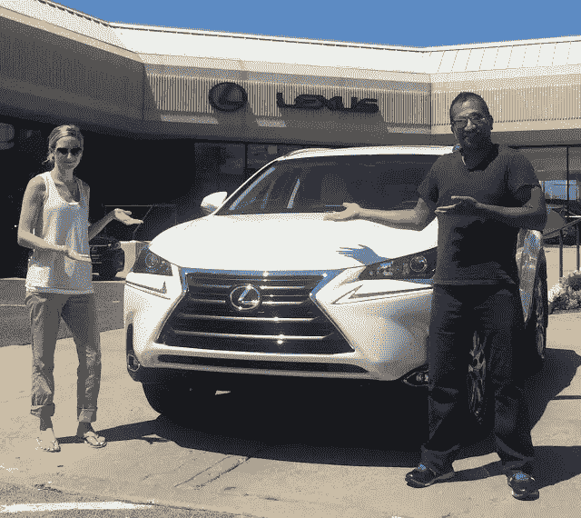
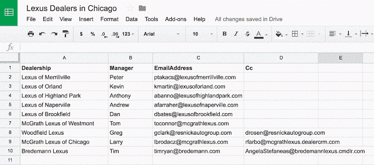
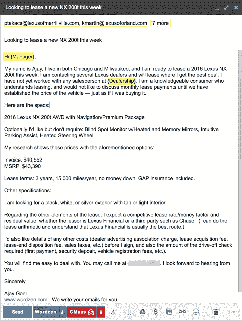
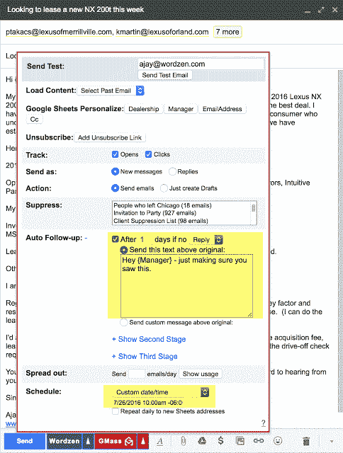
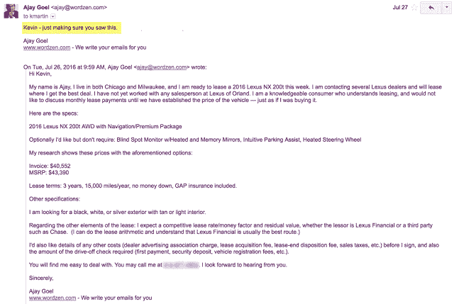
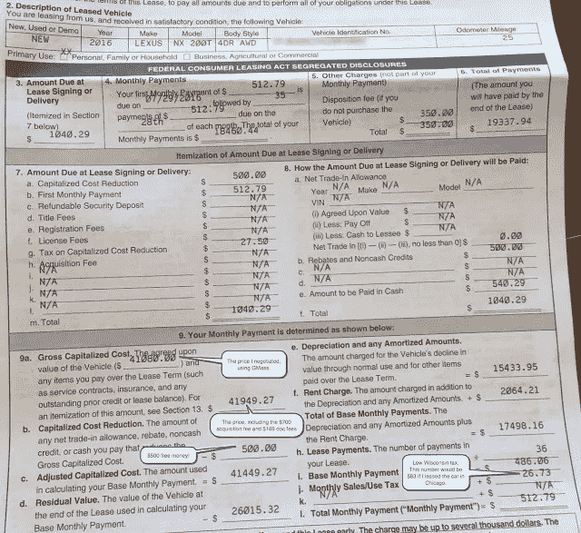

# 我如何使用我创建的 Gmail 邮件合并扩展以低于发票成本的价格购买了一辆全新的 2016 款雷克萨斯

> 原文：<https://medium.com/hackernoon/how-i-used-a-gmail-mail-merge-extension-i-created-to-buy-a-brand-new-2016-lexus-under-invoice-cost-fed4dc529c92>

My wife and I with our brand new 2016 Lexus NX 200t on August 1, 2016\. We used GMass, a mail merge extension for Gmail that I created, to negotiate the price of the car without ever setting foot in the dealership.

小时候，我喜欢和爸爸一起去汽车经销店。我被买车的过程迷住了。销售员会写下一个数字，我爸爸会哼哼哈哈，写下一个更低的数字，销售员会消失几分钟去“和他的经理谈谈”，然后回来拿一个更高的数字，然后我爸爸会起身离开，然后他们会从停车场追他回来，这个过程重新开始。

去年，我创建了一个名为 [GMass](http://www.gmass.co) 的 [Gmail](https://hackernoon.com/tagged/gmail) [扩展](https://hackernoon.com/tagged/extension)，可以让你直接从 Gmail 账户发送邮件合并活动。上个月，我不仅用它买了一辆新的 2016 款雷克萨斯 NX 200t，还确保我支付了最低的价格。

我用的不是我爸爸的系统，而是詹姆斯·布拉格的购买新车系统，它建议你给方圆 100 英里内的每一家经销商发一封传真，详细说明你想要的车。然后，你让经销商相互竞争，为你提供尽可能低的价格。我**采用他的方法给**发邮件，而 [GMass](http://www.gmass.co/) 是协调、跟踪和[自动跟进](http://blog.gmass.co/2016/05/automatic-follow-up-emails-until-reply-in-gmail.html)汽车经销商的完美解决方案。

# **针对经销商的邮件合并活动:**

1.结合使用 Edmunds.com 和 Lexus.com 的网站，我详细说明了我想要的东西，从选项到配件到可接受的颜色。

2.然后，我记下了包含在电子邮件中的**发票价格**和**建议零售价**。这样经销商就会知道我做了功课，是一个认真的买家。

3.接下来，我查找了芝加哥 100 英里半径范围内的每一家经销店，给每一家经销店打电话，向接待员要了销售经理的电子邮件地址。与销售经理而不是任何老销售助理一起工作是很重要的，因为销售经理在以成本价或低于成本价的交易谈判中拥有最大的权力。我把销售经理的名字、电子邮件地址和其他联系信息放在了一个 Google Sheets 电子表格中。

The spreadsheet I made of all Chicago area Lexus dealers and sales managers

4.接下来，我用 GMass[连接到我的电子表格](http://blog.gmass.co/2015/10/mass-email-mail-merge-google-sheets.html)，然后在 Gmail 中起草我的电子邮件。这是邮件:

The mail merge campaign I created to send to the 10 Lexus dealers in Chicago. I’m personalizing each email with the sales manager’s name and the dealership name.

使用 GMass，我[给每封电子邮件都写了销售经理的名字和经销商的名字。](http://blog.gmass.co/2016/07/gmass-complete-guide-to-personalization-gmail-email-marketing.html)

5.我包含了一个[自动跟进](http://blog.gmass.co/2016/05/automatic-follow-up-emails-until-reply-in-gmail.html)，将在 24 小时后发送给任何没有回复的销售人员**。**

Setting an auto email follow-up would trigger a new email 24 hours later to anyone that didn’t reply to the original email.

6.最后，我**安排**我的邮件在**月**的最后一个星期二发出，对我来说是**星期二，2016 年 7 月 26 日**。布拉格建议在接近月底的周二、周三和周四发送你的报价。

7.我点击了 **GMass 按钮**，我的活动被安排好了。

# **我发完邮件后:**

1.**邮件发出后不到 10 分钟，就有两家经销商打电话来报价。**内珀维尔的雷克萨斯提供了 3，750 美元的建议零售价，高地公园的雷克萨斯提供了 3，033 美元的建议零售价。

2.因为这两个经销商打电话而不是回复邮件，我不想让他们收到 24 小时跟进邮件。所以我手动将他们的地址输入到 GMass 自动跟进抑制系统中，以确保他们没有得到 24 小时的跟进。

3.在最初的三个小时内，已经有五家经销商回复了我的邮件，要么是打电话，要么是回复邮件。

4.在原始电子邮件发出 24 小时后，汽车跟进邮件发出时，只有两家经销商没有回复，因此只发送了两封跟进邮件。**这两家经销商都在一小时内对跟进**做出了回应，这很典型。这就是自动跟进邮件的威力……它们能确保你得到回复。每个经理都解释说他前一天没上班，刚到办公室。

> 我怀疑，如果不是因为自动跟进，他们都不会回复，因为他们会认为机会已经过去 24 小时了，但自动跟进电子邮件使它看起来好像机会仍然新鲜和可用。

以下是一封自动跟进邮件的示例:

The auto follow-up email that went out to a dealer 24 hours after the original email, because he hadn’t replied yet.

经过第一轮沟通，所有九家经销商都做出了回应，现在我已经收到了来自九家经销商的八份报价。第 9 家经销商回复了我的电子邮件，但从未真正报价。在整个过程中，**我从未涉足过一个经销商**。我都是在家里做的，除了必须打几分钟电话之外，所有的业务都是通过电子邮件以自动化的方式进行的。

# **谈判的经验教训:**

1.许多经销商打电话回复电子邮件，而不是回复电子邮件。我可以理解——通过说话，他们希望马上锁定交易，而电话需要双向通信，所以对经销商来说，这也是对我是合法买家的确认。

2.**九家经销商都没有我想要的选装配置。**为什么？因为包括雷克萨斯在内的大部分汽车厂商，都是把各种选项打包成两三种不同的汽车配置。

> 从数学上来说，如果一辆汽车提供 10 种选择，那就是 55 种不同的选择配置，没有汽车制造商愿意制造 55 种不同版本的汽车。

因此，他们制造两个或三个版本，提供他们认为对买家最有吸引力的选项。**因此，我最终租赁的汽车比我在电子邮件中详述的汽车有更多选择。**

2.有一次，销售经理让我走投无路:

> “告诉我我需要在哪里锁定这个价格。”

正如布拉格会告诉你的，**拒绝这个问题**。坚持让经销商报价的过程，你就能成为一个诚实的人。你是在向经销商传达，你将从出价最低的人那里购买，如果你吐出一个价格来锁定一个特定的经销商，你就没有给每个经销商一个公平的机会来竞争你的业务。我想 **a)得到最低的价格**，并且 **b)以道德的方式购物**。

3.在与经销商交谈之前，我不知道的是，当时雷克萨斯为新车租赁提供了两项激励措施:

*   **放弃第一个月的付款**，无论是基于购买价格、货币因素、税收还是其他变量。
*   **$500 租赁现金**适用于汽车的最终协商价格。也就是说，如果我协商的购买价格比建议零售价低 1，000 美元，那么购买价格实际上比建议零售价低 1，500 美元。每个经销商都提供这种服务，尽管有些经销商比其他经销商更加透明。

4.不管你的谈判能力有多强，在芝加哥租一辆新车总是一场失败的游戏，因为芝加哥的汽车租赁税高得离谱。尽管最近的一项法律降低了汽车租赁税，通过对每月付款而不是汽车的全价征税，[你仍然要为汽车租赁的每月付款支付高达 17%的税(销售税和使用税](http://www.chicagotribune.com/classified/automotive/ct-rides-1225-illinois-autolease-tax-20141222-story.html)。然而，我妻子的妈妈是威斯康辛州的居民，她大方地同意我们以她的名义租车，**为我们节省了每月 60 美元 x 36 个月= 2160 美元**。这就是芝加哥的租赁税比密尔沃基高多少。

5.伊利诺伊州格伦维尤的布雷德曼雷克萨斯给出了最好的报价。最初的报价是:

**我想要的任何 NX 200t 的发票金额为 1，200 美元，以及雷克萨斯财务公司的所有其他标准费用，总计:**

*   **700 美元收购费**
*   **169 美元的文件费**
*   **. 00085 货币因素，相当于 2.04%的低融资利率**
*   **汽车最终协商价格的 500 美元租赁现金返还**
*   **经销商支付第一个月的付款**

**按照布拉格的流程，我与每个经销商进行了第二轮谈判，为他们提供降低初始价格的机会。**

> ***在这种情况下，Bredemann 在他们不知道的情况下，已经提供了最好的价格，同意将购买价格再降低 120 美元。***

# ****雷克萨斯租赁合同:****

****

**The final Lexus lease contract. Note the final negotiated price and the $500 bonus cash. Total monthly payment = $512.79.**

# ****最终想法:****

**使用我开发的 Chrome 扩展 GMass，它可以为任何 Gmail 帐户添加邮件合并功能，我以 41，080 美元的价格谈判并购买了一辆新的 2016 款雷克萨斯 NX 200t，当时的标价是 44，854 美元 T22。我使用**调度**在周二早上发送电子邮件，我使用**开放式跟踪**跟踪哪些经销商收到了我的报价，我使用**自动跟进**联系从未回复的销售经理。**

**任何人都可以使用 [GMass](http://www.gmass.co/) 来方便同样的购车流程。**我已经免费每天发送多达 50 封电子邮件**，所以除非你打算联系 50 多家汽车经销商，这太疯狂了，否则你不必付钱给我来完成这个过程。**

# ****疑问？评论？****

**做某人的购车英雄，分享这个！**

************

> **[黑客中午](http://bit.ly/Hackernoon)是黑客如何开始他们的下午。我们是 [@AMI](http://bit.ly/atAMIatAMI) 家庭的一员。我们现在[接受投稿](http://bit.ly/hackernoonsubmission)，并乐意[讨论广告&赞助](mailto:partners@amipublications.com)机会。**
> 
> **如果你喜欢这个故事，我们推荐你阅读我们的[最新科技故事](http://bit.ly/hackernoonlatestt)和[趋势科技故事](https://hackernoon.com/trending)。直到下一次，不要把世界的现实想当然！**

****