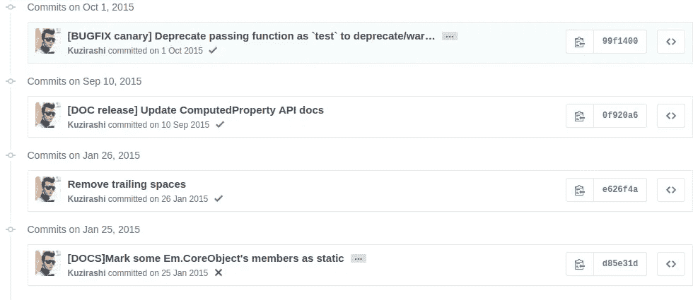
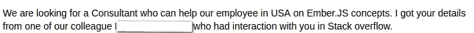

# 我如何使用 Stack Overflow & GitHub 在没有学位的情况下在 19 岁之前得到梦想中的工作

> 原文：<https://medium.com/hackernoon/how-i-used-stack-overflow-github-to-get-dream-job-before-19-without-degree-8cb5184e2bec>

嘿，我叫丹尼尔，今年 18 岁。我没有这方面的学位。我刚刚写完了我的期末考试。我有两个梦想，高薪工作。本人全职前端开发者，兼职远程 Ember.js 顾问。

毫无疑问，我得到这两份工作多亏了**栈溢出**和 **GitHub** 。以下是我如何利用这些伟大的网站获得:

*   雇主会尊重的声誉
*   需要注意的是，有兴趣的公司会邀请你参加 10-15 次视频电话面试，大多是远程面试
*   兼职远程 Ember.js 顾问工作
*   全职前端开发人员工作

# 开源代码库

GitHub 帮助我得到了不是一份，而是两份工作！当我参加关于兼职顾问工作技能的技术面试时，我把 GitHub 作为我的优势。此外，当我被考虑担任我现在担任的全职前端职位时，我被要求提供我的 GitHub 帐户的链接。

当你面对雇主时，你需要有东西在手里。他们要求你具备特定语言、框架的知识，但是**让他们明白**你和意大利面的唯一共同点是你的饮食，这也是非常重要的**。**

See [Spaghetti code](https://en.m.wikipedia.org/wiki/Spaghetti_code).

[GitHub](https://hackernoon.com/tagged/github) 是一个可以展示代码的地方。例如，当你学习新的[技术](https://hackernoon.com/tagged/technology)时，去创建一个带有一些如何利用该技术的概念证明的存储库，并将它上传到 GitHub。这种方法有四个好处:

*   你可以用它来证明你了解技术、语言、框架
*   人家看你写好代码，你能结构化，你懂 [OOP](https://en.wikipedia.org/wiki/Object-oriented_programming) ，你写[扎实](https://en.wikipedia.org/wiki/SOLID_(object-oriented_design))，干净的代码。招聘人员可以向团队展示这一点，他们可以决定是否要面试你(第一技术)
*   您至少掌握了 Git 的基础知识——您在 GitHub 上维护存储库
*   招聘人员会根据你在 GitHub 上有哪些语言的知识库，自动给你发送邮件。我已经收到了大约 10 封这样的邮件。所以，如果你有 C#库，那么你可能会收到 C#职位的邀请。当然，招聘人员发来的邮件没什么大不了的，但可以让谈话继续下去。你处在他们向你伸出援手的位置，而不是相反。相信我，这很容易。

我已经做过了。我收到了这些邀请。我并没有在我的所有项目中都遵循这一点——其中一些是在 GitLab 上私下创建的。我希望将来能卖掉它们，但没能完成。然而现在我后悔了，它没有公开。如果我将它作为开源文件发布，并附上它如何工作的小文档和截图，那么它将开始作为我的作品集为我工作。

[My repositories on GitHub.](https://github.com/Kuzirashi?tab=repositories)

我也为各种各样的，主要是与 Ember 相关的知识库做出了贡献。有时是文档，有时是代码。在面试中说出你对某件大事做出了贡献是很有用的。但对我来说，这只是微小的改进。

[My commits to Ember.js repository.](https://github.com/emberjs/ember.js/commits/master?author=kuzirashi)

# 堆栈溢出

几年前，我相信栈溢出是不用大学就能找到工作的最可靠的方法。我是对的。

我怎么知道的？我非常喜欢开源。我看过雇主通过查看堆栈溢出帐户来衡量你的技能。没那么容易。但是，当我和我现在的公司谈全职工作时，差不多 10000 的声誉(当时是 6 月份)，加上我的年龄，足以让雇主脸上产生这种惊叹的效果。他们决定试试我。谢谢堆栈溢出！

[Stack Overflow account overview](http://stackoverflow.com/users/2166409/daniel-kmak?tab=profile), August 2016.

我用各种语言和框架创造了东西。ASP.NET 和 Mono 的游戏服务器列表，XNA 的塔防桌面游戏，Java 服务器，C# WPF 客户端等。唯一让我感兴趣的事情可能是使用网络获取或发送数据。

我最拿手的牌是 Ember.js。我 16 岁的时候(2013 年)就开始学习了，那是在我看了旧金山 HTML5 会议上[耶胡达·卡茨](https://medium.com/u/324797632ca4?source=post_page-----8cb5184e2bec--------------------------------)的[这个非常出色的视频](https://youtu.be/u6RFyVN9sNg)之后。所以我有我的目标，学习余烬，我需要更多的动力和决心。引用自[这段视频](https://youtu.be/rstD4rm3EQ8)自从我第一次听到它就在我的脑海里。

> 无论你做什么，都要充满热情。

没错。回到堆栈溢出。第一，当我在学习的时候，我在那里寻找答案。然后我开始回答他们——为了获得声誉。我打开我的标签，出现了新的问题，我试图成为西方最快的枪手，首先回答它们——当涉及到更受欢迎的话题时——比如 JavaScript。在 Ember 就容易多了。我有很多时间来写我的答案和分析复杂的问题。这个标签回答问题的人比较少。

一段时间后，我在过去的 30 天里排名第一。我得到了关注，我收到了工作机会的邮件。其中一个是兼职远程 Ember.js 顾问职位。我收到了提议，因为我帮助了一个人在灰烬标记栈溢出。真实的故事。这是证据。

Fragment of email.

后来我接受了关于我对 Ember 的理解的技术采访。我通过了。我是 Ember.js 自 2015 年 11 月以来的 Techolution 顾问。

创建堆栈溢出职业简介也非常重要。这里有两个原因:

*   你会得到一份很酷的简历，上面有你从堆栈溢出的成就，就像你的答案一样多
*   雇主可以在那里找到你并给你发信息，到目前为止，有 2 个雇主在那个网站上联系过我，但都是非常严肃和直接的提议

[My Stack Overflow CV.](http://stackoverflow.com/cv/kuzi)

**结论**

相信自己，努力。在 GitHub 和 Stack Overflow 上记录你的技能。为开源库做贡献，创建你自己的库。让人们了解你。向他们展示你生活在某个地方，你有能力做一些了不起的事情。向他们展示你的激情。在这种情况下，招聘人员每天都在努力寻找像你这样的人。让他们的生活更轻松。

感谢阅读。喜欢的请推荐。:)如果你有不同的观点或者很棒的故事要分享，请评论！我对所有的反馈都很满意！

你想读更多吗？率先在 danielkmak.com/blog 的[看到其他故事！](http://danielkmak.com/blog)

如果你想谈谈，请给我发电子邮件:【contact@danielkmak.com 。☺

> [黑客中午](http://bit.ly/Hackernoon)是黑客如何开始他们的下午。我们是 [@AMI](http://bit.ly/atAMIatAMI) 家庭的一员。我们现在[接受投稿](http://bit.ly/hackernoonsubmission)并乐意[讨论广告&赞助](mailto:partners@amipublications.com)机会。
> 
> 如果你喜欢这个故事，我们推荐你阅读我们的[最新科技故事](http://bit.ly/hackernoonlatestt)和[趋势科技故事](https://hackernoon.com/trending)。直到下一次，不要把世界的现实想当然！

