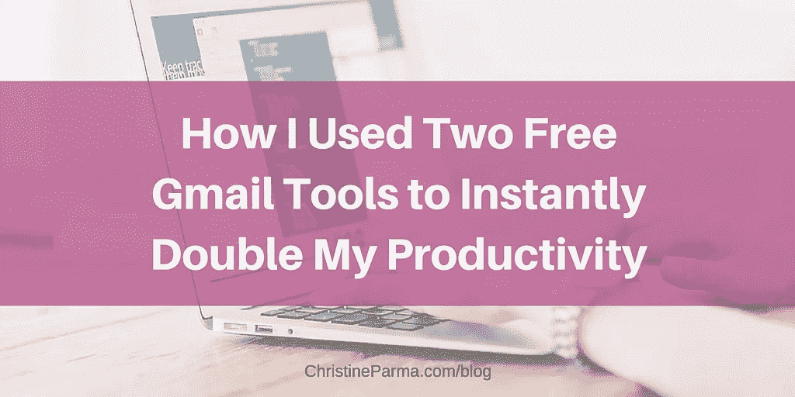
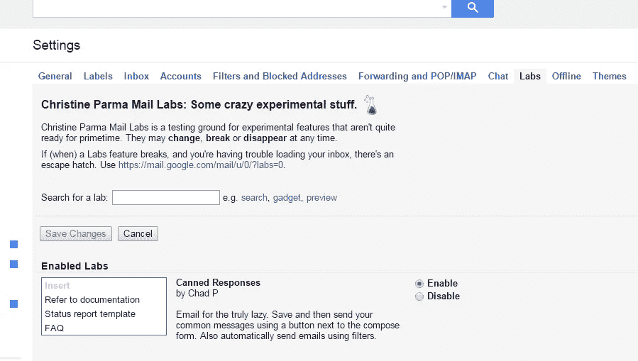
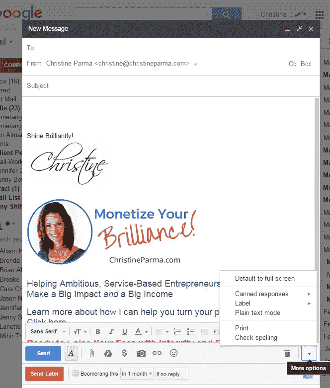
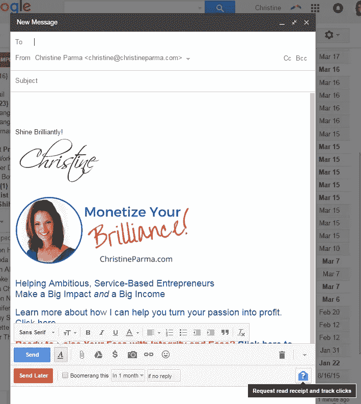
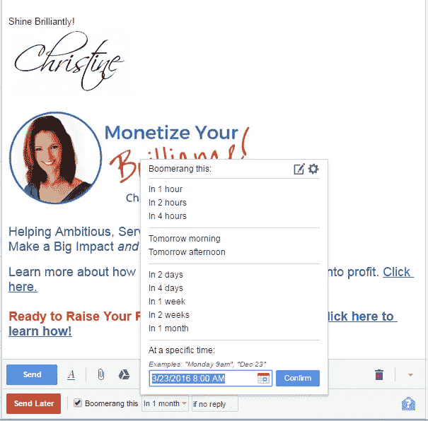

# 我如何使用两个免费的 Gmail 工具让我的工作效率瞬间翻倍

> 原文：<https://medium.com/hackernoon/how-i-used-two-free-gmail-tools-to-instantly-double-my-productivity-5f1b50daeec4>

[http://christineparma.com/blog/two-free-gmail-tools-double-productivity](http://christineparma.com/blog/two-free-gmail-tools-double-productivity)

作为一个企业主和母亲，我总是试图找出如何在更少的时间里做更多的事情。接触潜在客户，跟进询问和交流新的机会，仅仅是撰写和回复电子邮件就能消耗掉大量的时间。

我在很多业务后端使用 Google Apps，非常渴望找到一种方法来减少我发送个人电子邮件和跟踪回复的时间……我现在就想使用它，基本上没有学习曲线。

这时我发现了一个神奇的组合:谷歌实验室的预约回复+[Gmail 的回旋镖](http://www.boomerangapp.com/)。

一旦我安装并开始使用这两个工具，我发送电子邮件的时间实际上减少了一半……我发电子邮件的效率瞬间提高了一倍。如果你每天花几个小时撰写和发送电子邮件，这将是一个巨大的挑战。

最棒的是。这些邮件都是从您的 Gmail 帐户发送的，所以您发送的每封邮件都是个人邮件，而不是底部带有邮件发送者标志的时事通讯邮件。在个人层面上参与对商业网络和推广你的博客、预订播客以及跟进潜在和现有客户至关重要。这种免费工具的神奇组合使它变得更加容易和快捷！

我在下面列出了让你的 Gmail 工作效率翻倍的步骤。

# 使用 Gmail 录音回复和回旋镖的步骤，将你写、发和跟踪邮件的时间减少一半

# 第一步

创建您的各种电子邮件模板，并突出显示每个模板上需要定制的区域(例如，名字)，这样您就不会无意中向“您好，名字”发送电子邮件。

# 第二步

转到您的 Gmail 帐户。

# 第三步

进入齿轮图标(设置) >实验室(最右上角的标签) >预设回复，下载 Gmail 预设回复。点击“启用”。

*在“设置”中的“实验室”选项卡下启用预设响应*

# 第四步

去[www.boomerangapp.com](http://www.boomerangapp.com/)下载回旋镖。遵循安装说明。您希望安装“预定发送”和“阅读回执”选项。

# 第五步

现在，您的 Gmail 帐户中应该已经安装了 Gmail 自动回复和 Boomerang。

# 第六步

要开始创建预设回复模板，请单击您的电子邮件撰写按钮。在电子邮件的右下角，您会看到一个下拉箭头。单击它，并将鼠标悬停在“预设响应”上。

*如何找到安装后的预设响应菜单。*

# 第七步

点击*新的预设回复*。

# 第八步

将所需的电子邮件模板复制并粘贴到新邮件正文中。进行必要的编辑，让它成为你想要的样子。对于主题，插入一个标题，提醒您固定回复的用途。在您的预设响应选项列表中，您将只看到前 16 个字符左右，因此请正确命名。你可能需要编辑你发出的每封邮件的主题。

# 第九步

转到您的预设响应菜单，在菜单中间部分的灰色“保存”下找到您刚刚创建的模板的名称。(*见下面我的笔记)。单击您创建的模板的名称。询问您是否想要覆盖它的信息。单击是。

# 第十步

现在你已经有了你的第一个现成的回答！对于第一封电子邮件，您可以使用已经建立的模板，但对于未来的电子邮件，请单击“撰写”开始新的电子邮件，进入您的预设回复菜单，并从菜单顶部的灰色“插入”下选择您的模板名称。您的模板将填充新的电子邮件。

# 步骤 11

编辑您的电子邮件区域，使其个性化(如使用此人的名字)。

# 步骤 12

要使用 Boomerang 在您的电子邮件中添加已读回执，请单击电子邮件右下角蓝色信封图标上的问号。

*点击问号图标，请求阅读回执并跟踪链接。*

# 第十三步

要安排 Boomerang 稍后发送电子邮件，请单击红色的“稍后发送”按钮，并选择您希望发送的日期和时间。

# 步骤 14

要使用 Boomerang 在将来的某个日期提醒查看或跟进电子邮件，请在发送电子邮件之前，单击“Boomerang this”旁边的复选框，并选择日期或时间段和触发器。然后点击“发送”或“稍后发送”。Boomerang 将从您的收件箱中删除该电子邮件字符串，并在您指定的日期将其放回您的收件箱。(有点酷吧？)

*设置日期和时间或选择时间段并触发回飞棒将邮件返回到您的收件箱。*

我鼓励你观看 [Boomerang 的](http://www.boomerangapp.com/)操作视频，了解免费版 Boomerang 的所有使用方法。当然，他们也提供更高级的付费版本。

## 【喜欢你目前看的吗？[在这里注册](https://christineparma.leadpages.co/leadbox/14532cb73f72a2%3A165bd1e58346dc/5769928858664960/)获得我的最佳建议，告诉你如何创建一个你喜欢的 6 位数的生意。]

# 关于使用预设回复的特殊说明

我注意到在使用固定回答时有几个怪癖:

1.  请密切注意你在预设回复菜单的哪个部分！顶部是插入，中间是保存，底部是删除。为你想要实现的目标做出恰当的选择。
2.  发送电子邮件前，请检查您的主题。你可能想改变它。预设回复会自动使用您第一次保存模板时使用的主题行作为预设回复的标题。不幸的是，我还没有找到一种方法，可以在我创建固定回复后简单地编辑它的标题，这意味着如果你想更改标题，你必须更改主题行，然后重新保存(覆盖原始文件)。然而，对于你来说，帮助你记住模板用途的标题可能并不是你实际发送的邮件的最佳主题。
3.  如果您的电子邮件使用自动填充在新邮件中的签名，当您使用固定回复时，您可能会在电子邮件底部出现重复的签名(总共两个)，因此请检查这一点，并在需要时手动删除一个。

我刚刚开始利用这两个 Gmail 工具节省时间的可能性。让它们在你的小企业中发挥作用，让我知道它们是如何为你工作的！

## 如果你喜欢这篇文章，请喜欢它并关注我。(谢谢！)

# 嗨，我是克莉丝汀·帕尔玛。

我帮助雄心勃勃的女企业家，她们坚定地致力于建立她们热爱的有利可图的企业和她们更热爱的生活。

我一步一步地向你展示，如何通过将你的才华打包到高级签名计划中，创建客户预订服务并实施系统来发展你的业务，而无需你全天候工作，错过与你所爱的人在一起的宝贵时间或牺牲对你来说最重要的东西，从而最终获得你的价值。有了正确的策略和系统，你就可以做你喜欢的事情，赚取丰厚的收入，过上你梦想的生活。

准备好让您的企业支持您想要的生活了吗？我是来帮你实现的。了解更多我们可以一起做的事情。

> [黑客中午](http://bit.ly/Hackernoon)是黑客如何开始他们的下午。我们是 [@AMI](http://bit.ly/atAMIatAMI) 家庭的一员。我们现在[接受投稿](http://bit.ly/hackernoonsubmission)并乐意[讨论广告&赞助](mailto:partners@amipublications.com)机会。
> 
> 如果你喜欢这个故事，我们推荐你阅读我们的[最新科技故事](http://bit.ly/hackernoonlatestt)和[趋势科技故事](https://hackernoon.com/trending)。直到下一次，不要把世界的现实想当然！

