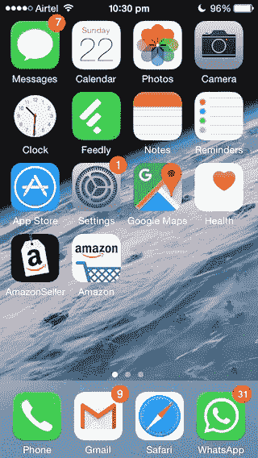
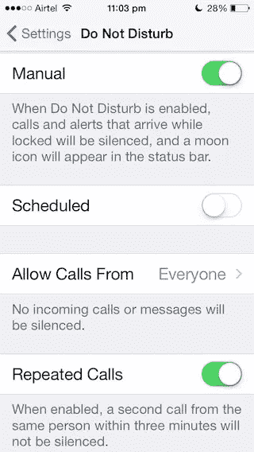
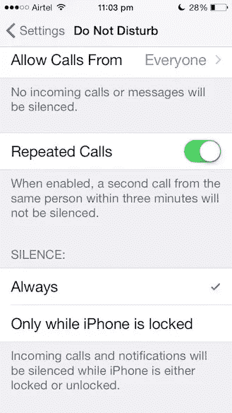

# 我是如何通过打开所有智能手机都有的一个功能来集中精力工作的

> 原文：<https://medium.com/hackernoon/how-i-was-able-to-focus-at-work-by-turning-on-just-one-feature-that-is-available-in-all-smart-d02170aff7ff>

在过去 5 年左右的时间里，手机已经成为生活中最亲密的伴侣，超过了你的伴侣或孩子，甚至父母或你每晚睡的床。营销人员已经明白这一点，在智能手机还没有统治你的头脑之前，吸引人们注意力的最佳方式是在广告中插入一个最喜欢的电视节目，或者在交通信号灯上放一个巨大的横幅广告，或者参加这些公司设立摊位的会议。

但现在，让人们坐在电视机前变得更加困难，因为任何东西都可以从智能手机上获取；营销机构已经将注意力转移到更个人化的东西上，你几乎一直持有它，给予它比生活中任何其他东西更多的关注和专注。这才是你安装一个 app 或者使用 app 进行购买时提供更多优惠和折扣的真正原因。

> 用电视广告对人们进行地毯式轰炸的日子已经一去不复返了，欢迎新的狙击手，他们接受过射击个性化报价的训练，可以进行销售。

在我深入探讨这个选项之前，让我们先退后一步，了解一下智能手机的特点，以及它吸引我们注意力的方式。我希望刷新你的记忆，你会完全意识到这意味着什么，降低你的焦虑水平，并完全准备好处理一旦该功能被打开的情况。

不仅仅是营销公司需要你的关注，许多人和机器人也需要你的关注，他们可以大致归类为

1.  **您知道或使用过的产品/服务** —这些公司与您有过互动，可能是店内销售(服装/电器连锁店)或在看到社交媒体广告后尝试过一次，等等。这些公司吸引你注意力的驱动力是“保留”——我们如何让这个人更多地使用我们的服务。公司花了很多钱让你试用(安装应用程序)，现在是回报的时候了。通常使用的渠道是移动应用程序通知或电子邮件或短信。应用程序通知是首选模式，因为它们是免费的(对公司来说，你需要支付数据成本)。
2.  **熟人——社交或职业网络**。社交和职业网络在“活跃用户群”的基础上蓬勃发展。参与就像可卡因——让这个人保持兴奋并和我们在一起的方法。通常的渠道是应用程序通知，引发对你最近的帖子或图片或评论的焦虑。
3.  **(工作中的)同事**。我们作为一个团队工作，一个团队需要沟通，并且在分享信息方面有很多对彼此的依赖。有了远程和全球团队，你在海外的朋友无法直观地看到你如何努力专注于工作或你有多忙，并通过公司渠道或你安装在智能手机上的应用程序不断发送即时消息通知。
4.  **家人和朋友**。即使在工作的时候，在你紧密团结的家庭和朋友圈子里也会发生很多事情。对他们来说，你的认可很重要，会有源源不断的短信、在 whatsapp 上分享的照片，还有你错过的东西。
5.  **你不知道或不使用的产品/服务**——这些公司得到一份联系人名单，他们可以通过电子邮件或短信进行地毯式轰炸，这几乎是一种传统，许多国家都有拒收讯息登记册来保护人们。这些人的重点是让你尝试他们的东西。虽然我的电话号码在 DNC 中，但我仍然会接到两个来自未知服务的电话，并礼貌地询问他们如何得到我的号码。

让我们把注意力集中在这些沟通渠道的设计目的、使用方式以及它们是如何受到我们的关注的。

1.  **消息**(短信、whatsapp、snapchat 等)——这个频道是在手机上设计的，用来交流不需要你立即关注的消息。另一边的人发信息的事实意味着他们不想给你打电话，不想打扰你正在做的事情。但是，我们(或电话公司)附上了音调、声音，现在甚至屏幕空间(横幅)，以便您关注它。你的注意力被打断了，因为你不得不立即回复他们，或者故意忽略他们。
2.  **电子邮件(gmail、outlook 等)** —这种渠道也类似于信息，只是电子邮件吸引你注意力的时间更长。同样的信息规则也适用于此，对方并不期望在 2 分钟内得到回复，这并不是什么惊天动地的信息，而是在几个小时内或者在你离开前需要处理的事情。
3.  **应用通知**(Facebook、twitter 等社交媒体；其他游戏或购物应用程序，如电子商务等)，这些信息甚至可以等待几天而不被关注，这些通常是今天的优惠，以诱惑你购买，订购状态等。但是手机给了他们发声的嘴和吸引你注意力的屏幕空间。这些元素不应该让你偏离手头的任务，应该在你空闲的时候参加。
4.  对我来说，这是唯一真正值得你立即关注的渠道。有人试图联系你，这是你的手机活跃起来的唯一原因，它发出重复的声音并摆动尾巴来引起你的注意。

# 启示录

过了一会儿，我才意识到确实是电话和持续不断的交流分散了我的注意力，打破了我的注意力范围。在任何一个工作日，我都会收到大约 20 条短信、45 条 Whatsapp 信息、5 个电话和 40 封电子邮件。如果在 8 小时内有 110 次干预，人们怎么能集中注意力呢？

这需要立即采取行动，所以我去了通知设置，把一切从横幅+声音+提醒变成只有徽章。我仍然保留的一个应用程序是 whatsapp，因为它类似于现在的电话(whatsapp calling)。

效果是立竿见影的，每次我焦急地看着手机寻找新的信息或通知，没有。通过输入密码然后查看徽章来解锁手机的漫长过程也帮助我抵御了诱惑。

一旦我对看不到任何通知感到舒服，我就打开“请勿打扰”，这将使一切静音，并将电话和 whatsapp 呼叫切换到振动模式。

时间久了，觉得自己的时间在自己掌控之中。现在，我也在 Mac 上打开了“请勿打扰”模式，这让所有的 Slack 和 Skype 消息都远离我，帮助我专注于工作。

> [黑客中午](http://bit.ly/Hackernoon)是黑客如何开始他们的下午。我们是 [@AMI](http://bit.ly/atAMIatAMI) 家庭的一员。我们现在[接受投稿](http://bit.ly/hackernoonsubmission)并乐意[讨论广告&赞助](mailto:partners@amipublications.com)机会。
> 
> 如果你喜欢这个故事，我们推荐你阅读我们的[最新科技故事](http://bit.ly/hackernoonlatestt)和[趋势科技故事](https://hackernoon.com/trending)。直到下一次，不要把世界的现实想当然！

