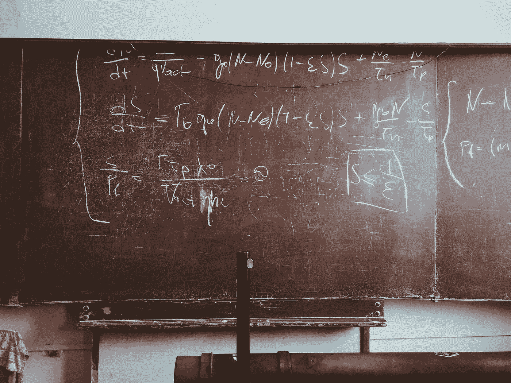

# 我如何学习“机器学习”

> 原文：<https://medium.com/hackernoon/how-im-learning-machine-learning-a0f88538eba1>

在过去的一年里，我开始相信机器[学习](https://hackernoon.com/tagged/learning)不是炒作。强人工智能/AGI 不再是复杂任务的要求。T2 AGI T3 遥不可及也没关系，因为我们不需要它来让自动化占领就业市场的大片领域。我现在认为，在未来的几十年里，特定领域的 ML 将占据所有工作的 10%到 50%。显而易见的是运输和物流。但是几乎每个行业都将被改变。我有 1 岁、3 岁和 5 岁的孩子。我不知道 20 年后他们进入就业市场时会有什么。

# 我的方法

## 斯坦福机器学习课程

我在 Coursera 上参加吴恩达著名的[机器学习课程](https://www.coursera.org/learn/machine-learning)已经两周了。上周才开始，所以如果你抓紧时间，这学期可能还能上。这门课是我见过的所有参与 ML 的人都推荐的。我想学习第一原理，这样我就可以超越教程，了解如何有效地使用像[张量流](https://www.tensorflow.org/)和 [Keras](https://keras.io/) 这样的工具。

## 人工智能的应用——电子邮件通讯

Rob May 的 [**技术上有感觉的**](https://www.producthunt.com/posts/technically-sentient) 电子邮件时事通讯的技术/商业焦点较轻。它每周一次，在中部时间周日早上 7 点。他涵盖了本周的一个重大想法，主题包括“DOJ 是否应该就数据垄断或人工智能人才垄断问题拆分谷歌和脸书，以及你是否最终能够购买针对算法偏见的保险。”然后他总结了本周的 5 篇最佳文章，并给出了另外 5 篇值得一读的文章。

## 播客

我也在补充一些播客。OCDevel 的 [**机器学习指南**](https://itunes.apple.com/us/podcast/machine-learning-guide/id1204521130?mt=2) 会给你一个介绍，然后对吴恩达课堂上的每一课进行音频评论。他还就如何进入机器学习领域给出了一些建议。

我也推荐听听 [**TWiML**](https://twimlai.com/) —本周在机器学习。我听了一个冗长的[和 Xavier Amatriain](https://twimlai.com/twiml-talk-3-xavier-amatriain-engineering-practical-machine-learning-systems/) 的对话，Xavier Amatriain 是 Quora 的 VPE，负责网飞的 ML 集团。伟大的软件工程每日播客时不时会有来自 ML 世界的人出现在节目中。我喜欢斯坦福人工智能实验室的 Zayd Enam 的“[机器学习很难](https://softwareengineeringdaily.com/2017/02/16/machine-learning-is-hard-with-zayd-enam/)”播客。他谈到 ML 几乎不可能被调试。

至于视频和幻灯片，我发现了一些[很棒的幻灯片](https://speakerdeck.com/bargava/introduction-to-deep-learning-for-natural-language-processing)，它们让我了解了神经网络是如何工作的，但我会保留它们，直到我下课。

# 班级

我一直在晚上上课，在午休时偷偷在这里或那里看录像。在接下来的几周里，我会好好谈谈这门课，并且会传授我所学的高级概念(这里没有线性代数或高等数学)。以下是我在头两周学到的东西:

## **蛮力作品**

我们可以在大型数据集上投入硬件，得出非常好的预测。

## 你不必成为数学专家

我真的很担心这些要求(我从未学过线性代数)，但最终很快就学会了高级概念。数学是令人生畏的，但是一旦你在高层次上理解了它，它只是导入数据和在 Matlab 中运行一些函数。

## 软件是为规模而构建的

梯度下降不优雅。这些问题可以用正规方程用简单的微积分来解决。然而，法线方程不适用于具有 10，000 多个特征的大型数据集。

## 习惯不确定性

专家主要依靠经验法则。他们甚至不完全理解其中的许多东西是如何工作的。

## 调试几乎是不可能的

神经网络是一个黑匣子，完成一次迭代的时间长度意味着你不能得到快速的反馈。

## 测验有点难

他们严格要求 80%的问题(5 题中的 4 题)通过。在开始测试之前，保存 PDF 幻灯片并查看它们。提交之前，检查并反复检查您的答案。

*再见*！我希望这个概述对您有用。我已经用 Octave 完成了我的第一个任务，但是还会有更多的任务。

> [黑客中午](http://bit.ly/Hackernoon)是黑客如何开始他们的下午。我们是 [@AMI](http://bit.ly/atAMIatAMI) 家庭的一员。我们现在[接受投稿](http://bit.ly/hackernoonsubmission)，并乐意[讨论广告&赞助](mailto:partners@amipublications.com)机会。
> 
> 如果你喜欢这个故事，我们推荐你阅读我们的[最新科技故事](http://bit.ly/hackernoonlatestt)和[趋势科技故事](https://hackernoon.com/trending)。直到下一次，不要把世界的现实想当然！

