# 我打算如何抛弃苹果

> 原文：<https://medium.com/hackernoon/how-im-planning-to-ditch-apple-d73f78912413>

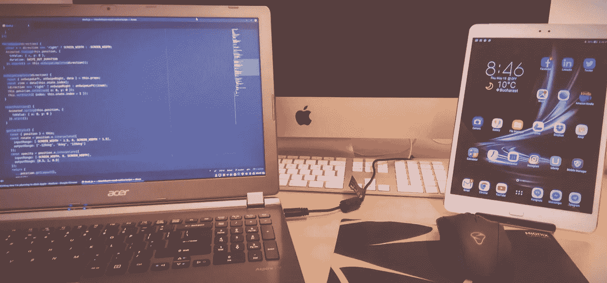

## 我不会在我漂亮、巨大的 27 英寸 iMac 上写这个故事。那些读过我上一篇文章的人已经知道为什么了:主要是因为我对最近苹果产品质量的下降感到非常失望，也因为我不想支持它成为新的微软的垄断野心。

首先声明:我绝对**不是**建议任何人抛弃苹果；相反，每当我看到有人鼓吹他们的解决方案是最好的，应该被所有人普遍采用，无论是异教徒还是信徒，我都有点恼火。不。如果你喜欢苹果，就用苹果。如果 Windows 适合你，继续使用它。但是，在这两种情况下，请确保在某个时候阅读 EULAs，这样您就知道您注册的是什么；-).

不碍事，如果你还在读这篇文章，出于你自己的原因，你可能对改变感兴趣。你可能知道只有两个主要的苹果替代品:Windows 生态系统和过多的(太多了)Linux 发行版。一些读者提出了另一个有法律问题的替代方案，即使用 Hackintosh。我将尝试从一个全栈 JS/web 开发人员、超级用户和偶尔的游戏玩家的角度总结每一个的利弊，并合理化我的决策过程**。视角很重要——你的视角可能与我的不同——因为你总是想**根据你的实际需求**做出决定，因为你想使用[技术](https://hackernoon.com/tagged/technology)。**

正如我所说的，我目前是一名全栈 JS/web 开发人员，偶尔也是一名游戏玩家。我也是一个超级用户，从某种意义上说，我对技术相当精通。我从小学就开始使用电脑(当时流行的是 Spectrum)，非常了解它们的内部工作方式，接触过上面提到的所有操作系统，还有一些已经不存在的操作系统。几年前，在转到 OSX 之前，我作为一个用 C#/编写程序的团队的一员，几乎只在 Windows 上工作。NET 是世界上最好的保险解决方案之一，所以我相信我是相当不偏不倚的，也有足够的知识来根据理性而不是粉丝主义的营销宣传(这是一个词吗？我的母语不是英语，所以请在必要的地方纠正我:-)。

## 先决条件

那么，除了漫无边际地谈论技术之外，我到底在做什么，我用的是什么软件？

*   写了很多服务器端和客户端的代码: *JS/Node.js* ， *CSS* ， *HTML* ，还有最近像 *JSX* 这样的弗兰肯斯坦式混血儿。几年前我使用 Sublime Text，然后尝试 Visual Studio 代码，现在我完全迷上了 Atom。幸运的是，所有这些都可以在所有可能的操作系统上运行。
*   最近开始钻研用于构建原生移动应用的 React-Native。是的，我知道，已经有了一个应用程序，但人们仍然想要更多。到处都可以写 React-Native(毕竟主要是 JS/JSX 和一些原生绑定)。你必须偶尔使用 [Android Studio](https://developer.android.com/studio/index.html) 或者你可以使用 [Expo XDE](https://expo.io/) ，但这两个是多平台的，你可以从 macOS、Windows 或 Linux 部署在 Google Play 上。苹果的 XCode 和 App Store 有一个不同的故事——我在之前的文章中提到过——你需要 macOS。这是一个潜在的痛点。
*   使用关系和非关系数据库:PostgreSQL、MongoDB、一些 Redis 和最近的 Firebase。我需要使用好的数据库客户端，我已经找到了 [DBeaver](http://dbeaver.jkiss.org/) 和 [Studio 3T](https://studio3t.com/) (前 MongoChef)来满足我的大部分需求。它们都是多平台的，所以这里没有痛苦。
*   编写和执行各种 shell 脚本来自动化我的工作流(构建、打包、部署等)。).*痛击*，其实。这是另一个潜在的问题，因为 Windows NTFS 与 POSIX 不兼容，而 PowerShell 则完全不同，在微软生态系统之外没有得到广泛使用，这肯定不是我希望了解的东西。
*   用 [VirtualBox](https://www.virtualbox.org/) 运行[vagger](https://www.vagrantup.com/)，在我的开发机器上虚拟化服务器环境。两者都能在任何主机操作系统上运行。
*   偶尔[为网站和网络&移动应用程序设计](https://hackernoon.com/tagged/design)用户界面。这实际上是一个更长的故事，也是切换到另一个平台的主要痛点，因此下面有专门的部分。
*   最后，偶尔玩玩像战舰世界这样的游戏。这里没什么可说的；你只需要在你的机器上启动 Windows。如果你在 mac 上，确保使用单独的分区，而不是 VMware/Parallels，因为你绝对想要性能。但即便如此，要知道 iMac 或 MacBook 将会是一款性能严重不足但价格高得惊人的游戏装备。除非你用的是最新的 Mac Pro 的顶级配置，在这种情况下，你是一个非常昂贵、性能一般的游戏机的幸运主人。

那么，现在主要的棘手问题是:web/UI 设计。

## Web/UI 设计——简史。

许多年前，我记得我使用了一款名为 Macromedia Fireworks 的特别软件。不知何故，Macromedia 的开发人员设法在位图和矢量之间找到了正确的平衡，并将其打包成一个完美的解决方案:Fireworks。足够强大，但界面相对简单。

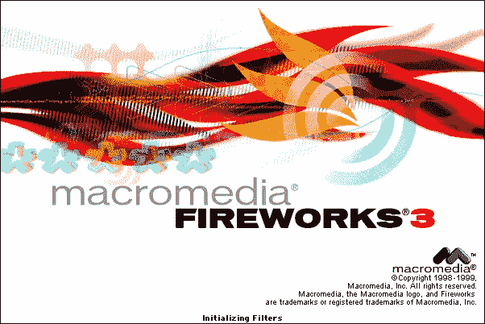

Macromedia Fireworks 3, many years ago

Adobe 在 2005 年收购了 Macromedia，并在 7 年后以一个令人惊讶的举动(可以说是公司历史上最糟糕的决定之一)公开宣布停产。产品本身绝对受到网页设计师的喜爱，因为不是每个做网页设计的人都愿意学习和支付像 Photoshop 这样复杂、繁琐、不适合简单网页设计的东西。长话短说，Adobe 是那种“大老公司”类型，它的管理层比我们这些凡人呼吸着稀薄的空气，所以他们不觉得有必要倾听小客户或“利基”客户的声音。即使那个小生代表了[的未来](https://hackernoon.com/tagged/future)。

## 草图——当前的*事实上的*标准，仅限 mac。

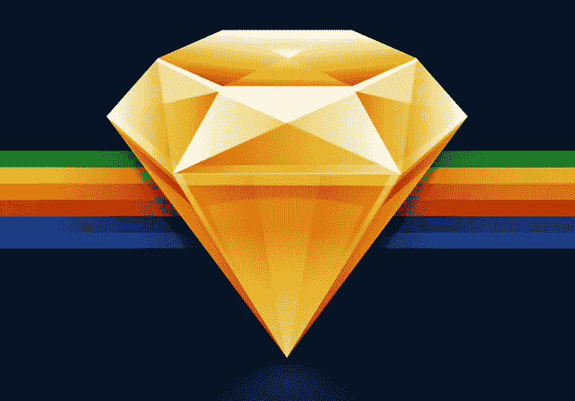

Sketch by Bohemian Coding

2010 年[波西米亚编码推出 Sketch 的时候](https://en.wikipedia.org/wiki/Sketch_(application))，没人关注；Adobe 当然没有，但几年后，在 2012 年赢得苹果设计奖后，每个人和他们的狗都在他们的 MAC 电脑上使用 Sketch 进行 UI 和网页设计。理由很充分:Sketch 拥有 Fireworks 曾经拥有的一切，甚至更多，而价格只是 Adobe CS 的一小部分。不用说，我一尝试它就爱上了它，就像几乎所有人一样，随着时间的推移，它成了一种反射:每当我需要设计一些东西，一个网络模型，甚至是简单的普通标志，我都会本能地伸手去拿应用程序启动器中的金色钻石形状。

不过，有一个问题:Sketch 是一个仅支持 mac 的应用程序，在他们的论坛上被反复询问后，开发者明确表示，出于完全可以理解的技术原因，在可预见的未来，它仍将仅支持 mac。

## affinity Designer——Windows 用户的一线希望？

因此，非 mac 专业用户不抱什么希望，但当 Serif Software [在 2016 年](https://affinity.serif.com/blog/affinity-is-coming-to-windows/)在 Windows 上推出 Affinity Designer 时，他们中的一些人从 Adobe 地狱的深处获得了部分救赎。在功能和用户界面方面，Affinity Designer 介于 Photoshop 和 Sketch 之间，所以如果你使用 Windows，并且觉得使用 Photoshop 进行网页设计很痛苦，请不要犹豫，尝试一下。

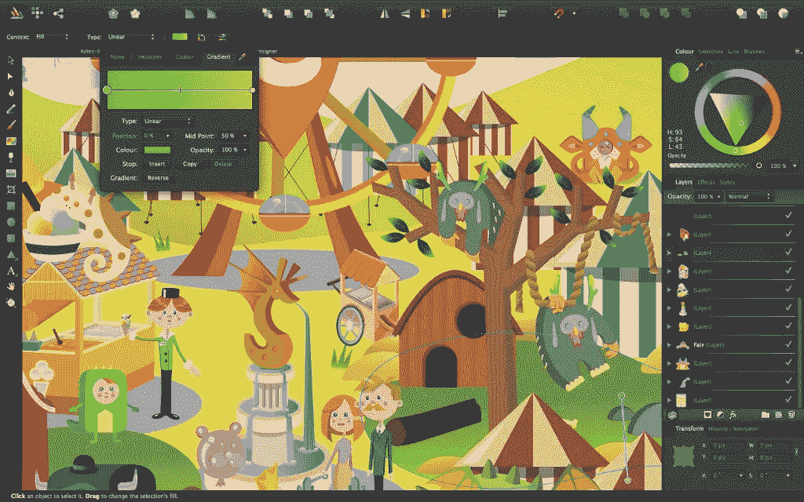

Affinity Designer by Serif Software

Affinity Designer 在 macOS 和 Windows 上都可用，我已经试过了，我可以想象自己用它来代替 Sketch。但是，在 7 年的时间里，我的大部分工作都是在 mac 电脑上完成的，我无法想象自己会完全切换回 Windows。我只是觉得不对劲，原因我稍后会解释。

## GIMP 加 Inkscape——不是真正的解决方案。

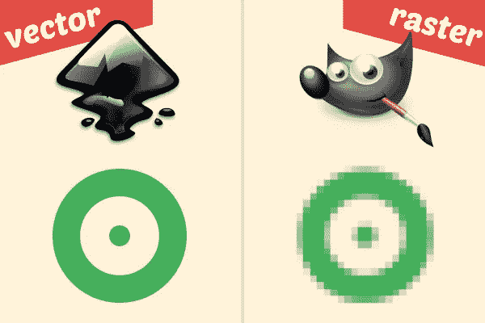

Inkscape and GIMP

Linux 社区有 [GIMP](https://www.gimp.org/) 用于位图图像处理，有 [Inkscape](https://inkscape.org/en/) 用于真正符合 SVG 标准的矢量设计。这两个软件在上个世纪就已经出现了，并且在 linux 用户社区中很有名，但是因为它们是免费的和跨平台的，所以也有人在 Windows 和 macOS 上使用它们。它们都是由非凡的人构建和维护的优秀程序，但完全不适合 UI 设计。我试图使用它们，但像大多数其他人一样，无论多么顽固，我都悲惨地失败了。是的，你绝对可以在 Inkscape 中设计矢量，是的，你绝对可以使用 GIMP 做任何与位图相关的事情。但是 UI 设计不仅仅是两者的总和——你需要一些在矢量和位图之间取得平衡的东西，并且有一个简单、直观和整洁的界面。Macromedia 几年前就做到了这一点，Bohemian Coding 在 2010 年做得更好，但仅限于 mac。所以，对 linux 反叛者不抱太大希望。还是有？…

## Gravit 设计师改变一切。就像 iPhone 一样，但是是免费的，对每个人都是真实的。

几年前，当我在寻找草图的潜在替代品时，我发现了 Gravit Designer。当时，Gravit 是这样宣传自己的:*“通过一个免费、轻量级、易于使用的工具的功能、灵活性和速度，在你的浏览器中创造和分享美丽的设计”*。有趣，我想。就在我的浏览器里？你是说，我可以在我的 iMac **和**廉价的 Windows/Linux 笔记本电脑上使用它？所以，我试了一下。我简直惊呆了。这几乎是素描的全部内容。有点慢，尤其是对于有很多层和效果的文档，因为它是基于浏览器的应用程序。不过，它有一个潜在的缺点:你只能把你的文件保存在一个私人在线账户里。它是免费的，但不是开源的，我不太了解它背后的团队或他们的商业模式(如果有的话)，所以我有点担心我的设计资源会发生什么，如果有一天他们被迫退出。我们以前见过这种情况，甚至是 Adobe、微软或谷歌等巨头支持的项目。但是 Gravit 看起来很有希望，所以我决定继续关注它。背后的团队维护着一个社区支持论坛，当用户对其未来提出问题和担忧时，他们发表声明暗示 Gravit 将永远免费，他们也有更大的计划，最终在 2016 年 8 月发布了这个预告: [Gravit 的新方向](/gravitdesigner/gravits-new-direction-340304d644dd)。哇！每个平台上都有免费的**浏览器和本地**设计应用？你的意思是，一个小的开发团队会做 Adobe 在十年或二十年内不能或不愿做的事情？那听起来好得令人难以置信。

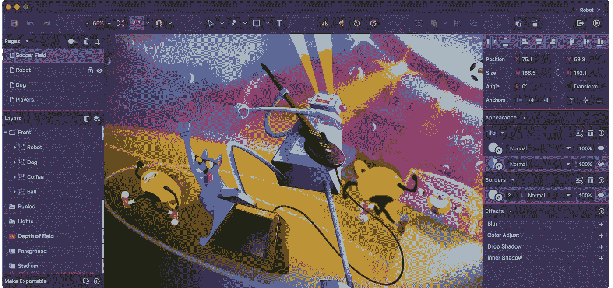

Gravit Designer — designer.io

“好得难以置信”在 2017 年初变成了现实。是的，它是免费的，真正跨平台的，使用起来非常直观。你可以在你的浏览器里试一试[或者安装它，不管你用的是什么操作系统(甚至有 linux 的 AppImage)，或者在](https://www.designer.io/)[的媒体博客](https://medium.com/gravitdesigner)上看看你能用它做什么。
当然，现在速度快多了，你可以把文件保存在本地，这样你就不用再被迫使用某种云了。
导出多种像素密度的 jpegs、png、SVG？当然可以。导出的 SVG 是真正的所见即所得，非常干净——只需通过 svgo，它们就可以“上网”了。任何使用 Illustrator、Affinity 甚至 Sketch 足够长时间的人都知道我在说什么:并不是你应用的每个效果都可以很容易地转换为 SVG 格式，所以有时你要么以嵌入位图的巨大文件告终(Illustrator、Affinity Designer)，要么你最奇特的渐变就不会被导出(Sketch)。

当然，bug 还在解决中。但是对于一个不到几个月前才公开发布的免费产品来说，这已经非常不错了。

在向往素描的跨平台替代方案的同时，我从来没有希望免费得到专业级的解决方案。因此，Gravit Designer 背后的团队获得了巨大的荣誉。在科技领域，有些名字是为了改变世界，创造历史。我觉得 Gravit 设计师就是其中之一。做得好，继续努力，请不要把你的灵魂卖给 Adobe-).

既然主要的棘手问题已经解决，回到实际的操作系统替代方案。如果你已经读到这里，你可能会预料到我的选择是什么，但是我还是会试着涵盖所有这些选择的利弊。

## Hackintosh

正如我提到的，一些读者建议将 Hackintosh 作为替代。由于我不是律师，我不会冒险评论法律方面的问题；我知道从法律上讲，安装 hackintosh 本身并不是犯罪*因为违反 EULA 并不自动“违法”。许多人已经这样做了一段时间，一些人对结果感到满意，我可以理解实际的好处和道德上的报复想法，即不用为一个不再那么昂贵的硬件产品支付额外的价格就可以获得 macOS 的所有好处。然而，考虑到我上一篇文章中的推理，我对 hackintosh 方式并不真正感兴趣。技术上的挑战当然很有趣…但是花无数的时间来欺骗操作系统，让它相信它实际上运行在苹果的硬件上？…这听起来没什么成效。而且几乎没有解决我写过的另一个问题——太多的开发人员越来越忽视这样一个事实，即世界上绝大多数用户都不在 iOS 或 macOS 上。*

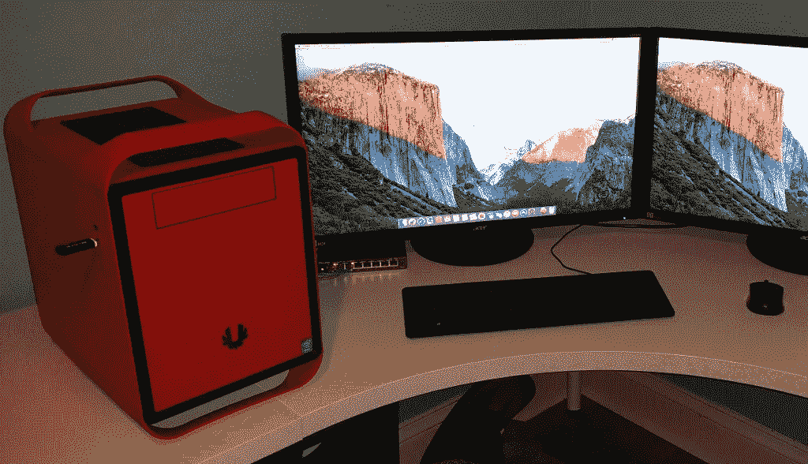

A Hackintosh build

因此，我喜欢以一半的价格构建一个功能是最强大的 mac Pro 两倍的 Mac 克隆的想法，但 hackintosh 对我来说不是一个选项。

## Windows 操作系统

我过去一直使用 Windows 作为我的主要操作系统，现在我仍然使用它来查看我的工作对绝大多数用户来说是什么样子，也作为一个游戏平台。我有点喜欢它目前光滑扁平的用户界面；如果你用深色主题定制 Windows 10，它很难再像旧的满是灰尘的 XP 了。Atom 在 Windows 上运行良好，前面提到的所有数据库客户端 Android Studio 和 Expo XDE 也运行良好。当然没有 XCode。对于 UI 设计，你可以在 Affinity Designer 和 Gravit Designer 之间选择。Node.js 背后的人做出了杰出的努力，使它能在 Windows 上工作，一旦你安装了用于 Windows 的 Git，你将得到一个可接受的 bash 生态系统。但是操作系统本身并不符合 [POSIX](https://en.wikipedia.org/wiki/POSIX) ，你迟早会遇到问题，因为 npm 模块 *x* 或 *y* 没有在 Windows 上测试。还要注意的是，安装数十个 npm 依赖项通常需要很长时间，因为 Windows Defender 无疑会怀疑如此多的 JS 文件以如此惊人的速度下载/复制到您的文件系统中。

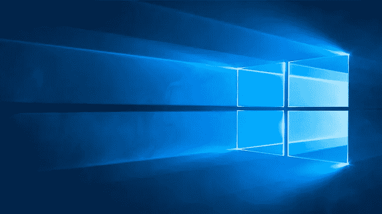

Microsoft Windows

还有另一个大问题:如果你担心苹果或谷歌可能对你愿意或不愿意与他们分享的数据有不可思议的计划，那么这意味着你没有阅读微软的 EULAs 或 Windows 收集的数据量。我同意，事情最近变得更加透明，但是大多数用户并没有意识到技术细节中的魔鬼。甚至有时我觉得我并不真正拥有我的电脑，例如当微软决定一个通宵*更新和重启*比我离开工作的一个长时间运行的进程更重要的时候。如果你认为苹果有一个过于明显的“供应商锁定”策略，你可能还没有听说过[Windows 10S](https://www.theverge.com/2017/5/2/15518752/windows-10s-operating-system-confusion)——这个操作系统版本专门用于 Windows 商店的应用程序……面向专业人士和教育人士。你可以在上面安装“来自商店的任何网络浏览器[”。关于这个主题还有很多要说的，但底线是:作为一个精通技术的人，如果我有选择的话，我根本不想在我的工作中使用它，我也不能把它推荐给其他开发人员，这样我才能问心无愧。](https://www.microsoft.com/en-us/search/result.aspx?q=browser&Preview=1&search=)

## Linux 操作系统

啊，对了，linux。面向自由人、极客反叛者、黑客和最近的机器人先生粉丝的桌面操作系统。

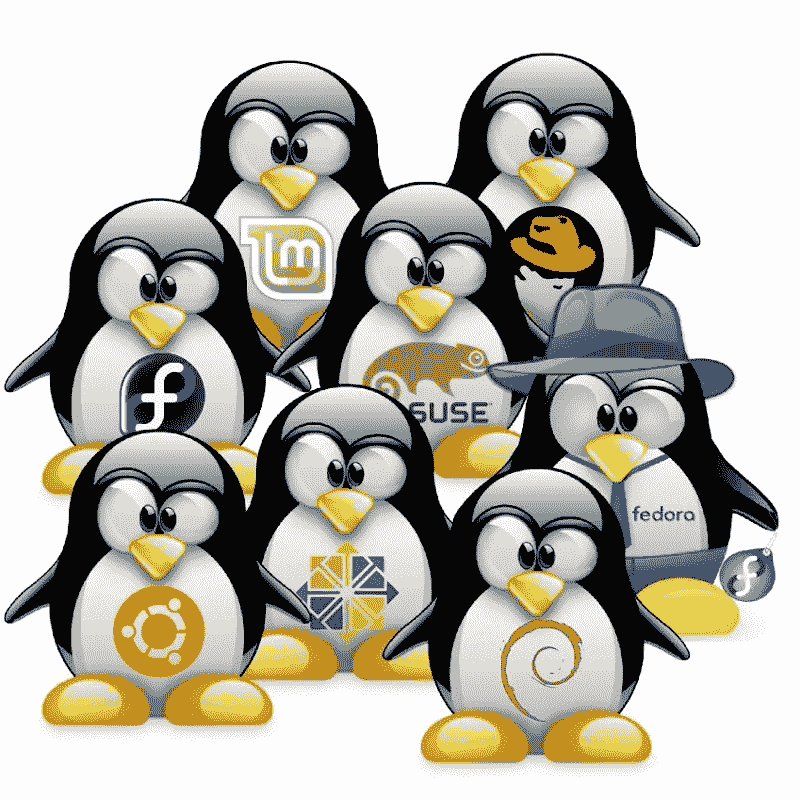

Linux distributions

在过去的 10 年里，我坚持每隔几个月测试一两个 linux 版本。我是一个好奇的极客，我忍不住。DistroWatch 和 [WebUpd8](http://www.webupd8.org/) 是我经常查看的两个网站。我一直对我们拥有的无限多的选择感到惊讶，这要归功于无数无私的开发人员，他们将数百万小时的时间奉献给了这样一个想法，即互联网和推动互联网发展的东西不仅应该是开源的(因此要接受公众监督)，而且还应该免费供每个人使用。我看着 Debian 和 Ubuntu 以及数十个它们的衍生产品成长，看着 Fedora、openSUSE、Arch、Antergos 和许多其他产品，沉思着人们在“哪一个是最好的”上展开近乎宗教的战争。
从一个 JS 开发者的务实角度来看，拥有无限多的选择有一个问题:你已经面临所谓的“JS 疲劳”，所以“发行版疲劳”可能是你最不需要的。从设计师的角度来看，还有另一个问题:如果你在 mac 上工作多年，你可能已经习惯了漂亮、简洁和一致的用户界面。大多数 linux 发行版只是默认不提供它，我不明白为什么。我的意思是，是的，设计的美是一个主观的东西，但有普遍接受的标准。一些发行版带有旧的默认主题，看起来好像是 Kirk 还在领导企业时绘制的。另一方面其他人似乎也承认了这个问题: [Ubuntu](https://www.ubuntu.com/desktop) 、 [Mint](https://www.linuxmint.com/) 、 [elementaryOS](https://elementary.io/) ，也许还有[ante gos](https://antergos.com/)、 [Manjaro](https://manjaro.org/) 等等。并且[弧形主题](https://github.com/horst3180/arc-theme)看起来很棒。从大多数用户的实际角度来看，还有硬件兼容性的问题。没有人喜欢和他们打交道，作为 mac 用户你没有这些，作为 Windows 用户你也很少见到他们。鼠标、网络摄像头、功能强大的专用显卡，你希望所有这些都能“正常工作”，但 linux 并不总是这样。所以，如果你打算转行，就要准备好遇到一些问题。但是如果你是一个开发者，并且通常是一个精通技术的人，你会发现你可以绕过他们中的大多数，特别是因为许多社区贡献者已经开始制作内容[甚至在 YouTube 上](https://www.youtube.com/results?search_query=linux)。

所以你可以根据自己的需求随意研究两三个发行版，选择一个，坚持一段时间，看看它有多适合你。

## 判决——Linux Mint

对我来说 **Linux Mint 做的工作**。传言说会出现在《机器人先生》下一季，但这不是我选择它的原因。我选择它是因为它基于 Debian/Ubuntu，大多数跨平台软件提供商都提供*。黛比包装，因为我是一个懒惰的人，我喜欢有 PPAs。它在我的廉价宏基 Aspire 笔记本电脑上也运行得很好，没有任何硬件兼容性问题。它自带了一个不错的主题，但是我安装和定制 Arc 只是为了好玩。

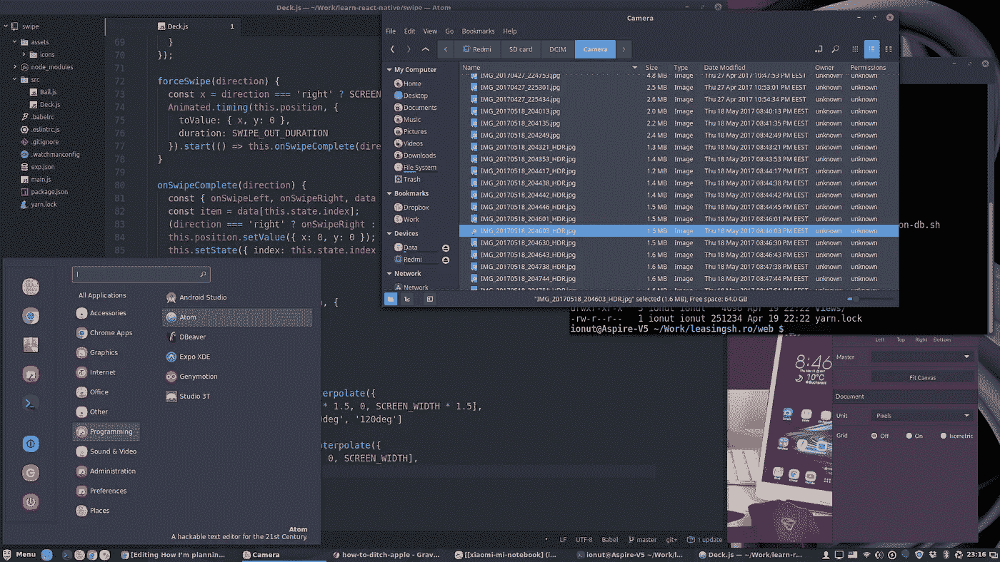

Customized Linux Mint

Atom 在上面工作得非常好，Sublime Text 也是如此，如果你喜欢，你甚至可以使用 Visual Studio 代码。不需要[家酿](https://brew.sh/)；npm 和 yarn 比 macOS 快，比 Windows 快得多。现在我非常确定我拥有自己的数据…现在随着 Gravit Designer 作为 AppImage 的发布，我也可以进行设计了。对于 jpg 和 png，我使用了 [Trimage](https://trimage.org/) 而不是 [ImageOptim](https://imageoptim.com/mac) (你确实优化了你的位图网络资源，不是吗？)和 [svgo](https://github.com/svg/svgo) 在部署前削减向量的大小。如果你喜欢制作教程或截屏，SimpleScreenRecorder 是事实上的标准。如果谷歌文档不适合你，你需要一个离线办公套件，这里有 [Libre](https://www.libreoffice.org/) 或 [WPS](https://www.wps.com/office-free) ，仅举两个免费的例子。如果你想安装的话，甚至还有 Skype for Linux。也不需要使用 Android 文件传输来访问非苹果手机或平板电脑上的文件。作为一名网络开发人员，我还没有遇到过在我配置的系统上做不到的事情。
只剩下一个问题——在 AppStore 上部署移动应用。幸运的是，我现在不用处理这件事，但是我听说世博会背后的人可能会发现一些有趣的事情。

## 非苹果硬件

关于这个问题有太多要说的了。每种口味和每个口袋都有无限的选择。它们中很少有像 MacBooks 或 iMacs 那样设计精美的，尽管我相信我们很快就会看到越来越多的设备，比如小米的第一台笔记本电脑。如果原始计算能力是你正在寻找的，你肯定会在苹果世界之外得到更多的回报。

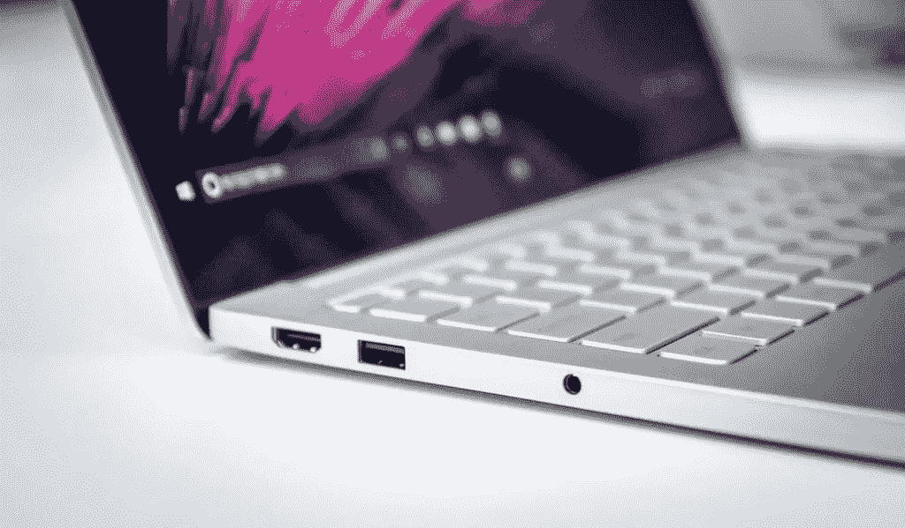

Xiaomi Mi Notebook

至于[我的老瘸腿 iMac](https://hackernoon.com/why-i-decided-to-ditch-apple-dcf502bed28a) ，我会尽可能长时间保留它，但我可能会越来越少使用它，而且很可能我的下一个桌面不会有水果标志。我会定制一个，两倍的功能，一半的价格。

## 最后的话

再说一次，我不是建议**你**抛弃**你的** mac。对我有效的不一定对你有效。如果苹果适合你，就继续用吧。如果没有，你愿意尝试别的，我希望以上能对你的探索有所帮助。苹果生态系统之外也有生命，意识到这一点很好。作为一名开发者，请不要忘记你 80%的潜在客户不会运行 iOS。

> [黑客中午](http://bit.ly/Hackernoon)是黑客如何开始他们的下午。我们是阿妹家庭的一员。我们现在[接受投稿](http://bit.ly/hackernoonsubmission)并乐意[讨论广告&赞助](mailto:partners@amipublications.com)机会。
> 
> 如果你喜欢这个故事，我们推荐你阅读我们的[最新科技故事](http://bit.ly/hackernoonlatestt)和[趋势科技故事](https://hackernoon.com/trending)。直到下一次，不要把世界的现实想当然！

