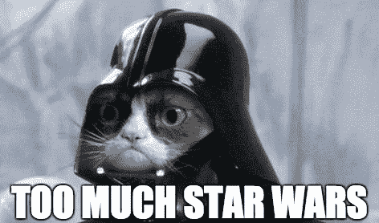
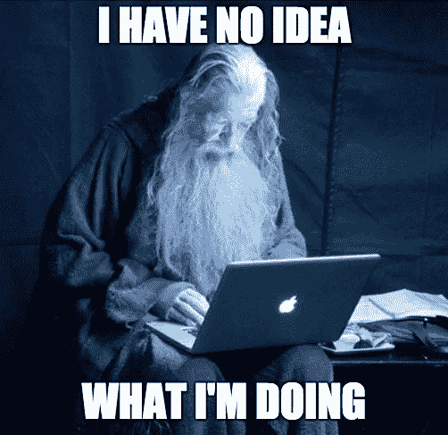

# 编写自己的移动应用程序是什么感觉

> 原文：<https://medium.com/hackernoon/how-it-feels-to-write-your-own-mobile-app-9de1940c23b6>

Image credit — knowyourmeme.com

我一直过着相当美好而平静的生活，直到有一天我下定决心在闲暇时间写一个 iOS 应用程序(那场灾难是如何发生的——阅读[此处](https://artplusmarketing.com/the-urge-to-improve-experiences-or-how-ideas-are-born-387f235f3d0c#.txam8ip23))。虽然它会伤害、娱乐、导致痛苦、带来快乐、满足、让你成为失败者、让你成为英雄，以及一堆其他矛盾的情绪，但我认为许多人不会知道这个秘密世界。所以我在这里分享我的乐观，悲观，以及总的来说讽刺的感觉，关于自己开发一个应用意味着什么。

# 你的老板就是你

哦，还有你的**项目经理**，**软件架构师**，**开发人员**， **QA** ，**营销专员**，**销售人员**，**技术支持**，**系统管理员**， **devops** 也就是*你*。这就像是比利·米利根头脑中的多重人格。尽管感觉很艰难！有时我会独自旅行，作为团队建设活动。书呆子开发者通常不会出现。

# 你的工资叫做满意度

而且连税都没有！多酷啊。！好吧，虽然你买不到“19.99 满意”的蛋糕，但不代表你的工资没用。其实你真正的工资(你作为钱拿到的那份)大部分都花在给自己买越来越多的满足感上了。所以在这种情况下，没有必要进行货币兑换，你的工资是作为一种满足感直接支付的。

# 你的隔间就是整个世界

如果你是一个普通的上班族，你最有可能在小隔间里工作。好吧，如果你的公司提供一个开放空间的办公室，它仍然是世界上最大的隔间。事实上，世界本身就是银河系内部的一个大隔间。银河系是宇宙中的一个小隔间。

made with imgflip.com

无论如何，对于你的应用程序来说，无论你是在亚美尼亚的山顶上，还是在泰国的海滩上，在托斯卡纳的阳光下，在德国的森林里，还是在家里睡觉的时候(说真的，我就是这样的！半夜醒来，天知道我怎么意识到我的 REST API 肯定不准确。然后决定早上重构一下，之后就睡着了。显然要疯了！).

# 你的周末已经过去了

你很快就会意识到周一被问到的流行问题(你周末做了什么？)和星期五(你周末有什么计划？)成为你最难回答的问题，因为无论你听起来多么热衷于编写应用程序，你都无法阻止人们思考“耶稣基督上帝，我的主啊，到底为什么要利用宝贵的周末来编写应用程序呢？一个 app？天哪，为什么？”

made with imgflip.com

# 你的知识就是你的力量

你在这个应用上做得越多，你越会意识到这些东西只能通过实践来学习。如果你感兴趣，你永远不应该害怕尝试新事物。在启动我的应用程序之前，我对将要使用的技术一无所知。真的，我以前从未打开过 Xcode，Swift 对我来说只是一只鸟，NodeJS 听起来像是“javascript 的连接点？”。是的，我是和麦克在一起的甘道夫。

made with imgflip.com

但是事情会随着时间而改变。很快你就会看到你正在取得进步，你会变得更有效率，对你正在做的事情更有信心。是的，甘道夫变成了一个酷哥！

made with imgflip.com

# 还犹豫要不要开发一个？

我的建议是——放手去做吧！开始新的东西，学习东西，实验，好奇，探索，失败，重新开始，奋斗，提高！总有一天你会觉得“我为什么要这么做？反正没人会用我的应用程序”，总有一天你会觉得这是有史以来最令人兴奋的事情。生活就是享受乐趣，如果你觉得自己不喜欢写应用程序的过程，那就放下它，去找其他能带给你快乐的事情。如果你觉得好玩，那就尽情摇滚吧！世界是你的！

> [黑客中午](http://bit.ly/Hackernoon)是黑客如何开始他们的下午。我们是 [@AMI](http://bit.ly/atAMIatAMI) 家庭的一员。我们现在[接受投稿](http://bit.ly/hackernoonsubmission)，并乐意[讨论广告&赞助](mailto:partners@amipublications.com)机会。
> 
> 如果你喜欢这个故事，我们推荐你阅读我们的[最新科技故事](http://bit.ly/hackernoonlatestt)和[趋势科技故事](https://hackernoon.com/trending)。直到下一次，不要把世界的现实想当然！

