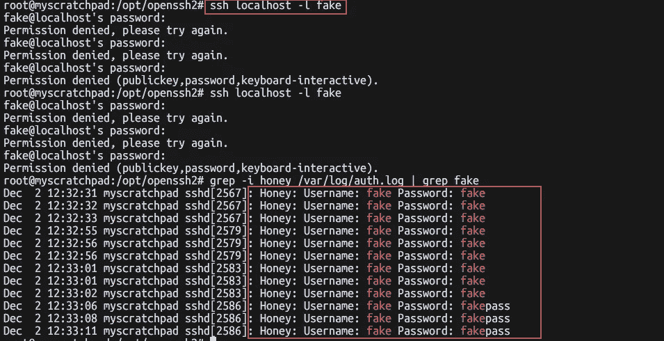
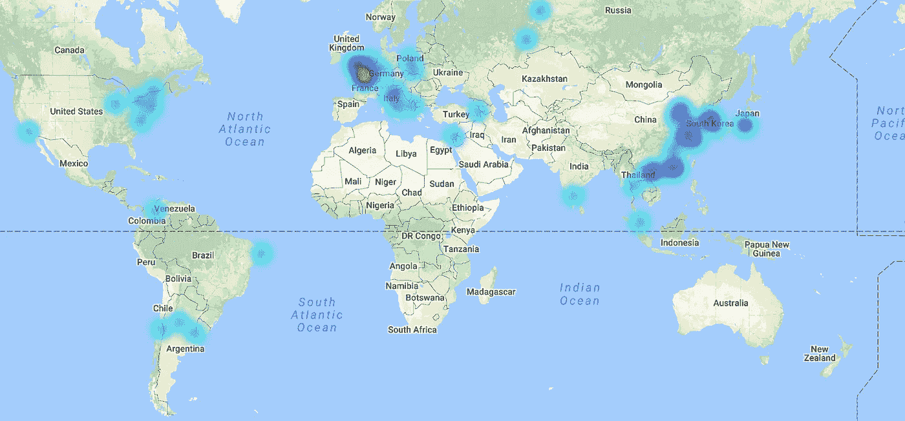

# 我是如何捕获所有试图通过 ssh 进入我的服务器的密码的！

> 原文：<https://medium.com/hackernoon/how-ive-captured-all-passwords-trying-to-ssh-into-my-server-d26a2a6263ec>

默认情况下，ssh 会记录 ssh 尝试，不管成功与否，它不会记录他们尝试过的密码。

所以我认为稍微修改 ssh 来记录他们的密码是个好主意。

所以我们开始吧，你需要快速编译 openssh、zlib 和 openssl

**注意，你必须有构建基础 gcc glibc-devel 和其他…**

没有什么需要注意的，除了:

```
sed -e 's/struct passwd \* pw = authctxt->pw;/logit("Honey: Username: %s Password: %s", authctxt->user, password);\nstruct passwd \* pw = authctxt->pw;/' -i auth-passwd.c
```

我基本上是在结构定义之前注入了一个小的 **logit()** 调用，如果你想了解更多，可以查看一下 **auth-passwd.c** 的代码。

所以这将编译 zlib，openssl 和 openssh，并将其前缀为

```
/opt/openssh2
```

您可以按如下方式启动 openssh:

```
/opt/openssh2/dist/sbin/sshd -f /opt/openssh2/dist/etc/sshd_config
```

这应该会让守护进程运行起来，您可以尝试几次通过 ssh 登录的虚假尝试:



10 个小时后，结果相当有趣:

首先，我点击的国家:(感谢[ipheatmap.azurewebsites.net](http://ipheatmap.azurewebsites.net))



Countries that sshed to my box

```
"HR Pula"
"CN Wuchuan"
"KR Seoul"
"DE Frankfurt am Main"
"NL "
"CN Shenzhen"
"RU Yekaterinburg"
"RU Nyagan"
"US Boydton"
"CN Kunshan"
"CN Hefei"
"TH Kamphaeng Phet"
"CN Beijing"
"HK Hong Kong"
"IL Tel Aviv"
"FR "
"PL Inowrocław"
"PL Krakow"
"IT Giugliano in Campania"
"FR Paris"
"GB London"
"VN Hanoi"
"VN Hanoi"
"VN Hanoi"
"CN Zhengding"
"CN Dongyangshi"
"CN Qingdao"
"CN Bengbu"
"CN Shanghai"
"US Los Angeles"
"IN Bengaluru"
"KR Seoul"
"KR Bucheon-si"
"KR Yangsan"
" "
"JP "
"CL "
"FR "
"JP Tokyo"
"US Buffalo"
"HK "
"CN Lianyungang"
"CN Beijing"
"US Chicago"
"AR Villa Allende"
"US Piscataway"
"AL "
"BR Recife"
"IT Soci"
"CO Bucaramanga"
"AR "
"TR Ağrı"
"FR "
"CA Montreal"
"MY Kuala Selangor"
"FR Ivry-sur-seine"
"FR "
```

(感谢 [ipinfo.io](http://ipinfo.io) )(可以卷曲，jq 一下)

**所以现在最常用的密码！**

```
46 password
     43 123456
     36 1234
     29 admin
     29 12345
     17 abc123
     16 root
     11 support
     10 test
     10 123
      9 ubnt
      9 fucker
      9 fake
      8 raspberry
      8 guest
      8 admin123
      7 password123
      7 default
      7 123456789
      6 user
      6 alpine
      6 12345678
      6 111111
      5 wubao
      5 ubuntu
      5 raspberrypi
      5 manager
      5 git
      5 1234567
      4 system
      4 operator
      4 mysql
      4 1
      4 000000
      4
      3 waldo
      3 tomcat
      3 postgres
      3 pi
```

**使用最多的用户是:(计算尝试次数)**

```
1689 root
     72 admin
     31 test
     24 postgres
     21 jenkins
     14 user
     13 mysql
     12 support
     12 fake
     11 nagios
     11 deploy
     10 oracle
     10 guest
      9 mother
      9 hadoop
      8 vagrant
      8 tomcat
      8 pi
      8 git
      7 ubuntu
      6 zabbix
      6 weblogic
      6 user1
      6 debian
      6 backup
      5 prueba
```

我正在注册完整的[东西](https://gist.github.com/anonymous/210ea139db3e07cfe40a537a28f8e4de)，所以你可以在那里找到你最喜欢的密码:)