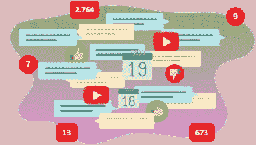
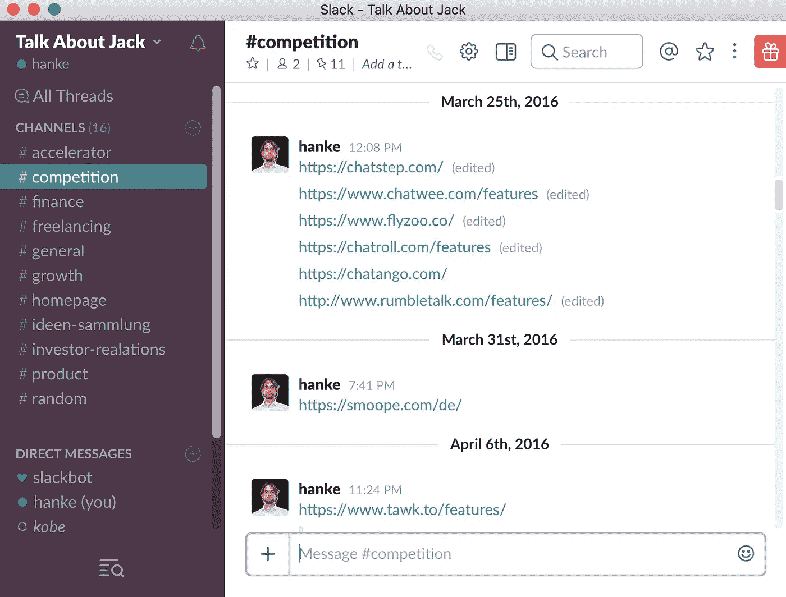
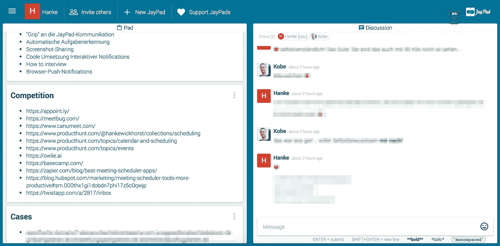

# 这一切都是为了加速这个过程，让一个想法达到像 Slack 或 Trello 这样的产品真正有所帮助的阶段

> 原文：<https://medium.com/hackernoon/how-jaypads-help-us-build-jaypads-c66c07c6c3ae>

## 事实证明，计划一次公路旅行或一次夜间外出，并开发一种工具使这种计划变得简单，需要非常相似的管理工具

正如我们在这里告诉过的那样，通过电子邮件、WhatsApp 和 Doodle 的组合与我们的伙伴一起计划一年一度的公路旅行促使我们完全转变方向，我们做了每个创业公司不时需要做的事情:Pivot！

六个月前，在研究一个完全不同的想法时，我们发现，在通过 WhatsApp 和/或电子邮件与朋友和家人计划日常活动时，我们遇到了一个紧迫的问题。无数次有人询问仅仅几个小时前发布的信息，混合了“把事情做好”，猫视频和有趣的图片，他们终于找到了我们。

Trying to get something done in a group chat? Welcome to chat hell!

我们注意到的(嗯，是被迫注意到的)是这些渠道中的一种普遍沟通模式，无论是聊天还是更复杂的协作工具:内容与非内容相遇。在即将到来的 5 分钟之外具有相关性的信息与“信息”的混合，老实说，通常没有太多相关性(是的，我们喜欢自己一个好的老猫视频-但是来吧。开着。)是不可估量的时间杀手，我们感觉到了。

> 无数次有人询问仅仅几个小时前发布的信息，混合了“把事情做好”，猫视频和有趣的图片，它最终到达了我们这里。

正如这里的所说，Slack 是管理我们创业初期的首选解决方案。不幸的是，Slack 需要大量的训练才能成为高效的协作工具。看在旧时光的份上，滚动我们的竞赛频道让我起鸡皮疙瘩。我数了特定竞争对手的网址多达五次。

A peak into our competition graveyard in Slack.

当然，有人可能会说我们使用 Slack 的方式是错误的——任何事情都有一个简单的机器人，或者任何集成或“黑客”解决了我们对简单的信息存储的需求，这些信息是在一个中心(或者特定的，如果需要的话)讨论频道中收集的。但是我们不认为这些工具真的能解决我们的问题:在一个小团队中有效地进行一个联合项目。

> 不幸的是，Slack 需要大量的训练才能成为高效的协作工具。

所以我们退一步。通过聊天进行讨论是很重要的，对培养想法和协作有很大的帮助。但是将这些讨论的结果留在聊天中可能会产生一点问题，并且/或者需要同时使用多种工具。我们的一个 Alpha 用户，一个创业公司的创始人，实际上通过 Slack 和 Google Docs 的屏幕截图为自己制作了 [JayPads](https://jaypad.de/) 。如果在轻松的讨论中出现了重要的事情，他会把它放到谷歌文档中，以便将来访问。这当然是一个 [JayPad](https://jaypad.de/) 的确切功能。

And this is the constantly evolving competition note in our [JayPad](https://jaypad.de/).

如你所见，我们生动地利用了聊天为协作提供的可能性。尤其是因为我们大部分时间都在不同的地方工作。这是至关重要的，也是讨论哪种方法对我们非常有效的一种方式。一旦我们形成了一个想法或得出结论，另一个产品是一个需要留在我们的雷达上的竞争对手，这个结果很快被记录在相应的…笔记中。这有助于我们 a)利用聊天的最大优势:快速而迅速的讨论(或者只是胡说八道和找乐子),同时 b)将这些讨论的结果保存在更永久但容易获取的地方。这就像我们整天都在进行那些伟大的对话，当我们形成一个值得注意的想法，或者要做的事情，或者网址，或者功能时，我们只需要把它放在左边的一个帖子里。那个。是。它。

当然，这个工具缺乏基本的项目管理功能，比如分配任务、跟踪进度等等。这就是其他工具，如特雷罗，JIRA 等。是为。但是从一个想法开始，在一个小团队中给你的新业务一个更结构化的推动，这些项目不需要这样的功能。这些项目需要的是一个简单的工具，帮助快速有效地达到速度。一旦进行了扩展并组建了团队，更复杂的解决方案可能会有所帮助。但是我们坚信一个 [JayPad](https://jaypad.de/) 可以让你更快地到达那个点。

同样，每个人都会参加 WhatsApp 的群聊，在群聊中，人们会不时计划第二天晚上外出、烧烤或周末旅行。找到一个适合 5 个人以上的约会是一个非常大的问题，这个问题可以通过许多日程安排工具来解决。在最好的情况下，有人在迅速崩溃的 WhatsApp 群中发布了这样一个工具的链接，并找到了一个日期。当然，直到至少有两个人要求至少两次“再次链接”。这和使用 Slack 和 Google Docs 的分屏是一个道理。仅仅通过聊天渠道组织一群人的会议是不可能的(或者至少需要比它应该做的更多的工作)。因此平行使用工具。为什么不切换到一个单一的渠道，不需要任何帐户，或登录，最重要的是能够让一个计划在一个屋檐下？老实说，我们对此没有答案。

这就是为什么我们建立了那个[单通道](https://jaypad.de/)。

> [黑客中午](http://bit.ly/Hackernoon)是黑客如何开始他们的下午。我们是 [@AMI](http://bit.ly/atAMIatAMI) 家庭的一员。我们现在[接受投稿](http://bit.ly/hackernoonsubmission)并乐意[讨论广告&赞助](mailto:partners@amipublications.com)机会。
> 
> 如果你喜欢这个故事，我们推荐你阅读我们的[最新科技故事](http://bit.ly/hackernoonlatestt)和[趋势科技故事](https://hackernoon.com/trending)。直到下一次，不要把世界的现实想当然！

