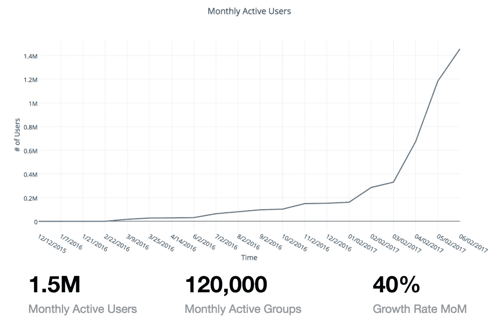
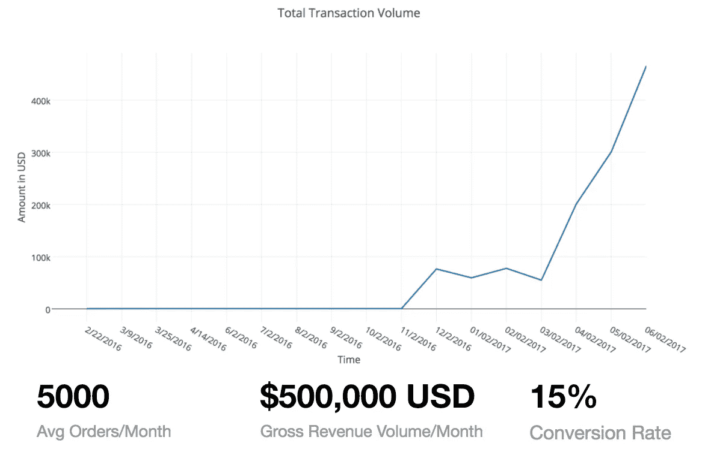
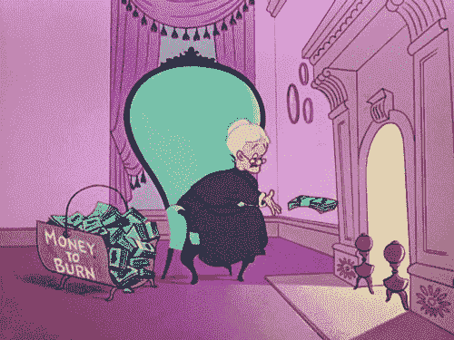
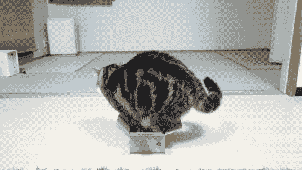
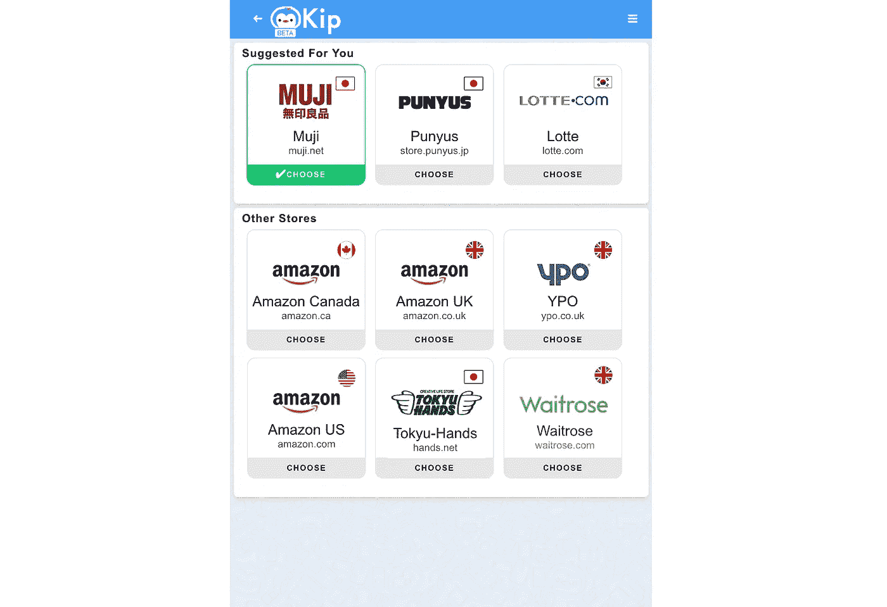

# Kip 如何在一年内达到 150 万用户和 50 万交易

> 原文：<https://medium.com/hackernoon/how-kip-got-to-1-5m-users-and-500k-transactions-in-1-year-420ff367c5c1>

我们很高兴与您分享，Kip 已经跨越了一个巨大的里程碑，月活跃用户达到 150 万，月销量达到 50 万！🎉🎉🎉

更重要的是，我们希望分享我们如何将 Kip 从企业购物转变为社交购物的故事，以及我们用来衡量增长的指标。在下图中，增长始于 2017 年 2 月左右:

Kip 最初于 2016 年开始，专注于[团队购买办公室](/@kipsearch/kip-for-slack-edc84908f298)。

typical office manager skills

我们的推销很简单:经理们被管理办公室的需求压得喘不过气来，而基普解决了协调来回请求和简化团队采购的痛苦。

这是一个很好的问题，有一个很好的市场来解决(美国 4400 亿美元)**除了一个主要问题的**:

# 采购成本的重要性

一开始，我们做得很好，6 个月(2016 年 6 月)就增长到 50k 用户。还不错，只是一般。因此，我们观察了每个渠道的增长率，发现了一个规律。

> **规模很重要。
> 也就是说 1%的脸书流量=/= 1%的 Slack、Skype 或 Kik。**
> 
> 当你考虑用户获取成本时，这很重要。

大多数僵尸工具制造者痴迷于[发现](https://techcrunch.com/2017/04/18/facebook-bot-discovery/)。有[所以有](/@jrodthoughts/some-thoughts-about-bot-discovery-d9c4a554d2a7) [很多](https://orat.io/blog/did-facebook-just-solve-bot-discovery/) [篇](https://chatbotsmagazine.com/there-s-a-bot-for-that-894f7c72d88e) [关于](https://venturebeat.com/2016/05/18/facebooks-chatbot-revolution-slowed-by-problems-with-search-and-discovery/) [发现](https://www.recode.net/2017/4/18/15336942/facebook-messenger-bots-qr-codes-fb)。诚然，发现很重要，但发现就像一个“*印象*”——这是一个虚荣的衡量标准，它只是告诉我有多少人知道你的存在。例如，有人可能会一直收到百事可乐的广告(discovery！)但如果他们不购买产品，这并不意味着什么。

这才是真正重要的指标，即**转化率**。

> 转化告诉我谁会看到 Kip 并愿意为此付费——这些人就是你真正的目标市场

我们的发现是毁灭性的。在 Slack/MSFT 团队/Skype 上获得一个 office manager 用户，在 Kip 上购买一次需要 18-20 美元。

> 这意味着为了获得 100 万用户，基普至少要花费 1800 万美元让他们完成一个订单

The Feel of Skyrocketing User Acquisition Cost

部分问题是在消息平台内部构建 Kip。我们在网站上认为理所当然的小事，比如能够在特定位置锁定用户，是不可能被追踪的。

Kip 用户将工作放在创建订单、整理团队购物清单上，然后因为不在零售区而无法结账！用户体验非常糟糕，我们对此无能为力。

这是 2016 年 12 月，我们刚刚启动了与 Delivery.com 的[合作。每个人都在度假，基普如火如荼。](/@kipsearch/kip-café-delivery-for-teams-f1aa61622e49)

我们很担心。我们没有达到我们想要达到的里程碑。最重要的是，我们认为这种商业模式是不可持续的，因为收购成本很高。我们知道我们必须改变一些东西，但我们不确定是什么。

> 投资者:如果你有一百万美元，你现在会改变什么？基普:我们将转向消费市场，而不是消费者市场投资者:为什么？
> **Kip:因为那是我们知道怎么做的**
> 投资人:那你就应该这么做，给自己定一个 100 万用户的标志。如果你能做到这一点，那么你会得到你的百万美元。
> **基普:现在枢轴不好吗？** 投资人:你不必称之为支点。只要拓宽你的业务范围。

要理解我们为何如此犹豫，你必须了解纽约市。大多数纽约投资者更喜欢企业创业，而我们投入大部分精力和资源的 Slack 就是企业。

trying to fit into the investor box

我们认为，为了筹集资金并适应环境，我们应该将精力集中在企业领域，尽管这不是我们的专业领域。

回想起来，这是一个危险信号。我们的背景在《趣事》里。我们创造了病毒游戏，围绕超过 1200 万活跃用户的共同兴趣建立了在线社区，并成功地在基层筹集了资金。

我们在团体购物方面有超过 10 年的经验，并且热衷于将团体购物作为一种主要的购买形式，但是我们在企业方面完全没有经验。

在这段旅程中，我们意识到，我们以前创造的“有趣的事情”并不是毫无价值的，而是有影响力的事情，值得作为成就来庆祝。毕竟，还有谁能说他们在 2007 年发明了一个沿用至今的模因？

# 认识 Kip 2.0

今天， [Kip 是一只用于社交商务的人工智能企鹅](http://www.kipthis.com)。用户利用他们现有的社交网络，通过聊天应用程序即时创建团体订单，以节省资金。

通过与你的网络共享团体订单和分期付款，购物者在购买国际品牌产品时，可以节省金钱和浏览陌生网站的挫折感。

Kip Direct 通过在你的社交网络中分摊运费和其他费用，让从日本、韩国和中国等国家直接购买变得更加实惠和方便，这样每个人只需支付一小部分费用。

我们做的另一个改变是将 Kip 完全转移到一个网络应用程序中。这让我们可以更快地发布，因为我们不必处理来自平台的 API 问题，也让分享**变得更加流行。现在，任何人都可以使用 Kip，不管他们使用的是什么应用程序。[他们需要的只是一个链接](https://www.kipthis.com/cart/65914964ebdd)。用户可以很容易地将链接复制粘贴到任何聊天窗口、电子邮件、群组甚至公共媒体的帖子中！**

我们在 2017 年 1 月部署了一款[网络应用](http://www.kipthis.com)，并集中所有精力达到 100 万用户大关。到 2017 年 2 月，我们在 1 个月内增长了 77%，月活跃用户达到 30 万。我们按参与或创建了团体订单的用户计算每月活跃用户数。

最能说明问题的统计数据:在 12 万个月活跃组中，**只有 4000 个**是企业团队。所有其他群体都是社会群体。

在社交团体中，获得一个新的购物车创建者(创建团体订单的人)的成本是 2.18 美元，每个购物车创建者将邀请 3-5 个新用户分享。

如果我们继续去年的道路，我们会有麻烦。现在，我们相信我们作为群体购物人工智能主导者的未来是光明的🔥 🔥 🔥

如果你喜欢阅读，请推荐💚或者点击查看我们的其他故事！