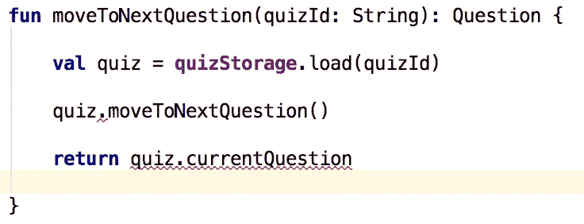
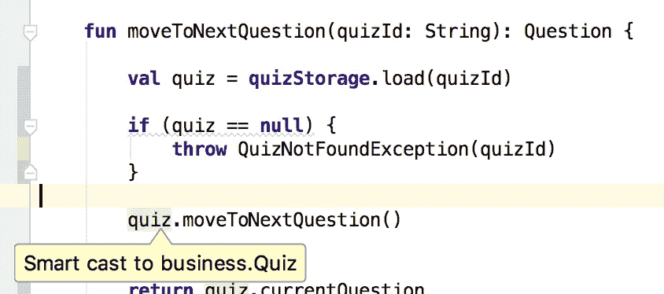
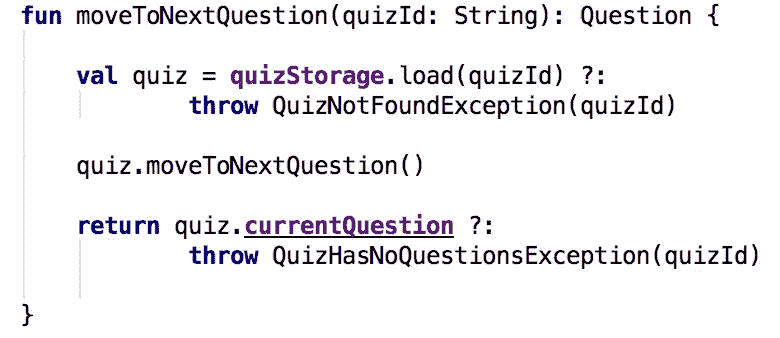

# Kotlin 灾难如何像闪电一样吞噬你的 Java 应用？

> 原文：<https://medium.com/hackernoon/how-kotlin-calamity-devours-your-java-apps-like-cancer-f3ce9500a028>

我听到你在说什么。有传言称 Android 积极采用 Kotlin 作为主要编程语言。而且[趋势](https://fossbytes.com/kotlin-surpass-java-android-programming/)也不看好。

web 开发方面的情况也好不到哪里去。[Java 中最流行的 web 框架通过提供合适的 API 来支持越来越多的惯用 Kotlin。](https://spring.io/blog/2017/01/04/introducing-kotlin-support-in-spring-framework-5-0)

你可以感觉到他们在为未来下注。

而且好像这个未来比你想象的还要近。

现在你在想。我也应该打这个赌吗？还是只是一些炒作，一年后就会销声匿迹？

你心中那种小小的混合的争议感。只会让你一直担心。

你不确定并且害怕如果你不做些什么，那么那个对 Kotlin 感兴趣的新员工会把你的代码库转换成 Kotlin，结果你会失去你的生产力。

这让你担心你的工作职位。

相反，你对以前编程语言取代 Java 的尝试感到失望。你对信任新的这样的尝试感到气馁。一种新的语言没有机会进入大多数遗留代码库，是吗？

或许，你对科技巨头(如谷歌和 Spring Team)为何将赌注押在科特林身上感到好奇。

会不会是你对代码库比较陌生，还在学习一些以前没有用过的新技术？而且你的团队里没几个 Kotlin 爱好者，已经开始把 Java 代码转换成 Kotlin 代码了？

这种转变的速度是惊人的？

这让你感到困惑和愤怒。你已经有很多需要学习的活动部件了。那只会增加更多。

如果你不花时间学习 Kotlin，你会担心你将不得不转移到一个不同的项目，这个项目仍然使用 Java。暂时如此。

如果你真的学了科特林，你会担心这是浪费时间，因为它不会像每个人承诺的那样成功。

我知道，对吧？

# 新团队成员如何在几个月内将整个代码库转换成 Kotlin？

那么，一个团队成员能对您的遗留代码库做出如此剧烈的改变吗？

我的意思是，它是巨大的！一个人不可能把它全部转换成新的语言。所以我可以一直保持高生产率，因为大部分代码都是用 Java 写的，对吗？

不对！

为了让您理解 Kotlin 消耗您的遗留 Java 应用程序有多快，我将附上这张图片。它完美地描述了我目前所看到的:

“How quickly Kotlin consumes Java applications.” (source: [https://www.pexels.com/photo/blue-clouds-color-danger-268774/](https://www.pexels.com/photo/blue-clouds-color-danger-268774/))

Kotlin 是由 [JetBrains](http://jetbrains.com/) 构建的编程语言。他们也有相当庞大的 Java 代码库。他们的使命是创造一种可以在他们的代码库中使用的语言。不仅仅是因为新功能。

那么如何将 Java 文件转换成 Kotlin 呢？

很可能，你又用新的语言写了同样的东西。然后让所有测试都通过。这相当耗时。没有强有力的理由，你的项目经理不会允许这样的努力。对吗？

没有。

一个热键。

你没听错。在 IntelliJ 中，只需一次按键就可以将 Java 文件转换成 Kotlin 文件。在 99%的情况下，所有的测试仍然会通过。

你知道什么更可怕吗？

这也适用于整个软件包…

我给你讲个故事吧。

我加入了一个项目，这个项目有一个这样的 Kotlin 爱好者。他们已经说服其他团队成员“试用”Kotlin 的一个功能。

该项目已历时两年半。一个项目的规模足够大，可以有多个梯度模块，并开始提取一些独立的服务。

两个月后，团队中没有人再编写任何 Java 了。任何需要修改以实现用户故事的 Java 文件都被立即转换成 Kotlin。

重要的是要说团队的速度在这两个月中没有下降，因为它没有花费太多的时间和精力来完成转换。尤其是对于科特林爱好者来说。他们一直在做这样的转换。

让我告诉你另一个故事。

这次是一次不成功的向科特林的转变。但是有一个问题。

几个科特林爱好者同时加入了这个团队。由于他们在将 Java 转换成 Kotlin 方面已经相当有经验，所以他们才开始这么做。

团队成员的另一半仍然在学习技术栈，因为他们在代码基础上相当新。科特林只是添加了其他活动部件。

他们拒绝改变科特林。该团队同意不继续转换，因为这将减缓让这些团队成员跟上现有技术的速度。

但问题是。

通过一对一的交谈，这些团队成员喜欢科特林。一旦他们对技术栈感到更舒服，他们就愿意继续转换。

我很有信心，大约半年后，他们也会停止编写任何 Java。

让我告诉你今天的最后一个故事。

这是一个长期的项目。相当大且复杂。我认为它是一个遗留的 Java 代码库，有十多个宏服务(注意是“宏”——不是“微”)。

一天，两名团队成员请一名科特林爱好者帮助他们试用科特林。他们很好奇，因为互联网上的所有嗡嗡声。因为科特林的狂热爱好者散发出对科特林的热情。

你可以猜到发生了什么事。

五个月后，那个团队中没有人再编写 Java 代码了。同样的故事。

你知道这种转变更可怕的是什么吗？一旦转换成 Kotlin 并开始使用 Kotlin 独有的特性，就很难将代码转换回 Java。

过去有太多这样的准 Java 替代品。他们都没有兑现承诺。

科特林有什么不同？

# 这次的 Java 替代尝试与以往有何不同？

几句话。

100%的 Java 互操作性。

您可以很容易地在同一个目录中混合 Kotlin 和 Java 文件。

Java 可以导入 Kotlin 类，并像使用 Java 类一样使用它们，没有任何奇怪的语法或技巧。科特林也是如此。Kotlin 代码可以导入您的任何 Java 类，并像使用 Kotlin 类一样定期使用它们。

没有像`object.field_$eq(value)`这样怪异的东西来设置一个值。

要从 Kotlin 调用 Java setter，您将使用 Kotlin 语法:`object.field = value`。要从 Java 调用 Kotlin setter，只需使用普通的 setter 方法:`object.setField(value)`。

Kotlin 代码可以实现 Java 接口，Java 代码可以实现 Kotlin 接口。

Kotlin 将互操作性作为该语言的首要特性。这是因为 JetBrains 团队想马上在他们庞大的 Java 代码库上使用 Kotlin。没有任何痛苦。

这使您能够只将一个类从 Java 转换到 Kotlin，而不会触发巨大的级联更改。有时，您仍然希望转换一些相关的文件，但您不必这样做。

Kotlin 更有可能实现取代 Java 的承诺的另一个原因是构建工具。

Kotlin 不需要任何独特的构建工具。一个 Maven 或 Gradle 插件就足够了。

此外，Kotlin 的构建时间非常快。如果启用了增量编译，它甚至会比 Java 更快！

好吧。如你所见，在与科特林的交易中，没有太多的负面因素。

那么，什么是积极的一面呢？当你停止写 Java，开始写 Kotlin 的时候，你得到了什么？

那么，为什么像 Android 和 Spring 这样的科技巨头会把赌注压在 Kotlin 身上呢？

# 那么，为什么科技巨头将赌注押在科特林身上呢？

科特林语言简洁。简洁而不失 Java 的可读性。Kotlin 删除了你在普通 Java 或 Android 应用程序中看到的所有样板文件。

曾经想让流 API 直接在集合对象上可用吗？科特林有那个。它的标准库用附加功能扩展了相当多的标准 Java 类。

这大大减少了样板文件。你必须创建五个不同的类来读取一个流，Kotlin 允许你做你想做的。去读那个流。

Kotlin 比 Java 更安全。它促进了类型系统的可空性。这意味着编译器可以静态地分析你的代码，如果你有可能在某个地方出现空指针异常——kot Lin 代码将无法编译。

这些可空性检查甚至不像在其他语言中那样烦人。

这要感谢聪明的演员。让我给你看一个例子:

Compile error because quiz variable can be null

因为`quizStorage.load(quizId)`返回`Quiz?`(一个可空的`Quiz`)编译器抱怨你不能直接调用`quiz`变量上的方法，因为它可以是`null`。

因此，为了让编译器满意，您需要添加一个空检查:

By adding null-check we are fixing the compile error and making quiz “smart-casted” to non-nullable

可以看到，`quiz.moveToNextQuestion()`是以一种“特殊”的方式突出显示的。如果您将鼠标悬停在该变量上，它会告诉您它已经被智能转换为`Quiz`类型。

因为编译器现在知道，此时`quiz`变量不能是`null`。

在具有可空类型的不同语言中，通常需要将可空值展开为不可空值。即使你做了一个空检查！

这种展开操作是不安全的。因此，如果另一个程序员(包括你未来的自己)移除了你的 null-check，他们不会得到警告。

聪明的演员很酷。一旦有人取消了空检查，就会出现编译错误。

还有一种更简洁的方式来写同样的东西——Elvis 操作符`?:`:

Most null-checks can be eliminated using elvis operator to further simplify the code

顺便说一下，这些例子来自我的终极教程:Kotlin 入门。这是一个电子书形式的三部分教程，总共有 260 页(将来会更多)的实践内容，你可以跟着学。

至此，如果你对学习 Kotlin 感兴趣，[在这里下载 PDF 格式的 Kotlin 教程。](https://iwillteachyoukotlin.com/ultimate-tutorial-getting-started-with-kotlin-kilac)

你不仅可以获得实际操作的内容，还可以从中学习用 Kotlin 编程。当你遇到困难时，你可以问我任何问题，我会帮助你。

不管怎样？科特林还有什么好处？

显然，如果你花足够的时间编写 Kotlin，你也会开始编写更可读和更健壮的 Java 代码。

这是一个有趣的副作用，不是吗？

我的几个朋友甚至告诉我，他们更愿意雇佣 Kotlin developer 而不是 Java developer 来完成这个全是 Java 的项目，而根本没有 Kotlin。

此外， [Kotlin 从《有效的 Java》一书中吸取了许多原则，并将它们转化为基本的语言概念](https://hackernoon.com/how-effective-java-may-have-influenced-the-design-of-kotlin-part-1-45fd64c2f974)。因此，通过编写 Kotlin 一段时间，您将学会如何编写更好的 Java 代码。还不错，对吧？

那么工装呢？Kotlin 好用吗？还是我必须放弃 IDE 的重构和智能功能，转而使用 Kotlin 代码？

我是不是要像在文本编辑器里一样重新写一遍？

号码

Kotlin 由 JetBrains 制造。这是制造 IntelliJ IDEA 的同一家公司。他们尽了最大努力确保你在 IntelliJ 中使用 Kotlin 时有宾至如归的感觉。

目前的支持是巨大的。所有必要的重构都已经就绪。

就在我们说话的时候，他们添加了越来越多。

那么现在是学习一些科特林的好时机吗？

# 你现在学习科特林是个好主意吗？

当然，你需要决定。

如果你问我……站在你的立场，我会去做的。原因如下。

即使 Kotlin 没有兑现在大多数遗留代码库(甚至是新代码库)中替换 Java 的承诺，我知道我已经成为一名更好的 Java 程序员。

只有这样才值得。你需要更多吗？

我为你准备了这个。

对于程序员来说，在任何时候学习另一种语言都是值得的。唯一的例外是，如果你只是刚刚开始。

因此，如果您对自己的语言、技术栈和一切都很满意，并且目前没有学习任何其他编程语言，那么尝试一下 Kotlin 是个不错的主意。

它将把事情放在正确的角度，带你走出当前的泡沫。总是好的。

学习是一种技能。所以你学得越多，你就会成为更好、更有效率的学习者。

也许，你认为你没有时间学习一项新技能，因为你有一份全职工作，家庭，爱好，以及生活中的其他一切？

然后你应该[学会如何在全职工作的时候挤出时间来学习一项新技能](https://hackernoon.com/how-to-find-the-time-to-learn-a-new-skill-when-you-are-working-full-time-d1957060ced0)。

如果你认为自己已经准备好迎接从 Java 开发人员升级到 Kotlin 开发人员的挑战，[下载终极教程:Kotlin 入门](https://iwillteachyoukotlin.com/ultimate-tutorial-getting-started-with-kotlin-kilac)。

我真诚地感谢您的阅读，并鼓励您尝试一下科特林。反正你也没什么可失去的。你只能从中受益。

如果你想让我开心，那么你可以给我中等的掌声(你知道你可以给多个吗？)并分享给你的朋友，在社交网络，黑客新闻，Reddit 等。

# 更多精彩阅读

 [## 对于 CTO:技术债什么时候还？

### 开发人员经常抱怨技术债务，并希望获得一些时间来修复它。无论是重大的重构，还是…

hackernoon.com](https://hackernoon.com/for-cto-when-is-the-time-to-pay-technical-debt-65343f18e5e4)  [## 科特林的“@弃用”如何减轻巨大重构的痛苦？

### 我要告诉你一个真实的故事，我们是如何节省大量时间的。科特林的@弃用的重构的力量…

hackernoon.com](https://hackernoon.com/how-kotlins-deprecated-relieves-pain-of-colossal-refactoring-8577545aaed)  [## 我为什么要学安卓？

### 你已经下定决心要学习使用 Kotlin 为 Android 创建应用程序。你超级上进…

hackernoon.com](https://hackernoon.com/why-should-i-learn-android-14687b27e062)