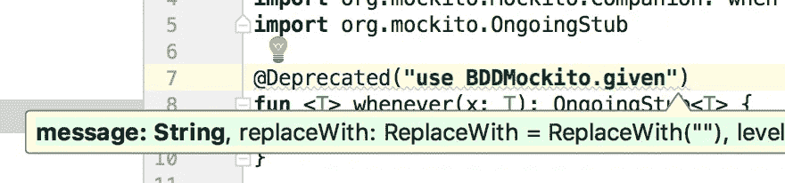
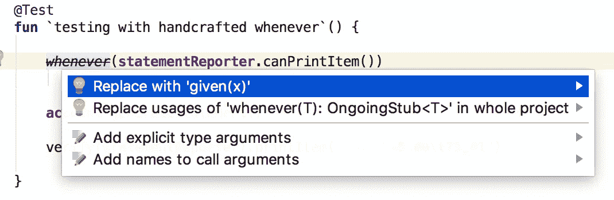
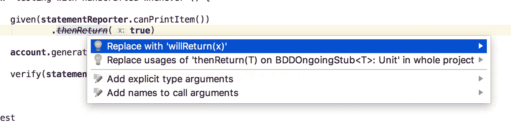
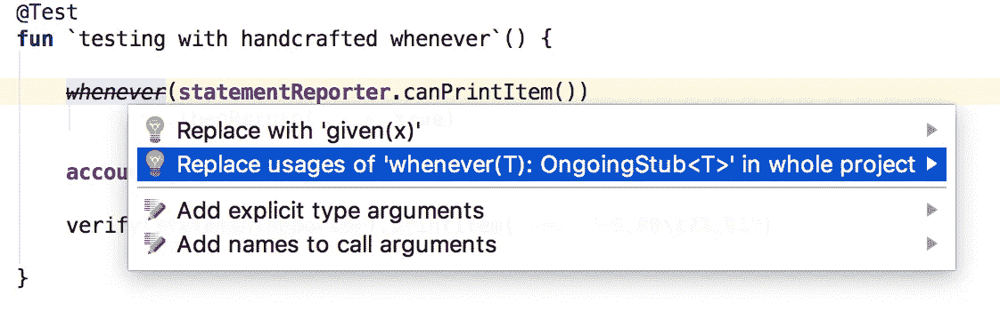
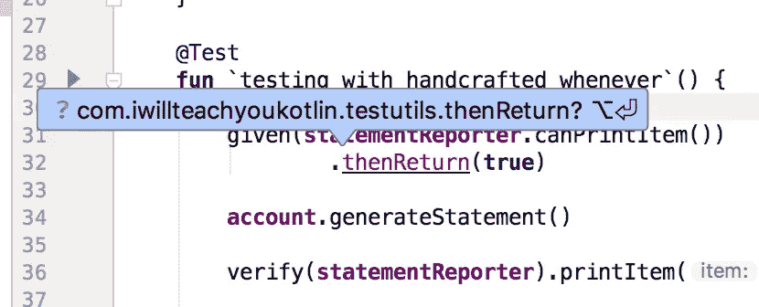
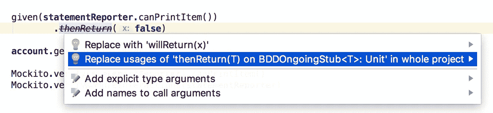

# 科特林的“@弃用”如何减轻巨大重构的痛苦？

> 原文：<https://medium.com/hackernoon/how-kotlins-deprecated-relieves-pain-of-colossal-refactoring-8577545aaed>

我要告诉你一个真实的故事，我们是如何节省大量时间的。科特林重构的力量令人震惊。

不要觉得和 Java 的`@Deprecated`一样。它更强大。它允许多步自动更换。

那么，让我告诉你吧。

我们将代码库从 Java 迁移到 Kotlin。当有人需要接触现有的 Java 文件时，我们会自动将它转换成 Kotlin。只有这样才能带来改变。否则，所有新代码都是用 Kotlin 编写的。

我们在单元测试中使用了`mockito`库。你可能知道，mockito 非常依赖于`Mockito.when`方法。

`when`是 Kotlin 中的保留关键字。所以我们必须用倒刺把它围起来。

老实说，它看起来很丑，打字也很笨拙:

```
class AccountTest { private val statementReporter =
                    mock(AccountStatementReporter::class.java)

    private val account = Account(statementReporter) @Test
    fun `testing with Mockito when`() { `when`(statementReporter.canPrintItem())
                .thenReturn(true) account.generateStatement() verify(statementReporter).printItem("-5,00\t73,91") }}
```

当时，我们还不知道`mockito-kotlin`，所以我们构建了自己的`whenever`函数来缓解关键字问题:

```
fun <T> whenever(x: T): OngoingStub<T> {
    return `when`(x)
}
```

它是`Mockito.when`的别名。

它可以快速输入，IntelliJ 帮助自动完成。这很好:

```
 @Test
    fun `testing with handcrafted whenever`() { whenever(statementReporter.canPrintItem())
                .thenReturn(true) account.generateStatement() verify(statementReporter).printItem("-5,00\t73,91") }
```

在半年的时间里，我们到处都有这种基于`whenever`的代码。

成千上万次。

```
 @Test
    fun `testing with handcrafted whenever – false case`() { whenever(statementReporter.canPrintItem())
                .thenReturn(false) account.generateStatement() verify(statementReporter).canPrintItem()
        verifyNoMoreInteractions(statementReporter) }
```

此时，有人已经发现了`BDDMockito` API。它允许我们用稍微不同的词来表示`when`、`thenReturn`、`thenThrow`和其他词。

最重要的是，它是官方`mockito`库的一部分！

顺便说一下，`mockito`通常在 Java 和 Kotlin 测试时使用。

好奇在科特林测试？还是一般的科特林？

建议你[下载我的免费终极教程:Kotlin 入门](https://iwillteachyoukotlin.com)。再过几分钟，您就可以在 Kotlin 中使用第一个成熟的命令行应用程序了。

该教程是一本 80 页的书，完全是动手操作。您可以在学习各种 Kotlin 和 IntelliJ 特性的同时跟随它。还有很多其他的东西。

不管怎样？

这里有一个`BDDMockito`语法的例子:

```
 @Test
    fun `testing with handcrafted whenever`() { given(statementReporter.canPrintItem())
                .willReturn(true) account.generateStatement() verify(statementReporter).printItem("-5,00\t73,91") }
```

当然，我们想从手工制作的功能切换到官方 API！

顺便说一下，`BDDMockito`使用了稍微不同的命名。但是嘲讽的结构是一样的:

```
// given vs when
given(statementReporter.canPrintItem())
        // willReturn vs thenReturn
        .willReturn(true)
```

如你所见，它允许我们使用`given`而不是`when`，所有的`then*`方法都变成了`will*`。

那时，我们决定从`whenever`切换到`given`。我们不想一次改变成千上万的事件，因为这将花费很多时间。

如果我们要进行搜索和替换，我们可能会改变一些不应该改变的东西。

因此，我们决定在`whenever`函数上添加一个简单的`@Deprecated`注释。这将使 IntelliJ 中的所有用法都被弃用(删除)。也不太可能引入新的用法。

当我的搭档输入时，我注意到 IntelliJ 在参数列表工具提示中显示了一些有趣的东西:



这让我对这个`replaceWith`参数很好奇。如果我理解正确的话，这将允许一些自动替换。

我们稍微摆弄了一下。看起来你可以做这样的替换。

代码如下:

```
@Deprecated(
        "use BDDMockito.given",
        replaceWith = ReplaceWith(
                "given(x)",
                "org.mockito.BDDMockito.Companion.given"))
fun <T> whenever(x: T): OngoingStub<T> {
    return `when`(x)
}
```

现在，我们尝试使用`whenever`，将光标放在已废弃的`whenever`调用上，然后按 ALT+ENTER(IntelliJ 的神奇热键)。

发生的事情令人惊讶:



您确实可以进行自动替换。而且在整个项目中甚至还有替换它的选项！

令人震惊！

但首先，我们决定仔细检查它将如何工作，只是一个事件。

这是正确的决定:


它导致了一个编译错误，因为`BDDOngoingStub<T>`上没有定义`thenReturn`方法。应该是`willReturn`。

现在它让我们思考。

如果我们可以使用 Kotlin 的“扩展方法”特性来定义方法，会怎么样呢？这将使事情编译。当然可以。

但是后来我们还是没有去掉自定义代码…

“如果我们也反对扩展方法，那又怎么样呢？!"——我问。

“然后我们可以加上`replaceWith`！”我的搭档回答道。

在欣喜中，我们开始这样做:

```
fun <T> BDDOngoingStub<T>.thenReturn(x: T) {
    willReturn(x)
}
```

这允许我们通过自动导入`thenReturn`扩展来解决问题:


现在，我们要用同样的注释来否定它:

```
@Deprecated(
        "use willReturn",
        replaceWith = ReplaceWith(
                "willReturn(x)"))
fun <T> BDDOngoingStub<T>.thenReturn(x: T) {
    willReturn(x)
}
```

现在我们能够用`willReturn`替换这些`thenReturn`方法调用了:



我们也可以为整个项目运行替换程序。

干净利落。

我们认为我们已经准备好进行“整个项目”的重构了:



这仍然迫使我们在大约 40 个文件中进行“ALT+ENTER”自动导入。

但是，说实话，这是一个快速的。



有一个捷径可以跳到下一个编译错误:CMD+ALT+DOWN。所以解决这个小问题的方法就是按一个快捷键，然后再按一个。

一遍又一遍。

我们花了一分钟做那件事。

我们也为`thenReturn`做了同样的“整个项目”替换:



工作起来没有任何问题:

```
 @Test
    fun `testing with handcrafted whenever`() { given(statementReporter.canPrintItem())
                .willReturn(true) account.generateStatement() verify(statementReporter).printItem("-5,00\t73,91") } @Test
    fun `testing with handcrafted whenever – false case`() { given(statementReporter.canPrintItem())
                .willReturn(false) account.generateStatement() verify(statementReporter).canPrintItem()
        verifyNoMoreInteractions(statementReporter) }
```

最后，我们再次检查了没有出现`whenever`、`thenReturn`和`thenThrow`。

没有。

所以我们安全地删除了我们的`testutils/whenever.kt`文件。

正如你所猜测的，这些`@Deprecated`定义中融入了一些智慧。但是一旦到位——会节省你很多时间，减轻你很多痛苦。

我真诚地感谢你阅读这篇文章。对我来说，这是一段相当长的旅程。

如果你喜欢你刚刚读到的，我会很感激一些中等的掌声！社交媒体分享也很受欢迎。反馈也是如此！

如果你刚刚开始使用 Kotlin，你将会通过下载这个免费的关于 Kotlin 入门的终极教程让我高兴。

谢谢大家！

# 更多精彩阅读

[](https://hackernoon.com/how-kotlin-calamity-devours-your-java-apps-like-cancer-f3ce9500a028) [## Kotlin 灾难如何像闪电一样吞噬你的 Java 应用？

### 我听到你在说什么。有传言说 Android 积极采用 Kotlin 作为主要编程工具…

hackernoon.com](https://hackernoon.com/how-kotlin-calamity-devours-your-java-apps-like-cancer-f3ce9500a028) [](https://hackernoon.com/for-cto-when-is-the-time-to-pay-technical-debt-65343f18e5e4) [## 对于 CTO:技术债什么时候还？

### 开发人员经常抱怨技术债务，并希望获得一些时间来修复它。无论是重大的重构，还是…

hackernoon.com](https://hackernoon.com/for-cto-when-is-the-time-to-pay-technical-debt-65343f18e5e4)  [## 当你全职工作时，如何找到时间学习一项新技能？

### 让我猜猜…

hackernoon.com](https://hackernoon.com/how-to-find-the-time-to-learn-a-new-skill-when-you-are-working-full-time-d1957060ced0)