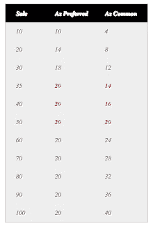

# 清算优先权如何运作

> 原文：<https://medium.com/hackernoon/how-liquidation-preferences-work-2df6c035b537>

清算优先权是优先股定义中的一个关键术语(它是公认的第二重要的经济术语)。早些时候，我在关于[谈判条款清单](http://altgate.typepad.com/blog/2008/01/the-science-art.html)的帖子中写了这个和其他条款，但这里我想举一些具体的例子来说明为什么这是一个如此重要的条款。

你可能已经知道这一点，但值得重复的是[清算优先权](https://hackernoon.com/tagged/liquidation-preference)指的是在公司出售或清盘时向投资者支付报酬的程序。它通常包括两个组成部分:偏好(先于其他人获得的金额)和参与(能够“二次探底”)。许多人已经[写了](http://www.feld.com/blog/archives/2004/07/liquidation_pre.html)关于偏好的定义，所以我将给出一些简单的例子。

为了简单起见，假设一个风险投资者在一家公司的一类优先股上投资了 1000 万美元，拥有 40%的股份，该公司以 5000 万美元的价格被出售。下面是我在[上一篇](http://altgate.typepad.com/blog/2008/01/the-science-art.html) [中的三个不同场景是如何工作的](https://hackernoon.com/tagged/work)(在一个具体的例子中):

> (1) **1x 不参与优先**。在这种情况下，风险资本家可以选择拿走 1000 万美元(他们的 1x 偏好)或转换成普通股并拿走 2000 万美元(5000 万美元的 40%)。显然，他们会选择后者。你可能会问，偏好的价值是什么？想象一下，如果公司以 1500 万美元的价格出售——在这种情况下，风投将获得 1000 万美元的优先权，这意味着他们实际上拥有 67%的经济利益(而不是资本表中显示的 40%)。
> 
> (2) **1x 优惠上限为 2x，参与度**。在这种情况下，风险投资者将获得 1000 万美元(1 倍优先)，然后获得其余的 40%(或 1600 万美元)，但在这里，上限开始生效，因此风险投资者将获得额外的 1600 万美元，而不是 1000 万美元，总共 2000 万美元(或 2 倍)。看看这里的结果表会有所帮助:

> 第一列是销售价格，第二列是 VC“优先”的价值，右列是如果他们转换为普通股(他们总是可以选择这样做)对 VC 的价值。你会看到这个上限是如何创造一个“甜甜圈洞”的，在这个洞里，无论公司是以 3500 万美元还是 5000 万美元的价格出售，风投都会收到相同的金额(因为在任何超过 5000 万美元的出售中，风投都会转换为普通股)。
> 
> (3) **1x 有参与且无上限的优先权**。在这种情况下，创投资本家从顶部获得 1000 万美元，然后他们转换为普通股，并获得其余的 40%(或 1600 万美元)，总计 2600 万美元。在这种情况下，VC 得到 52%,而不是 cap 表中显示的 40%。通过这个简单的例子，你可以看到清算偏好是如何为投资者增加可观的回报的(这些回报都来自于普通股)。

因此，我的观点是，不参与是共同的最佳选择，其次是上限，最糟糕的交易是无上限参与情景。

最后，我想对上限方案提出警告，即甜甜圈洞有时会产生不受欢迎的激励。想象一下，在上面的例子中，如果有两笔交易摆在桌面上:一笔是 3500 万美元的现金，另一笔是 3500 万美元的现金，外加 1500 万美元的收入。此外，想象一下 3500 万美元的全现金交易更有可能达成。在这种情况下，风投会倾向于接受价格较低的交易(记住他们在两种情况下得到的报酬是一样的)，但普通投资者可能会接受价格较高的交易。

> [黑客中午](http://bit.ly/Hackernoon)是黑客如何开始他们的下午。我们是 [@AMI](http://bit.ly/atAMIatAMI) 家庭的一员。我们现在[接受投稿](http://bit.ly/hackernoonsubmission)并乐意[讨论广告&赞助](mailto:partners@amipublications.com)机会。
> 
> 要了解更多信息，[请阅读我们的“关于”页面](https://goo.gl/4ofytp)，[在脸书上点赞/给我们发消息](http://bit.ly/HackernoonFB)，或者简单地说， [tweet/DM @HackerNoon。](https://goo.gl/k7XYbx)
> 
> 如果你喜欢这个故事，我们推荐你阅读我们的[最新科技故事](http://bit.ly/hackernoonlatestt)和[趋势科技故事](https://hackernoon.com/trending)。直到下一次，不要把世界的现实想当然！