# 你的博客文章应该有多长？

> 原文：<https://medium.com/hackernoon/how-long-should-your-medium-posts-be-dbf34be6507d>

## 黑客正午研究

## 4 分钟，5 分钟，6 分钟，7 分钟，8 分钟？从顶级作家身上学到的一课。

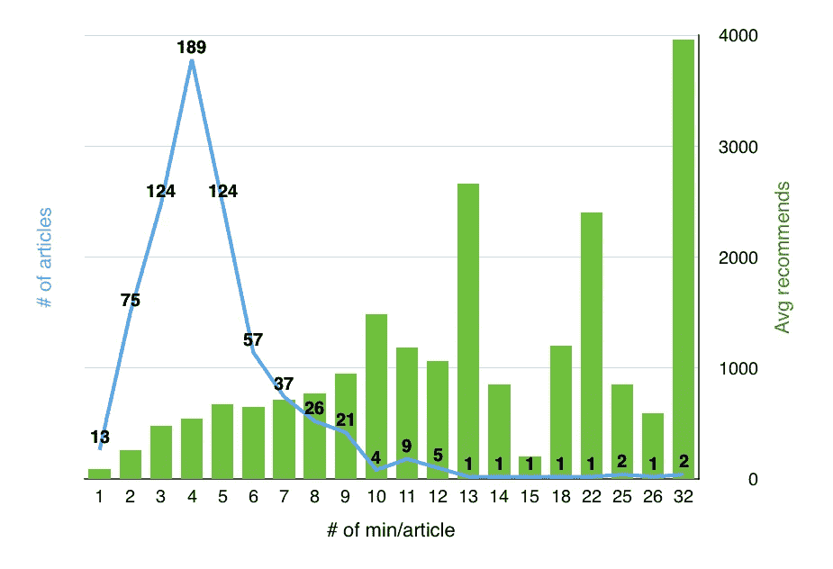

几个月前，我分析了我在[媒体](https://hackernoon.com/tagged/medium)上关注的 10 位作家的 694 篇帖子，我认为他们是顶级媒体作家。他们有 5 万到 15 万的粉丝。我分析了他们在 2016 年 7 月 1 日—11 月 30 日之间发布的所有文章。在此期间，每位作者发表了 22 至 213 篇文章，阅读时间介于 1 分钟至 32 分钟之间。

## 这是所有这些帖子的结果。

Number of recommends may have changed slightly since I analyzed the posts

超过 60%的帖子是 3 分钟、4 分钟或 5 分钟的阅读，超过 90%的帖子是 2 到 9 分钟的阅读。然而，看起来越长的帖子有越多的推荐:4 分钟阅读的平均推荐数约为 600，而 9 分钟阅读的平均推荐数接近 1000。32 分钟的阅读量甚至高达 4000 次！然而，只有两个 32 分钟的阅读被张贴出来。

所以你可能认为你应该写 30 分钟长的帖子。嗯，实际上没那么简单。

让我们通过分解到每个作者来了解更多，找出实际上表现最好的帖子长度。

*如果你不想看每个作家的每个图，你可以直接跳到***。**

# *詹姆斯·阿尔图彻*

***14.4 万追随者***

*顶级作家:**商业**，**创业**，**人生教训***

*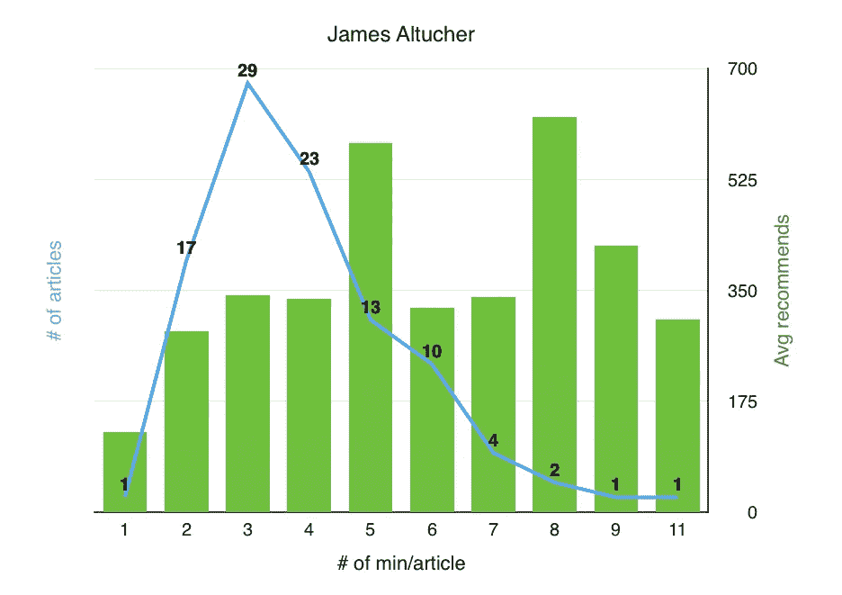*

*Number of recommends may have changed slightly since I analyzed the posts*

## *7 月至 12 月间撰写的文章数量*

*101*

## *这些职位的建议数量*

*37,000+*

*这使得平均每个帖子有 360+ ❤*

## *他写得最多的帖子*

*3 分钟帖子(29%)、4 分钟帖子(23%)、2 分钟帖子(17%)和 5 分钟帖子(13%)*

## *似乎获得最多❤的帖子*

*8 分钟帖子(620+ ❤，但他只写了两条)，5 分钟帖子(580+ ❤)*

# *[大流士·福鲁](https://medium.com/u/54163a1723f6?source=post_page-----dbf34be6507d--------------------------------)*

***65k 追随者***

*顶级作家:**灵感**，**商业**，**生活**，**创业，生产力***

*[实用艺术](https://medium.com/art-of-practicality)的编辑(2 万追随者)*

*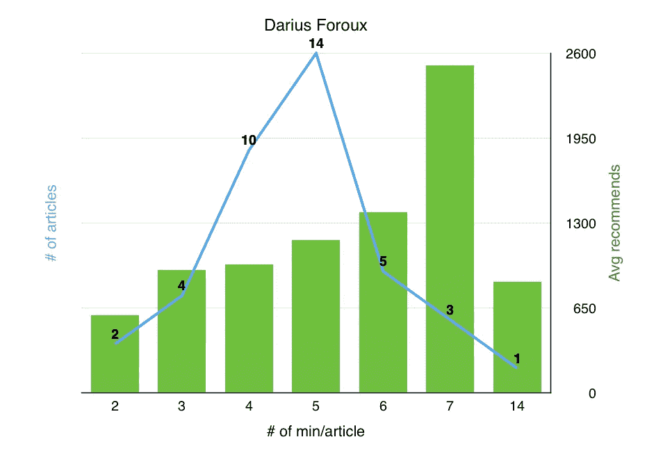*

*Number of recommends may have changed slightly since I analyzed the posts*

## *7 月至 12 月间撰写的文章数量*

*39*

## *这些职位的建议数量*

*46,000+*

*这使得**平均每篇帖子有 1100+❤***

## *他写得最多的帖子*

*5 分钟帖子(36%)、4 分钟帖子(26%)和 6 分钟帖子(13%)*

## *似乎获得最多❤的帖子*

*7 分钟帖子(2，500+ ❤)*

# *本杰明·p·哈迪*

***12.3 万追随者***

*顶级作家:**创业**，**人生**，**人生教训**，**生产力**，**自强***

*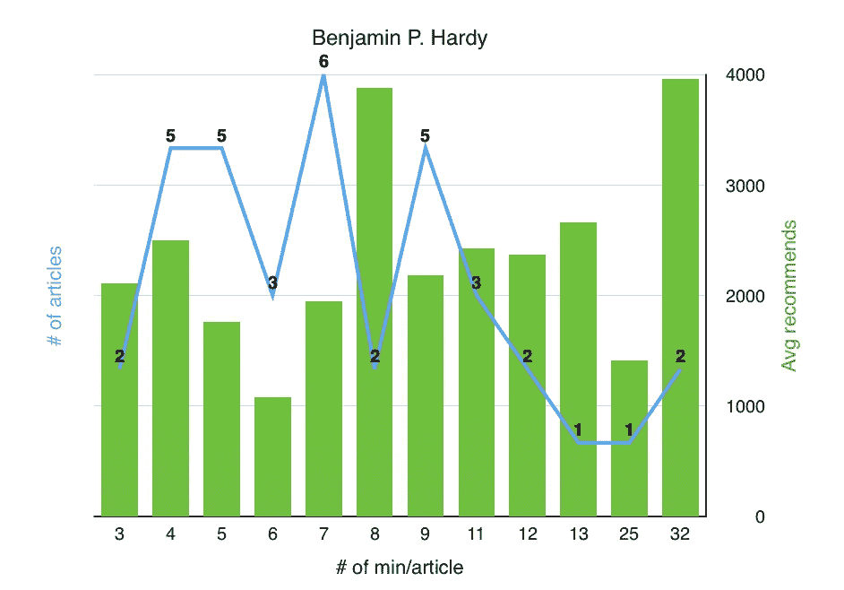*

*Number of recommends may have changed slightly since I analyzed the posts*

## *7 月至 12 月间撰写的文章数量*

*37*

## *这些职位的建议数量*

*83,000+*

*也就是说，平均每篇帖子有**2200+❤***

## *他写得最多的帖子*

*7 分钟的帖子(16%)、4 分钟、5 分钟和 9 分钟的帖子(各占 14%)以及 6 分钟和 11 分钟的帖子(各占 8%)*

## *似乎获得最多❤的帖子*

*32 分钟发言(3 900+❤)和 8 分钟发言(3 800+❤)*

# *拉里·金*

***173k 追随者***

*顶级作家:**社交媒体**，**风险投资**，**商业**，**创业**，**创业***

*[营销与创业](https://medium.com/marketing-and-entrepreneurship)的编辑(13.9 万关注者)*

*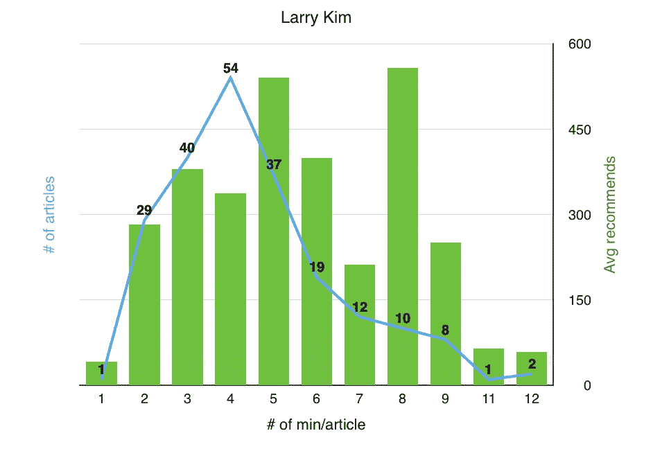*

*Number of recommends may have changed slightly since I analyzed the posts*

## *7 月至 12 月间撰写的文章数量*

*213*

## *这些职位的建议数量*

*79,000+*

*这使得平均每个帖子**有 370+❤***

## *他写得最多的帖子*

*4 分钟帖子(25%)、3 分钟帖子(19%)、5 分钟帖子(17%)和 2 分钟帖子(14%)*

## *似乎获得最多❤的帖子*

*8 分钟发言(550+ ❤)和 5 分钟发言(540+ ❤)*

# *史蒂文·利维*

***108k 追随者***

*顶级作家:**科技***

*[幕后频道](https://backchannel.com)的编辑，[的前途如何？](https://medium.com/the-wtf-economy) (16k 追随者)[苹果手表项目](https://medium.com/the-apple-watch-project) (3k 追随者)*

*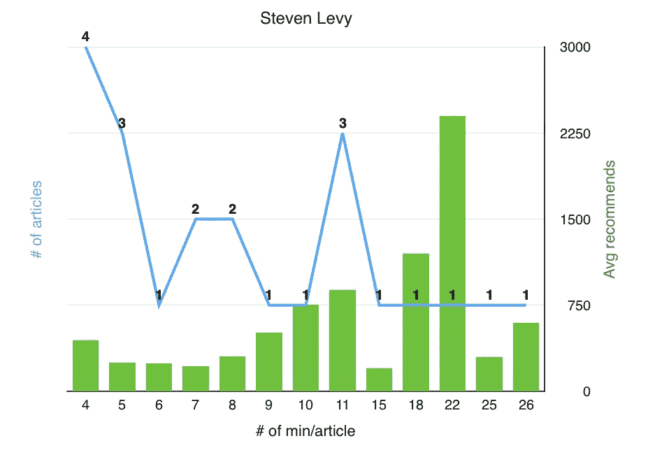*

*Number of recommends may have changed slightly since I analyzed the posts*

## *7 月至 12 月间撰写的文章数量*

*22*

## *这些职位的建议数量*

*12,000+*

*这使得平均每个帖子有 540+ ❤*

## *他写得最多的帖子*

*4 分钟的帖子(18%)、5 分钟和 11 分钟的帖子(各占 14%)以及 7 分钟和 8 分钟的帖子(9%)*

## *似乎获得最多❤的帖子*

*22 分钟帖子(2400+❤，但他只写了一个)，18 分钟帖子(1200+❤，但他只写了一个)。他 11 分钟的投篮命中率也很高(880+ ❤).*

# *托马斯·奥彭*

***90k 追随者***

*顶级作家:**心理学**，**生活经验**，**生产力**，**创造力**，**生活***

*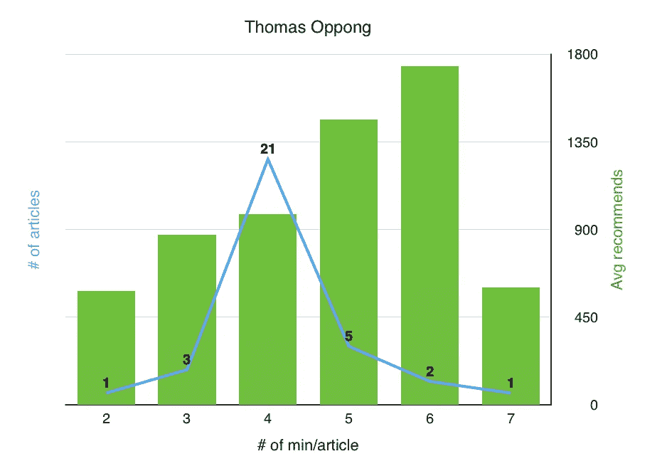*

*Number of recommends may have changed slightly since I analyzed the posts*

## *7 月至 12 月间撰写的文章数量*

*33*

## *这些职位的建议数量*

*35,000+*

*这使得平均每篇帖子有**1000+❤***

## *他写得最多的帖子*

*4 分钟帖子(64%)和 5 分钟帖子(15%)*

## *似乎获得最多❤的帖子*

*6 分钟发言(1 700+❤)和 5 分钟发言(1 400+❤)*

# *M.G .西格勒*

***146k 追随者***

*他写了很多关于科技的文章。*

*编辑[500 多字](https://500ish.com)*

*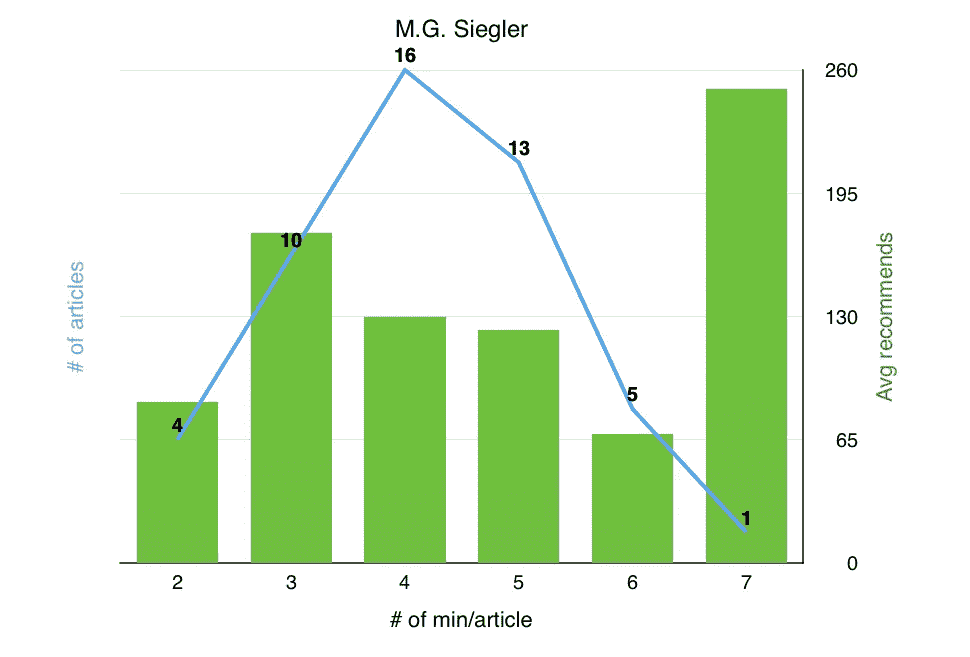*

*Number of recommends may have changed slightly since I analyzed the posts*

## *7 月至 12 月间撰写的文章数量*

*49*

## *这些职位的建议数量*

*6,000+*

*这使得平均每个帖子有 120+ ❤*

## *他写得最多的帖子*

*4 分钟帖子(33%)、5 分钟帖子(27%)和 3 分钟帖子(20%)*

## *似乎获得最多❤的帖子*

*7 分钟帖子(250+ ❤，但他只写了一个)和 3 分钟帖子(170+ ❤)*

# *马克·苏斯特*

***97k 追随者***

*顶级写手:**启动***

*[桌子两侧](https://bothsidesofthetable.com)的编辑(20k 追随者)*

*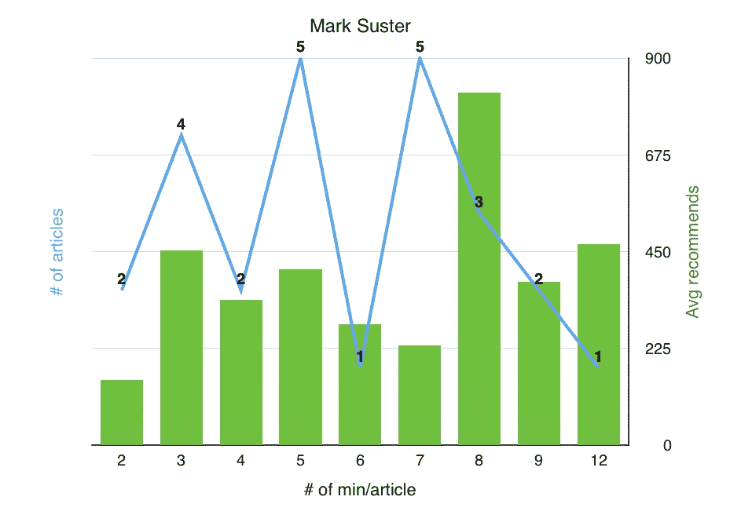*

*Number of recommends may have changed slightly since I analyzed the posts*

## *7 月至 12 月间撰写的文章数量*

*25*

## *这些职位的建议数量*

*10,000+*

*这使得平均每篇帖子有**400+❤***

## *他写得最多的帖子*

*5 分钟和 7 分钟帖子(各占 20%)，3 分钟帖子(16%)*

## *似乎获得最多❤的帖子*

*8 分钟帖子(810+ ❤)*

# *托拜厄斯·范·施耐德*

***89k 追随者***

*顶级作家:**设计***

*范·施耐德【13k 关注者】 [Semplice 杂志](https://medium.com/semplice-labs)【2k 关注者】的[台编辑](https://medium.com/desk-of-van-schneider)*

*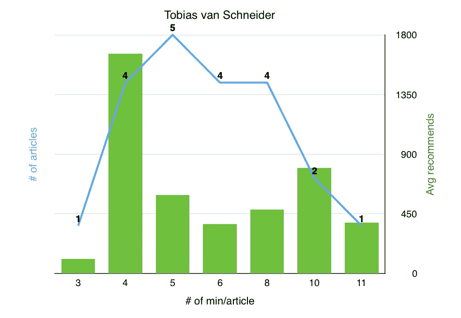*

*Number of recommends may have changed slightly since I analyzed the posts*

## *7 月至 12 月间撰写的文章数量*

*23*

## *这些职位的建议数量*

*16,000+*

*这使得平均每个帖子有 690+ ❤*

## *他写得最多的帖子*

*5 分钟(22%)、4 分钟、6 分钟和 8 分钟(各占 17%)*

## *似乎获得最多❤的帖子*

*4 分钟帖子(1，600+ ❤)*

# *乔恩·韦斯顿伯格*

***10.3 万追随者***

*顶级作家:**写作**，**创业**，**创业**，**人生**，**人生教训***

*编辑的[创作的](https://medium.com/hi-my-name-is-jon)，[作废的](https://thevoidist.com)，[多产的。由 Speedlancer](https://productive.speedlancer.com) ， [TECHOZ](https://medium.com/thats-not-a-round)*

*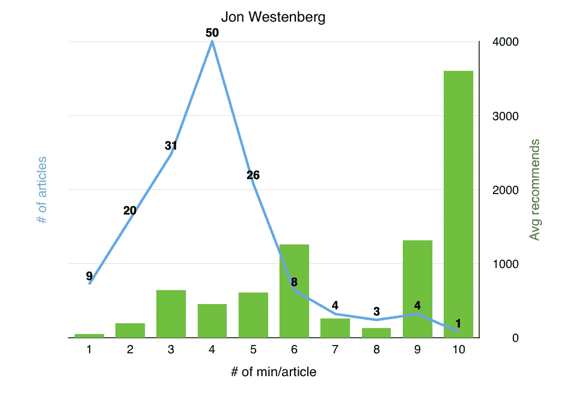*

*Number of recommends may have changed slightly since I analyzed the posts*

## *7 月至 12 月间撰写的文章数量*

*156*

## *这些职位的建议数量*

*83,000+*

*这使得平均每个帖子有 530+ ❤*

## *他写得最多的帖子*

*4 分钟帖子(32%)、3 分钟帖子(20%)、5 分钟帖子(17%)和 2 分钟帖子(13%)*

## *似乎获得最多❤的帖子*

*10 分钟帖子(3600+❤，但他只写了一个)，9 分钟帖子(1300+❤)和 6 分钟帖子(1200+❤)*

# *学习*

## *8 分钟帖子才是王道*

*看来一个帖子获得最多推荐的理想时长是 **8 分钟**。对于这 10 位作者中的 3 位来说，平均来说，8 分钟的帖子带来的推荐最多。然后是 7 分钟的帖子。*

## *长文很有潜力*

*有趣的是，一些长文(两篇 32 分钟的文章由 Benjamin P. Hardy 撰写，一篇 22 分钟的文章由 Steven Levy 撰写)给他们各自的作者带来了平均最多的推荐。所以也有可能写长文是获得大量推荐的好方法。*

*不过，写长文可能是一项困难的练习——不是每个作者都能在 20 分钟内保持读者的注意力。它可能需要大量的工作和天赋来掌握。我建议阅读本杰明·p·哈代的作品来学习如何做到这一点，因为他的长篇文章得到了大量的推荐。本杰明还有一个有趣的地方是，他总是在自己的故事发布几天后推荐它们。这是给你的帖子第二次提升的好方法——当然前提是你有大量的追随者。*

# *在媒介上写作就是给你的读者一些有价值的东西。*

*不需要写一篇 8 分钟的帖子，因为这里的数字显示这是最值得推荐的。如果你能在 4 分钟内表达你的观点并传递价值，那就更好了。记住，少即是多。*

*然而，当然，当写作时，你可能会在 8 分钟内而不是 4 分钟内更深入地分析，这可能是为什么 7 分钟和 8 分钟的帖子如此受欢迎的原因——足够长以进行良好的分析，但足够短以至于不会中途失去读者。*

# *最后*

*不要误会:这不是*因为*你会写一篇 8 分钟的帖子，人们*会*喜欢。相反，写下你要说的话，而不要关注帖子的长度。一旦你认为它完成了，检查它有多长(一篇 8 分钟的帖子大约是 1800 字)。*

*   *如果远低于 8 分钟，问问自己:“**我说得对吗？分析是否深入到足以交付有价值的东西？**”。*
*   *如果超过了 8 分钟，问问自己:“**我会不会中途失去我的读者？我能砍掉那些没用的、没有增加任何价值的东西吗？**”*

*总而言之，这个 8 分钟的标记应该作为你的一个指示，而不是一个遵循的规则。*

*我将以大流士·弗鲁在他的文章中所说的话来结束我的演讲:*

> *把主要精力放在写作之外的事情上是浪费你的时间。*

**希望这篇文章对你有用，如果有用，请点击❤，让其他人也能看到:)**

**你可以在*[***Twitter***](https://twitter.com/thibaudherr)*和*[***LinkedIn***](https://www.linkedin.com/in/thibaudherr/)*上找到我，如果你想要更多类似这些的故事，可以关注我，订阅* [***我的快讯***](http://eepurl.com/cD6E_P) *。**

******

> *[黑客中午](http://bit.ly/Hackernoon)是黑客如何开始他们的下午。我们是 [@AMI](http://bit.ly/atAMIatAMI) 家庭的一员。我们现在[接受投稿](http://bit.ly/hackernoonsubmission)，并乐意[讨论广告&赞助](mailto:partners@amipublications.com)机会。*
> 
> *如果你喜欢这个故事，我们推荐你阅读我们的[最新科技故事](http://bit.ly/hackernoonlatestt)和[趋势科技故事](https://hackernoon.com/trending)。直到下一次，不要把世界的现实想当然！*

**