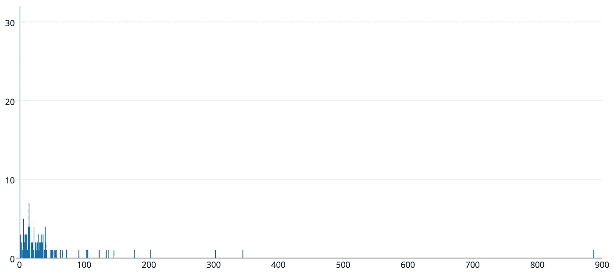

# 需要多长时间？

> 原文：<https://medium.com/hackernoon/how-long-will-it-take-d567033abb38>

## *估算软件工作*

*【2018 年 1 月 10 日更新】:* [*还要多久？第二部分——那么，它有用吗？*](/@tristanls/how-long-will-it-take-part-2-cd80ad93796d)

像许多发现自己在做软件开发的人一样，我有时会被要求估计工作何时完成。我将要展示的是我所知道的评估软件工作完成的最好方法。下次有人问“需要多长时间？”，在你阅读这句话的时间里，你将能够回答诸如“当开始一项新工作时，有 25%的可能性会花费我们不到 3 天的时间，有 75%的可能性会花费我们不到 37 天的时间，有 90%的可能性会花费我们不到 104 天的时间”之类的问题，并且能够提供你想要的任何其他百分比。

首先，我想要的一个约束是**人们不应该为了得出一个合理的估计而对工作的性质或者工作的难度做出任何猜测**。这种限制是因为在[价值流映射](https://en.wikipedia.org/wiki/Value_stream_mapping)意义上，估计是[浪费](https://en.wikipedia.org/wiki/Lean_manufacturing#Types_of_waste)。因此，不做评估的人消除了评估浪费。

接下来，让我们回顾一下我对这项工作的假设。出于估算的目的:

**工作是一些需要解决的问题**。问题解决了，工作也就完成了。

工作属于软件开发领域。这是我的经验所在，这是我被要求评估的领域。

**工作性质无关紧要**。这可能是所显示信息的输入错误，也可能是由于未知原因导致的面向客户的可用性中断。

我们不知道作品的概率分布。这最后一个假设需要解释一下。

想象一下，你有一份你在过去一段时间内完成的工作的记录，例如在过去的两年里你已经完成了 150 项工作。对于每个工作项(一个已解决的问题)，您都有一个开始日期和一个结束日期。这些给你一个工作的持续时间，或者一个工作项目需要多长时间来完成。因此，在我们的例子中，您将有一个 150 个持续时间的列表。如果您要创建工作持续时间的直方图，您将看到工作的持续时间分布。假设“我们不知道工作的概率分布”意味着我们事先不知道工作的持续时间分布是什么样的。我们*可能*只能在事后才能确定分布*。但是，估计不会在事后发生，因此，在我们必须做出估计的时候，我们不知道功的概率分布。*

如果您认为工作是正态分布的(例如，易于统计的典型钟形曲线)，下面是 150 个实际工期的直方图:

*Created using:* [*https://plot.ly/create/histogram/*](https://plot.ly/create/histogram/)

现在，150 个数据点并不是一个大样本。所以，我们需要做另一个假设。

**以前观察到的工作持续时间代表了工作的概率分布。**也就是说，我们假设我们过去的数据来自与我们未来的数据将来自  相同的功的概率分布。

如果我们过去的数据代表了未来数据的概率分布，我们可以经历一个[自举](https://en.wikipedia.org/wiki/Bootstrapping_(statistics))的过程，生成一个比 150 大得多的数据集。我们通过*随机采样，替换*我们的 150 点数据集来实现这一点，以生成比如说 1000 点数据集。基本上，我们随机选择 150 个点中的一个，将其添加到我们的 1000 点数据集中(现在其中有一个点)，然后将其放回 150 点数据集中。然后，我们随机选取 150 个点中的另一个，将其添加到我们的 1，000 点数据集(现在其中有两个点)，并将其放回 150 点数据集。我们不断重复，直到从 150 个点中抽取了 1000 个点。这给了我们一个对作品“真实”概率分布的估计，*给定我们之前的假设*。

得到 1，000 个点后，我们现在将它们从最短持续时间到最长持续时间进行排序。“需要多长时间？”的第 90 百分位答案是排序后的 1，000 个点的第 90 个百分位数，在我们的示例中，结果是 103.73125 天，即不到 104 天。就是这样。如果你自动化了这一点，你将能够快速地提供任何你想要的  的工作完成评估。

# **还有一件事……**

除了“需要多长时间？”之外，还有一个有趣的，我认为也是重要的问题需要考虑。也就是说，“完成你正在进行的工作需要多长时间？”。答案令人惊讶(至少对我来说是第一次看到会发生什么)。我们来看一个例子。

在这个例子中，我将用十个数据点作为整个样本来说明会发生什么。以下是以天为单位的已完成工作的持续时间:

> 0.5, 0.5, 0.75, 1.0, 1.5, 3, 5, 7, 10, 21.5

给定上面的历史数据，现在考虑您将要开始下一个工作项。换句话说，我们所知道的关于工作项的一切就是我们还没有开始它。因此，我们使用所有 10 个数据点来引导一个包含 1，000 个数据点的更大的数据集，一旦我们有了这个数据集，我们就对它进行排序，然后选择例如第 90 个百分位数。和我们已经演示过的没什么不同。

然而，现在想象两天后，我们仍然在处理我们的工作项。我们如何回答我们需要多长时间才能完成的问题？工作两天之后有一个关键的不同，那就是*我们了解到我们的工作项目至少需要工作两天*。工作两天后，当我们问我们需要多长时间才能完成这个问题时，我们真正想问的是“需要多长时间才能完成一项至少需要两天才能完成的工作？”。要回答这个问题，使用持续时间少于两天的任何数据点都没有意义。持续时间少于两天的数据点显然不代表我们试图估计完成的工作类型。如果这项工作是那种不到两天就能完成的工作，它早就完成了。因此，如果没有少于两天的数据点，我们用于引导的数据点现在是:

> 3, 5, 7, 10, 21.5

如果你从这些数据点开始，有趣的事情发生了，那就是，第 90 个百分位数在未来很可能会比你两天前问这个问题时给出的估计值更远。因此，在第 0 天，当你还没有开始工作时，你使用了所有的数据点，第 90 个百分位数可能需要 10 天才能完成。在第二天，当你工作了两天，使用新学到的信息，我们更新了我们的开始数据集，第 90 个百分位数可能需要 21.5 天才能完成。

事实上，如果你正在做一个工作项目，并且每天你都在问“需要多长时间才能完成？”答案往往是未来越来越远的  。

下面是一个工作项持续时间的第 90 个百分位数估计的例子，如果我们在前 30 天问这个问题，并且工作项没有完成:

*Created with* [*https://plot.ly/create/*](https://plot.ly/create/)

# **等等，什么？！**

我认为，我在这里提出的是一种合理的估算工作量的方法。它在解决问题的层面上工作，这是“业务”通常关心的。它做出合理的假设，以百分位数的形式给出估计，这比单一的估计要好，因为我们可以根据个人的风险承受能力进行调整。此外，这种方法在没有任何人参与的情况下生成评估(一旦自动化)。

同样，因为这种方法是自动化的，它允许我们问这样一个问题“需要多长时间？”我们喜欢多久就多久。我们学到的是，每问一次，未来的答案会更远，我们会对答案更有信心。

当一件事完成时，了解这件事的最佳时间是它结束的时候。但是如果你坚持问，你可能不喜欢这个答案。

## 尾注

更准确地说，我假设过去的数据来自我们未来数据将来自的同一个*发电机类型*。这种区别虽然有趣，但对整体工作来说并不重要，所以我不会在这篇文章中进一步讨论。

更……统计有效(也许？)，您可以多次重新生成您的 1，000 点数据集，并在每一代中取您感兴趣的百分比的平均值。然后，你可以说你正在使用一种[蒙特卡罗方法](https://en.wikipedia.org/wiki/Monte_Carlo_method)来得出你的估计。

我发现这是林迪效应的一个相当迷人的表现。

> [黑客中午](http://bit.ly/Hackernoon)是黑客如何开始他们的下午。我们是阿妹家庭的一员。我们现在[接受投稿](http://bit.ly/hackernoonsubmission)并乐意[讨论广告&赞助](mailto:partners@amipublications.com)的机会。
> 
> 如果你喜欢这个故事，我们推荐你阅读我们的[最新科技故事](http://bit.ly/hackernoonlatestt)和[趋势科技故事](https://hackernoon.com/trending)。直到下一次，不要把世界的现实想当然！

