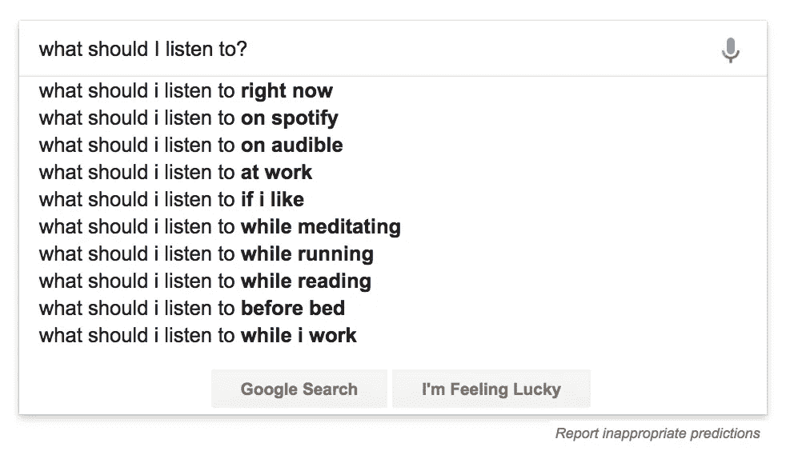

# 机器学习如何找到你的音乐

> 原文：<https://medium.com/hackernoon/how-machine-learning-finds-your-music-7ac9e8364f97>

## 亲爱的美丽的黑客午间读者，

**以下是顶级风险投资观点、秘密专栏、软件发展趋势、创业故事，以及为什么不是本周故事:**

💰💰

## 几个风险投资家对风险资本

[**钱背后的钱:做风投的 LP。**](https://hackernoon.com/the-money-behind-the-money-being-an-lp-in-venture-a4dea7db6617) 专访 Vintage Investment Partners 创始人艾伦·费尔德 via [Venture](https://medium.com/u/49e6e88d9e43?source=post_page-----7ac9e8364f97--------------------------------) 。

[**风投数学**](https://hackernoon.com/vc-math-2848971a34a0)**new gen Capital 的管理合伙人 [Homan Yuen](https://medium.com/u/c83b23204c12?source=post_page-----7ac9e8364f97--------------------------------) 。**

**🏛️🏛️🏛️🏛️🏛️🏛️**

## **加密列**

**[**加密货币资源列表(109+链接🔗)**](https://hackernoon.com/cryptocurrency-resources-list-109-links-e10aed48dfeb) 作者:CrptoHacker [亚历山大·伊索拉](https://medium.com/u/d049937fbdf6?source=post_page-----7ac9e8364f97--------------------------------)**

**最初的硬币发行:我们是在泡沫中吗？ 科技作家[安基特·库马尔](https://medium.com/u/df6cc92ec6ec?source=post_page-----7ac9e8364f97--------------------------------)**

**这个社区正在区块链放鱼🐟 由 Crypto 水族馆的[乔希·佩蒂](https://medium.com/u/98d0fc26f98e?source=post_page-----7ac9e8364f97--------------------------------)**

**[**代币购买者、代币持有者和代币使用者**](https://hackernoon.com/token-buyers-token-holders-and-token-users-40e7234c46bb) 由早期风投 [Ouriel Ohayon](https://medium.com/u/454d729d5955?source=post_page-----7ac9e8364f97--------------------------------)**

**[**ICO 行业为什么可怕，如何修复。**](https://hackernoon.com/why-the-ico-industry-is-terrible-and-how-to-fix-it-98888bdea9b2) 由 8760 创始人[沙迪·阿拉巴比迪·帕特森](https://medium.com/u/a2c445ed620f?source=post_page-----7ac9e8364f97--------------------------------)**

**👨‍💻👩‍💻👨‍💻👩‍💻👨‍💻👩‍💻**

## **软件发展趋势**

**[**设计基于角色的企业访问控制(RBAC)系统**](https://hackernoon.com/designing-an-enterprise-role-based-access-control-rbac-system-96e645c659b7) 由 Ten-X 的高级产品设计师[贾斯汀·贝克](https://medium.com/u/f713ef315ee8?source=post_page-----7ac9e8364f97--------------------------------)**

**[**我如何管理我的密码(技术版)**](https://hackernoon.com/how-i-manage-my-passwords-technical-version-8549dc1bde1e)Pinterest 的安全工程师，Theneeds 的联合创始人[伊曼纽·切塞纳](https://medium.com/u/b40459095e4e?source=post_page-----7ac9e8364f97--------------------------------)**

**[**有趣的 JavaScript 库诞生在中国**](https://hackernoon.com/interesting-javascript-libraries-born-in-china-d50d1bb81355) 由 App 制作者在[dash bounk](https://medium.com/u/9cc3c5352dbc?source=post_page-----7ac9e8364f97--------------------------------)**

**[**由**](https://hackernoon.com/introducing-mythril-a-framework-for-bug-hunting-on-the-ethereum-blockchain-9dc5588f82f6) **[Bernhard Mueller](https://medium.com/u/c9c016683f17?source=post_page-----7ac9e8364f97--------------------------------) 未经认证的软件安全专业人士介绍 Mythril:以太坊上的 bug 狩猎框架区块链****

**[**掌握与酒厂的药剂发布—软件制造商**](https://hackernoon.com/mastering-elixir-releases-with-distillery-a-pretty-complete-guide-497546f298bc) **[Philipp](https://medium.com/u/524783b33278?source=post_page-----7ac9e8364f97--------------------------------) 的(漂亮的)完全指南****

**[**哪些习惯让我成为了更好的软件工程师？**](https://hackernoon.com/what-habits-made-me-a-better-software-engineer-47e7d54b8fa) 由文艺复兴人[桑尼·雷西奥](https://medium.com/u/342def541d2e?source=post_page-----7ac9e8364f97--------------------------------)**

**📈 🙂 📈 🙃📈 😎**

## **来自创始人的一些创业建议**

**[**我从最成功的非科技创业者身上学到的 9 件事**](https://hackernoon.com/9-things-that-i-learnt-from-the-most-successful-non-tech-founders-9525efd27163)**Indiez 创始人 [Nitesh Agrawal](https://medium.com/u/520aadd1ce3c?source=post_page-----7ac9e8364f97--------------------------------)****

****[**开发者 SEO:登上谷歌首页而不被滥发**](https://hackernoon.com/seo-for-developers-reaching-the-front-page-of-google-without-being-spammy-78f581d538aa) 由开发者变身企业家[科里祖莪](https://medium.com/u/4b8e6ae70185?source=post_page-----7ac9e8364f97--------------------------------)****

****[**如何创建一个成功的推介平台:如何创建你的推介平台的幻灯片指南风投们想看什么**](https://hackernoon.com/how-to-make-a-winning-pitch-deck-slide-by-slide-guide-on-how-to-make-your-pitch-deck-what-vcs-want-6bb19c945916) 作者:InterimCMO 创始人 [Megan Groves](https://medium.com/u/d7fdeb3480fb?source=post_page-----7ac9e8364f97--------------------------------)****

****🔊****

## ****…&为什么不呢？？？****

****[**多重高潮理论**](https://hackernoon.com/the-multiple-orgasm-theory-76b9311dc2c2) 作者 Wishfie 联合创始人[阿克谢·普鲁西](https://medium.com/u/40e32fe2510b?source=post_page-----7ac9e8364f97--------------------------------)****

****🕛在我们再次相见之前，不要把这个世界的现实想当然。****

****亲切的问候，****

****[大卫·斯穆克](http://www.davidsmooke.net/)，[阿米](https://medium.com/u/1fedc8fffada?source=post_page-----7ac9e8364f97--------------------------------)****

******P.S.** *更多阅读尽在**[***最新***](http://hackernoon.com/latest)*[***趋势***](http://hackernoon.com/trending)**[***存档***](http://hackernoon.com/archive)********