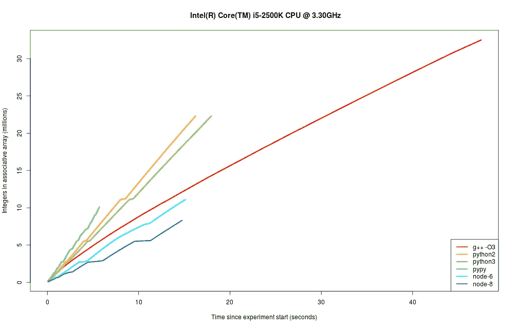

# 您的语言的地图数据结构中有多少个 53 位整数？

> 原文：<https://medium.com/hackernoon/how-many-53-bit-integers-fit-in-your-languages-map-data-structure-41605402b7de>

在许多应用程序中，生成唯一的用户标识符是一项常见的任务，通常被认为是理所当然的。生成用户标识符的一种简单、有效的方法是生成一个大随机数，让小概率的属性几乎保证每个生成的数字将不同于任何先前生成的标识符(参见: [UUIDv4](https://en.wikipedia.org/wiki/Universally_unique_identifier#Version_4_.28random.29) ，或[密码随机数](https://en.wikipedia.org/wiki/Cryptographic_nonce))。

假设随着用户基数的增加，你不想拿出铅笔、纸和大脑来计算碰撞概率。取而代之的是，你伸手去拿附近一个相对来说没有碎屑的键盘，并决定通过写一个模拟来娱乐自己。

程序很简单。它执行以下操作:

1.  创建一个 map / dict / object 数据结构作为关联数组。
2.  将全局冲突计数器设置为 0。
3.  生成一个随机的 53 位随机整数(为了允许与 Javascript 奇偶校验，Javascript 只允许 53 位整数)。
4.  检查这个数字是否存在于关联数组中。如果没有，将其添加到数组中。如果是，则增加全局冲突计数器。
5.  跳到第 3 步，直到程序由于达到 2 GB 内存限制而崩溃。

这显然是一个简单的程序，可以用多种方式编写(例如，通过使用每种语言的设置数据结构)。然而，这个微基准的目的是粗略地回答许多语言的以下问题:

1.  **在程序崩溃之前，我们可以在一个关联数组中填充多少个唯一的整数？**
2.  每种语言到达崩溃点需要多长时间？

当然，还要看看实际上遇到了多少碰撞。

竞争者如下。在查看结果之前，试着对每种语言的上述问题的答案进行猜测。

*   **C++** 编译支持 gcc 5.4.0 和 C++11
*   运行在 CPython 2.7.12 上的 Python 2
*   运行在 PyPy 5.1.2 上的 Python 2
*   运行在 CPython 3.5.2 上的 Python 3
*   **node.js 6** .11.3 (LTS 截至 2017 年 9 月)
*   **node.js 8** .4.0(最新截至 2017 年 9 月)

# 结果

下图显示了在程序达到 2 GB 内存限制或由于其他原因崩溃之前，放入关联数组的唯一整数的数量。

x 轴是程序启动以来的时间，y 轴是关联图中的整数个数，单位为百万。在这个图中，当程序崩溃时，线终止。较陡的线表示关联数组性能更快，因为在循环的每次迭代中都执行查找和插入。

Size of the associative array over time for a number of languages. Each series ends when the program crashed. Lines that reach higher y-values represent more memory-efficient languages, and the slope of each line represents the performance of data structures in each language.

*   自然， **C++实现了最好的内存性能**，在崩溃前在一个 std::map 中存储了超过**3250 万长整数**。然而，Python 在速度方面超过了它的性能，这可以从所有三个实现的更陡峭的线条中看出。对于习惯于将 C/C++作为性能黄金标准的人来说，这可能有些出乎意料，但这可以通过以下事实来解释:Python 使用[普通哈希映射](http://www.laurentluce.com/posts/python-dictionary-implementation/)作为其 dict 数据结构的实现，而 C++的映射使用[红黑树](https://stackoverflow.com/questions/5288320/why-is-stdmap-implemented-as-a-red-black-tree)。
*   在 Python 2 和 3 模式下运行 CPython 显示了非常相似的性能配置文件，在存储相同数量的项目时，Python 2 比 Python 3 快一点——大约 2230 万个整数。
*   Pypy 的性能在 Python 2 和 3 版本中都超过了 CPython，但是它的内存管理导致它在仅仅向 map 添加了**1000 万个整数**之后就崩溃了。
*   node.js 显示了最差的内存性能特征。其中，node (v6)的当前 LTS 版本比最新版本(v8)稍好一些。然而，这两者不仅是最慢的，也是最差的内存性能。节点 6 在一个对象中只存储了**1110 万个整数**，节点 8 的情况最差，有**830 万个整数**。

至于这次考察的初衷，所有语言的所有运行中的冲突总数正好是 **0。**

# 代码和原始结果

[Github](https://github.com/mayanklahiri/53bit-ids)

# 笔记

*   g++ 与 **-O3** 和 C++11 标准一起运行。
*   **消耗约 1.1 GB 内存后，节点 8.4.0 挂起而不崩溃**。尽管运行时使用了 **— max-old-space-size=2048** 命令行标志，情况仍然如此。如果不使用 ulimit 限制进程内存，内存消耗似乎会无限制地增加，尽管不会产生新的输出。使用**关闭涡轮风扇发动机——没有影响。使用 **— noconcurrent_sweeping** 禁用垃圾收集也没有影响。**
*   **节点 6.11.3** 的垃圾收集器将其崩溃栈跟踪打印到 stdout 而不是 stderr，这是非标准行为。