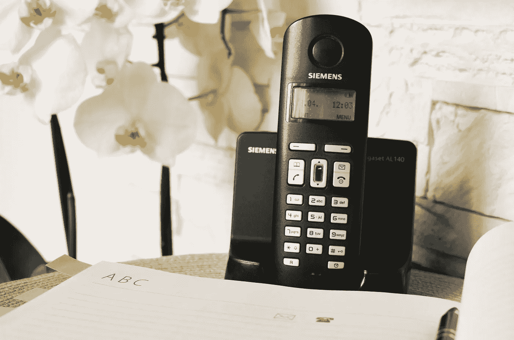
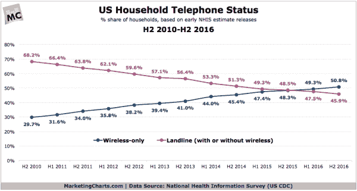
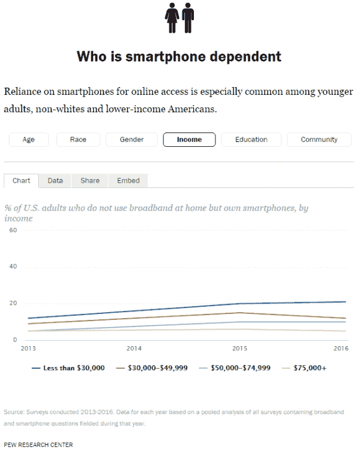
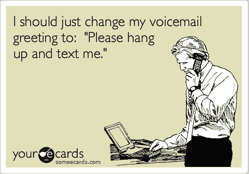

# 新的研究发现，45%的美国家庭仍然拥有固定电话

> 原文：<https://medium.com/hackernoon/how-many-people-still-use-a-landline-phone-in-2017-new-research-finds-4f2fe7387022>

感觉好像每个人都已经迁移到使用智能手机做任何事情。那么，2017 年还有多少人在用座机电话呢？

简短的回答是:比你想象的要多。或者，至少，事实证明使用固定电话的人比我们想象的要多。

我们假设越来越多的人选择扔掉固定电话，只用手机来省钱。

## 相关:[2017 年人们花在手机上的时间有多少？](https://www.textrequest.com/blog/how-much-time-people-spend-mobile-phones-2017/)

在某种程度上，*是*正在发生，但是新的研究告诉我们，*真的是*正在发生。

# 2017 年还有多少人在用座机电话？

> 50.8%的美国家庭是“只有无线的家庭”。

根据美国疾病控制中心国家健康信息调查 (NHIS)本月的[报告，截至 2016 年 12 月，45.9%的美国家庭仍在使用固定电话。](https://www.cdc.gov/nchs/data/nhis/earlyrelease/wireless201705.pdf)

这一数字自 2015 年 12 月以来下降了 2.6%，自 2010 年以来平均每年下降 3.7%。

PC: [MarketingCharts](http://www.marketingcharts.com/traditional/cell-only-households-now-the-majority-as-landline-owners-continue-to-recede-77051/)

大多数家庭——50.8%——现在只使用手机，尽管这个数字根据研究有所不同。

GfK MRI 在一月份的美国消费者调查中报告说，52%的美国家庭只使用手机。不管怎样，很明显越来越多的美国人正在放弃固定电话。

# 2017 年谁还在用座机？

> 收入和地理位置与拥有固定电话的关系和年龄一样大。

正如你可能想象的那样，年龄较大的人更有可能仍然使用固定电话。

NHIS 的一个特别有说服力的发现是，50.5%的被调查成年人(男性和女性，丈夫和妻子等。)住在“只有无线的家里。”然而，60.7%的儿童(18 岁以下)生活在“只有无线网络的家庭”

另一个有趣的发现是，61.7%的 18-24 岁成年人住在只有无线网络的家里，而 72.7%的 25-29 岁成年人和 71.0%的 30-34 岁成年人住在只有无线网络的家里。

这可以用更多的大学年龄的成年人和他们的父母住在一起来解释，尽管 NHIS 的报告没有证实这一点。

## 相关:[手机玛丽:千禧一代营销完全指南](https://www.textrequest.com/blog/mobile-mary-guide-millennial-buyer/)

年龄当然是拥有固定电话的一个因素，但收入和地理位置似乎也起着同样的作用。

根据 NHIS 的说法:

> “生活贫困(66.3%)和接近贫困(59.0%)的成年人比收入较高的成年人(48.5%)更有可能生活在只有无线电话(手机)的家庭中。”

这与[皮尤研究中心](http://www.pewinternet.org/fact-sheet/mobile/)的研究相一致，该研究显示低收入家庭更可能依赖智能手机作为他们唯一的互联网和电信来源。

这些群体不太可能购买捆绑服务，如互联网、卫星电视和电话。

PC: Pew Research Center

根据 GfK 的报告，美国东北部只有 39%的家庭只有无线网络，而中西部有 53%的家庭和南部有 57%的家庭只有无线网络。

GfK 与 Pew 建立了类似的联系。他们说，东北地区的家庭捆绑服务的比率更高，因此更有可能仍然使用固定电话。

# 企业呢？

很难找到商务座机使用的确切数字。

我们知道，老牌小企业坚持使用现有的固定电话服务是很常见的。音频质量更好，他们可以捆绑服务，并且他们已经支付了安装费(通常是固定电话服务中最昂贵的部分)。

我们还知道，新(额)企业通常会选择网络电话(VOIP)服务，而不是座机。这些更具成本效益，也更易于管理。

## 相关:[短信对商务沟通至关重要的 8 个理由](https://www.textrequest.com/blog/8-reasons-why-texting-is-crucial-to-business-communication/)

尽管如此，企业从固定电话转向网络电话服务还是很常见的。

所有这些情况都很常见，但不幸的是，我们没有美国用法的最新数据。我们知道，在全球范围内， [VOIP 服务](http://thevoipreport.com/article/cold-hard-voip-stats/)预计将在今年年底达到 10 亿用户，创造约 988 亿美元的[全球市场价值](http://www.newsmaker.com.au/news/234173/voip-services-market-by-2021-set-for-rapid-growth-to-reach-around-usd-140-billion#.WRobKYjyuuV)。

# 您应该如何处理这些信息？

> 如果你不能把研究应用到任何事情上，那研究有什么用？

这些数字应该有助于您的业务决策，并塑造您对我们技术前景的看法。今天的人们更喜欢移动性和省钱，所以他们选择可以在任何地方使用的较便宜的服务。

总的来说，我们的文化正在发生变化。家庭座机更多是由筹款人而不是朋友和家人打来的。如此多的人在不同的地方工作，固定电话可能不切实际。

然而，在 2017 年，许多人仍然使用固定电话！超过 45%的美国家庭拥有固定电话，尽管这个数字呈下降趋势。

这标志着我们沟通方式的转变，尽管可能没有一些主要媒体让你相信的那么大。我们正在改变，但还没有完全迁移。

 [## 文本请求-小型企业论坛

### 阅读小企业论坛中的文字请求。使用我们易于使用的……

smallbusinessforum.co](https://smallbusinessforum.co/@Text_Request) 

> [黑客中午](http://bit.ly/Hackernoon)是黑客如何开始他们的下午。我们是 [@AMI](http://bit.ly/atAMIatAMI) 家庭的一员。我们现在[接受投稿](http://bit.ly/hackernoonsubmission)，并乐意[讨论广告&赞助](mailto:partners@amipublications.com)机会。
> 
> 如果你喜欢这个故事，我们推荐你阅读我们的[最新科技故事](http://bit.ly/hackernoonlatestt)和[趋势科技故事](https://hackernoon.com/trending)。直到下一次，不要把世界的现实想当然！

