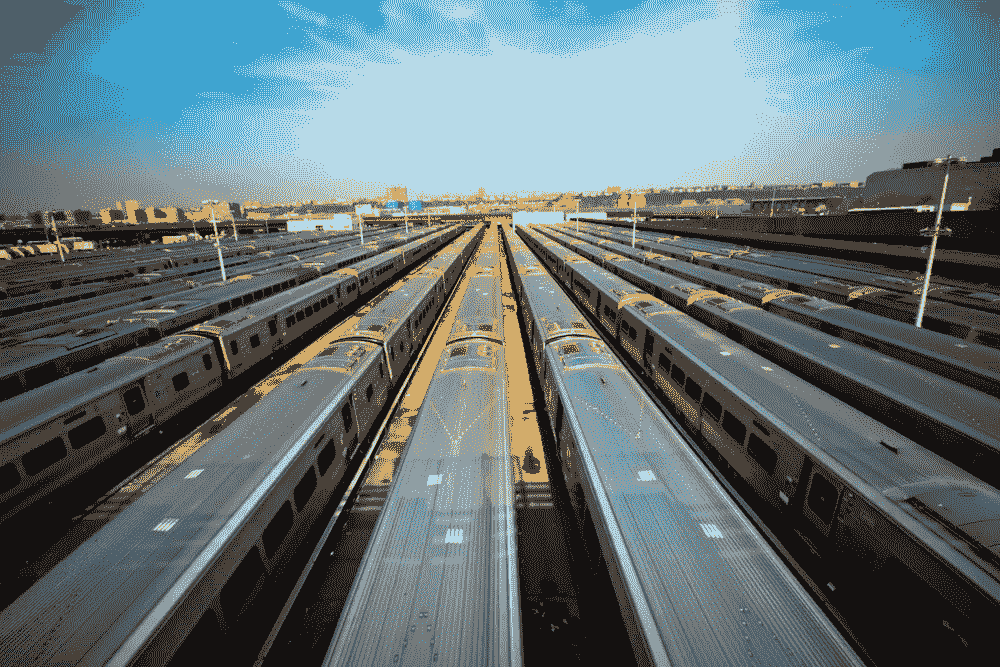
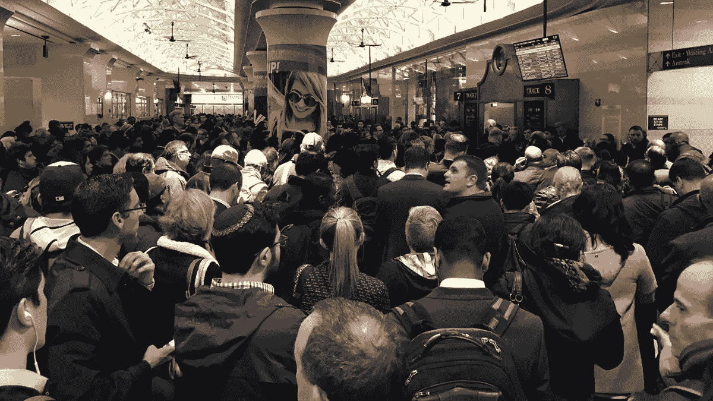
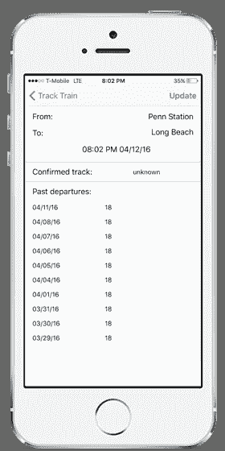

# MTA 如何关闭我为宾州车站通勤者开发的应用程序

> 原文：<https://medium.com/hackernoon/how-mta-shut-down-my-app-for-penn-station-commuters-39e1cf69395f>

## 这是我的第一个 iPhone 应用程序的故事——从想法，到规划，到执行，发布，最初的成功和(剧透警告！)因为纽约市的 MTA 而不得不关闭它。最后一部分很痛苦，但总的来说这是一次很棒的经历，我学到了很多很酷的东西。

# 背景

当我搬到长岛时，我开始通过长岛铁路(LIRR)通勤到曼哈顿的[宾州车站](https://hackernoon.com/tagged/penn-station)。对于那些从来没有使用过它的人来说，宾州车站是巨大的，拥挤的，令人无法抗拒的。有三种火车系统——美国国家铁路客运公司、长岛铁路和新泽西运输。麦迪逊广场花园(Madison Square Garden)——世界上最著名的竞技场——坐落在佩恩车站(Penn Station)的顶部(有一些出口直接通往场地)，那里有许多商店、酒吧、餐馆和其他设施。每天有 65 万人通过宾州车站——比纽约所有的机场(JFK、[、拉瓜迪亚](https://hackernoon.com/tagged/laguardia)和纽瓦克)加起来还要繁忙。

There are 1200 trains per day at Penn Station

在 LIRR、新泽西和美国国家铁路客运公司之间，每天有 1200 列火车，[有 21 条共享轨道](http://www.nj.com/news/index.ssf/2013/11/how_to_squeeze_1200_trains_a_day_into_americas_busiest_transit_hub.html)。由于许多原因，直到最后一刻才知道你的火车将从哪条轨道离开。为了解决这个问题，在宾州车站 LIRR 区的中间有一个巨大的显示屏。任何时候都有成千上万的人站在它下面。显示屏显示列车时刻表，但没有车次。你站在那里盯着它看了一段时间，直到火车离开前十分钟，轨道号终于显示出来——你现在知道去哪里回家了。不幸的是，其他人也是如此——在同一时间。

任何一列火车的轨道号一公布，一大群人就开始沿着轨道奔向(一个非常狭窄的)楼梯。如果你等到人群过去之后——因为火车过于拥挤——就只有站立的空间了(这只适用于高峰火车。如果你乘凌晨 3 点的火车去萨福克郡，那里几乎是空的。

# 想法

几天后，我意识到这个系统效率低下，并开始寻找改进的方法。有没有办法提前知道轨道号？LIRR 官方应用程序和网站在巨大显示屏的同时发布了这条消息——在出发时间前几分钟(从那以后，网站已经完全停止发布这条消息，可能是因为我的应用程序)——继续读下去。)似乎没有其他选择，只能和大家一起等待揭晓。

然而，几周后，我开始注意到某些模式。看起来每天在高峰时间，火车都从几乎相同的轨道离开。为了测试我的理论，我决定记录我乘坐的不同列车的轨道号。事实证明，它基本上是正确的——虽然非高峰时段的轨道数量变化很大，但在高峰时段，每天 95%的时间都是相同的轨道。我开始在官方显示的时间之前下到轨道上，并立即意识到这有多好——我将是第一批登上火车的人之一，可以选择任何座位，并避免焦虑(不用说，我总是给老人、病人或孕妇让座，每个人都应该这样做。)

Peak hours at Penn Station

我开始寻找与他人分享我的知识的方法，并产生了创建一个移动应用程序的想法。你会到达宾州车站，打开应用程序，看看他们的火车将从哪条轨道离开，成为第一批前往轨道的人之一，并获得一个好座位。

这个想法看起来很简单，但是弄清楚它的确切工作方式被证明是一个挑战。我显然需要每天保存列车数据，但是下一步呢？我想过创建一个公式来确定可能的曲目数量，但决定不这么做——计算很快变得复杂，如果应用程序出现几次错误，用户就会失去信任。相反，我决定简单地显示最近几天的曲目数量，并让用户得出自己的结论。如果他们看到火车总是从同一条轨道离开，他们会意识到今天它也可能从同一条轨道离开——在实践中，几乎总是这样。事实证明，这一决定对该应用的初期成功至关重要。

# 技术

我花了一些时间思考技术选择。该架构由三个组件组成:

*   **数据服务** —从 LIRR 获取数据并将其存储在数据库中
*   **手机应用** — iPhone，Android 计划稍后发布)
*   **服务器—** 通过 API 向应用程序发送数据

对于后端，我考虑过使用一种性感的新技术，比如 Node.js/MongoDB,，这是我非常想学的(从那以后我也确实学了)，但是我决定不这么做。因为这不是一个一次性的项目，我需要使用我熟悉的技术。出于这个原因，我选择了一个绝对不性感的堆栈——PHP/PostgreSQL。我对这个选择非常满意，因为一切都“正常工作”，而且我发现了许多有用的库，它们帮助我节省了时间。

对于移动组件，我探索了“原生包装器中的 JavaScript”技术，如 Phonegap/SenchaTouch。然而——经过一番探索，我决定反对它，因为没有任何东西像它应该的那样工作。最后我雇了一个自由职业开发者实现了一个原生的 iOS (Swift) app，效果非常好*(如果你没有管理自由职业者的经验，我不推荐这个。在我过去的生活中，我经营着一家软件开发机构，所以我非常熟悉寻找和审查优秀自由职业者的过程。如果你从来没有做过，这并不容易，而且有很大的风险会有不好的经历。)*

# 数据

首先，我需要看看是否有可能从 MTA 获得这些数据。一个 API 会很棒，但是他们没有。获得赛道信息的唯一方法是从他们的网站上抓取。抓取本身很容易——曲目编号出现在一个非常容易预测的标签中。然而，安全地获取数据(不被 MTA 封锁，也不被请求轰炸而导致服务器瘫痪)是一个挑战。

为了不被阻塞，我需要使它难以识别来自我的脚本的请求。这意味着以下任何一个都可能是一个警示信号:

*   来自同一个 IP 地址的重复呼叫
*   在相同的时间间隔内调用相同的 URL
*   来自同一 web 浏览器的呼叫(用户代理)

逛这些地方很有趣。以下是我最后做的事情:

*   我注册了[私人互联网接入](https://www.privateinternetaccess.com/) VPN 服务，该服务使用自动更新的代理列表为每个呼叫随机分配服务器的 IP 地址。
*   我将访问时间随机化，在不同的时间间隔提取数据
*   对于每个请求，我会从网上找到的列表中随机选择一个不同的用户代理(找不到我原来使用的那个，但是[这个](https://github.com/joecampo/random-user-agent)看起来是个不错的选择)

经过几周的夜以继日的编码，这个应用开始变得好看了。然而，事情变得越来越复杂——MTA 似乎出人意料地发布了一个官方 API！一方面，我对这些消息感到非常高兴——我可以干净地获得数据，而不用刮擦。另一方面，我花了很大的力气让抓取代码完美工作。最后，我并没有太在意——尽管我的抓取代码会被闲置，但学习并让它工作是很有趣的(有一天这些知识可能会被证明是有用的)。我申请了一个 API 密匙，几周后就收到了。

# 释放；排放；发布

尽管我不得不重写后端以利用官方 API，但应用程序很快就完成了。我决定让它看起来尽可能简洁——用户可以打开应用程序，选择他们需要的火车，并立即看到这列火车在过去 10 天里离开的轨道号。

It’s fairly obvious what track the train is about to leave from

在确定了一个价格点(1 美元)后，我将应用程序命名为“轨道列车”，提交给应用程序商店，然后它就开始运行了！尽管零营销，这款应用还是获得了销量和好评。人们会写信给我，说他们等这样的应用程序等了多久。很快，它就成为了 app store 中 LIRR 相关关键词的热门搜索结果之一。其他开发人员开始询问他们是否可以使用我的 API 在其他平台上实现相同的应用。尽管这些钱几乎不够支付成本，但我很高兴我做了一些人们真正想要的东西，并开始计划更多的功能和扩展到其他车站(布鲁克林的大西洋码头也有同样的问题)。

# 关机

唉，这不是命中注定的。发布后仅仅几个月，我就收到了一封来自 MTA 的电子邮件，称我使用了“错误的 API”。尽管我从 MTA 那里得到了一个官方的使用令牌，但这个 API 是用于“为 MTA 应用程序托管数据，而不是供第三方使用”。我研究了一下新的 API，发现它没有最重要的特性——火车的轨道号！是的，我的整个应用都是建立在☹的基础上的

我不会不战而降，所以我开始了向 MTA 求情的运动。我联系了不同级别的人，要求给新的 API 添加所需的功能，试图让他们相信人们依赖我的应用程序，但这一切都是徒劳的。像 MTA 这样庞大的官僚机构不可能为我或任何人破例，所以我无法从官方渠道获得我需要的数据。他们也停止在网站上发布曲目编号——所以回去刮也不是一个选项。

在度过了几乎一年的夜晚和周末之后，并且在推出后仅几个月，我别无选择，只能关闭该应用程序。我对那些在日常通勤中依赖它的人感到非常失望，并向每个购买该应用的人提供退款。

# 课程

尽管这个项目不幸结束，但我对它的进展并不感到太糟。

以下是我一路走来学到的一些经验:

*   如果你的应用程序依赖于像 MTA 这样一个大而不灵活的组织来获得成功，那你的日子就不好过了。当 MTA 改变主意让数据可用时，我没有切实可行的方法来获取数据，所以你必须确保有一个备份计划。
*   对于您打算启动的项目，使用您熟悉的成熟稳定的技术是最有意义的。我对自己使用 PHP 和 PostgreSQL 的决定非常满意——如果我使用 Node 的话。JS 和 MongoDB，这个过程可能要花三倍的时间。
*   首先构建给用户带来价值的最简单的版本是有意义的。建立某种机器学习预测机制会大大推迟项目，我怀疑我会保持兴趣并出货。
*   在最初阶段征求用户的反馈——我一有想法，就和我认识的所有 LIRR 通勤者讨论，他们都说这是他们会使用并付钱购买的东西。当我有模型的时候，我会再给他们看一次，当我做了一个最早的原型的时候，我会再给他们看一次，并且总是得到有用的反馈。

总的来说，虽然我为不得不关闭它感到难过，但我很高兴我制作了 TrackTrain。这是我的第一个 iPhone 应用程序，我很自豪地完成了项目和运输。我学到了很多有价值的东西，并且做得很开心。我为所有在通勤中依赖该应用的人感到难过，但希望很快会出现更好的解决方案。

总有一天，我会计划从我的应用程序中公开历史轨迹数据——我相信可以推断出一些有趣的结论。我希望有一天 MTA 和类似的交通组织意识到，如果他们想吸引人们使用他们的平台，他们需要对第三方开发者更加友好。对我来说，此后不久我加入了一家令人惊叹的初创公司，该公司开发软件来帮助警察更有效地工作，我非常高兴。