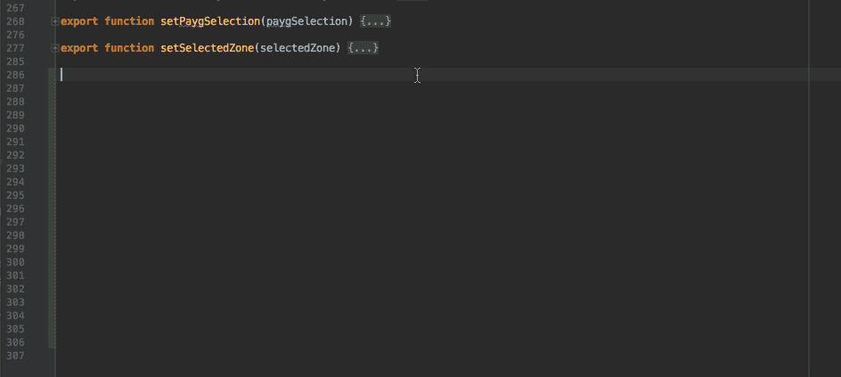
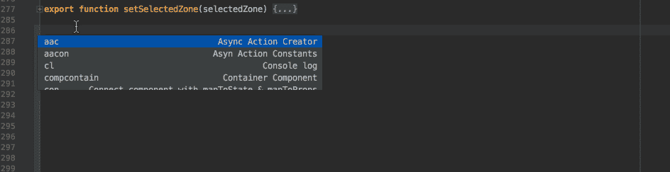

# 我们应该努力生成多少代码？

> 原文：<https://medium.com/hackernoon/how-much-code-should-we-be-striving-to-generate-c4ac6b8f341>

Redux would be impossibly annoying without IntelliJ snippets

**“小子，如果我是一个**[**JavaScript**](https://hackernoon.com/tagged/javascript)**[**工程师**](https://hackernoon.com/tagged/engineer) **，我就不会写代码，我只会整天写代码的生成器……”****

**一个 devops 的家伙说…我的工作保护激怒了罗斯-“这个家伙显然不知道写 FE 代码有多难！”，我想——尖叫着。但是后来我退一步想，我能生成多少代码？此后几个月，这件事一直萦绕在我的脑海里…**

***所以我决定研究一下* ***我能生成多少代码来代替编写？*****

**下面是我想出来的(并且做出来的！):**

****代码生成类型:**(根据我)**

1.  ***代码片段生成器***
2.  ***子项目发电机***
3.  ***全项目发电机***

**—**

# ****代码片段生成器****

**几乎在每个 IDE 中都可以找到的代码片段生成器是插入小块代码的方法。以下是我在工作中使用的一些:**

****

**片段非常有用，尤其是如果你学会如何快速制作和利用它们。它们真的加快了你的开发时间。**

# ****子项目发电机****

**下一个类别是**子项目生成器**，它比 snippets 更上一层楼，因为它们通常采用大型配置，可以生成在现有项目中使用的独立代码段。**

**我找到的例子:[https://formbuilder.online/](https://formbuilder.online/)——一个 JQuery 表单生成器**

**没有很多独立的“子项目”生成器，因为大多数都被放在下一个类别中…**

**—**

# **全项目发电机**

**这些负责为你生成一个完整的项目。**

**[http://yeoman.io/](http://yeoman.io/)——它实际上会生成一个完整的项目，然后经常给你组件生成器，比如角度控制器等等。**

**https://jasonette.com/[——一种将 JSON 对象转换成完整原生应用的可爱方式。](https://jasonette.com/)**

**这些对于“开始”来说很棒……但是其他任何东西都开始感到压抑(比如 JSONette)。**

**—**

# **我生成代码的尝试:一个“子项目 Selenium 生成器”**

**在做了所有这些研究之后，我得出了一个结论:**只有当代码生成非常重复或者你需要帮助的时候，才尝试代码生成。****

**因此，在二月份，在一系列新功能登陆我们的初创公司仪表板后，我再次重写了我的 Selenium 代码。我意识到这些东西是重复的…点击元素，检查它是否存在，诸如此类…**

**我写了一个名为 [Snaptest](https://www.snaptest.io) **的 chrome 扩展工具，它输出一个 Selenium 测试文件夹。**然后，该文件夹被添加到您现有的测试配置/设置中，并且可以更容易地在工具中维护和运行。**

**完成这种代码生成后，我节省了大量的时间。因此，一个愚蠢的短语:**“好家伙，如果我是一个 javascript 工程师，我不会写代码，我只会整天写代码生成器……”**实际上真的很有帮助！**