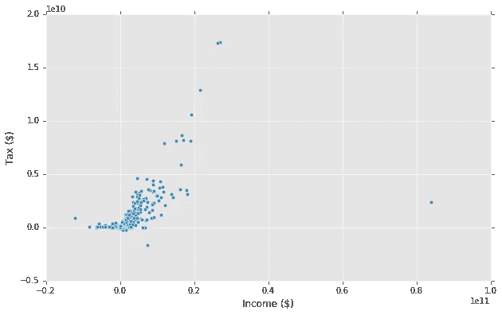
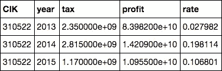
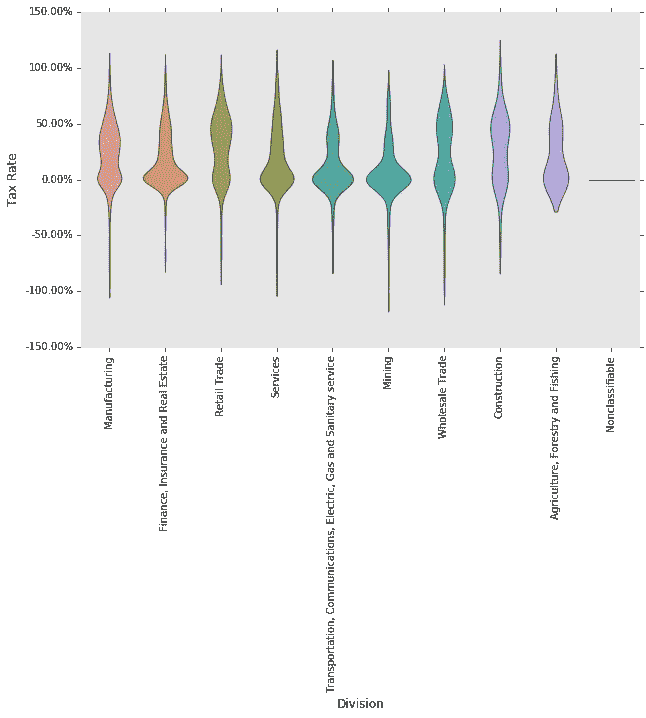
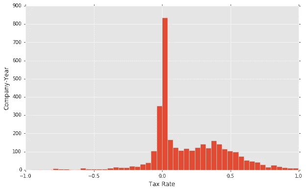

# 公司交多少税？

> 原文：<https://medium.com/hackernoon/how-much-do-corporates-pay-in-taxes-a39d77e0bb76>

我查看了上市公司缴纳的税款，它们通常在 10-k 文件中的“已缴纳所得税”项下报告。加上报告的收入(“利润/损失”)，我希望根据最近的事件发现一些有趣的东西，如税收改革和[“天堂文件”](https://en.wikipedia.org/wiki/Paradise_Papers)。

该数据集涵盖了 2011 年至 2016 年超过 8500 家公开交易公司的申报文件，其中 1344 家完成了收入和纳税申报。图表中的每个点代表一个公司年度。请注意，这些公司并不都是美国公司，税收方案可能会因国内/国外收入等而异。

为了简单起见，让我们假设这些只是联邦税。这看起来像一个 [ReLu](https://en.wikipedia.org/wiki/Rectifier_(neural_networks)) 函数，应该是这样的——因为这些往往是相当大的公司(18，333，333 美元及以上),所以 35%适用于其中的大多数。当然，亏损的公司通常不纳税。

不过，这里有一个例外，那就是 2013 年的联邦国民抵押贷款协会房利美。我不太明白为什么房利美支付了异常低的税，甚至在他们再次盈利的几年后。可能是一些非常复杂的东西，但这里有[一些更详细的](https://www.housingwire.com/articles/26045-fannie-mae-starts-paying-income-tax-again)给那些感兴趣的人。

接下来，我们来看看各行业的税率:

我很惊讶他们之间有明显的区别。出于某种原因，制造业和零售业实际上比其他行业更符合 35%的基线。总体税率分布如下所示:

