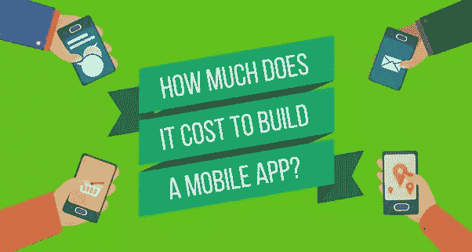
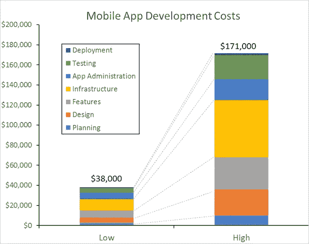

# 做一个手机 app 要多少钱？

> 原文：<https://medium.com/hackernoon/how-much-does-it-cost-to-build-a-mobile-app-5d768fe2aa3e>

# 为什么您的企业需要移动应用程序？

如果你的企业有一个移动响应网站，你已经领先于 91%的其他人。但是，如果你增加一个移动应用，你可以成倍地增加你对最接近的竞争对手的领先优势。

以下是为您的企业提供移动应用的一些优势:

1.  **提高可访问性**

今天的移动市场在应用上花费了大约 200 分钟。移动应用程序使他们更容易访问您的业务，而无需切换设备。

**2。提高客户参与度**

便利性和易用性是确保客户体验的重要品质。移动应用程序还允许您的客户与您实时联系和互动。这有助于培养信任和更牢固的关系。

**3。提高品牌认知度**

将你的品牌放在智能手机或平板电脑的界面上会提高品牌认知度。想想人们在移动设备上花了多少时间。此外，据估计，2017 年将有 2680 亿次应用程序下载。此外，68%的消费者表示他们确实在使用他们下载的应用程序。

**4。改进价值主张**

您可以使用手机应用程序为您的客户提供折扣、有用信息和支持。

**5。呈现另一种销售途径**

移动应用程序的便利性和可访问性将鼓励您的客户与您的企业进行交易。

人们 89%的时间都在使用手机应用程序，而不是手机网站。据 ISBX 的 Arthur Iinuma 称，“移动应用程序往往会获得更合格和更投入的受众。因此，与电子商务网站相比，销售转换率更高。”

# 影响移动应用构建成本的三个主要因素是:

1.功能
2。目标用户/设备
3。时间表

*   **功能**

1.  (你希望 app 做什么)是决定成本最重要的因素。一个只做简单事情(比如创建待办事项)的应用程序和一个全功能的互动应用程序(比如新的)有很大的区别
2.  [星球大战](https://itunes.apple.com/app/star-wars/id960108075?mt=8&ign-mpt=uo%3D8) app。从历史上看，那些能很好地执行一两个功能的应用程序(如[【优步】](https://www.uber.com/features)或[与朋友的对话](https://zynga.com/games/words-friends))比那些塞满了额外的、有时是不必要的功能的应用程序更成功。尽管应用程序开发人员在交付具有更广泛功能的应用程序时，在可用性方面越来越有效率。我仍然认为开发一个应用程序来很好地完成一两个特定的任务是最好的方法。这将最终降低开发的总体成本。这里的要点是，你希望应用程序做的事情越多，它的成本就越高。

*   **目标用户/设备**

1.  (你希望谁使用你的应用程序)可以极大地影响开发移动应用程序的成本。最大也是最常争论的问题是，你应该建立一个本地应用程序还是一个移动网络应用程序。作为参考，一个
2.  [原生应用](http://www.seguetech.com/blog/2013/04/09/native-vs-html-applications-best-approach)是专门为某个移动操作系统(如 [iOS](http://www.seguetech.com/services/mobile/ios-development) 或 [Android](http://www.seguetech.com/services/mobile/android-development) )开发并直接安装在设备上的应用，而移动网络应用则是不特定于操作系统并在设备的网络浏览器上运行的应用。本文的重点不是讨论这两种选择的利弊。在这里，我们将解释选择一个选项会如何影响项目的总成本。例如，假设您想要开发一个临床移动应用程序来帮助医生进行查房，并且您知道他们都将使用医院发放的 iPhones。
3.  在这种情况下，为 iOS(苹果)设备开发一个本地应用程序似乎是一个非常合理的解决方案，对吗？然而，以同样的场景为例，要求支持 Android、Windows Mobile 和 Blackberry 设备会使它变得复杂。如果你想为每一个需要的平台开发一个本地应用，那么最终你会花费 4 倍于开发一个移动网络应用的成本。这是因为每个移动操作系统的代码开发本质上是一项独立的工作，通常需要不同的编程语言和环境。因此，正如你所看到的，一种尺寸并不总是适合所有的移动设备，你的目标受众的选择在成本上很重要。

*   **时间线**

1.  决定移动应用项目成本的另一个关键因素是你何时需要它。将项目控制在预算之内并避免成本超支的最好方法是制定一个合理的时间表(让客户参与整个过程)。对项目交付抱有不切实际的期望会导致不必要的赶工费用，也会影响成本。
2.  例如，假设你的公司想开发一个应用程序来控制火星探测器，而你想在下周得到它。你认为紧急交货会影响成本吗？你打赌它是。虽然有些开发任务根本不能抢着拿。无论需要多长时间，要求快速周转时间肯定会对成本产生影响。

# 开发应用程序的过程

应用程序的开发包括四个阶段:

1.  **开发创意:**一旦你确定了你的企业需要的应用类型，就该把注意力转移到开发创意背后的概念上了。
2.  **功能布局**:这个阶段慢慢把你的想法变成更实在的概念。您的软件开发人员或架构师将展示线框来展示应用程序将如何运行。你可以就如何让这款应用更适合你的市场发表意见。
3.  设计:这个阶段包括后端和前端开发阶段。它涉及用户管理、服务器端逻辑、用户体验定制、数据集成、数据缓存、数据同步、UI 设计和开发以及各种测试计划。
4.  **上线:**一旦你的软件开发团队确认一切就绪，你就可以准备上线了。

# 这要花多少钱？

来源:[http://clutch.co](http://clutch.co/)

没有一家专业开发公司能马上给你准确的项目成本。在线价格计算器只不过是营销诱饵。甚至最初的每小时费用也是可以协商的，比如，不会告诉你 iphone 应用程序开发的价格。

在谈判阶段，我们首先根据开发一个移动应用程序所需的计划时间，给客户一个粗略的估计。根据想法实现和嵌入式功能的复杂程度，我们将所有开发的应用程序分为四类——简单、中等复杂、高度复杂和创新。基于每小时 40 美元的平均费用，根据项目类别，项目开发的粗略估计如下:

# 简单的应用

*   简单的应用程序通常包括一些基本的功能、基本的集成 API、简单的 UI/UX、项目列表以及简单的搜索。
*   开发时间长达两个月，
*   界面设计——长达 80 小时，
*   开发(移动和后端/BaaS) —长达 500 小时，
*   25%预留给项目管理(PM)和测试(QA)共同使用。
*   开发一个应用程序的平均成本约为 25000-35000 美元。

# 中等复杂度的应用

*   中等复杂程度的应用程序包括更多高级功能，如自定义 UI/UX 元素、平板电脑支持、支付服务集成、社交媒体集成以及地图搜索等。这些功能通常会增加开发应用程序的成本。
*   开发时间表—2-5 个月
*   界面设计——长达 160 小时，
*   开发(移动和后端/BaaS) —长达 900 小时，
*   25%留给 PM 和 QA 一起用。
*   开发一个应用程序的平均成本约为 45000-55000 美元。

# 高复杂性应用

*   高复杂性应用包括最先进的功能，如音频/视频处理、实时同步、自定义动画、与第三方服务的集成、具有多种类型数据库的复杂后端、离线数据缓存等。
*   开发时间表—2-5 个月
*   界面设计——长达 160 小时，
*   开发(移动和后端/BaaS) —超过 1000 小时
*   25%留给 PM 和 QA 一起用。
*   开发一个应用程序的平均成本在 55000 美元到 100000 美元之间。
*   MyOCard——基于网络的商业应用(12 个月，9 人)和 AppleTV 应用——快速视频搜索/导航应用(4 个月，8 人)

# 创新应用

*   除了高度复杂的功能外，创新应用还包括高科技组件和新颖元素。
*   开发时间框架—6-12 个月
*   界面设计——超过 160 小时，
*   开发(移动和后端/BaaS) —超过 1000 小时，
*   其中大约 25%是留给 PM 和 QA 的。
*   开发一个应用程序的平均成本约为 5 万至 10 万美元。

# 参考资料:

[https://erminesoft . com/开发一个移动应用程序需要多少成本/](https://erminesoft.com/how-much-does-it-cost-to-develop-a-mobile-app/)

[http://www . seguetech . com/how-mud-cost-build-mobile-app/](http://www.seguetech.com/how-much-does-cost-build-mobile-app/)

【https://www.entrepreneur.com/article/288027 

# 雇佣移动应用开发者

你可以在[http://ontoborn.com](http://ontoborn.com/)按小时、周或月雇佣移动应用开发者

> [黑客中午](http://bit.ly/Hackernoon)是黑客如何开始他们的下午。我们是 [@AMI](http://bit.ly/atAMIatAMI) 家庭的一员。我们现在[接受投稿](http://bit.ly/hackernoonsubmission)，并乐意[讨论广告&赞助](mailto:partners@amipublications.com)机会。
> 
> 如果你喜欢这个故事，我们推荐你阅读我们的[最新科技故事](http://bit.ly/hackernoonlatestt)和[趋势科技故事](https://hackernoon.com/trending)。直到下一次，不要把世界的现实想当然！

