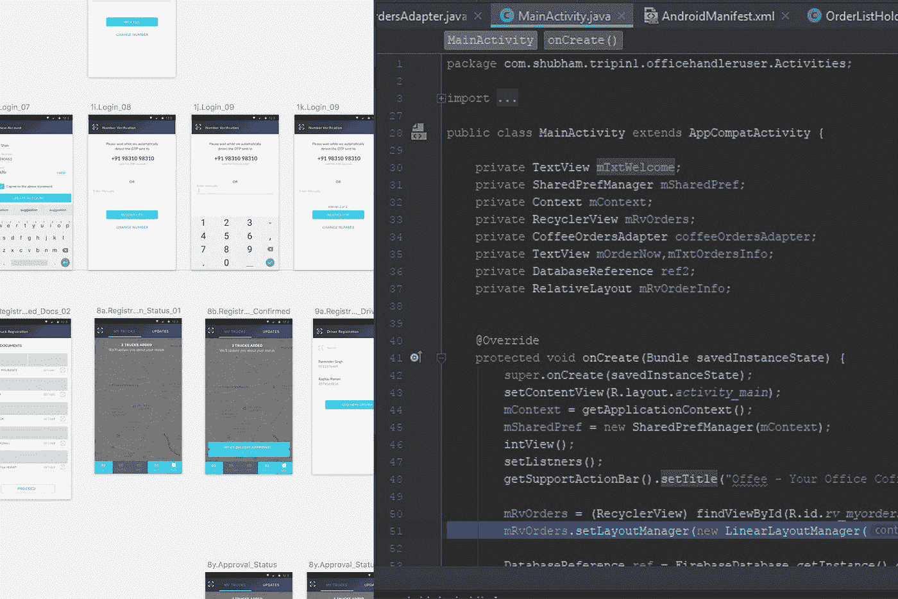

# 开发一个 app 要多少钱？

> 原文：<https://medium.com/hackernoon/how-much-does-it-cost-to-develop-an-app-52b154909d37>

你有一个价值百万美元的应用程序的想法。或者你有一个价值数百万美元的业务，并希望通过应用程序提供更高层次的消费者体验。

你知道，在你把这个想法推向市场之前，你需要以合适的价格找到一个好的开发伙伴。

app stores 上有数不清的应用程序不必要的复杂，使用起来令人沮丧，由业余爱好者创建，或者只是简单的坏掉。就真正的努力而言，这些应用程序可能需要几周时间，或者在最高端，需要几个月的时间来构建。

然后，还有让你惊叹的应用程序。这些是你每天使用的应用程序。他们让你的生活更美好。他们速度很快。它们很漂亮。它们是直觉的。它们不会崩溃，而且基本上没有 bug。它们是伟大应用的定义。

*让我们直截了当* —客户总是想知道制作一个应用程序要花多少钱。相对较低的价格和高质量是每个人都在寻找的，无论你是来自英国、美国、印度还是乌克兰。我们非常清楚这一点，因为我们为创业公司开发 iOS 和 Android 应用程序。

app 开发要花多少钱？定价是如何决定的？所涉及的成本和工作量的明细是什么？

不用说，[手机 app 开发](http://tripin.co.in)成本千差万别。然而，让我们试着弄清楚你可能期望为你的新 iPhone、iPad 或 Android 应用程序付出多少，以及这些钱实际上是用来做什么的。

# 什么影响了应用程序开发的成本？

应用程序开发主要分为两个部分:

## 设计体验和界面

*   **信息分析** —用户研究、市场调查、利益相关者访谈和竞争分析。识别和创建用例、行为场景，以及收集用户故事。耗时:15 至 30 小时
*   **市场调查** — 50 小时，取决于对行业及其术语的熟悉程度，然后了解产品，以及竞争对手分析
*   **利益相关者访谈** — 90 小时，用于寻找利益相关者、准备问题、进行访谈并确保所有问题都得到回答。
*   **使用案例** — 25 个小时，取决于设计的受众的多样性以及他们需要为解决方案重叠多少。
*   **原型** —可用性测试、概念验证和 UX 设计
    耗时 200 小时，收集灵感、构思、概念化、挑选、版本化、
    设计开发信息架构、用户流、特性、线框和线流，然后构建一个可测试的原型，耗时 200 小时

UI Design of Tripin’s Shipper Application

*   **视觉设计(UI 和 UX 设计)** —应用程序的完整外观。
    用户界面设计意味着产品看起来如何，而 UX 设计意味着它创造的感觉如何。UI 设计包括应用程序的颜色、按钮、形状、字体、框架和导航风格等。，而 UX 设计是用户在应用程序的每个动作结束时的感受。
    耗时—平均 80 至 280 小时

根据功能的复杂性和设计的复杂性，设计成本可能会有所不同。一个有 0-2 年经验的设计师一个小时的花费大约是 15-45 美元。一个有 2-5 年经验的设计师可以每小时收费 45-90 美元，当然[折扣](http://kupanzone.com/store/amazon-coupons/)是允许的，设计公司可以根据他们在印度的专业知识收费。

## 应用程序的开发

编写一个应用程序需要多长时间？虽然这个问题不像“要舔多少次才能舔到棒棒糖的中心？”(剧透警告:3481)，它是我们的[移动应用开发者](http://tripin.co.in)社区非常珍视的一个。

开发因包含的功能数量、动画细节、应用速度等而异。

## 应用程序的功能包括:

*   **用户和账户登录媒介** —脸书登录、谷歌登录、邮箱登录。
    耗时— 18 小时，每次 6 小时
*   **用户生成的内容** —用户档案、评级、搜索功能、媒体上传。
    耗时— 24 小时
*   **移动特定功能** —云同步、设备传感器、条形码&二维码、
    耗时— 40 小时
*   **日期和位置** —日历、位置访问、预订
    花费时间— 12 小时

Development of Tripin’s Shipper Application

*   **社交活动** —信息传递、论坛和评论、社交分享、推送通知
    耗时 32 小时
*   **计费和电子商务** —购物车、支付网关、应用内购买
    耗时— 40 小时
*   **管理、反馈&分析** —使用分析、客户支持、数据管理
    所需时间— 32 小时
*   **外部 API 集成** —第三方集成、短信、电话号码屏蔽
    耗时 18 小时
*   **安全性** — OTP 管理
    所用时间— 8 小时

上述所有功能加起来等于 224 小时，相当于 1-2 个月。

现在，开发人员的成本取决于他们的编码原则和编码语言。在印度，有 0-2 年经验的开发人员每小时收费 20-35 美元，有 2-5 年经验的开发人员每小时收费 35-80 美元。

这是对应用程序开发中无数因素的粗略概述。但是你现在对真正的应用程序开发成本有所了解，并且知道要小心那些不考虑复杂的设计和开发过程的简单的应用程序成本计算器。

如果你准备好采取下一步开发你的应用程序，我们的团队正在等待聊天。Tripin 的一位产品策略师已经准备好讨论您项目的独特需求——使用[联系表](https://tripin.co.in)打招呼。

参考资料:

[https://fugenx.com/how-much-does-it-cost-to-design-an-app/](https://fugenx.com/how-much-does-it-cost-to-design-an-app/) https://fueled . com/blog/how-it-Dow-it-cost-to-develop-a-app/