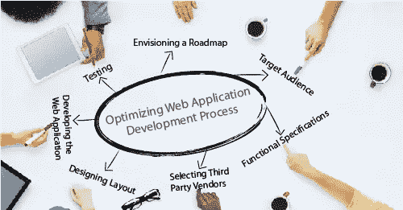

# 开发一个 Web 应用要花多少钱？

> 原文：<https://medium.com/hackernoon/how-much-does-it-cost-to-develop-an-web-application-8ac36d97a653>

$14,768 !！开个玩笑:任何人都会期待一个数字！正确答案是“视情况而定”..有几个因素……我在 http://www.ontoborn.com/ onto born[工作，我们的主要焦点是设计高质量的网络应用。](http://www.ontoborn.com/)

web 应用程序已经成为 It 市场中业务的重要组成部分。它们帮助企业更快地发展和实现其目标。它们极大地有助于同时锁定众多的客户和顾客。组织正在接受创建 web 应用程序的这些方面，以满足他们的业务需求。出于多种原因，网络应用是任何业务的主要因素。

1.**营销你的企业和建立品牌**:除非有合适的网络应用支持，否则任何企业都不可能想象自己的市场份额会增长。主要目的是接触新客户，让他们了解公司及其服务。他们在品牌塑造过程中也起着至关重要的作用。在他们的帮助下，更容易在潜在客户和企业组织之间保持适当的沟通渠道。销售服务或产品的机会也增加了。在电子商务开发商的帮助下，企业可以获得一个全新的市场来进行销售。

2.**客户支持:** Web 应用程序提供了增强客户支持的选项。好的应用程序可以成为潜在客户和企业之间的第一道防线。这类应用程序的美妙之处在于它们可以随时被访问。在他们的帮助下，甚至位置也不再是一个限制。

3.**竞争对手:**当前商业世界的竞争变得如此激烈，以至于让 web 应用程序致力于组织的事业变得更加重要。这些应用程序可以成为获得客户的重要工具。

**影响构建有效网络应用成本的因素**

从根本上说，创建一个 web 应用程序的成本是由投入其中的工作时间乘以您的 web 开发团队的小时工资组成的。你的团队开发软件所需的工作时间主要取决于软件的复杂性。所谓复杂性，我们主要是指你想要的自定义功能的数量，以及你的应用程序将如何被使用。有三个核心因素决定了开发 web 应用程序的成本。

*   复杂性
*   每小时费用
*   发布后费用。

最简单的应用程序版本是一个网站，只有一个人管理内容，没有在线支付，也不需要集成。例如，一个关于公司及其服务的信息网站。自定义 web 应用程序的复杂性会随着您的需要而增加:

*   允许所有用户注册并添加他们自己的内容
*   在线销售
*   允许别人在你的网站上买卖(C2C)
*   将你的应用与其他应用集成
*   为多个地理位置本地化您的网站。

因此，你的应用程序的成本将取决于你打算用于开发的一些功能。这里列出了最常见的特性，所有这些特性都会影响 web 应用程序的复杂性。简而言之，你想要添加的定制特性越多，它就变得越复杂。

电子商务功能:支付，支出/提款(当用户可以在你的网站上销售)，在线投标。

社交网络功能:注册用户之间的互动(喜欢，分享，评论，消息)，评分系统。

管理和操作工具:管理面板、具有不同访问级别的多个用户角色、仪表板、统计和分析。

**每小时收费:**全球网络开发服务市场非常多样化，因此很难驾驭。只是为了让你对市场价格有个概念，我们分享一份细目表。web 应用程序开发人员根据他们的业务类型和与每个供应商类型相关的给定价格范围进行划分。

企业供应商:500-2000 名员工，预算只有 6 位数，开发周期从 6 个月开始。

新贵店铺:生意上的新星，可以相当专业。

底层:低质量的公司和自由职业者。

通常这种每小时的费用会分配给几个专家，他们将开发您的应用程序。因此，您为应用程序开发支付的费用将在以下各项之间分配:

*   项目管理人
*   开发商
*   质量保证工程师。

认为团队成员越多，他们构建 web 应用程序的速度就越快，这是一种常见的误解。情况并不总是这样，因为开发过程通常应该按照严格的顺序进行，并且您不能同时完成大部分任务。即使你真的很着急，也不要陷入这个陷阱，因为你可能会比你的应用程序完成得更快地花掉你的预算。

**发布后费用:**发布后费用通常包括漏洞修复和基础设施。

不幸的是，即使最优秀的开发人员正在开发你的应用程序，发布后的错误也会发生。在测试阶段，我们通常会在我们之前与客户商定的条件和使用场景下测试应用程序。这意味着，在开始测试之前，我们将与我们的客户讨论应用程序可能使用的所有设备，以及不同用户群使用该应用程序的方式。然后我们会根据这些条件和使用场景制定测试方案。

明智的做法是为发布后可能出现的不可预见的错误保留一部分预算。通常发布后的错误修复需要 10-25%的应用程序开发预算。至于基础设施成本，通常包括域名注册费用从[5 美元到 50 美元](https://greenice.net/goto/http://greenice.net/goto/http://www.domparison.com/)不等，托管网络应用程序费用从[4 美元到 500 美元](https://greenice.net/goto/http://greenice.net/goto/http://www.whoishostingthis.com/)不等，取决于存储空间和功能。

**Web 应用开发的阶段**

Web 应用程序开发过程有 4 个阶段:

1.  预见项目的性质和方向:分配到项目的管理人员和开发人员走到一起，建立解决方案必须实现的目标。这包括认识到应用程序的项目、时间安排和版本控制的局限性。在这个阶段结束时，应该有关于应用程序将实现什么的清晰文档。
2.  设计计划:在这个阶段，您必须确定应用程序“如何”运行。什么脚本语言最合适，必须包含哪些特性，需要多长时间？这些是在规划阶段必须回答的一些问题。在这一点上，主要的切线是项目计划和功能规范。项目计划确定了事件和任务的时间框架，而功能规范详细描述了应用程序将如何运行和流动。
3.  开发:一旦项目计划和功能规范准备就绪，就为开始开发工作设定了基线。程序员或 Web 开发人员开始编码、测试和发布数据。这个阶段建立数据变量、实体和编码程序，它们将在项目的剩余部分使用。开发团队准备了一份里程碑文档，然后提交给管理层进行审查。
4.  测试、支持和稳定性:应用程序项目的稳定性阶段主要侧重于测试和消除可能导致应用程序失败的错误、差异和网络问题。正是在这里，为一个成功的支持系统建立了政策和程序。

这要花多少钱？

下面给出了基于复杂性的三类项目的过于简化的估计。这是为了让您了解开发成本是如何随着项目的复杂性而变化的。

**基本:**静态信息的页面，它可以花费大约……[继续阅读](https://ontoborn.com/blog/much-cost-develop-web-application/)