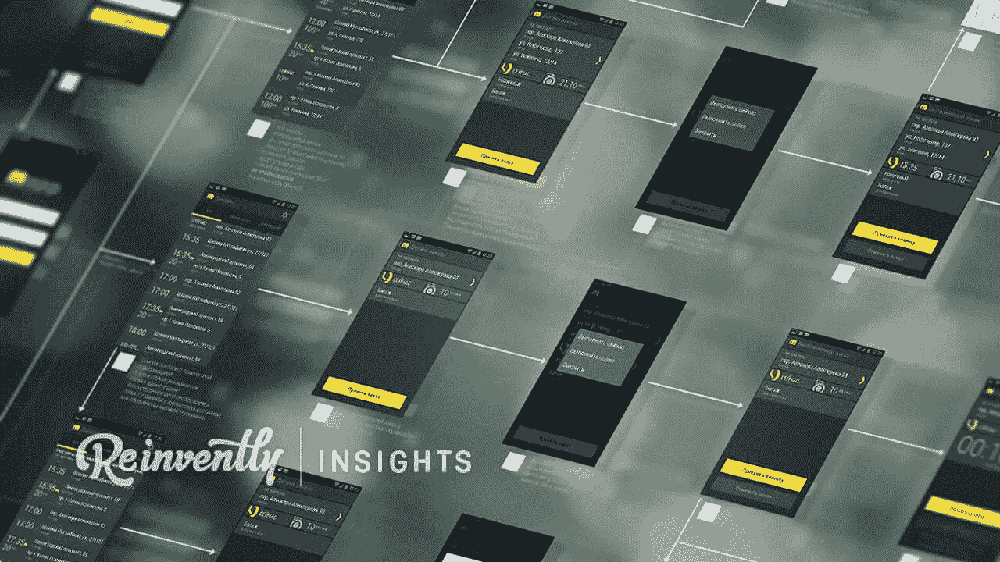
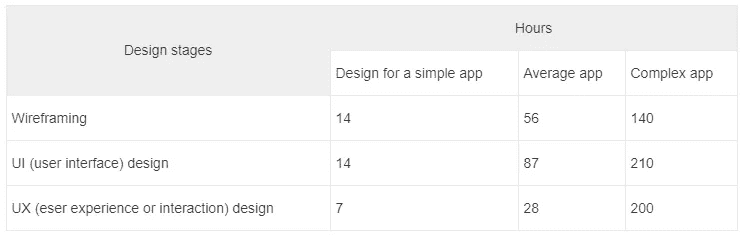
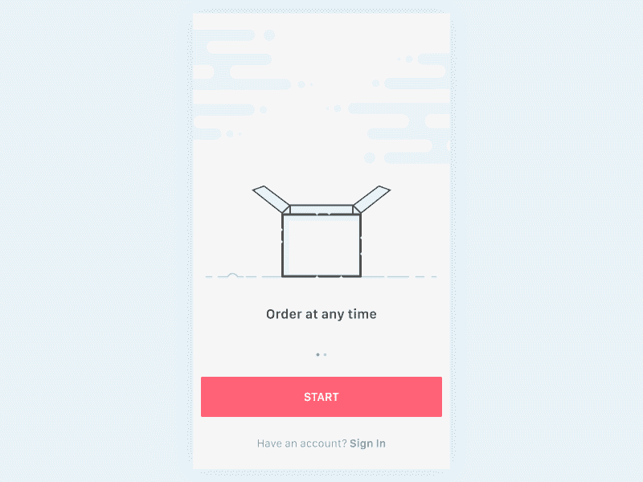
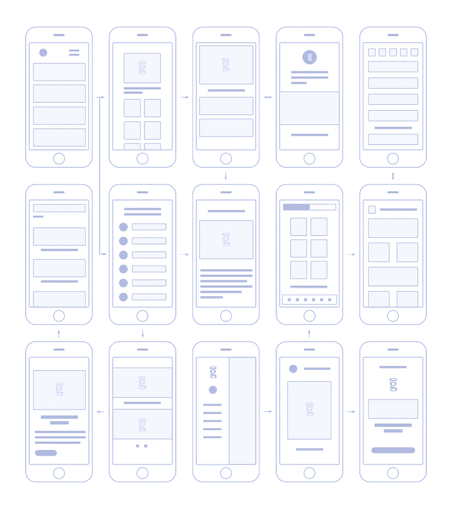

# 设计一个手机 App 要多少钱？

> 原文：<https://medium.com/hackernoon/how-much-it-costs-to-design-a-mobile-app-f5699beb8015>

Ride-hailing app concept by [Reinvently Design Studio](https://reinvently.com)

你曾经真正(从商业角度)思考过 UI/UX 设计这样对应用成功至关重要的东西吗？如果没有，也是时候了！如果你有，这里有更多的思考。让我们深入了解一下，设计一个移动应用程序到底要花多少钱。

在继续前进之前，正确的做法是解决一些关于专业移动应用程序 UI/UX 设计的最令人沮丧的问题。

优秀的设计对应用程序的整体成功至关重要。它在获得更多流量、将用户转化为潜在客户(进而转化为客户)以及提高投资回报率方面发挥了重要作用。设计越好，用户就越喜欢你的应用。

# 如果开发人员可以完成这项工作，我为什么要付钱给花哨的设计师？

是的，大多数开发者可以设计你的应用；然而，专业设计师有如此多的经验和知识。伟大的设计不是画几张图，而是一幅大图。

在 Photoshop(或者其他工具)里‘画’几张图真的那么难吗？设计看似容易；然而，这是一项需要多年掌握的技能。虽然使用 Photoshop 或任何其他工具很容易，但专业人士应该能够做得更多，比如:“感受”所有的最新趋势；抓住应用程序的想法，将其转化为有吸引力的设计；对移动可用性有深刻的理解，对美学有感悟。

> *精挑细选可用性:* [*微 UX 在 8 个令人愉悦的例子中解释*](https://reinvently.com/blog/micro-ux-explained-8-examples/)

# 什么能让 app 设计成本多多少少？

价格取决于很多因素，比如 app 复杂程度、项目大小、设计师水平、地理位置等。一般来说，应用程序的功能越多，成本就越高。

# 设计完成后我能得到什么？

当你的应用程序设计好了，所有的图片，图像，屏幕和图标都打包到 PSD(或。png)文件并发送给你。雇佣一名设计师来设计图标或屏幕也不是问题。

# 平均应用程序设计成本

即使是专业人士也不能一眼看出这个或那个应用程序要花多少钱。为了估算价格，设计师应该进行所谓的分解:对设计进行分解，以估算其工作流程中每个逻辑步骤的价格。

该设计分为两个基本部分—用户界面(UI)和用户体验(UX):

> 10 个词中的 UI-UX 差异:UI 是用眼睛看的，UX 是用肚子感受的。

1.  UI 部分是关于创建应用程序的视觉风格，并在 Photoshop 或任何其他工具中准备所有必要的图片和图像。那是大多数人认为设计开始和结束的地方。但是设计不仅仅是外观。

在下表中，您可以看到每个应用程序设计阶段可能需要多长时间。请注意，应用程序越复杂，设计 UX 部件所需的时间就越多:

设计师，无论是公司还是个体自由职业者，都是按小时收费的，这意味着成本取决于花费的时间。根据您的设计合作伙伴所在的地区，设计一款移动应用的成本如下:

【2017 年夏季更新

*   10-20 美元/小时—印度、巴基斯坦、孟加拉国
*   25-45 美元/小时—东欧
*   40-60 美元/小时—西欧
*   65-130 美元/小时及以上—英国
*   150-200 美元/小时及以上—美国

因此，一个普通的应用程序设计可能会花费你 2000 美元到 35000 美元甚至更多。记住，质量从差到世界级都有。

# 为什么 app 设计这么贵？

是的，成本很高，因为即使是最简单的应用程序也相当复杂。另外，算上额外成本:工资、福利、办公室维护等。行业发挥了作用——不仅是设计，应用开发的所有阶段都包含多种成本。

不过，这是值得的。看看这个可爱的小动画[重塑设计团队](https://reinvently.com/mobile-app-design/)为按需交付应用程序制作的:

很酷，对吧？这样的事情会让你的用户去*哇，太棒了！*。

然后他们把它展示给朋友，你得到了你非常感激的关注。没有什么比一个好看的解决问题的产品更有市场。

# 应用程序设计成本和用户体验

优秀的应用程序都有一个相似的特征——它们提供出色的用户体验。投资 UX 是成功的最佳决策。为什么？竞争不会给你失败的机会。如果用户发现应用程序很难交互，他们会怎么做？对，他们会放弃的。

对 UX 设计的投资回报是十倍。实际上，[设计可以有 10000%](https://reinvently.com/blog/10000-roi-of-uiux-design/)的投资回报率。即使你需要储蓄，也要关注区域价格区间的上部。雇佣有很棒的 UX 作品集的设计师，收费至少 15 美元/小时。

要求 UX 设计的例子和参考。花一些时间安装和使用设计师开发的应用程序，看看从用户的角度来看他/她的设计是否好。

手机应用程序的可用性方案，或者如设计者所称的流程，可能相当复杂和精密:

*The UX scheme for our client Vegaster, the complex on-demand guide and booking for Las Vegas.* [*See the success story.*](https://reinvently.com/work/vegaster/)

# Android 和 iOS 应用程序设计成本

尽管 Android 和 iOS 的应用程序设计成本可能相差不大，但有几点需要注意。为 iOS 设计通常很昂贵。App Store 应用往往比 Play Store 更有利可图。这就是为什么设计师会把价格标签卷起来。由于苹果公司严格的设计准则，它们的价格也更高。

# iOS 应用程序设计

这是相当标准化的。由于严格的设计指南已经到位，iOS 设备的范围有限，设计师知道他们的设计将如何工作，并在这个或那个 iOS 设备上查看。它们可以是“完美的像素”此外，iOS 应用程序设计易于测试和修复。评估 iOS 应用程序设计并不复杂。

# 设计 Android 应用

有点难，分段。多年来，设计 Android 应用程序受到的控制较少:直到 2015 年，谷歌才在 Play Store 中推出应用程序审批流程。UI/UX 设计者没有义务遵循任何指导方针，而且许多应用程序都是…懒散地设计的。确保你的设计师非常了解商店设计指南。

Android 设备众多，操作系统支离破碎:不同的公司、版本、定制功能等。除非你专注于有限范围的 Android 操作系统版本，甚至是你的应用程序设计的特定 Android 设备，否则做出一个适合所有应用程序的理想设计是非常不可能的。

根据你的目标，一个 Android 应用程序的设计会花费你或多或少的钱。如果你想覆盖大多数版本和设备，这将比 iOS 设计花费 2-3 倍的时间(和金钱)。与此同时，专注于最新的 Android 设备将使价格降低 10-15%。

> 我们推荐:[软件开发成本的餐馆指南](https://reinvently.com/blog/app-development-cost-breakdown/)

如果你只为 iPhone 设计，你可能要支付 500 美元到 10000 美元甚至更多。价格取决于应用程序的复杂性，大小和设计师的时薪。让你的应用在 iPhone 6 Plus 和 iPad 上看起来不错，会增加 25%到 50%的应用设计成本。

# 结果

应用程序设计是应用程序成功的重要组成部分。如果设计不好(没有吸引力的标志，低质量的图像，糟糕的可用性，不友好的触摸)，应用程序不会受欢迎，因此流量低，差评多，投资回报率低。

好好投资设计。聘请一位懂得如何让东西变得美观实用的专业人士。这可能会让你付出代价，但这是对你的应用程序的最佳投资。

# 想让你的应用看起来和工作起来都很棒吗？

咨询顶级 UI/UX 设计师并获得详细的设计评估

[了解更多](https://reinvently.com/mobile-app-design/)

*最初发表于* [*脱胎换骨的见解*](https://reinvently.com/blog/how-much-it-costs-to-design-a-mobile-app/) *。*