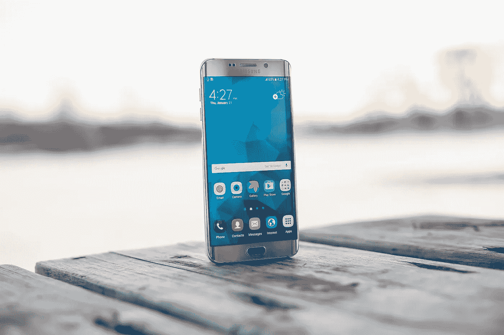
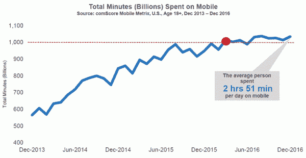
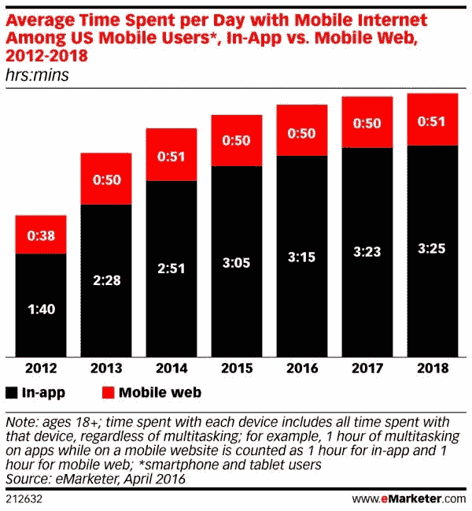
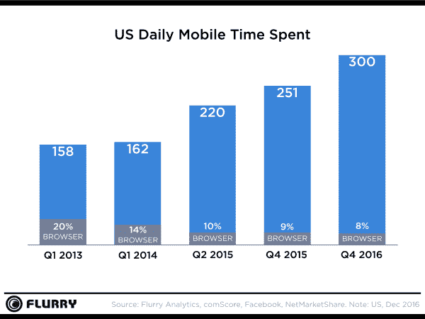
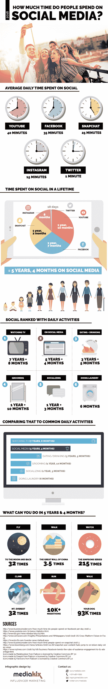
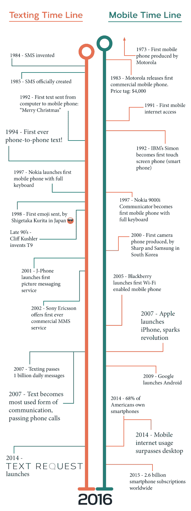
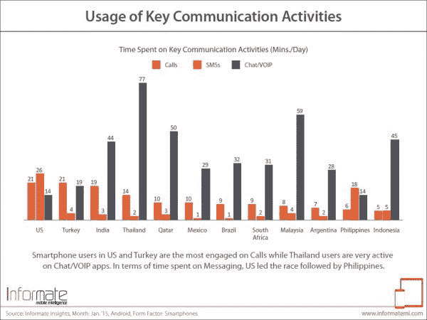
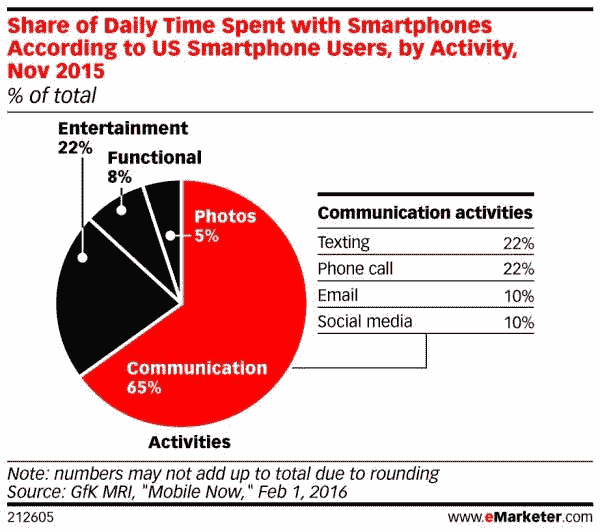
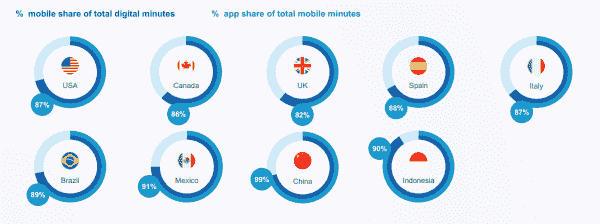
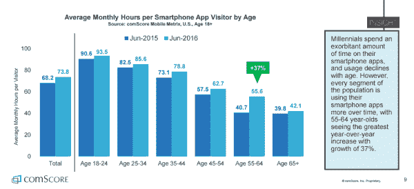

# 2017 年人们花在手机上的时间有多少？

> 原文：<https://medium.com/hackernoon/how-much-time-do-people-spend-on-their-mobile-phones-in-2017-e5f90a0b10a6>

我们都同意人们“一直”都在使用手机。但是，以分钟和小时计算，那会是什么样子呢？2017 年人花在手机上的时间*有多少？*

谢天谢地，最近有很多这方面的研究。我们将在下面分享这项研究，并告诉你它对我们的日常生活意味着什么。

那么，2017 年人们花在手机上的时间有多少呢？让我们开始吧！

# 我们从哪里得到这些信息的？

当我们引用每个人的工作时，我们会链接到他们，但我们包括了来自行业巨头的研究，如:

*   comScore
*   尼尔森
*   SmartInsights
*   eMarketer
*   MediaKix
*   皮尤研究中心
*   更多

我们写这份报告的目的不是要证明一个观点，而是要看看人们实际上在做什么，然后理解它的实际应用。我们希望你喜欢它！

# 2017 年人们花在手机上的时间有多少？

> 简单的回答是“每天超过 4 小时”

根据 comScore 的 2017 年[跨平台聚焦未来](http://www.comscore.com/Insights/Blog/Mobile-Matures-as-the-Cross-Platform-Era-Emerges)报告，美国成年人(18 岁以上)平均每天在智能手机上花费 2 小时 51 分钟。

也就是一个月 86 个小时左右！这可能是一个记录，但在过去的一年半里，增长肯定是平稳的。

## 相关:[人们每天发多少条短信？](https://www.textrequest.com/blog/many-texts-people-send-per-day/)

总的来说，我们花在数字媒体上的时间越来越多，但花在台式机和笔记本电脑上的时间却越来越少。移动设备现在占数字媒体消费总量的 65%。

正如你可能想象的那样，大学年龄的成年人(18-24 岁)在手机上花费的时间比老年人多得多。

eMarketer 在 2016 年也发布了一项研究，给出了明显不同的答案。他们的[移动研究报告](https://www.emarketer.com/corporate/coverage/be-prepared-mobile)显示，移动用户每天花费的总时间为 4 小时 5 分钟。

他们的研究*不包括平板电脑用户，只包括活跃的移动设备用户，这两者可以解释每天超过一个小时的差异。*

这项研究也为可能在智能手机和平板电脑之间执行多项任务的用户之间的潜在重叠留有余地。尽管平板电脑的使用约占总移动时间的 15%,但平板电脑用户仍可能扭曲数据。

PC: eMarketer

由 [Flurry](http://flurrymobile.tumblr.com/post/157921590345/us-consumers-time-spent-on-mobile-crosses-5) 进行的另一项研究显示，美国消费者实际上每天在移动设备上花费超过 5 个小时！大约 86%的时间被智能手机占用了[，这意味着我们每天在手机上花费大约 4 小时 15 分钟。](http://flurrymobile.tumblr.com/post/155761509355/on-their-tenth-anniversary-mobile-apps-start)

Flurry 的研究与 eMarketer 的研究更接近，使 comScore 的研究处于边缘。

Flurry 和 eMarketer 的报告也与[过去的研究](https://www.textrequest.com/blog/engaging-consumers-key-statistics/)更加吻合，该研究显示我们每天在手机上花费大约 4 小时 40 分钟。

很难确定 2017 年人们花在手机上的时间的准确数字，但简单的答案是“每天超过 4 小时。”

PC: Flurry

# 我们在手机上做什么？

> 一切！

我们用手机娱乐、与朋友和同事联系、获取信息、购物，以及做其他任何事情。

至少 81%的美国成年人现在拥有智能手机，这些设备已经成为我们工作和个人生活中不可或缺的一部分。

这是用小时和分钟表示的样子。

## 社会化媒体

根据 [MediaKix](http://mediakix.com/2016/12/how-much-time-is-spent-on-social-media-lifetime/#gs.2V25Gc4) 的数据，仅在前 5 大社交媒体平台上，我们平均花费 1 小时 56 分钟。前 5 位是(按使用情况):

1.  油管（国外视频网站）
2.  脸谱网
3.  Snapchat
4.  照片墙
5.  推特

根据 comScore 的 2017 年未来聚焦报告，66%的时间发生在智能手机上。(只有 21%的社交媒体时间发生在桌面上。)

虽然这不包括 Pinterest、LinkedIn 和其他重量级网站，但这意味着我们每天花大约 1 小时 16 分钟在手机上参与前 5 大社交媒体平台。

PC: MediaKix

## 实际通信

这些年来，手机的用途发生了多么惊人的变化。它们开始是另一种交流方式，现在它们是从你的手指上体验整个世界的工具！

随着社交媒体、娱乐、搜索和购物占据了我们大部分时间，我们在实际交流上花了多少时间？

不幸的是，现有的(和可获得的)研究都有点过时了，而且没有一项研究与下一项一致！

## 相关:[人们每天会收到多少封邮件？](https://www.textrequest.com/blog/how-many-emails-do-people-get-every-day/)

例如，Informate(2015 年 1 月)的一项[研究报告称，美国智能手机用户平均每天要处理 32 条短信和 6 个电话。](http://informatemi.com/blog/?p=133)

这分别需要 26 分钟和 21 分钟。要是其他研究也有相同的结果就好了！

PC: Informate

尼尔森的一项研究显示，我们平均花费 5.3%的 T2 时间发邮件，13.4%的时间发短信。

根据我们每天超过 4 小时的总移动时间，尼尔森显示我们每天花大约 13 分钟和 35 分钟发邮件和发短信。

接下来，comScore 的 2017 年聚焦未来报告显示，我们花费 3% (7 分钟。)的时间发邮件，2% (5 分钟。这是*与前两篇报道截然不同的数字！*

然而，comScore 的研究只包括应用程序的使用，所以通过浏览器访问的标准短信和电子邮件不包括在内。

## 相关:[移动依赖是什么意思？](https://www.textrequest.com/blog/mean-mobile-dependent/)

eMarketer 的移动使用报告(2015 年 11 月发布)提供了一个更简单的时间细分，尽管它比前两个更加不同！

根据 eMarketer 的数据，22%的手机时间被短信占用，22%被电话占用，10%被电子邮件占用。

这意味着我们平均每天花 55 分钟发短信，55 分钟打电话，25 分钟发手机邮件。

也许我们真的用手机交流！

PC: eMarketer

eMarketer 的报告与过去的研究最为一致。行为可以而且确实会改变，但是所有这些差异可能有更好的原因。

当今的移动领域由多用途应用主导。你可能会用 WhatsApp——或者任何类似的软件——发短信或者打电话。您可以使用 Snapchat 发送信息、发送图片和滚动浏览订阅源。

我们今天的很多交流都发生在“社交媒体应用”中因为这些应用程序有如此多的功能，很难说我们在任何一件事情上花了多少时间，比如发短信。

## 应用程序

> 我们大约 90%的移动时间都在使用应用程序。

今天的数字世界非常注重应用。事实上，根据 comScore 的[移动层级报告](https://www.comscore.com/Insights/Presentations-and-Whitepapers/2017/Mobiles-Hierarchy-of-Needs)(2017 年 1 月)，应用程序占总移动分钟数的 87%。

虽然， [Flurry Analytics](http://flurrymobile.tumblr.com/post/157921590345/us-consumers-time-spent-on-mobile-crosses-5) 在 2016 年 12 月报告称，应用占据了总移动时间的 *92%* ，而浏览器占据了另外的 8%。

可能很难确定一个准确的数字，但我们大约 90%的移动时间都花在了使用应用程序上。

PC: comScore

根据 comScore 的数据，美国成年智能手机用户平均每月在应用上花费 73.8 小时，每天不到 2 小时 30 分钟。

然而，如果我们每天在手机上花费超过 4 个小时(就像我们上面所说的那样)，而应用程序的使用占了其中的 90%，那么我们实际上每天在应用程序上花费大约 3 小时 40 分钟。

## 相关:[移动设备在客户购买过程中处于什么位置？](https://www.textrequest.com/blog/mobile-fit-customer-buying-journey/)

正如你所想象的，年轻人比老年人花更多的时间在应用上。对于年龄较大的人群，这一数字稳步下降，最终达到 65 岁以上，他们每月在应用上花费 42.1 小时，或每天大约 1 小时 25 分钟。

PC: comScore

最令人惊讶的可能是*老年人*在应用上花费的时间！年轻的成年人是“数字原住民”，他们伴随着这项技术长大，但这显然没有阻止它的传播。

# 这对你我意味着什么？

> 事情已经发生了变化，它们将继续变化，相应地适应符合每个人的最佳利益。

手机已经固化在日常的美国文化中。它们也改变了我们的日常行为。

自从苹果在 2017 年引发智能手机革命以来，移动设备已经从酷和时尚变成了我们与世界互动的主要方式。我们的行为大多已经从强制走向实际应用。

1 号[闹钟](http://www.dailymail.co.uk/news/article-2815114/Top-ten-uses-mobile-phone-Calls-come-SIXTH-40-smartphone-users-say-manage-without-call-function-device.html)是一部手机。大多数人用手机查看电子邮件和社交媒体，我们都用手机与朋友、家人和同事交流。

人们花在手机上的时间与其说代表了当今的上瘾行为，不如说代表了大规模的文化转变。

对这一数据的一种解释是，我们的生活只是更加科技化了。而且，与任何变化一样，这也带来了自身的一系列挑战。

我们将如何处理它们？只有时间会证明一切！

# 这对企业意味着什么？

人们花在手机上的时间对企业和其他人的意义是一样的。事情已经发生了变化，它们将继续变化，相应地适应符合每个人的最佳利益。

比起电话和电子邮件，更多的人更喜欢社交媒体和手机短信。你的企业有责任通过社交媒体和手机短信进行沟通，因为你需要在消费者已经花时间的地方与他们见面。

## 相关:[推动指数增长的 7 个基本小企业营销技巧](https://www.textrequest.com/blog/small-business-marketing-tips-drive-exponential-growth/)

人们通过手机搜索答案的时间比在桌面上多。你的企业有责任为这些搜索提供答案，并定制你的网站，以便为移动用户提供快速、愉快的体验。

时代变了，与时俱进的企业才会成功。

# 最后一句话

2017 年人们花在手机上的时间有多少？相当多。

每天超过 4 小时意味着我们一天中超过 1/6 的时间花在手机上！但这并不意味着我们是坏人。

移动电话已经成为非常实用、高功能的设备，我们的使用反映了它们的应用。

人们一直在集体适应移动技术的进步，紧随其后的企业将能够在这个移动优先的时代蓬勃发展。

至少在下一件大事到来之前。

## 相关: [63 条回答你所有问题的短信统计](https://www.textrequest.com/blog/texting-statistics-answer-questions/)

> [黑客中午](http://bit.ly/Hackernoon)是黑客如何开始他们的下午。我们是 [@AMI](http://bit.ly/atAMIatAMI) 家庭的一员。我们现在[接受投稿](http://bit.ly/hackernoonsubmission)并乐意[讨论广告&赞助](mailto:partners@amipublications.com)机会。
> 
> 如果你喜欢这个故事，我们推荐你阅读我们的[最新科技故事](http://bit.ly/hackernoonlatestt)和[趋势科技故事](https://hackernoon.com/trending)。直到下一次，不要把世界的现实想当然！

