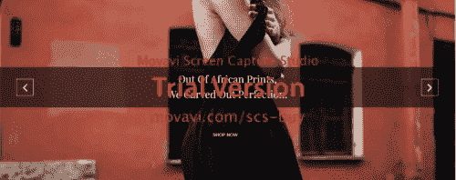

# 多整洁？

> 原文：<https://medium.com/hackernoon/how-neat-aafacead3018>

我在为我的一个客户做一个网站，我实现了一些我觉得很酷的东西，我想我应该分享一下。这是我第一次在实际项目中使用这么多的 jQuery，非常有趣。

**我所做的:** 我创建了一个滑块，看起来像这样

(在桌面上)



(在手机上)


我是如何做到的:
(HTML)

```
<!--A container div-->
<div clas='slider'>
  <!--A LIST-->
  <ul class='slides'>
  <!--IMAGES-->    
    <li class='slide'> </li>
    <li class='slide'></li>
    <li clas='slide'></li>
</li>
    <li clas='slide'></li>
</ul></div>
```

(CSS)

```
/*CONTAINER DIV */
.slider {
  width: 100%;/* full width for a desktop*/
  height: 600px;
  overflow: hidden;}/* LIST STYLING */
.slides {
  width: 400%; /* Because we have four images */
  height: 100%;
  margin: 0;
  padding: 0;
}/* CHILD LIST */
.slide {
  list-style-type: none;
  float: left;
  height: 619px;
  display: block;
  position: relative;
  width: 25%; /* Beacause 25% of 400% is 100% == full width */
}/* EACH IMAGE */.slide_images {
  width: 100%;
  height: 100%;
  z-index: -1;
}
```

以及 [JavaScript](https://hackernoon.com/tagged/javascript) (jQuery)

```
$(function(){const slider = $('.slider');const slides = slider.find('.slides');const slide = slides.find('li');const sliderWidth = $(window).width();const slidesWidth = $(slides).width() - sliderWidth;let sliderLength = 0;const slideShow = () =>{$(slides).animate({'margin-left': '-=' +sliderWidth}, 2000, () => {sliderLength++;if (sliderLength === 4) { $(slides).css('margin-left', 0); sliderLength = 0;}}let interval;function playSlideShow () {interval = setInterval(slideShow, 5000);}playSlideShow();});
```

你如何让你的图像滑块响应？