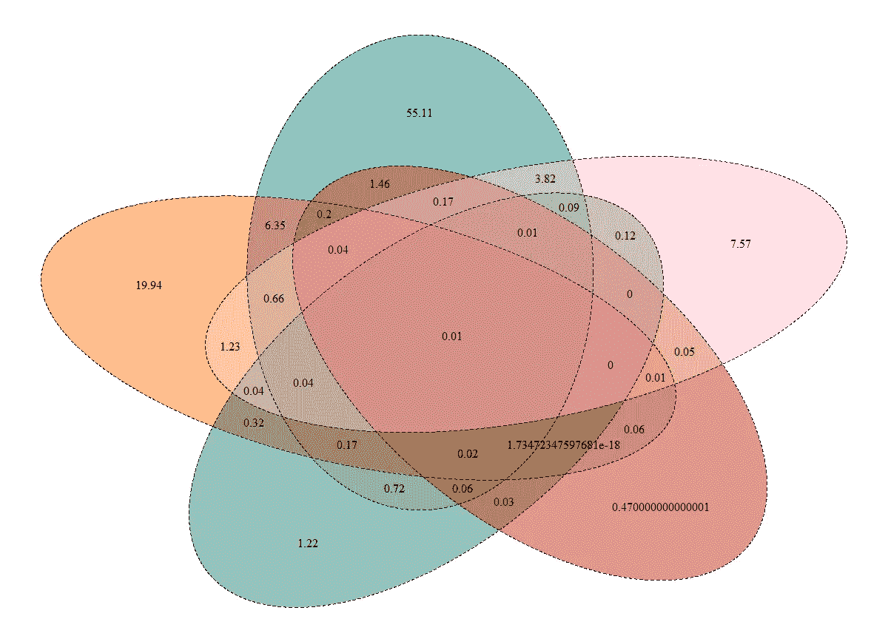

# 如何不雇佣你的第一个数据科学家

> 原文：<https://medium.com/hackernoon/how-not-to-hire-your-first-data-scientist-34f0f56f81ae>

你是一家初创公司的创始人。你知道你需要一个“数据游戏”(或者更糟，“AI 游戏”)。投资者和客户正在询问机器[学习](https://hackernoon.com/tagged/learning)(或者更糟，深度学习)。问题不再是为什么，而是什么时候。

所以，你雇佣了你的第一个数据科学家。一个应届毕业生(有行业经验的太贵，不好招)。他们有博士学位(所以在与潜在客户和风投的对话中，你可以漫不经心地说‘我有最好的博士在研究这件事’。)他们对进行机器学习感到兴奋——你也是。这太棒了。

您的数据科学家开始工作，准备好获取您的数据并根据数据构建模型，就像您同意的那样。回到学术界，他们正在处理几代研究生一直在使用的数据集。然而，他们并不天真——他们知道这一次他们将不得不创造他们自己的。没问题！你的初创公司在 S3 有一年的日志，随时可以被挖掘并用作训练数据。

How not to think about the data science Venn diagram

没有用于数据分析的基础设施，所以一切都必须从头开始。您的数据科学家正在尝试安装与您的堆栈或架构不兼容的各种工具，并且目前正在进行一次性的日志解析来回答每个问题。工程团队觉得给他们 prod 访问权限不安全，所以他们提供了数据库的离线副本。

*那里！*你对数据科学家说。您可以访问您需要的所有数据！

除了……从设计上来说，离线数据库中的数据不是以一种易于分析或与日志中的数据相结合的方式构建的。值没有意义或者一次丢失数周，检测的唯一事件是那些与 ops 团队相关的事件，甚至最简单的查询也要花很长时间才能运行。

## 每个人都很沮丧。

这位数据科学家希望从事机器学习——他们花费职业生涯思考和发表的优雅算法。是的，他们期望在收集和清理数据方面付出一些努力，但他们没有想到会如此复杂和混乱，有如此多的数据丢失或难以访问。他们没有想到会在会议上花这么多时间，也没有想到数据是如何收集的，以及 json blob 中到底有什么。他们没想到公司的其他人会如此不在乎每一次重新设计如何搞乱月与月的比较。他们没有意识到没有人记录用户点击之前看到的所有选项，也没有记录当时的 UI 版本，因此一年的训练数据并不完全可用。

你雇了一个数据科学家来研究机器学习。他们被警告不要花 80%的时间清理数据。那现在听起来像一个遥远的梦想。相反，他们花费 80%的时间乞求创建、访问、移动或解释数据。他们将剩下的 20%用于游说有利于数据科学的工具、安全政策和基础设施，或者寻找新工作。

工程团队也很沮丧。他们不得不从自己的工作中抽出时间，为那些无所事事、无所事事、仍在抱怨数据不够好的科学家做大量吃力不讨好的工作。

你这个创始人就更沮丧了。已经两个月了，数据科学家甚至没有制作出一个像样的仪表板，更不用说每个人都在谈论的神奇机器学习了。此外，他们似乎是一个糟糕的文化适应，毫无理由地拖累其他人。在内心深处，你开始怀疑机器学习是蛇油， [AI 只是炒作](https://chatbotnewsdaily.com/machine-learning-ai-and-the-emperors-vest-32b7bdd99b58#.lomvxohgc)。

不过，你要保守这个秘密，告诉你的投资者和客户你的人工智能游戏和你的疯狂聪明的博士数据科学家，他现在对任何一天从事机器学习都超级兴奋。

*如果你想知道如何避免这种痛苦但过于频繁的情况，这里有激发这篇文章的 Quora 答案:“* [*在初创公司建立数据团队有哪些挑战*](https://www.quora.com/What-are-the-challenges-of-building-a-data-team-at-a-startup) *？”。*

# 你认为其他人会从这篇文章中受益吗？点击心脏，帮助他们找到它❤

> [黑客中午](http://bit.ly/Hackernoon)是黑客如何开始他们的下午。我们是阿妹家庭的一员。我们现在[接受投稿](http://bit.ly/hackernoonsubmission)并乐意[讨论广告&赞助](mailto:partners@amipublications.com)机会。
> 
> 如果你喜欢这个故事，我们推荐你阅读我们的[最新科技故事](http://bit.ly/hackernoonlatestt)和[趋势科技故事](https://hackernoon.com/trending)。直到下一次，不要把世界的现实想当然！

