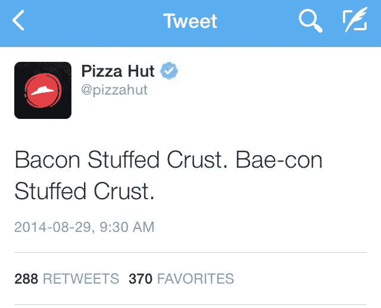

# 如何不向年轻人推销——一位青少年写的

> 原文：<https://medium.com/hackernoon/how-not-to-market-to-young-people-written-by-a-teenager-f7a606e9af7d>

## 获得更多用户，而不会让你的公司尴尬

我不是营销方面的专家，所以我不能告诉你如何向我营销。然而，我是营销方面的专家，对于像我这样的青少年来说，我已经看到了好的和坏的营销，所以我可以告诉你的是**如何不**向我营销。

> 我并不代表所有的年轻人，所以不要把我的观点作为世界上每一个青少年的综合指南。

## **不要让我买你的产品**

对于青少年来说，别人的看法很重要。如果我要去某个地方，买些东西，或者和某人聊天，很可能是在和我的朋友们讨论并得到他们的同意之后。

如果我看到一个广告告诉我购买[产品，](https://hackernoon.com/tagged/product) **我会忽略它**。即使广告很搞笑，或者很吸引人。最后只有身边的人觉得有用我才会买。

所以为了让我使用你的产品，你需要一个我信任的人来告诉我。这可以是朋友，也可以是我在社交媒体上关注的人。例如，Casey Neistat 是一位有影响力的视频博客作者和电影制作人，他总是收到产品进行评论。如果他喜欢，我就会对这个产品产生新的敬意，主要是因为我尊敬凯西·奈斯塔特。

这并不意味着你应该做付费影响者营销。看看 youtube 上任何公然推销产品的付费视频，你会发现观众并不总是对此感到高兴。

## 不要把广告强加给我

在前面的基础上，如果我看到一个弹出窗口要求我订阅某样东西，或者在 youtube 视频之前看到一个广告，我的注意力会立即集中在关闭它所需的按钮上，而不是广告上。

这里有一个有趣的事实——我从来没有点击过 youtube 上的广告。

然而，我已经研究过了，并且对我观看的 youtubers 上验证过的产品非常感兴趣。

我举一个叫罗根·保罗的优步的例子。虽然我个人不喜欢他的视频——它们相当不成熟(即使对于一个青少年来说)，但他使用了一种有趣的策略来让他的观众购买他的产品。他在视频中找到切入点，开始自我推销自己的商品。现在，尽管它可能与叙事有所不同，但与直接在视频上为不同的目标受众播放广告相比，它没有那么不和谐。

一个小事实，他现在身价超过一百万美元。

这引发了关于在线广告的另一个问题。产品只是针对性不够好。为了证明我的观点，当我写这篇文章的时候，我打开了 youtube，我看到了一个用我不懂的语言写的广告。

## 不要仅仅为了赶时髦而赶时髦

当然，我们这一代人已经开发了新的词汇，我们用来指代事物，**，但这并不意味着你必须在不理解它们的情况下将它们融入你的营销中。**

给你的广告添加标签不会让它酷，使用千禧一代的词汇不会让它酷，**，添加一个普通的名人也不会让它酷。**

一个恰当的例子是:

## 如果你在推销什么东西，至少试着让它酷一点

就我有限的知识让我明白，这是很多营销的基本法则，毕竟 [Seth Godin 写过一本关于它的书](http://www.sethgodin.com/purple/)。然而，很多产品就是对年轻人没有吸引力。

过于严肃和沉重的产品对大多数青少年没有吸引力。**青少年通常想要有趣的、通常是愚蠢的方式来利用他们的时间和与他们的朋友分享事情。**

这就是为什么像 Snapchat 和它的滤镜这样看起来很傻的产品做得这么好。

## **结论**

作为一个年轻人，我喜欢通过口耳相传而不是明目张胆的广告了解的东西。

当广告通过社交媒体强加给我时，通常弊大于利。

然而，最有害的是，品牌试图利用千禧一代的词汇和模因，试图让他们的营销与年轻受众“相关”。

**最后，做一个好玩又不过分严肃的产品**

感谢阅读，

萨尔瓦夫

***看看我的其他故事吧！***

**苹果的特长不是硬件也不是软件—**[https://medium . com/swlh/Apple-specialty-is-t-Hardware-Or-Software-af1e 6337 D5 f 2](/swlh/apples-speciality-isn-t-hardware-or-software-af1e6337d5f2)

**十五个 Y/O 给聊天机器人工作人员的消息—**[https://medium . com/swlh/A-Message-From-A-fifth-Y-O-to-any one-Working-With-Chatbots-fd1b c 6292028](/swlh/a-message-from-a-fifteen-y-o-to-anyone-working-with-chatbots-fd1bc6292028)