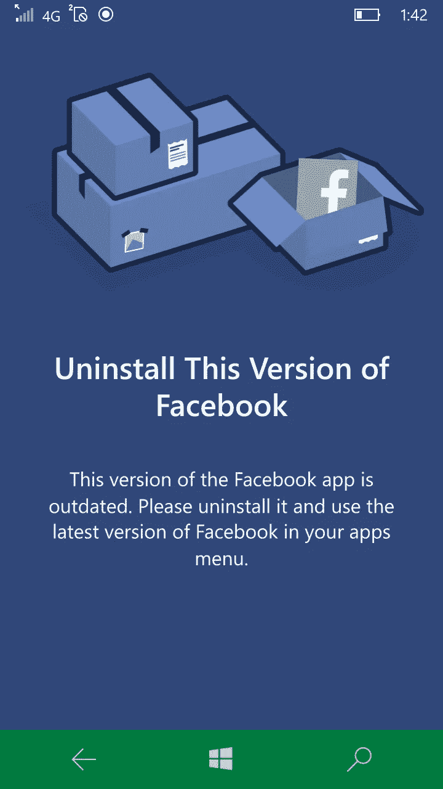
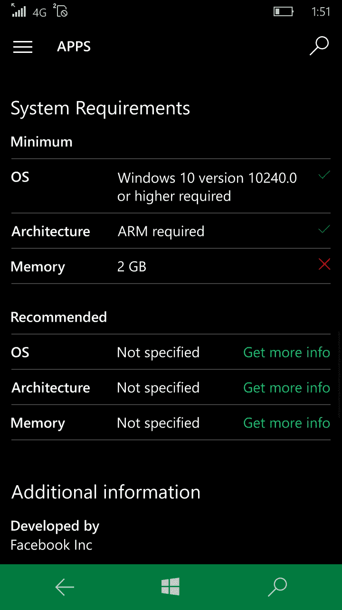
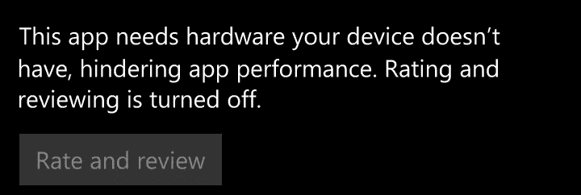
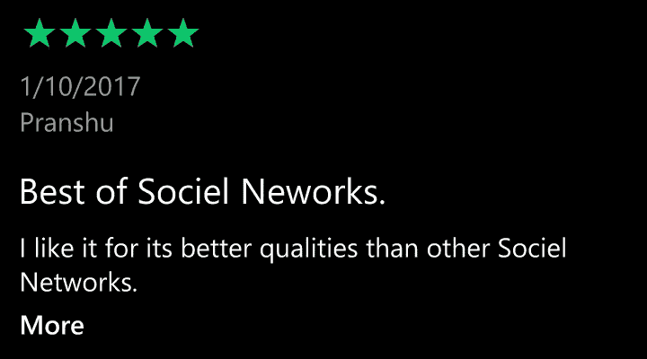
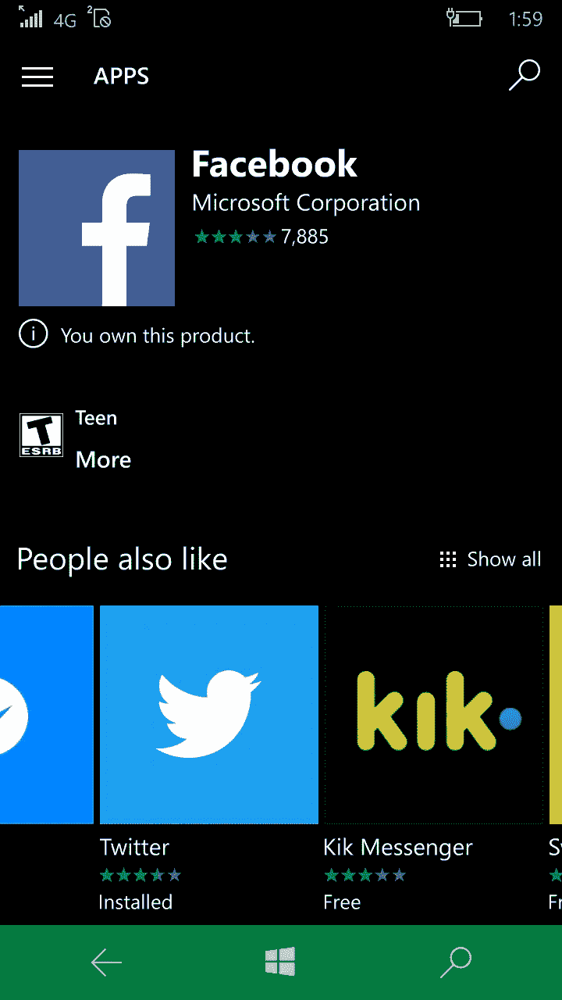

# 如何(不)在公司之间转换应用程序。

> 原文：<https://medium.com/hackernoon/how-not-to-transition-an-app-between-companies-d703230d91a4>

脸书在 Windows 10 上的应用有着传奇的历史。最初，每个 Windows 10 移动设备上搭载的版本都是由微软内部的一个团队开发的。这款应用做的正是你期望脸书客户端做的事情:它很好地掌握了时间线的工作原理，有评论，感觉它很适合平台的环境。我有一些挑剔(它肯定有“脸书”的外观，而不是定义的“微软”的外观。不过，我能理解。)

最近(我想是最近几个月)，[微软](https://hackernoon.com/tagged/microsoft)和脸书来到 nexus，说“你知道吗？脸书应该拥有 Windows 10 上的脸书应用。”因此，微软开始(悄悄地)推出由脸书开发的新应用。

他们主要是通过照片应用程序来做这件事；这是新的分享序列的一部分:基于你已经安装的应用程序的推荐会显示给特定类型的图片。在这种情况下，我的手机建议我安装脸书应用程序。

我想知道为什么它会建议我已经安装了一个应用程序。出于好奇，我嘘了一下这个选项，它就在后台安装了。当我来到我的开始屏幕，嘘了一下我钉在那里的脸书图标，迎接我的是一个令人不快的惊喜:旧应用程序只是拒绝启动，句号。故事结束，我们完成了，打包，把我扔进垃圾桶。

In the ever knowledgeable words of Anon, “lol wut?”

注意:这是我拿到手机后就钉在开始屏幕上的版本。我一直惊喜地发现我有多**喜欢 Windows 10 自带的脸书应用**，但当我经常甚至无法*与手机上的 Messenger 应用*互动时，我感到非常失望——一个长期存在的错误导致触摸输入根本无法注册——更不用说享受这种错误体验了。

“嗯，好吧，我想，”我对自己说。我绞尽脑汁，卸载了“过时”的版本。拉起新版本需要我重新登录，重新做我的 2FA，再次授权设备，我得到了什么？

我给你一点时间思考。

准备好了吗？

它坠毁了。砰，一直到起始页。这在 Windows UAP 开发世界中被称为“墓碑”。你死得太惨了，平台都懒得*试着复活你*。发生这种情况有几个原因:内存不足是一个很好的开始，但是越界和出现疯狂的、未被捕获的异常是另一个原因。

当我终于打开应用程序时，是时候看看我是否可以滚动我的提要了。我可以，以惊人的…每秒 5 帧的速度。说真的，它慢到我可以看到屏幕撕裂。我试着评论某人的帖子。

它又崩溃了。

我有点生气。

“脸书创造了什么地狱般的世界？”我问自己。对这个问题的简短回答是，他们已经做了我完全期望他们做的事情:以尽可能横向的方式，将一个不适合这个平台的浏览器粉碎成一个应用程序，并使它的重量超过如果它是一个点击式冒险游戏我会感到舒服的重量。

Lumia 550 和 650 都配有 1GB 内存。相比之下，950 配备了 3GB 内存。这是什么意思？

意思是我什么都不能说。我的评论是无效的，因为根据商店的说法，*我不应该运行这个应用程序。*

此外，这个应用程序有一个 5 星评级，我无法与之互动:

我不能提供我的一星反评论去“我想要回我的手机 272 兆。”脸书:就当这是我对你的应用程序操作的零星级评价吧。

最重要的是，我并没有意识到，但我已经将这些 290MB 的数据转移到了 4G 上，这意味着我刚刚消耗了这个月 15%的数据量(12 月对我来说是一个沉重的月份，好吗？)客观地说，在过去的 11 天里，我拍了 65 张照片。大约 2.5 兆字节，也就是 160 兆字节左右。

脸书占据的空间比我今年迄今拍的 12 张照片还要多。我发现我在照片上使用的存储空间(上个月大约有 100 张)比脸书一次占用的还少。

我想知道自己“我能拿回我的旧脸书应用程序吗？”答案是否定的。商店显示我可以下载它，但当我这样做时，它只是说“这个项目不是你拥有的”，尽管当我去它的页面(作者:微软公司)时，它说我拥有它，但不能安装它。

我想花一点时间来指出，由微软建立的一个是在一个苗条的 18 兆字节，并要求一个轻量级的 512 兆最低内存。**18 兆比我上周拍的照片小。**

当然，由于移交是如何完成的，旧的脸书应用程序没有任何记录。今天早上还能用的软件现在已经没了。

这确实是多方面的失败:首先，微软在处理应用程序之间的转换时擅离职守，脸书推动的改变并没有让事情变得更好，实际利益的普遍缺乏让我感觉很糟糕。

我们不要再这样了，好吗？

> [黑客中午](http://bit.ly/Hackernoon)是黑客如何开始他们的下午。我们是 [@AMI](http://bit.ly/atAMIatAMI) 家庭的一员。我们现在[接受投稿](http://bit.ly/hackernoonsubmission)并乐意[讨论广告&赞助](mailto:partners@amipublications.com)机会。
> 
> 如果你喜欢这个故事，我们推荐你阅读我们的[最新科技故事](http://bit.ly/hackernoonlatestt)和[趋势科技故事](https://hackernoon.com/trending)。直到下一次，不要把世界的现实想当然！

