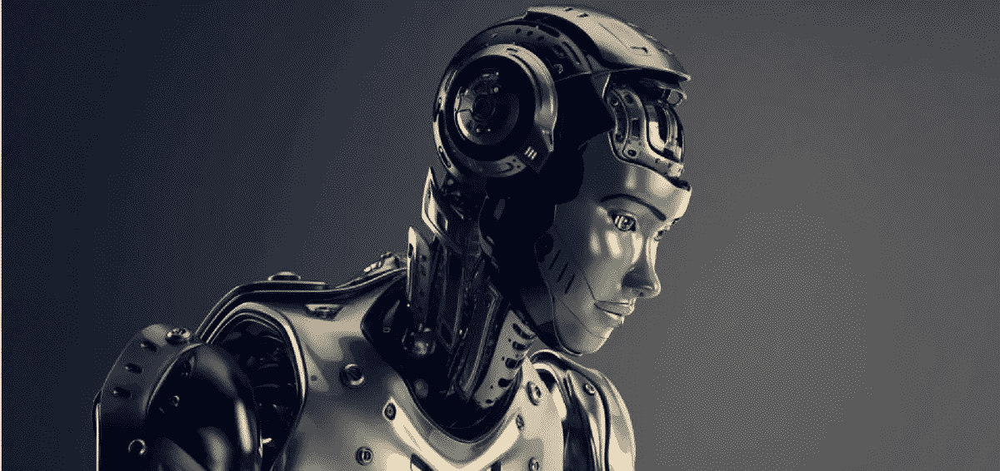

# Obizcoin 的智能流程机器人将如何让企业变得透明和安全？

> 原文：<https://medium.com/hackernoon/how-obizcoins-smart-process-bot-will-make-businesses-transparent-secure-1466498df00b>

出于不同的原因，透明和安全是企业的两个基本要求。工商企业的各种内部和外部利益攸关方期望并寻求公司业务活动中与其相关的领域的透明度。但是同时保持透明和安全有几个必要条件。例如，如果一个打车应用程序对其提供的票价和实际执行情况不透明，它很可能会引起客户的不满。但是相同的应用程序还必须配备足够的 [*技术*](https://hackernoon.com/tagged/technology) *和安全性，以确保正确测量乘坐统计数据，并且不能操纵票价计算，从而成功完成预订时约定的乘坐。因此，透明和安全对企业来说同样重要。*

*在本文中，我们将尝试评估 Obizcoin 的智能流程机器人(目前处于开发阶段)如何证明有助于企业实现透明和安全。*

**透明和安全对企业的重要性**

首先，商业运作的透明度是一个非常重要的考虑因素，尤其是对商业企业/公司的外部利益相关者而言。例如，潜在投资者可能有兴趣了解一家公司在运营、财务、技术等各种参数方面的健康状况，以评估对该公司的投资前景。与公司相关的商业顾问可能需要知道公司在监管领域的表现。公司的客户可能需要检查他们的订单、投诉、付款/退款等的状态。员工、经理和所有者等内部利益相关者也需要必要的职能和跨职能透明度来监控业务运营和业务流程的进展，以确保运营的稳定流动和遵守 sop。

> 工商企业/公司有责任向其真正的内部和外部利益攸关方提供必要和相关的信息。

其次，关于其客户、顾客、卖主、供应商、投资者、金融交易、供应链活动等的商业数据对于商业企业来说是至关重要的。任何商业企业都不能在这种商业数据的安全性和机密性上妥协。

> 虽然商业数据的数字存储和数字交换如今对于商业过程/操作的执行变得越来越普遍，但是对于商业数据的增强的数字安全性的需求也在增长。

【Obizcoin 的智能流程机器人如何融入

## *区块链技术和 BOT 智能合约*

公司的各种业务流程涉及与公司不同内部和外部利益相关者的工作协议、合同等。各种业务流程将通过 Obizcoin 的智能流程机器人实现自动化，协议(员工和雇主以及外部机构之间的组织内协议)将通过智能合同执行。

> 机器人将能够准备和执行智能合同，使组织能够根据预定义/商定的条件和结果自动执行重复和明确的任务。

例如，在以太坊智能合同技术的帮助下，员工评级和奖励(工资、激励等)将根据预定义的条件自动进行。预期绩效、员工评级和奖励将完全透明。

Obizcoin 的分散平台和智能合同的使用有望提高组织内部以及利益相关方之间关系的透明度。分散的[区块链](https://hackernoon.com/tagged/blockchain)平台也应用于存储业务数据。

就数据安全而言，区块链技术的本质赋予了它强大的优势。

## *操作风险评分分析*

Obizcoin BOT 的关键服务之一是其运营风险得分分析，这是一种业务的综合得分，通过独特的风险得分算法获得。

> 运营风险评分分析将有助于中小企业、初创企业和投资者确定组织内流程实施的程度，衡量整个组织的团队绩效，评估组织的优势和劣势，并提出即兴解决方案/策略。

通过操作风险评分分析，组织的真实和相关的利益相关者可以了解业务操作的实时状态，不仅用于审查或分析，还用于监控和即兴发挥，以实现业务流程的卓越。

*虽然人工智能继续引起人们的兴趣，并在商业和技术领域找到了强大的立足点，但区块链技术将成为继互联网之后的下一个大事件，这是有充分理由的。*

*阅读阅读更多相关文章:* [*颠覆:获得竞争优势的新方法*](/@obizcoin/disruption-new-way-to-gain-competitive-edge-4ef0256e7894)**[*隆重促销的 ICO 投资安全吗？*](/@obizcoin_90682/are-icos-with-grand-promotions-safe-to-invest-in-ef038f014252) *，* [*商业管理中的颠覆性技术*](/@obizcoin_90682/disruptive-technology-in-business-management-207ad40d0d1b) ，[*ICO 投资变得有风险。投资前要检查的 10 件事——第一部分*](/@obizcoin_90682/ico-investments-have-become-risky-10-things-to-check-before-investing-part-i-7435eda597df) *，* [*清单能帮助你决定投资哪些 ICO 吗？，*](/@obizcoin_90682/can-a-checklist-help-in-deciding-which-icos-to-invest-in-1c2eb29381c0)**

***访问:*[*obizcoin . io*](https://www.obizcoin.io/)**