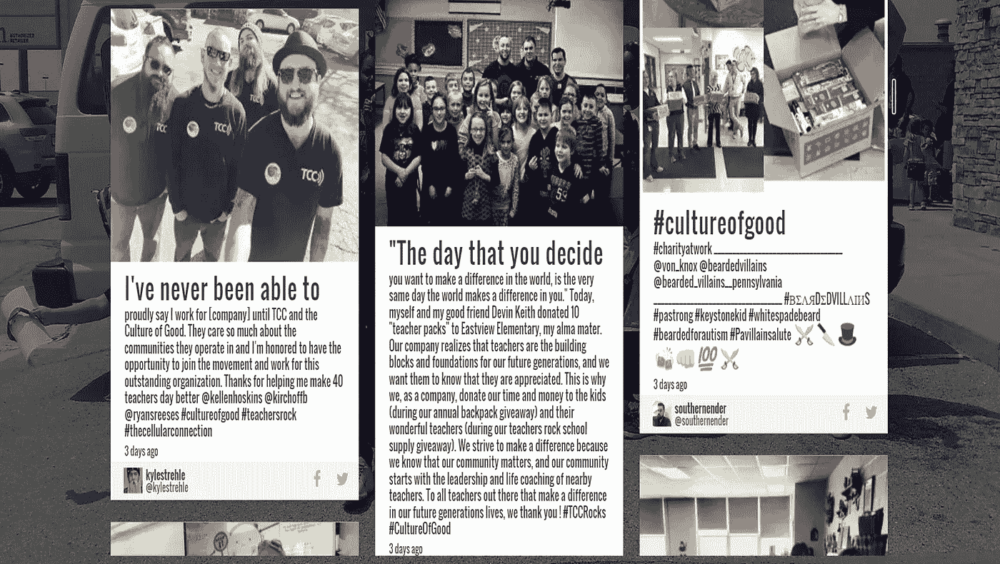

# 一个人如何开创了降低零售商 TCC 营业额的良好文化

> 原文：<https://medium.com/hackernoon/how-one-man-began-a-culture-of-good-that-reduced-turnover-at-retailer-tcc-d4aaabe43e73>

当 TCC 首席执行官 Scott Moorehead 任命 Ryan McCarty 领导美国最大的威瑞森高级无线零售商开展企业社会责任(CSR)活动时，他还是一名牧师。当时，麦卡蒂并不知道 CSR。他让你的“为什么”与“你的什么”相等的信息，启发了穆尔黑德在他成功的家族企业中做同样的事情。穆尔黑德问了麦卡蒂一个问题，这个问题在麦卡蒂的非营利职业生涯中创造了一条营利之路——你能领导公司为世界做更多的好事吗？

随着一个肯定的回答，一个新的计划形成了——善的文化。“良好文化”是一项草根倡议，旨在帮助宜家商场所在地的当地社区。最初由一个人扮演一个角色开始，今天，良好文化在每个员工的支持和授权下结出了硕果。

现在，客户忠诚度和参与度都有所提高。TCC 的流动率为 45 %,相比之下，零售行业的兼职员工平均流动率为 66%。18 至 30 岁的千禧一代占 TCC 劳动力的 85 %, 25 至 35 岁的 90%将良好的文化归功于他们的工作成就。对于 35 岁到 45 岁年龄段的人来说，这一比例只低 10%。

一个没有员工的人是如何在 1600 名员工中发起如此有影响力的运动的？

## **要素 1:意图**

该计划不是为了吸引员工，而是因为这是正确的做法。在 TCC 取得成功的阶段，Moorehead 知道是时候以新的方式回报了。穆尔黑德的父母总是回馈他们做生意的社区，但现在是每个员工都参与其中的时候了。麦卡蒂认为真实性是该项目如此成功的主要原因之一。

TCC 社区和员工参与总监 McCarty 表示:“我们的员工身上闪耀着真实性的光芒，这是一种只做好事就做好事的理念。“我们总是回到最基本的问题——“我们在乎吗？”。当我们做出决定时，从管理层到客户服务代表，我们会问‘它如何改善社区？’。"

员工可以看出组织何时创建 CRS 计划来吸引员工，而不是做好事。看起来像是捐钱，而不是时间。这看起来不像是鼓励、奖励或允许员工从工作中抽出时间来回馈社会。这看起来像是大笔一挥，而不是像麦卡蒂在 TCC 描述的那样，作为“我们的生活方式”做好事。

## **元素 2:运动的瞬间**

当由一个人在没有员工的情况下设计时，该计划必须简单且易于扩展。麦卡蒂的非营利经历教会他从小处着手，扩大规模，创造一系列瞬间来建立一场运动。

他从背包开始。当该计划在 2013 年启动时，麦卡蒂将 6 万个书包装满了学习用品，分发给 28 个州的 1600 名员工，并发起了本地化的派对，将它们分发给贫困儿童。有一个事件是一个时刻。

为了建立一个运动，麦卡蒂继续建立一个节奏的时刻。如今，TCC 每个季度都会举办一次活动，91%的商店都会参加。主题包括教师摇滚供应赠品，拯救世界，停止饥饿，和原来的背包赠品。今年，TCC 捐赠了 13.5 万个背包，另一家公司受 TCC 工作的启发，又捐赠了 10 万个背包。

## **要素 3:自主性**

TCC 良好文化的另一个关键因素是每个商店位置的自主权。为了保持公司的一致性，McCarty 提供捐赠产品并安排活动日期，但将活动规划和当地慈善选择留给商店。一些商店通过 DJ 和活动成功举办街区派对，让整个社区参与进来。

麦卡蒂说:“独自经营这个项目让我明白，我不能经营这个项目。“员工经营并拥有它。我们必须相信我们的员工自己会做好事。”

每年，员工都有 16 小时的带薪休假去做志愿者——即使是在工作时间之外。员工也可以自由地提出想法。当新员工询问回收问题时，麦卡蒂给每个商店都发了回收箱。

## **元素 4:大使**

麦卡蒂说，如果他能改变 CRS 计划的一个方面，他会更早开始大使计划。今天，每个主要地区都有 85 名大使来领导良好活动和协调的文化，并确定新的想法。大使是一个精英职位，由一个优秀的执行者来定义，他对发展良好的文化充满热情。大使候选人接受职位面试，并同意接受年度培训和每周三到五小时的良好文化活动。这份工作也扩大了他们的内部关系网，给了他们更大的职业能见度，并使他们能够学到有价值的可转移技能。

## **要素 5: CEO 支持**

员工不会接受一项运动，直到执行团队接受。没有领导的支持和积极参与，CRS 计划不会成功。对麦卡蒂来说，做好事不与销售噱头挂钩也很重要——比如他们背包赠品里的优惠券。尽管很难直接衡量收益，但 68%的 TCC 员工发现，由于良好的文化，他们的商店赢得了新顾客。TCC 现在是美国最大的威瑞森优质无线零售商，在 40 个州经营着 800 多个地点，拥有 3，000 多名员工。高管团队就在那里，和员工一起做志愿者，不再质疑这是否值得。

## **一个励志的例子**

TCC 的招聘策略已经发展到将良好文化作为一种价值观。如果候选人没有准备好把做好作为他们工作的一部分，TCC 就不会被认为是一个合适的人选。通过这样做，TCC 吸引了反映其文化的人才，并更有可能留得更久。

麦卡蒂希望激励更多的公司做好事，即使资源有限。他是一个人，扮演着一个角色，由一位首席执行官支持。下一代员工希望公司关心他们——尤其是一旦公司盈利。TCC 是如何实现当今工作场所现代化的一个很好的例子。

— — — — — — — — — — — — — — — — — — — — — — — — — — — — — — —

Crystal Kadakia 是两次 TEDx 演讲人、作家以及千禧一代和现代工作场所的顾问。她的公司 [Invati Consulting](https://www.invaticonsulting.com/) ，支持她所谓的“人才驱动的组织设计”，通过演讲、培训和咨询解决方案来实现工作场所的现代化。她是广受好评的虚拟混合培训 Generation University 和 Modern Culture Assessment 的创始人，这些培训推动组织战略性地转变文化以满足现代员工的需求。www.invaticonsulting.com 在推特上关注:@WeAreInvati

> [黑客中午](http://bit.ly/Hackernoon)是黑客如何开始他们的下午。我们是 [@AMI](http://bit.ly/atAMIatAMI) 家庭的一员。我们现在[接受投稿](http://bit.ly/hackernoonsubmission)并乐意[讨论广告&赞助](mailto:partners@amipublications.com)机会。
> 
> 如果你喜欢这个故事，我们推荐你阅读我们的[最新科技故事](http://bit.ly/hackernoonlatestt)和[趋势科技故事](https://hackernoon.com/trending)。直到下一次，不要把世界的现实想当然！

