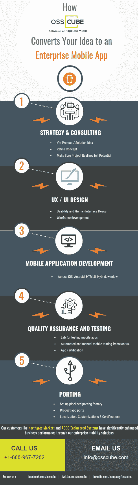

# OSSCube 如何将您的想法转化为企业移动应用程序

> 原文：<https://medium.com/hackernoon/how-osscube-converts-your-idea-to-an-enterprise-mobile-app-3a8fa5e4d5c9>

OSSCube 提供世界级的 [**企业级移动解决方案**](http://www.osscube.com/enterprise-mobility-solutions) ，无缝集成到您的生态系统中。公司通过结合移动和 [**云**](http://www.osscube.com/cloud-services) 技术来变革企业，为[移动](https://hackernoon.com/tagged/mobile)用户创造个性化体验，并使内部团队能够更好地协作和快速周转。OSSCube 端到端解决方案涵盖[设计](https://hackernoon.com/tagged/design)具有强大后端系统的解决方案，支持企业移动性。

**详见:**[http://www.osscube.com/enterprise-mobility-solutions](http://www.osscube.com/enterprise-mobility-solutions)

> [黑客中午](http://bit.ly/Hackernoon)是黑客如何开始他们的下午。我们是 AMI 家庭的一员。我们现在[接受投稿](http://bit.ly/hackernoonsubmission)并乐意[讨论广告&赞助](mailto:partners@amipublications.com)机会。
> 
> 如果你喜欢这个故事，我们推荐你阅读我们的[最新科技故事](http://bit.ly/hackernoonlatestt)和[趋势科技故事](https://hackernoon.com/trending)。直到下一次，不要把世界的现实想当然！

