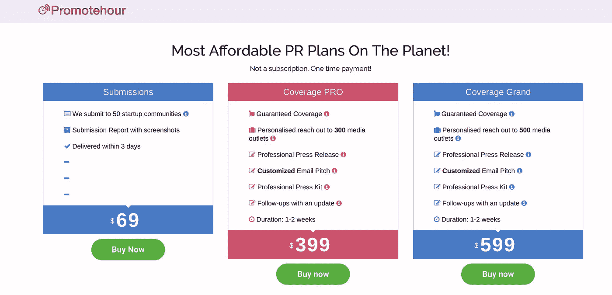
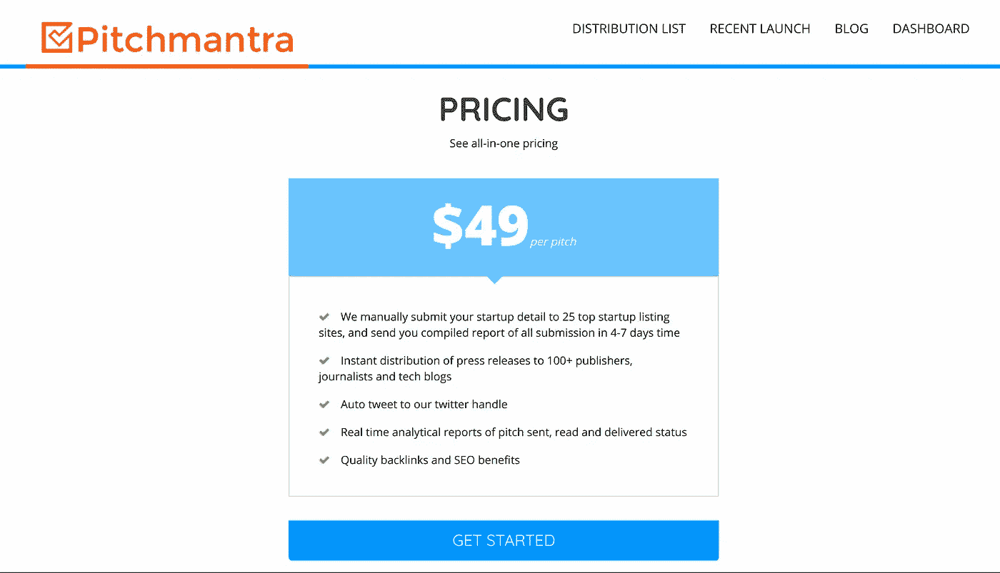
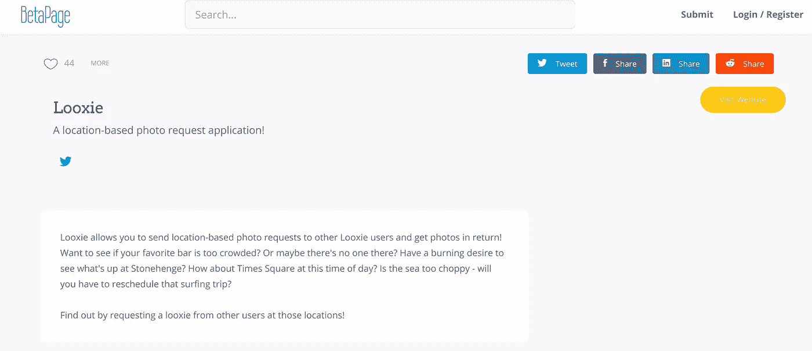
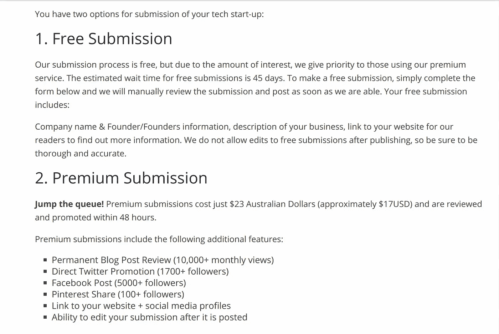

# 付费应用推广如何让我失望

> 原文：<https://medium.com/hackernoon/how-paid-app-promotions-failed-me-b0b013377b74>

Take my money

## 有一件事一直有效

去年夏天，我发布了我的 Android 应用程序，并决定尝试一下，让各种(相对)低成本的服务向一些出版物和科技博客提交我的推介。

我必须事先声明，这篇文章并不是关于这些服务的热门文章。他们做了他们承诺要做的事。我的文章仅仅关注那些付费推广的*结果*。

你可能会想，我在文章的开头就写下了这个免责声明，事情并没有真正开始。你可以想象。

# 我用的

经过一些广泛的研究(十分钟的*非常激烈的*谷歌忍者搜索和一分钟的浏览 The Verge 论坛)，我决定选择 Promotehour、Pitchmantra、BetaPage 和 TechGreet。

## Promotehour.com

以下是我免费为你添加的宣传小时公关计划，透过紫色滤镜看到的:

尽管“提交”计划的身高差异引发了我的强迫症，并导致我的 IBS 发作，但我还是选择了低成本的提交计划，因为我真的不打算在这种事情上花太多钱。另外，我还想尝试一些其他的服务。

现在，Promotehour 承诺以 69 美元的价格向 50 个创业社区提交你的申请。他们这样做了。他们将应用程序提交给 50 个创业社区，你可以免费提交，这很好，因为如果你自己做，会花很多时间。很公平。

## Pitchmantra.com

接下来，我去了 Pitchmantra 网站，这是他们提供的计划:

“为什么不呢？”我想了想，然后按下了开始按钮。

事实证明，“开始”实际上意味着“*花一个小时左右的时间与我们的应用程序搜索功能进行相扑，然后通过运气、有利的月相和黑魔法的组合找到解决方案*”，不管 Pitchmantra 的人说的是什么。这是一个非常简洁的语言，我会给他们。

在成功提交 Looxie 后，我支付了 49 美元并等待结果。

## BetaPage.co

下一站？BetaPage。BetaPage 允许你免费提交你的创业公司，然后等待几个月，或者支付 25 美元(我不知道它后来是否改变了价格)的费用，然后在 48 小时内成为特色。我选择支付 25 美元，因为我想控制实验的时间。

“精选”是什么意思？嗯，意思是这样的:

公平地说，它曾经在标题下面有一张我们登陆页面的图片，但后来被移除了(在网站重新设计后)。

BetaPage 将允许其他用户为你的应用投票，如果他们喜欢这个主意的话。Looxie 获得了 44 个赞，这使得它在专题报道当天排名第二。(2016 年 6 月 26 日)。

BetaPage 还会在他们的社交媒体账户上分享他们的特色应用。

## TechGreet.com

与 BetaPage 类似，TechGreet 让你要么免费提交你的初创公司，然后等待它被推广，要么支付 23 澳元，然后插队，这意味着你的初创公司将在 48 小时内得到推广。

事情是这样的:

23 澳币还不错。美元是澳大利亚货币的事实也让我想到“这不是一个促销计划。*那是*对我自己来说的一个推广计划”，这让我觉得很有趣，也值得门票本身的价格。

# 值得吗？

帖子的标题应该会给你一点提示。

现在，让我们诚实的说:花费大约 160 美元的推广费用并不能让一个人得到他们从专门的公关公司得到的推广。

所有这些服务基本上都是在最低层提供的

*   向许多社区提交你的应用/创业，这样你就不必亲自提交了
*   他们账户上的社交分享
*   *也许*是他们网站上的一个特色

## 我应该继续做吗？

**让我澄清一些事情:如果你打算这样做来增加你的应用安装或用户注册，*不要这样做*。至少根据我的经验，它不会给你带来安装和/或注册的提升。**

在促销活动开始后的一段时间里，我查看了一下我的应用下载和用户注册情况。

> Promotehour 和 Pitchmantra 会向您发送一份报告，证明您的应用程序已提交给他们声称要发布到的社区。
> 
> BetaPage 和 TechGreet 会向您发送一封电子邮件，通知您您的应用已被重点介绍和共享。

与正常时期相比没有任何区别。没有增加下载，没有增加注册，什么都没有。

如果你想这样做是为了 SEO，反向链接和所有我从未真正理解的魔法，也许这是值得的。

虽然在促销一年多后被警告，但当我在谷歌上搜索“Looxie”时，我被这个最初于 2010 年发布、自 2014 年以来一直没有生产的东西[超过了。](http://www.looxcie.com/)

我的错，我应该给我的应用程序起个类似 H'Sog-Shoboth 的 Lovecraftian 名字。购买与现有产品如此相似的产品对我没有任何好处。我们的另一项服务 Karkoona 排名第一，推广也相对较少。

我的结论是，尝试一下没有坏处(因为它相对便宜)，但控制你的期望也没有坏处。不要指望排名或下载量会大幅提升。你会在网上的某些地方被提及。就是这样。

此外，不要期望以这样的价格获得任何形式的个性化服务。Looxie 是 Android 的独家应用，也被发送到 iOS 评论网站，我不断收到电子邮件，告诉我他们不能在他们的网站上展示我的应用程序。至少就 Pitchmantra 和 Promotehour 而言，它只是向各种机构提交的大量电子邮件和表格。

再说一次，我没有权利期待更好的价格。只是让你知道你要面对什么。

# 那么，唯一有效的是什么呢？

哦，那很简单: **Reddit。**

Reddit 是推广你的应用程序的最好地方，只要你在你所在的 subreddit 的指导方针内做，并且不是一个太多的垃圾邮件制造者。

你不必整天呆在 Reddit 上，为社区做出有意义的贡献。制作一个信息丰富的帖子，并与那里的人分享。给一些有帮助的评论投票。成为我所说的 N*OTA bot****。***

**以下是一些帮助:**

## **r/android**

**不要在 r/android 中发布关于您的应用程序的帖子。它将在几分钟内被删除，你会得到一个虚拟的手掌拍。**

**相反，每个周六你都会发现一个名为*周六欣赏*的周线。在这个帖子的顶部，你会发现一个帖子说**【开发者应用推广在此】****

**回复这篇文章，提供一些关于你的应用的信息，以及 Play Store 或 F-Droid 的链接。*不要试图听起来像一家公司*。做人，像人一样回复。**

**如果你的应用是付费的，提供一些推广代码，这样人们就可以免费获得你的应用。这似乎特别受欢迎。**

**如果你决定每周发布你的应用程序，那就稍微改变一下。不要每次都复制粘贴相同的文本。用户会觉得无聊，你也不会再喜欢它了。最好的情况:发布你添加的新功能，或者你的应用程序的新版本如何比旧版本少消耗 90%的电池。**

**最重要的是:一周之后不要放弃。人们需要一段时间才能注意到你。**

## **r/androidapps**

**这个子编辑对应用程序提交更加友好。你可以继续发布你的应用程序，只要你坦白说你是开发者。你可以通过在文章标题前添加一个**【DEV】**标签来表明这一点。**

**只要你的应用相当有用，看起来不像完全的垃圾，你就会得到一些反馈和下载。**

**不要随便发帖子就不管了；回复人们对你的应用的每一条评论。好的和坏的。确保每个回复都在你的收件箱里，这样你就知道你收到了评论。当然，这适用于每个子网格。**

**总的来说，尽管 Reddit 可能相当残酷，但出于某种原因，r/androidapps 有点像一个和平的天堂。当然，不要把这看作是成为一个人类机器人或者一个彻头彻尾的混蛋的许可。**

## **我怎么知道 Reddit 有用？**

**很简单:每次我在每周的应用推广线程或 r/androidapps 中发布帖子时，我都会看到下载量的显著增加。**

**当然，下载数量并不是衡量成功的唯一标准:通过 Reddit 下载 Looxie 的人通常是 Looxie 最活跃的用户，正如发给我的电子邮件所显示的那样。**

**我还确信，所有在每周精选和本周最佳应用综述中提到 Looxie 的博客、播客和技术网站都是通过 Reddit 发现这个应用的。**

**我不能 100%肯定这一点(没有确凿的证据)，但当我发布一个重大更新或过了一段时间后再次发布(在 Reddit 上)时，Android 博客或技术网站很快就会将该应用程序纳入他们的应用程序综述。这种情况经常发生。**

## **结论**

**也许我对付费推广网站有点苛刻。我认为对结果失望是我的错，因为我有不切实际的期望。**

**标题可能不应该是“付费应用推广如何让我失望”,而是“我如何不知道我想从付费应用推广网站得到什么，但还是继续为他们的服务付费”。天啊，真是个混蛋。但这并不吸引人。**

**我的建议？避免在你的应用中使用这种营销方式。可能越贵的套餐效果越好。事实上，我很乐意听到任何从这些服务中获得任何成功的人的意见(不，他们网站上的推荐不算)。**

**相反，把你的表演带到(虚拟的)道路上。上 Reddit。与你的用户交流。给一个狗屎，看起来像你在努力。然后，如果你的应用真的值得关注，你就会得到它。**

************

> **[黑客中午](http://bit.ly/Hackernoon)是黑客如何开始他们的下午。我们是 [@AMI](http://bit.ly/atAMIatAMI) 家庭的一员。我们现在[接受投稿](http://bit.ly/hackernoonsubmission)，并乐意[讨论广告&赞助](mailto:partners@amipublications.com)机会。**
> 
> **如果你喜欢这个故事，我们推荐你阅读我们的[最新科技故事](http://bit.ly/hackernoonlatestt)和[趋势科技故事](https://hackernoon.com/trending)。直到下一次，不要把世界的现实想当然！**

****