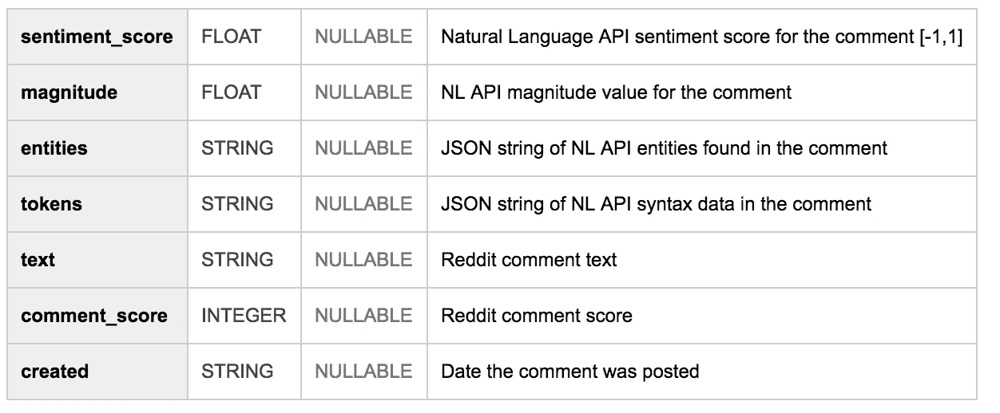
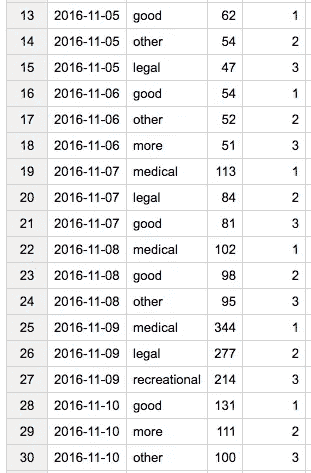
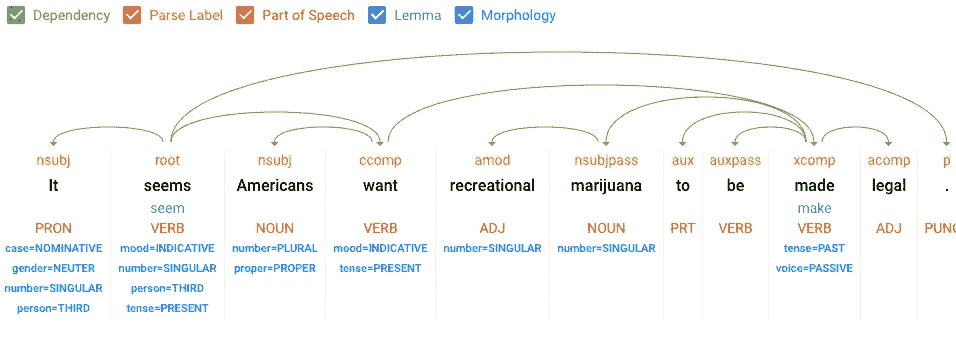
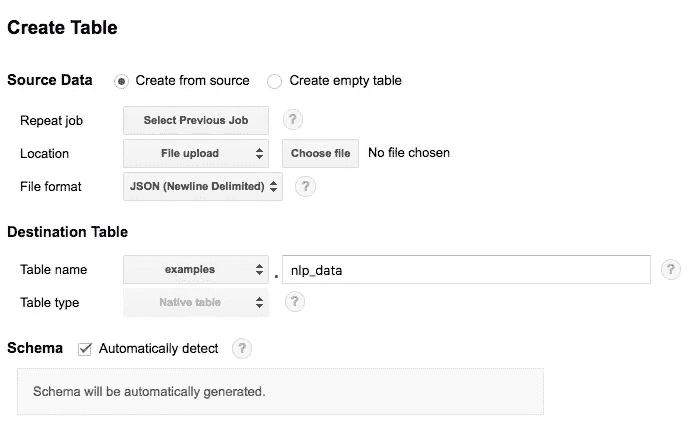
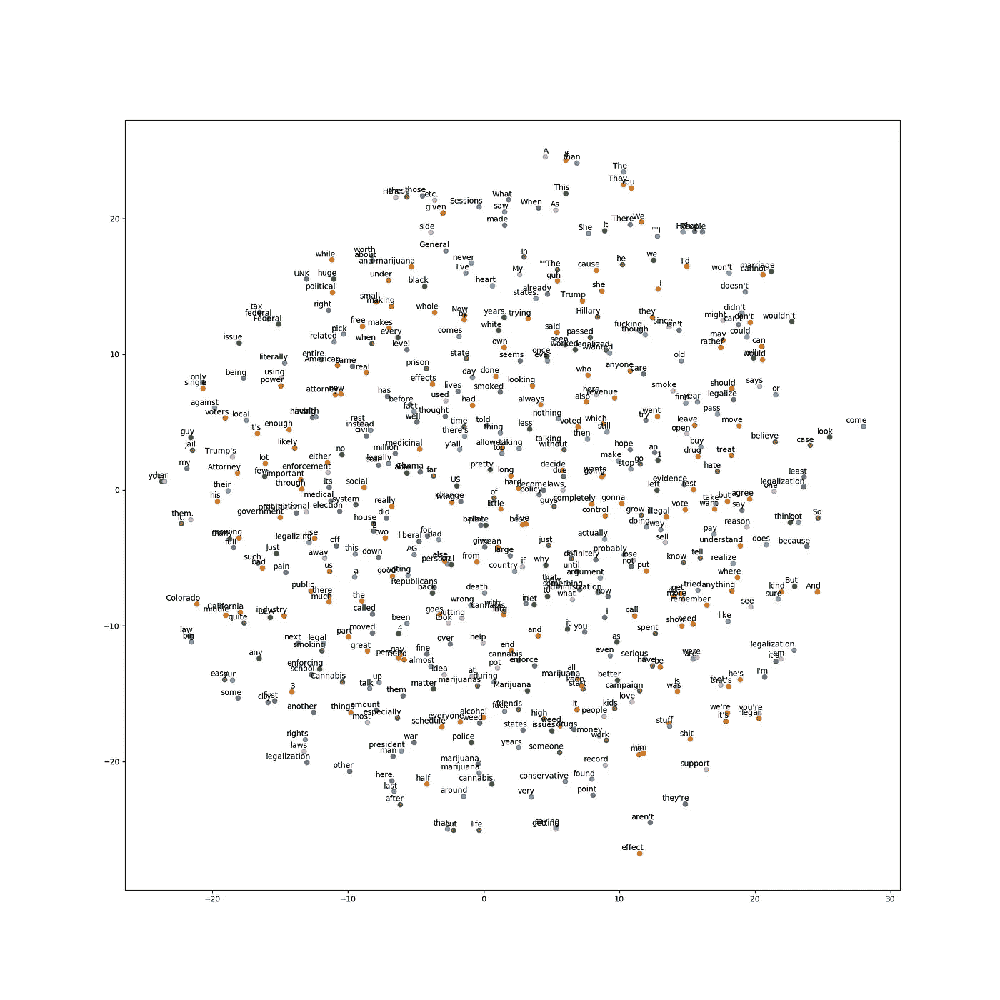

# 人们如何在 Reddit 上谈论大麻:自然语言分析

> 原文：<https://medium.com/hackernoon/how-people-talk-about-marijuana-on-reddit-a-natural-language-analysis-a8d595882a7a>

为了纪念今天是 4 月 20 日[，我觉得在 Reddit 上做一些关于大麻的 NLP 评论会很有趣(为这个想法向](https://en.wikipedia.org/wiki/420_(cannabis_culture))[国玉峰](https://twitter.com/yufengg?lang=en)大声喊出来！).我的队友 [Felipe Hoffa](https://medium.com/u/279fe54c149a?source=post_page-----a8d595882a7a--------------------------------) 已经方便地让[所有 Reddit 评论在 BigQuery](https://bigquery.cloud.google.com/dataset/fh-bigquery:reddit_comments?pli=1) 中可用，所以我提取了这些评论的子集，并通过谷歌的[自然语言 API](https://cloud.google.com/natural-language/) 运行它们。

# 评论数据

*   我只看了 2016 年 11 月表格中的评论，因为在那段时间通过了许多大麻立法
*   在 2016 年 11 月的 7100 万条评论中**，49717 条评论(. 07%)包含“大麻”或“大麻”字样**。
*   为了质量控制，我只查看 Reddit 评分> 100 的评论。我还将数据集缩小到英文评论。这样，我只剩下 **12，789 条评论来分析**。以下是我的 BigQuery 模式:



# **2016 年 11 月日评论数**

整个 11 月与大麻相关的评论量是什么样的？

我们看到围绕选举的评论数量激增，这是有道理的:七个州在 2016 年选举期间改变了大麻法律。

# 人们在谈论大麻时会用什么形容词？

自然语言 API 的语法分析方法告诉我们一个句子中每个单词的词性，这使得获取这些注释中使用的所有形容词变得很容易。哪些形容词最常与“大麻”和“大麻”连用？

我还想知道一个月中每天使用的最常用的形容词是否会发生变化。利用 BigQuery 便利的分区功能，我用这个查询找到了每天使用最多的三个形容词:

```
SELECT * FROM (
  SELECT day, adjective, count(*) c, 
  row_number() over(partition by day order by count(*) desc) seqnum
  FROM `sara-bigquery.reddit_pot_nlp.adj_day`
  GROUP BY 1, 2
  ORDER BY day, c desc
)
WHERE seqnum <= 3
ORDER BY day
```

下面是从 11 月 5 日到 10 日的输出片段(第 4 列是一个单词的提及次数，最后一列是上面查询中的`seqnum`):



我们可以看到，“好”、“更多”、“其他”和“法律”是整个月份词汇的一部分，但在选举期间，形容词“医疗”和“娱乐”开始发挥作用。

# 人们在谈论大麻的时候还会谈论些什么？

自然语言 API 的 [analyzeEntities](https://cloud.google.com/natural-language/docs/reference/rest/v1/documents/analyzeEntities) 端点可以告诉我们！它将从我们的文本中提取任何已知的实体，以及它们的维基百科 URL(如果存在的话)。以下是 Reddit 上最常见的与大麻相关的实体:

# 开始使用您自己的文本

想在与大麻无关的文本上做这种事情吗？那也很酷。这种 NL 分析可以应用于任何类型的文本——新闻文章、客户服务反馈、语音转录等等。

你可以用你自己的文本直接在浏览器中尝试自然语言 API [。例如，下面是我上面的数据集中的一个注释的语法注释结果:](https://cloud.google.com/natural-language/)



如果您想遵循我在本分析中使用的方法，以下是步骤:

*   从 BigQuery 获取您想要分析的 [Reddit 数据](https://bigquery.cloud.google.com/dataset/fh-bigquery:reddit_comments?pli=1)。将结果作为 JSON 下载到本地文件
*   从本地文件读取，将文本发送到 NL API，并将 NL 输出写入一个单独的文件。你可以用你最喜欢的语言做到这一点，我在这里用了 Node.js — [代码](https://gist.github.com/sararob/b0b299cad9c1aa7558cedbdf95fad65f)。
*   将您的换行符分隔的 JSON 文件上传到 BigQuery，它可以自动检测模式:



前进，处理你的文本！

# **额外:使用单词嵌入训练自定义文本模型**

机器学习 API 非常神奇，因为它们获取你的数据，并向你返回关于它的详细信息——所有这些都不需要你思考引擎盖下发生了什么。

你可以把它想象成订购糕点:你付钱，面包店给你一块巧克力曲奇。这将导致一个美味的饼干很多时候，但有时你可能会决定你想添加白巧克力片或太妃糖位到您的饼干。在这种情况下，你将不得不*定制*它，这可能包括自己制作它，即使它可能会破坏一些魔力。当你克服了这种恐惧之后，你可以使用别人写的食谱(BYO 配料),或者过危险的生活，写你自己的食谱。

机器学习相当于从零开始制作你的 cookie，是用你自己的数据建立和训练一个模型。我最近开始通过查看 [word2vec](https://code.google.com/archive/p/word2vec/) 来探索机器学习的这一方面:一个用于学习数据集中单词之间关系的模型。顾名思义，它将单词作为输入，输出*单词向量*:一组文本中一个单词的向量表示。

使用 GitHub 和本教程上的 word2vec [示例，我向模型输入了 Reddit 评论数据的子集(约 55k 个单词，8k 个唯一单词)，以生成单词嵌入的可视化:](https://github.com/tensorflow/tensorflow/blob/master/tensorflow/examples/tutorials/word2vec/word2vec_basic.py)



单词嵌入本质上是通过从大的文本数据集中提取有意义的单词并确定它们之间的语义关系来将单词映射到向量。我们可以在上面的可视化中看到，该模型在将相关单词聚集在一起方面做得非常好:“权利”、“法律”和“合法化”被分组在一起，就像“大麻”和“大麻”一样。

**下一步？我可以使用这个训练好的模型来预测评论的主题或者生成新的评论。我刚开始做定制款，所以很想听听大家的反馈和建议！请发表评论或在 Twitter 上找到我。**

# 想做更多的大麻分析？

我的同事艾伦·戴(Allen Day)在 BigQuery 上发布了 1000 种大麻的基因组数据。[详情在此](/google-cloud/dna-sequencing-of-1000-cannabis-strains-publicly-available-in-google-bigquery-a33430d63998)，或者前往 BigQuery 查看[公共数据集](https://bigquery.cloud.google.com/dataset/bigquery-public-data:genomics_cannabis)。

[](http://bit.ly/HackernoonFB)[](https://goo.gl/k7XYbx)[](https://goo.gl/4ofytp)

> [黑客中午](http://bit.ly/Hackernoon)是黑客如何开始他们的下午。我们是 [@AMI](http://bit.ly/atAMIatAMI) 家庭的一员。我们现在[接受投稿](http://bit.ly/hackernoonsubmission)，并乐意[讨论广告&赞助](mailto:partners@amipublications.com)机会。
> 
> 如果你喜欢这个故事，我们推荐你阅读我们的[最新科技故事](http://bit.ly/hackernoonlatestt)和[趋势科技故事](https://hackernoon.com/trending)。直到下一次，不要把世界的现实想当然！

