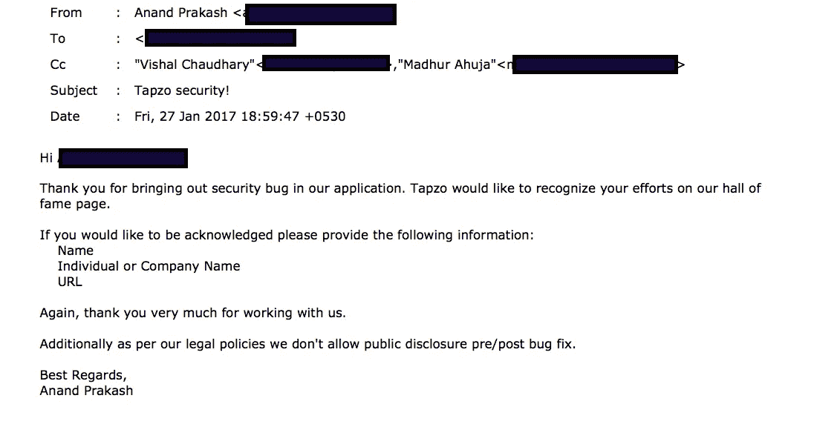
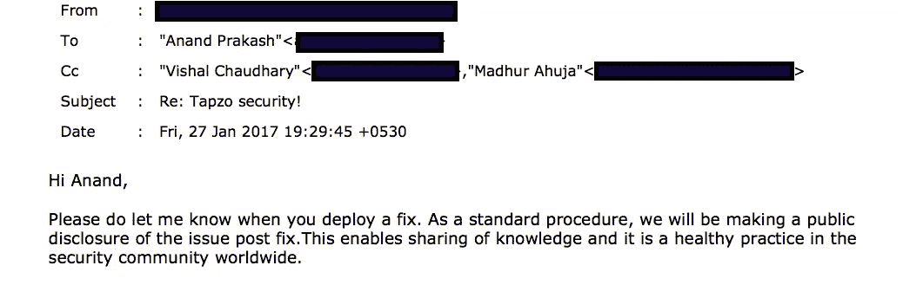
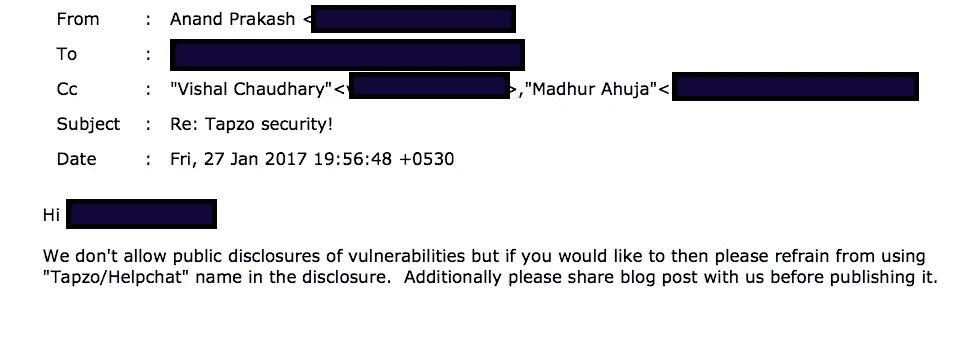
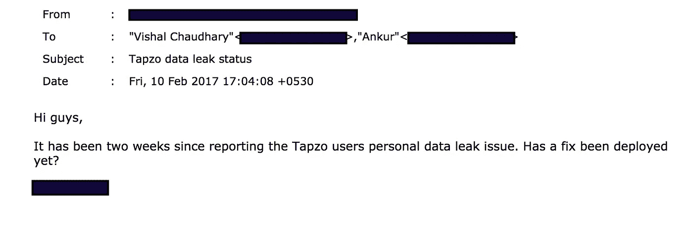

# 创业支点如何导致用户数据泄露漏洞

> 原文：<https://medium.com/hackernoon/how-pivoting-a-startup-led-to-users-data-leak-vulnerability-8c27c7ca9143>

我们有一个相当有趣的数据泄露故事要分享。存在漏洞的公司拥有超过 500 万用户。API 端点之一可用于迭代所有用户数据，包括姓名、电话号码、电子邮件地址、个人资料图片、用户元数据和保存的物理地址。数据泄漏现在看起来已经修复了，但是我们还没有收到他们的回复或确认，所以我们可以在发布前按照他们的要求分享这篇文章。

消费科技公司的数据泄露实际上使其用户面临各种问题，包括身份盗窃、物理诈骗、垃圾邮件甚至威胁。最近在印度发生了一起预付费手机充值商店出售随机女性电话号码赚钱的事件。电话号码也可以在脸书上搜索。

这是我们发送的披露漏洞的完整电子邮件以及技术细节。(curl 请求中用于第三方服务的额外 HTTP 头已被移除，并且 auth 令牌已被更改。我们还删除了带有用户个人数据的 curl 响应。)API 使用一个 [JSON Web 令牌(JWT)进行身份验证](https://jwt.io/)，这可能会在 pivot 之前的应用程序中使用。在 pivot 之后，该公司为较新的应用程序添加了另一个 JWT，但继续使用早期的代码从旧令牌中获取经过认证的用户 id，从而开放对所有用户数据的访问。解码后的 JWT 包含以下数据，id 是一个小整数，可以迭代并创建新的令牌来获取相应的用户数据。

*{“用户名”:空，“身份证”:XXXX，“手机”:“YYYYYYYYYY”，“过期”:180558878080}*

> 嗨，创始人，
> 
> 我们研究了移动应用程序使用的 API 中的一个安全漏洞，该漏洞会暴露用户的个人数据，可能包括电子邮件、电话号码、姓名和地址。以下是重现该问题的技术细节。我们假设通过同一个 API 同时支持 Akosha 和 Helpchat 客户端，使用了两个 JWT 身份验证令牌，只有 Akosha 令牌得到验证，但是这个端点的已验证用户 id 是从 Helpchat 令牌中提取的。可以更改 Helpchat 令牌中的 userid，并且可以使用枚举所有用户 id 的脚本来获取所有用户数据。提取的样本数据显示在 curl 请求的下方。
> 
> 请让我们知道你什么时候修理这个。
> 
> 问候，
> 
> XXXXXX
> 
> [https://fallible.co](https://fallible.co/)
> 
> curl-H ' Host:[API . HELPCHAT . in](http://api.helpchat.in/)'-H ' User-Agent:HELPCHAT/3 . 2 . 1 . 1 cf network/808 . 0 . 2 Darwin/16 . 0 . 0 '-H**' X-HELPCHAT-AUTH:eyj 1c 2 vyx 25 hbwuiom 51 bgwsimlkijpwfhywfhywfgsim 1 vymlszsi 6 ilhywfhywfhywfhywfghigilcjlehbpcmvzijoxodawnrc 4 = . ODC 4 mdgwfquza**

# 邮件回复:

**#1**

Interestingly, there was no hall of fame page for the concerned company. It was an improvisation.

**#2**

**#3**

**#4**

这是我们在 2017 年 2 月 10 日发送的最后一封电子邮件，询问是否应用了修复程序。我们还没有收到回复，但是已经确认错误已经被修复。可悲的是，这种根本不与安全研究人员沟通或在修复后不允许公开披露的做法在南亚比其他成熟市场更为普遍。我们真诚地希望这些公司能够意识到这些安全问题，至少告知他们的用户。

> [黑客中午](http://bit.ly/Hackernoon)是黑客如何开始他们的下午。我们是 T21 家庭的一员。我们现在[接受投稿](http://bit.ly/hackernoonsubmission)并乐意[讨论广告&赞助](mailto:partners@amipublications.com)机会。
> 
> 如果你喜欢这个故事，我们推荐你阅读我们的[最新科技故事](http://bit.ly/hackernoonlatestt)和[趋势科技故事](https://hackernoon.com/trending)。直到下一次，不要把世界的现实想当然！

