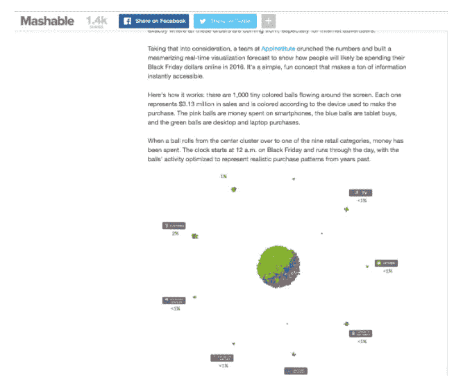
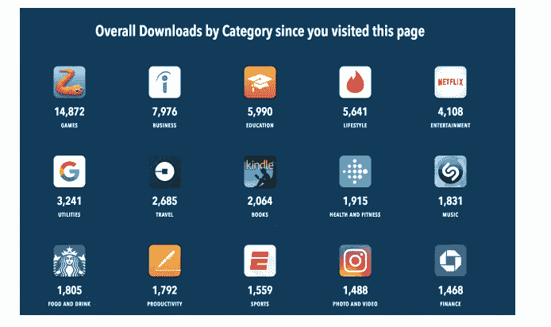
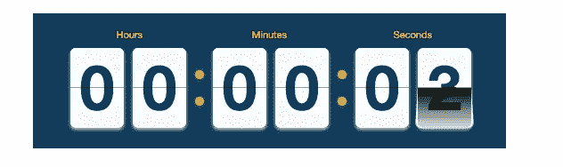
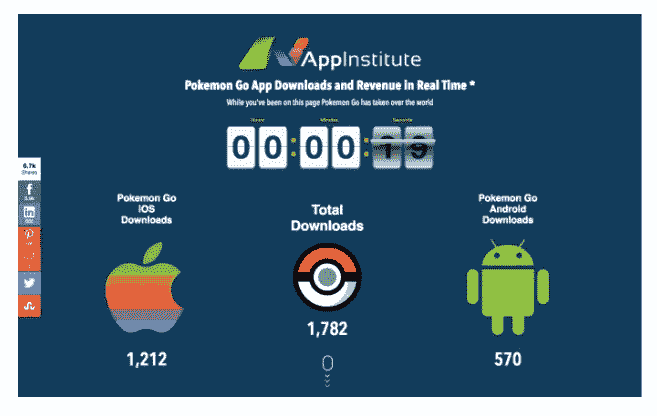
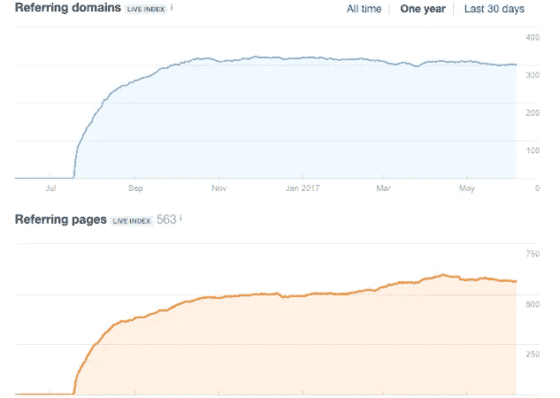
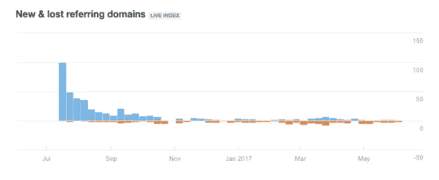
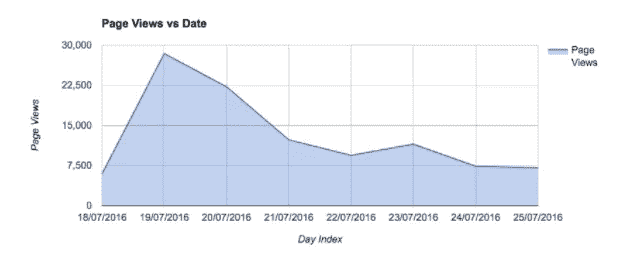
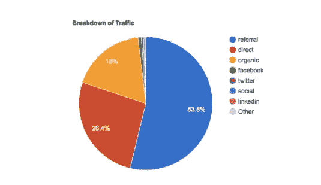

# 口袋妖怪 Go 和反向链接策略如何帮助我们公司淘金

> 原文：<https://medium.com/hackernoon/how-pokemon-go-and-a-backlinking-strategy-helped-our-company-strike-gold-41bc9ae947e6>

这是《口袋妖怪 Go》背后的公司任天堂和 Niantic 在 2016 年夏天发生的事情。增强现实手机游戏几乎在一夜之间成为一种全球现象。

在商业的其他时候，黄金可能只是打击一家公司。

至少这是 2016 年夏天在 AppInstitute 的感觉，当时我们在网站上发布了一段与口袋妖怪相关的内容，引起了如此大的反响，以至于我们的服务器崩溃了。好吧，当我这样说的时候，这听起来不太像黄金——尤其是与 Niantic 通过他们的应用赚得的数十亿美元相比。但是，还是。口袋妖怪对我们来说是件大事。也许一点背景知识会有帮助。

# 宝贝回来了(链接)

在过去的几年里，我们一直在构建公司博客，重点关注移动应用和[营销](https://hackernoon.com/tagged/marketing)的交集。

事实证明，那是一个非常繁忙的十字路口。

我们投资于创造高质量、可分享的内容，其他人也是如此。这是因为我们现在都是内容营销者:这是谷歌对我们的要求。

我的意思是，他们并没有真的要求这样做，但是他们的算法被设置来评估一个网站与任何搜索的相关性，这使得一个面向内容的策略是必要的。SEO 和维护页面排名不仅仅是在你的网站上有正确的关键词。谷歌也会考虑链接到你的其他网站的数量(和种类)来决定你在搜索结果中的排名。链接回来的网站越“重要”或受欢迎，谷歌的权重就越大。把反向链接想象成你的朋友为你担保:你的朋友越受尊敬，他们的支持就越有价值。

此外，谷歌表示，这些链接需要是自然的。这是一种模糊的描述，但意图是明确的。用最简单的话来说:一个不自然的链接就是我把我的 URL 放在了一篇 Mashable 文章的评论部分。一个自然的链接将是一个 Mashable 文章，使用我的内容作为一个来源，并链接回它([咳咳](http://mashable.com/2016/11/17/black-friday-2016-online-shopping-visualization/#3WpVZ94l9OqA))。

无论如何，这是我们在 2016 年初夏发现自己的地方。我们的博客吸引了大量的访问者，定期的发帖和社交提及传播了这个消息。我们的排名很高，但很脆弱。保持相关性是一场持久战，所以我们真的专注于建立反向链接。我们越能让其他网站将我们视为权威，我们对令人垂涎的第一页列表的把握就越深。

为此，我们集思广益，将互联网的注意力引向我们。我们想要一些轻松、可分享的东西，有足够的实证分量，让它对寻找故事的科技作家和博客作者有吸引力。

最终，我们决定使用一个带有实时统计计数器的网页。在这种情况下，我们希望专注于移动应用的增长。我们将展示顶级移动应用程序的应用商店下载量和收入越来越高。

我们设计了计数器，这样每当用户登陆页面时，它就从零开始计数。

让这个计数器更具共享性的是能够实时查看下载量和收入增长。它给了用户上下文。我们都同意这是一个可靠的计划，并继续进行页面设计和营销研究。

然后 Pokemon Go 就发生了。

# 我喜欢赚大钱，我不能说谎

2016 年 7 月 6 日，我们正在对我们的应用程序柜台进行最后的润色，并已经制定了完整的推广战略。

同一天，Pokemon Go 在苹果和安卓应用商店首次亮相，创造了约 400 万美元的收入。在 13 个小时内，它占据了苹果最高票房应用排行榜的首位。我们的团队立即就这些数字的两个观察结果达成一致:

1.  天哪，那可是一大笔钱！(完全披露:我们没有说“莫利。”)
2.  我们需要围绕这个令人难以置信的故事重新调整我们的下载和收入计数器。

关于第二个观察，这是显而易见的，即使我们离自己的发射只有几天了。创造可分享的内容，没有比让它成为当下的东西更好的方法了。内容应该总是最新的，但这次不同。口袋妖怪 Go 是巨大的，世界有一个共享的时刻。不利用我们得到的机会是愚蠢的。我们也认识到，时刻是有尽头的，我们需要在热潮消退、人们厌倦听到它之前，尽快完成这件事。

这就是我说的“金子击中了我们”的意思。因为它在排行榜上名列前茅，Pokemon Go 无论如何都会成为我们帖子的一部分——但它只会是“最高票房游戏”名单上的一个项目。但在那一刻，有这么多的宣传围绕着游戏的成功，感觉就像我们得到了一份营销礼物。

结果证明我们是对的。

虽然我们保留了页面的大部分内容，但我们给了口袋妖怪 Go 柜台一个位置，上面写着:“当你在这一页时，口袋妖怪 Go 已经占领了世界。”那使一切都不同了。该活动取得了巨大的成功:在 7 天内，我们的网站吸引了 92，000 名访客——我之前说流量激增导致我们的服务器崩溃并不是开玩笑。我们还积累了近 450 个新的反向链接(279 个来自“高权威”域名)，*和*我们开始为 294 个新关键词排名。

我们所要做的就是改变我们内容的重点，以迎合口袋妖怪 Go 的热潮。还有一大堆升职。你没想到会这么容易，是吗？

# 拿一个普通的应用软件人来说，告诉他:它必须包含很多统计数据

当我们的编码人员正忙着修改页面，使其成为新的以口袋妖怪为中心的主题时，我们回到了开始，以确定我们将向谁推广我们的页面。我们将观众缩小到两个(相当大的)类别:

*   口袋妖怪粉丝，我们通过搜索，然后加入关于这个话题的用户社区和论坛找到他们。我们还搜索了社交媒体渠道上的用户和群体。
*   –记者和博主，他们不像粉丝那样容易找到。我们的研究为我们提供了一些很棒的 Twitter 列表，我们能够识别许多科技作家和博客的名字和 Twitter 账户。从那里，我们使用软件——和服和电子邮件猎人——自动检索他们所有的电子邮件地址。

我们编制了我们认为对口袋妖怪计数器最感兴趣的论坛和用户的总列表。当网站上线时，真正的工作才开始。我们做了许多努力来确保正确的人知道这些内容:

*   –对于我们有电子邮件地址的每个人，我们都发送了一封电子邮件。不过，我们使用 Replyapp 将这封邮件作为一个活动来管理，这样我们就可以监控它的进展和结果。每封邮件都是个性化的(称呼对方的名字)，正文简短扼要。基本上:我们有关于口袋妖怪 Go 热潮的统计数据，你可能会感兴趣。[这里是网址](https://venturebeat.com/2016/07/19/sensor-tower-pokemon-go-has-already-passed-30m-downloads-and-35m-in-revenue/)。它比那更优雅一点，但是你得到想法。
*   –对于 Twitter 用户，我们不只是发送一条冷冰冰的 DM，希望他们会阅读。相反，我们让团队成员一个接一个地检查我们名单上的每个人。他们会关注这个人，就像他们的一条推文一样，转发这条推文，然后发送一条或多或少与邮件内容相同的 DM。
*   –还是在 Twitter 上，我们在主推广账户的提要顶部发布了一篇文章，其中包含了计数器的链接。然后，我们使用软件来自动喜欢任何使用与口袋妖怪相关的关键字的帖子。
*   –我们使用 [Facebook Messenger](https://bitly.is/socialcommerce2016) 联系了脸书上我们名单中的人，还在我们之前确定的几个社区论坛上发布了链接。
*   –在口袋妖怪粉丝论坛上，我们创建了账户，并发布了我们柜台的链接。
*   –我们在 Quora 上也很活跃，询问和回答关于 stat 网站的问题，并随着问题出现在其他人的订阅中而获得曝光率。
*   –因为我们在这一点上全押了，所以我们认为我们也应该在促销上投入一些钱。我们在 Google Adwords 上开展了一项针对口袋妖怪相关搜索的活动。利用[脸书](https://bitly.is/fbads101)的广告，我们的活动针对对《口袋妖怪 Go》感兴趣的记者和作家。现在想来，这是一个奇怪而微小的利基市场。但是如果他们存在，我们会找到他们的。

# 他们被迷住了，无法停止凝视

现在该是我回顾结果以及这一切进展如何的时候了，但是我已经做了。此外，这篇文章的重点不是陶醉于我的团队的成功。关键是我们都从那次成功中学到了一些东西。我知道我们的技术团队在我们的服务器崩溃的时候。

巨大的反应让我大吃一惊，这让我后退一步，看看背后是什么。虽然我们知道它可能会很大，但我从未想到我们的内容会得到这样的回应。我们都知道创造引人入胜和有趣的内容是起点。内容应该是主题性的——主题越大，回应越好。

我们有点幸运，因为我们已经在做一些非常适合这个夏天的科技故事的东西。你可以打赌，我会密切关注下一个会成为好话题的大现象。

虽然互联网的本质使内容很容易像病毒一样传播，但你首先还是要把这些内容呈现在合适的人面前。所有的病毒式内容都始于第一次分享:找到一整群可能会分享它的人，你就领先了。但是你必须找到那些人。没人说数字营销的成功会很容易。你的内容策略需要精心规划——规划每一个细节，并重点针对你的促销活动。

如果你想获得令你惊讶的结果，你需要完全有条理。

*原载于 2017 年 6 月 6 日*[*bitly.com*](https://bitly.com/blog/backlinking-strategy/)*。*

> [黑客中午](http://bit.ly/Hackernoon)是黑客如何开始他们的下午。我们是 AMI 家庭的一员。我们现在[接受投稿](http://bit.ly/hackernoonsubmission)并乐意[讨论广告&赞助](mailto:partners@amipublications.com)机会。
> 
> 如果你喜欢这个故事，我们推荐你阅读我们的[最新科技故事](http://bit.ly/hackernoonlatestt)和[趋势科技故事](https://hackernoon.com/trending)。直到下一次，不要把世界的现实想当然！

