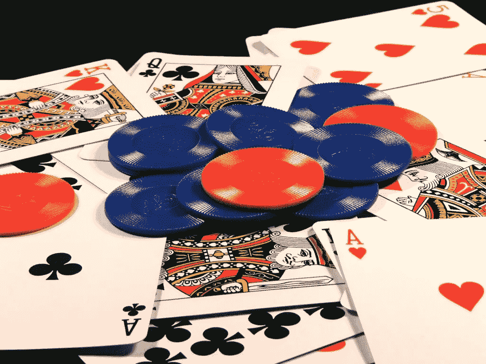

# 扑克如何让我为交易工作做好准备

> 原文：<https://medium.com/hackernoon/how-poker-prepared-me-for-a-job-in-trading-782fa2408391>

在交易或投资银行的工作中，你需要的许多技能在学校里都会学到。不过，通常情况下，将优秀者从其他人中分离出来的技能不是在课堂上教授的，而是通过参加运动队和其他课外活动和爱好培养的。对于我们最近的[播客](http://breakingbaystreet.com/bbs-episode-6/)的主题，他磨练了玩[扑克](https://hackernoon.com/tagged/poker)的技巧，这将使他成为一名伟大的交易者。

TP 是加拿大一家最大银行的股票交易员，他解释说，在进入金融界之前，他最初的职业是职业扑克玩家。在我们的采访中，TP 在成功的扑克玩家和成功的交易者之间做了一个惊人的类比。

在扑克游戏中，你可以了解纸牌、游戏、数学和概率，但这并不能让你成为一名优秀的扑克玩家。一个好的扑克玩家必须能够在压力下通过同时分析多个因素做出好的决定:赔率、数学、前景和牌桌上的其他人。要成为一名出色的扑克玩家，你必须知道什么时候该虚张声势，明白什么时候别人在虚张声势，知道什么时候你需要跟注。

这些也是你成功交易所需要的技能。作为交易者，你需要能够根据多种经济因素、几率、数学、压力和人来快速做出决定。就像在扑克中一样，你可以理解数学、赔率和模型，但你需要能够利用你的直觉来解读字里行间，并理解这是否是一笔好交易。你的客户是不是告诉你他们只有 10 万股要卖，而实际上他们有 100 万股？就像玩扑克一样，你必须知道什么时候该虚张声势，明白什么时候别人在虚张声势，知道什么时候你需要跟注。能够结合所有这些能力是一个人成功的原因。

你需要能够利用你在课堂之外的经历来帮助你在事业上取得成功。不管你的背景如何，过去让你成功的原则可以转化为今天的成功。

当我在二年级的时候，我曾经要求人们为我送的一份独立报纸付费。人们不需要为此付费，但自愿付费是这份独立报纸得以生存的原因(很像维基百科的捐款)。店主不是傻瓜；每收 2 美元，他付给我 0.75 美元，所以我很有动力去卖。这次经历对我来说是一个很好的机会，让我学会如何与成年人交谈，更重要的是，如何向他们要钱。不管过去有多少次有人说不，我每个月都会去敲他们的门，问他们是否愿意为报纸付钱。正是在这里，在二年级的时候，我学到了坚持不懈和找到与客户的共同点是达成销售的关键。

无论是团队合作、下棋、即兴表演、打扑克还是为你的报纸路线收集，你都必须能够识别出你一路上获得的有价值的特质，并将它们应用到你当前的事业中。否则你就是在浪费一生的经验教训！

原载于

******

> *[黑客中午](http://bit.ly/Hackernoon)是黑客如何开始他们的下午。我们是 [@AMI](http://bit.ly/atAMIatAMI) 家庭的一员。我们现在[接受投稿](http://bit.ly/hackernoonsubmission)并乐意[讨论广告&赞助](mailto:partners@amipublications.com)机会。*
> 
> *如果你喜欢这个故事，我们推荐你阅读我们的[最新科技故事](http://bit.ly/hackernoonlatestt)和[趋势科技故事](https://hackernoon.com/trending)。直到下一次，不要把世界的现实想当然！*

**