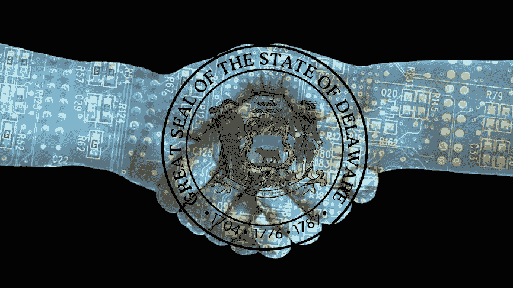

# 特拉华州公司法的拟议修改如何支持区块链公司和股票交易

> 原文：<https://medium.com/hackernoon/how-proposed-changes-to-delaware-corporate-law-enables-blockchain-corporations-and-stock-ce3b24bf5b57>

Image Credit: CryptoNinjas ([cryptoninjas.net](http://www.cryptoninjas.net))

*免责声明:以下分析仅供参考，不构成法律意见。你应该联系律师寻求关于任何特殊问题的建议。使用和访问这篇文章不会在作者和用户或读者之间产生任何律师-客户关系。*

在过去的两个月里，T2 区块链法律领域的行动可能比前两年的总和还要多。自去年 12 月以来， [Overstock 通过区块链股票发行](http://www.coindesk.com/overstock-first-blockchain-stock-issuance/)筹集了 1090 万美元，比特币基地发布了[他们提议的区块链代币证券框架](https://www.coinbase.com/legal/securities-law-framework.pdf)，而 [SEC 否决了文克莱沃斯双胞胎的比特币 ETF](https://www.sec.gov/rules/sro/batsbzx/2017/34-80206.pdf) 。这些行动是对区块链监管框架的首批重大基础性贡献，将在未来几年或几十年塑造该行业和交易。

特拉华州信守其作为商业相关法律领导者的承诺，通过宣布特拉华州普通公司法(“DGCL”)[的拟议修正案，加入了区块链相关法律创新的最新潮流，该修正案将承认“分布式分类账股份”是跟踪和计算公司股票的合法方法](https://www.cooley.com/news/insight/2017/2017-03-15-newly-released-delaware-corporate-law-amendments-would-permit-blockchain-shares)。如果获得特拉华州大会的通过，这个以商业友好闻名的州的公司可以期待从 2017 年 8 月 1 日起通过分布式账本合法发行股票。

这些变化将允许公司利用区块链来大大减少或消除股票交易和管理的时间和金钱成本。传统上为资产交易和记录提供便利的昂贵的中间人(如中央证券托管机构、审计师、交易所或转让代理)可能会被能够以很少的价格(甚至免费)提供相同服务的分布式分类账淘汰。此外，区块链加密跟踪系统固有的股票可能会被纳入[智能合约](http://blockgeeks.com/guides/smart-contracts/)，允许自动化资产管理和转移，减少对托管服务、经纪人和律师的依赖。随着[特拉华州区块链倡议](http://global.blogs.delaware.gov/2016/06/10/delaware-to-create-distributed-ledger-based-share-ownership-structure-as-part-of-blockchain-initiative/)建议的这些变化，特拉华州将再次证明为什么它被称为“最有利于创新的州”，朝着实现《哈佛商业评论》的预测迈出关键的监管一步，“[区块链将对金融业产生与互联网对媒体产生的影响](https://hbr.org/2017/03/the-blockchain-will-do-to-banks-and-law-firms-what-the-internet-did-to-media)相同的影响。”

[提案本身](https://www.cooley.com/~/media/cooley/pdf/alerts/council-2017-proposals-in-bill-form.ashx?la=en)主要集中于股票的记录保存和发行。对第 151(f)条、第 202(a)条、第 219(a)条、第 224 条和第 232 条的拟议修改修改了 DGCL 的措辞，以更好地反映从硬拷贝到电子记录保存和通知发布的演变，为区块链开展此类进程铺平了道路。对第 219(c)条和第 224 条的拟议修改特别重新定义了术语“库存分类账”,以包括通过区块链等电子网络管理的库存分类账。此外，公司将不再需要亲自维护这些记录，现在可以合法地依靠“分布式电子网络和数据库”来做。任何分布式分类账都可以用于这些功能，只要它符合 224 的规定，执行三个功能:方便公司准备当前的股东名单；满足 DGCL 其他章节(特别是 156、159、217(a)和 218)的记录保存要求；并根据其他 DGCL 法案(如 159)记录区块链支持的股票转让。这些变化的最终结果是，特拉华州的公司可以依靠区块链系统作为股票管理、转让和跟踪的数字“信任实体”，从而优化效率、最小化交易成本并提高股东价值。

虽然这些变化侧重于记录保存，但仍有待观察的一个领域是，该州是否会以及如何修改法律，以授权股东通过区块链或[应用令牌](http://www.coindesk.com/tokens-crowdsales-startups/)投票和参与。正如我们通过[工作共识](http://nakamotoinstitute.org/mempool/the-proof-of-work-concept/)方法和 [DAO-enabled 股东决策](http://www.investopedia.com/articles/investing/022916/decentralized-autonomous-organizations-iot-today.asp)所看到的，区块链通过传统技术实现了从未被认为可能的新组织投票方案。仍然需要解决这些潜在问题的特拉华州法律的例子包括 DGCL 112 和 113 的部分没有明确允许代理材料和通过分布式分类帐投票。此外，还可以对这些部分进行修改，以包括明确授权私人钥匙签字代替这类材料上的书面签字。(也许是最重要的)DGCL 对像 Dao 这样的非传统公司结构保持沉默，在这种结构中，不同类别的人类股东、董事会和官员的传统概念被能够自主决策或通过股东直接投票决策的智能合同所修改。法律还没有机会考虑硬编码的 DAO smart 合同与股东或董事会的意愿直接冲突的可能性，特别是当一份简明的公司注册证书在这个问题上保持沉默甚至相互矛盾时。在区块链治理技术更加成熟之前，我们可能不会看到反映这些可能性的法律框架，但区块链开发商、企业家和监管机构必须关注这些法律问题，因为他们通过分布式账本创新新的企业功能。

总而言之，拟议的规则变化是监管监督的良好开端，区块链生态系统中的许多人认为这是非常必要的。特别感谢 Andrea Tinianow 主任、Jack Markell 州长、库利 LLP 合伙人 Marco Santori 以及特拉华区块链倡议的其他成员，感谢他们在该提案中所做的出色工作。让我们希望特拉华州大会通过这些修正案，这样我们就可以向建设未来的企业景观更近一步。

*关于作者:Jason Civalleri 是一名法律系学生和 MBA 毕业生，对区块链和分布式账本创新充满热情。他第一次接触区块链是在 2011 年，当时他投资了比特币，用这笔钱资助了他在法学院的第一年。2016 年 1 月，他为以太坊网络建造了他的第一个“矿工”，并从那时起指导初创公司、中型公司和财富 500 强公司在考虑流程优化和幸存中断时如何更好地理解分散系统。在他的空闲时间，杰森喜欢酿造啤酒，航海，和他的狗“开罗”玩耍。*

【jcivalle@lawnet.uci.edu】邮箱:
推特:@jasonthehealer
领英:[*https://www.linkedin.com/in/jasoncivalleri/*](https://www.linkedin.com/in/jasoncivalleri/)

> [黑客中午](http://bit.ly/Hackernoon)是黑客如何开始他们的下午。我们是阿妹家庭的一员。我们现在[接受投稿](http://bit.ly/hackernoonsubmission)并乐意[讨论广告&赞助](mailto:partners@amipublications.com)机会。
> 
> 如果你喜欢这个故事，我们推荐你阅读我们的[最新科技故事](http://bit.ly/hackernoonlatestt)和[趋势科技故事](https://hackernoon.com/trending)。直到下一次，不要把世界的现实想当然！

