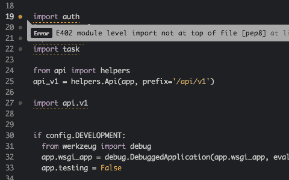

# Python Linters 将如何拯救您的大型 Python 项目

> 原文：<https://medium.com/hackernoon/how-python-linters-will-save-your-large-python-project-fab960d6368e>



我在 [Enigma](http://www.enigma.io) 工作的一个 [Python](https://hackernoon.com/tagged/python) 项目开始变得相当大。我昨天花了很大的力气将一个五行更改添加到我们的`Makefile`(它作为我们的 CI 和 CD 管道的一部分在每个 pull 请求和 merge 上运行)。PR 合并后，我幸灾乐祸地跟别人说我团队的项目有多牛逼。下面是五行:

```
lint: pylint --rcfile=.pylintrc api -f parseable -r n && \ mypy --silent-imports api && \ pycodestyle api --max-line-length=120 && \ pydocstyle api
```

出于完整性考虑，下面是作为 CI 测试的一部分实际运行的`test`目标:

```
test: install lint python3 setup.py test --addopts="--cov=api" coverage xml -i -o coverage/cobertura-coverage.xml --omit=$(VIRTUAL_ENV)/*,.eggs/*
```

(因此，对于那些不熟悉“Makefile-ese”的人来说，如果`lint`目标不先运行，`test`目标就不会成功运行)。

为什么我会高兴到对其他工程师来说是个混蛋，并吹嘘那五行？这一切都归结于*复杂性*。

随着 Python 项目的增长，维护变成了一场噩梦(我更多指的是企业规模的项目，而不是“大型”个人项目，但同样的想法也成立)。[代码](https://hackernoon.com/tagged/code)变得杂乱无章，反映了作者的风格(即使对于执行 [PEP-8](https://www.python.org/dev/peps/pep-0008/) 和 [PEP-257](https://www.python.org/dev/peps/pep-0257/) 的团队来说也是如此)，并且 docstrings 半途而废。新开发人员需要越来越长的时间来适应这个项目。简单的修复和特性改变在真正实施时变得不那么简单了。所有这些都是由于随着项目的增长，复杂性必然增加。那么，我们如何尽可能降低复杂性呢？

# 没有万灵药

显然，这里没有答案，但是你现在可以采取一系列的行动*这些行动需要很低的开销，却能带来巨大的回报:*

***让代码成为你构建过程的一部分。如果*他们中的任何*报告*任何*问题，你的构建就失败。***

*那么什么是代码“棉绒”呢？*

> **代码“linter”是一个工具，它对你的代码执行*静态分析*，并报告代码风格违规、可能的设计缺陷、明显的错误以及已知的危险代码模式。*静态分析*意味着你的代码被分析*但不被执行*，所以没有外部依赖，运行 linter 永远不会损害你的环境。你可以把他们想象成穷人的 AI 代码审查者。**

*Linters 有各种不同的输出格式和运行模式(复杂性和有用性也各不相同)。下面是最流行的 Python linters 之一 [pylint](https://www.pylint.org/) 的输出示例:*

```
************** Module sandman2.app
C:117, 0: Line too long (81/80) (line-too-long)
C:163, 0: Line too long (88/80) (line-too-long)
C: 24, 0: Invalid constant name "auth" (invalid-name)
R: 27, 0: Too many arguments (6/5) (too-many-arguments)
************* Module sandman2.decorators
W: 42,24: Duplicate key 'status' in dictionary (duplicate-key)
************* Module sandman2.model
C: 49, 0: Line too long (89/80) (line-too-long)
C: 50, 0: Line too long (113/80) (line-too-long)
C:141, 0: Invalid constant name "DeclarativeModel" (invalid-name)
C: 10, 0: Imports from package sqlalchemy are not grouped (ungrouped-imports)
************* Module sandman2.service
C: 98, 0: Trailing whitespace (trailing-whitespace)
C:208, 0: Line too long (87/80) (line-too-long)
C:215, 0: Line too long (93/80) (line-too-long)
C:224, 0: Line too long (82/80) (line-too-long)
R:231, 4: Method could be a function (no-self-use)
************* Module sandman2.scripts.sandman2ctl
C: 40, 0: Line too long (98/80) (line-too-long)Report
======
364 statements analysed.Statistics by type
------------------+---------+-------+-----------+-----------+------------+---------+
|type     |number |old number |difference |%documented |%badname |
+=========+=======+===========+===========+============+=========+
|module   |9      |9          |=          |100.00      |0.00     |
+---------+-------+-----------+-----------+------------+---------+
|class    |12     |12         |=          |100.00      |0.00     |
+---------+-------+-----------+-----------+------------+---------+
|method   |21     |21         |=          |100.00      |0.00     |
+---------+-------+-----------+-----------+------------+---------+
|function |18     |18         |=          |100.00      |0.00     |
+---------+-------+-----------+-----------+------------+---------+External dependencies
---------------------
::flask (sandman2.app,sandman2.decorators,sandman2.service)
      \-views (sandman2.service)
    flask_sqlalchemy (sandman2.model)
    sandman2 (sandman2.scripts.sandman2ctl)
      \-admin (sandman2.app)
      \-app (sandman2)
      \-decorators (sandman2.service)
      \-exception (sandman2.app,sandman2.decorators,sandman2.service)
      \-model (sandman2.app,sandman2.service)
      \-service (sandman2.app)
    sqlalchemy
      \-ext
      | \-automap (sandman2.model)
      | \-declarative (sandman2.model)
      \-inspection (sandman2.model)
      \-sql
        \-sqltypes (sandman2.app)Raw metrics
-----------+----------+-------+------+---------+-----------+
|type      |number |%     |previous |difference |
+==========+=======+======+=========+===========+
|code      |459    |54.38 |459      |=          |
+----------+-------+------+---------+-----------+
|docstring |243    |28.79 |243      |=          |
+----------+-------+------+---------+-----------+
|comment   |20     |2.37  |22       |-2.00      |
+----------+-------+------+---------+-----------+
|empty     |122    |14.45 |118      |+4.00      |
+----------+-------+------+---------+-----------+Duplication
-----------+-------------------------+------+---------+-----------+
|                         |now   |previous |difference |
+=========================+======+=========+===========+
|nb duplicated lines      |0     |0        |=          |
+-------------------------+------+---------+-----------+
|percent duplicated lines |0.000 |0.000    |=          |
+-------------------------+------+---------+-----------+Messages by category
--------------------+-----------+-------+---------+-----------+
|type       |number |previous |difference |
+===========+=======+=========+===========+
|convention |12     |13       |-1.00      |
+-----------+-------+---------+-----------+
|refactor   |2      |2        |=          |
+-----------+-------+---------+-----------+
|warning    |1      |3        |-2.00      |
+-----------+-------+---------+-----------+
|error      |0      |0        |=          |
+-----------+-------+---------+-----------+% errors / warnings by module
-----------------------------+-----------------------------+------+--------+---------+-----------+
|module                       |error |warning |refactor |convention |
+=============================+======+========+=========+===========+
|sandman2.decorators          |0.00  |100.00  |0.00     |0.00       |
+-----------------------------+------+--------+---------+-----------+
|sandman2.service             |0.00  |0.00    |50.00    |33.33      |
+-----------------------------+------+--------+---------+-----------+
|sandman2.app                 |0.00  |0.00    |50.00    |25.00      |
+-----------------------------+------+--------+---------+-----------+
|sandman2.model               |0.00  |0.00    |0.00     |33.33      |
+-----------------------------+------+--------+---------+-----------+
|sandman2.scripts.sandman2ctl |0.00  |0.00    |0.00     |8.33       |
+-----------------------------+------+--------+---------+-----------+Messages
--------+--------------------+------------+
|message id          |occurrences |
+====================+============+
|line-too-long       |8           |
+--------------------+------------+
|invalid-name        |2           |
+--------------------+------------+
|ungrouped-imports   |1           |
+--------------------+------------+
|trailing-whitespace |1           |
+--------------------+------------+
|too-many-arguments  |1           |
+--------------------+------------+
|no-self-use         |1           |
+--------------------+------------+
|duplicate-key       |1           |
+--------------------+------------+Global evaluation
-----------------
Your code has been rated at 9.59/10 (previous run: 9.50/10, +0.08)*
```

*当然，这是非常冗长的，并且绝对是我使用过的 linters 中最全面的输出，但是它很好地说明了它们在寻找什么以及它们能够做什么。`[pylint](https://www.pylint.org/)`在输出的末尾提供了一个有用的(如果*有点*武断的)分数，这个分数保存在运行之间，这样你就知道按照`pylint`的标准你的代码是变好了还是变坏了。*

# *那么这与持续集成有什么关系呢？*

*在它们最基本的模式中，大多数 linters 会打印出所有对`STDOUT` *的违反，如果遇到任何违反*会返回一个非零的退出代码。这意味着，如果一切顺利，该命令只是成功运行，没有输出。如果你看一下我在文章顶部的`Makefile`修改，这就是为什么我们可以将对连续 linters 的调用链接在一起，第一个报告违规的调用将中止整个命令集。*

*通过将这与您的 CI 平台挂钩，**您可以实施良好的风格，捕捉错误，并在构建时实际上要求所有事情(我确实是指*所有事情*)的适当文档。**有人不跟 PEP-8？构建失败。对不起，你的 PR 不能合并。没有为那个包/模块/类/函数写 docstring？抱歉，构建失败。写了一个接受 14 个参数的函数并命名为`foo`？你猜对了...**构建失败。***

*这是一个巨大的数字，原因有很多:*

*   *在构建通过之前，每个负责进行代码审查的人甚至不需要看 PR。在别人阅读你的代码之前，你必须遵循所有的规则。*
*   *Linters 能够在不执行你的代码的情况下捕获*真正的 bug*。这就像是另一层(非常小的)测试*
*   *新的开发人员和代码审查人员可以打开项目中的任何文件**，布局、命名约定、文档和其他一切**都与他们可能打开的任何其他文件相同。这一点的好处不能被夸大。*

# *我深信不疑！让我们来抓这只小狗！*

*Python(像大多数语言一样)有许多可用的 linters，它们都做相似(但不一定完全相同)的事情。令人困惑的是，每个人都认为偶尔编写一个工具来打包所有当前流行的 linters 并像消防水管一样向您的代码开火是一个好主意。但是这种情况每隔几年就会发生一次，所以你会得到由元棉条组成的元棉条，直到谁知道什么工具实际上正在查看你的代码(以及它是否仍然被维护)。*

*所以我要成为“那个家伙”,告诉你应该用什么样的棉绒。下面的列表是经过仔细挑选的，但是如果有人愿意的话，我会在评论中加入。*

*你应该使用的棉绒是:*

*   *`[pylint](http://www.pylint.org/)`*
*   *`[pycodestyle](https://github.com/PyCQA/pycodestyle)`*
*   *`[pydocstyle](https://github.com/PyCQA/pydocstyle)`*

*仅此而已。我将在下面简要介绍每一个。*

# *皮林特*

*`pylint`一直存在，几乎可以肯定是最全面的 Python linter。有些人抱怨它太挑剔或太冗长，但这就是配置文件的用途！`pylint`的一个鲜为人知(很棒)的特性是`.pylintrc`文件，如果你运行的话`pylint`甚至会*为你创建一个默认的框架**

```
*$ pylint --generate-rcfile*
```

*我仍然惊讶于更多的 CLI 工具*没有做到这一点。简直牛逼。**

*您可以通过运行带有`-r n`标志的命令来隐藏这个巨大的报告，从而大大减少`pylint`的冗长性。*

# *pycodestyle 和 pydocstyle*

*这两个 linters 曾经有不同的名字:前者被称为`pep8`，后者被称为`pep257`(在它们检查一致性的 pep 之后)。在一个[有点滑稽的 GitHub 问题](https://github.com/PyCQA/pycodestyle/issues/466)中，GvR 自己请求他们友好地更改工具的名称，以避免人们仅仅因为同名工具困扰他们而讨厌 [PEP-8](https://www.python.org/dev/peps/pep-0008/) 。不管怎样，这些工具都很全面，并且易于上手。只需`pip install`它们，然后运行`$ pycodestyle <some-module-or-package-or-file>`，找出这段时间你一直做错的所有事情！*

*正如人们所料，`pycodestyle`处理[PEP-8](https://www.python.org/dev/peps/pep-0008/)(Python 代码的官方风格指南)，而`pydocstyle`处理[PEP-257](https://www.python.org/dev/peps/pep-0257/)(Python 的官方 Docstring 约定)。后者非常严格。如果你让你的项目顺利通过(我花了一天时间在这个项目上),你就再也不用担心有人忘记写 docstring(或者忘记如何写 docstring)了。它甚至检查正确的大小写、标点符号以及说明性和描述性注释。我喜欢它的迂腐。*

# *自动化所有的事情*

*说真的，[英格玛](http://www.enigma.io)是一家创业公司。我们资源有限。如果我们想让一个大型项目保持理智，唯一的办法就是通过自动化(因为我们正忙于用公共数据构建[牛逼的](http://enigma.io/labs/healthcare-data/) [东西](http://bit.ly/boomtobust))。我甚至认为，在我们的测试套件(单元测试和 E2E 浏览器测试)、持续集成管道(Jenkins + GitHub + Codecov +大量自制胶水)、持续部署管道(10% Jenkins/GitHub，90% Ansible)和上面提到的 linters 等工具之间，**我们节省了两名全职工程师管理开发和部署流程的成本，同时使我们的代码库更具可读性、可测试性和可维护性。***

*所有这些都来自几个自动化工具，您可以在接下来的五分钟内安装…您还在等什么！？*

*Jeff Knupp 于 2016 年 12 月 9 日发布*

**原载于 2016 年 12 月 9 日*[*【jeffknupp.com】*](https://jeffknupp.com/blog/2016/12/09/how-python-linters-will-save-your-large-python-project/)*。**

*[](http://bit.ly/HackernoonFB)**[](https://goo.gl/k7XYbx)**[](https://goo.gl/4ofytp)*

> *[黑客中午](http://bit.ly/Hackernoon)是黑客如何开始他们的下午。我们是 [@AMI](http://bit.ly/atAMIatAMI) 家庭的一员。我们现在[接受投稿](http://bit.ly/hackernoonsubmission)并乐意[讨论广告&赞助](mailto:partners@amipublications.com)机会。*
> 
> *如果你喜欢这个故事，我们推荐你阅读我们的[最新科技故事](http://bit.ly/hackernoonlatestt)和[趋势科技故事](https://hackernoon.com/trending)。直到下一次，不要把世界的现实想当然！*

**