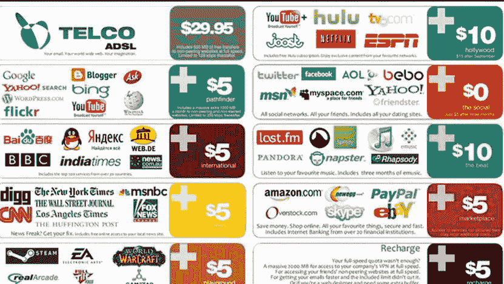
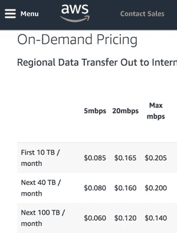

# 废除网络中立会如何摧毁我的小企业

> 原文：<https://medium.com/hackernoon/how-repealing-net-neutrality-could-destroy-my-small-business-4788f0b9b110>

有两种可能的情况，我都不喜欢。

几周前，我推出了一个分享 3D 内容和游戏的网站。早期的产品让分享用 Unity 游戏引擎创建的 WebGL 版本变得[轻松](https://www.gamasutra.com/blogs/RoccoBalsamo/20171108/309168/Share__Embed_Unity_WebGL_Games_Just_about_Anywhere.php)。

事实上，煨是一个真正的内容交付平台，将需要大量的带宽，因为越来越多的人开始使用该网站。

我使用谷歌云通过内容交付网络快速交付游戏，无论游戏玩家住在达拉斯、丹麦还是迪拜。

我是小人物之一。一个有着很酷想法的人把我的积蓄押在追求一个很酷的想法上。仅仅依靠储蓄账户在旧金山生活六个月是很难做到的，但对我来说幸运的是，服务器成本相对便宜。

[my site](https://simmer.io)

为了建立一个观众群，我需要警惕短期的金钱掠夺，比如在网站上贴满广告。所以本质上，我在计算货币化的时候，有一段时间完全不知所措。随着网站获得越来越多的关注，我预计将交付数十亿字节的数据，这将是昂贵的。

如果网络中立消失了，我可以预见会发生两件事。每个人都在谈论的是分层互联网服务:

Artist mockup from [a reddit post 8 years ago.](https://www.reddit.com/r/pics/comments/9yj1f/heres_a_new_scenario_i_just_created_illustrating/)

我其实觉得这种情况不太可能发生。我认为会有太多的消费者反对。我的猜测是，ISP 将告诉云托管提供商，如谷歌云或 AWS，“嘿，我们将允许你以分层的速度向我们的客户发送数据”。然后云主机提供商会把成本转嫁给我们，webdev 社区。

以下是我想象中的 Cloudfront CDN 价格表:

Notice the “slow” lanes and fast lanes at the top of the column

我很幸运地生活在一个有“Indy”ISP，Monkeybrains，[的地区，他们相信网络中立](https://www.monkeybrains.net/policies.php#neutrality)。但是在许多市场，像康卡斯特和时代华纳这样的互联网服务提供商已经垄断或接近垄断。

虽然让 10 家 ISP 在整个城镇运营电缆没有意义，但像电缆和电力这样的自然垄断企业受到政府的高度监管是有意义的。

my [indie isp](https://monkeybrains.net)

如果网络中立废除法案通过，很可能会损害甚至摧毁我的小企业。如果 ISP 将分级成本转嫁给消费者，许多人会选择最便宜的方案…这可能不包括快速访问像我这样的独立网站。如果他们将分层成本转嫁给云提供商，我也可能会损失难以承受的托管成本。

所以这不仅仅是为网飞的 4K 视频支付更多的钱。这是在扼杀创新，让像我这样的“小人物”在互联网上创造创新体验变得更加困难。

*如果你喜欢这篇文章，我想要一篇*👏*！或者在* [*twitter*](https://twitter.io/@simmer_io) *或者 medium 上关注我，让更多人看到。并在此帮助* [*拯救互联网*](http://act.freepress.net/sign/internet_wake_up_destroy/?source=what) *。*

如果你用的是桌面浏览器，试试《保姆游戏》的《变异蛇》:

mutant snake on [SIMMER.io](https://simmer.io)

嘘…中型游戏嵌入是一个秘密功能，我还没有公开。